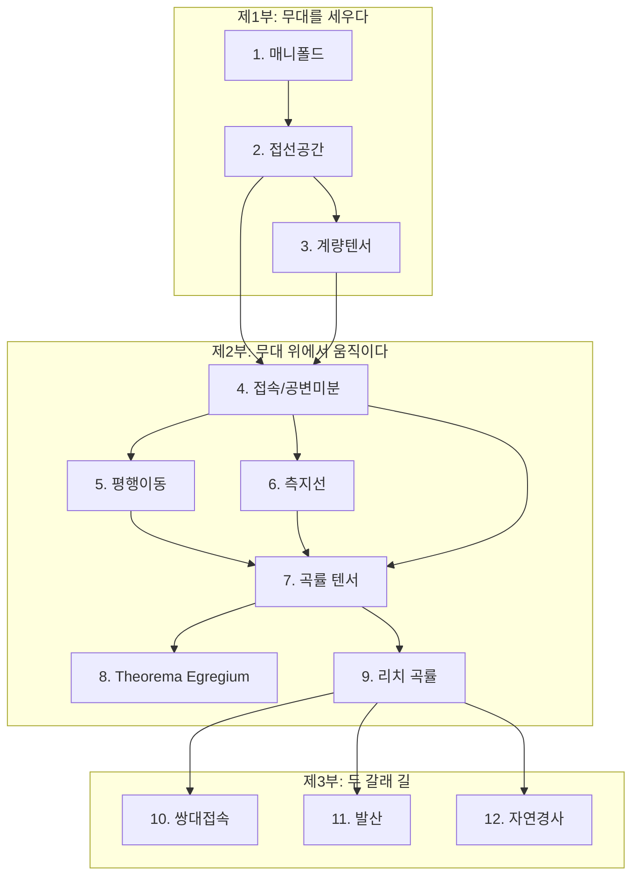

# 서문

> 문제에서 패턴으로, 패턴에서 정리로, 정리에서 정의로.

---

## 이 책은 왜 존재하는가

미분기하학 교과서를 처음 펼치면, 대부분 이런 문장으로 시작한다:

> "위상공간 $M$이 제2가산 하우스도르프 공간이고, 극대 $C^\infty$-호환 아틀라스가 주어져 있을 때, $M$을 매끄러운 매니폴드라 한다."

수학적으로 완벽한 정의다. 하지만 이 문장이 **왜** 이렇게 생겼는지는 알 수 없다. 왜 "제2가산"이 필요한가? "호환"이 없으면 무슨 일이 벌어지는가? 이 정의를 만든 사람은 어떤 문제를 풀다가 이 개념에 도달했는가?

이 책은 그 "왜"에서 시작한다.

## 역순으로 읽는 기하학

수학 교과서의 전통적인 순서는 **정의 → 정리 → 증명 → 응용**이다. 논리적으로 깔끔하지만, 이 순서는 개념이 발견된 과정과 정반대다. 아무도 "매니폴드를 정의하자"라고 말한 뒤에 지구의 지도를 떠올린 것이 아니다. 지구의 지도를 만들다 보니 매니폴드라는 개념이 필요해진 것이다.

이 책은 개념이 발견된 순서를 따른다. 구체적인 문제를 붙들고 씨름하다 보면 패턴이 보이고, 패턴을 정밀하게 진술한 것이 정리가 되며, 정의는 정리를 말하기 위해 필요한 언어로서 가장 나중에 나온다. 보통의 교과서가 정의에서 시작해서 문제로 끝나는 것을, 이 책은 문제에서 시작해서 정의로 끝낸다. 이렇게 하면 매 정의가 등장할 때, 그 정의가 왜 그런 형태인지를 독자가 이미 이해하고 있다.

## 한 장, 한 절은 이렇게 짜여 있다

각 장은 **출발 문제**로 시작한다. "왜 세계지도에는 왜곡이 있는가?" 같은 구체적이고 직관적인 질문이다. 출발 문제는 답을 주지 않고 물음으로 끝난다.

그 뒤로는 개념 하나에 절 하나, 절 하나에 한 페이지가 이어진다. 한 절의 흐름은 대체로 같다.

1. **왜?** — 앞 절이 남긴 물음이나 독자가 이미 아는 것에서 나온 물음으로 연다. 답과 이름은 독자가 그 답을 원하게 된 뒤에 나온다.
2. **역사** — 그 개념이 어떤 문제를 풀다가 태어났는지, 그 문제와 씨름한 사람의 이야기.
3. **예제** — 구체적인 사례나 작은 장난감 예제로 개념을 세우고, 여기서 비로소 이름(정의)을 붙인다. 손으로 따라 해 볼 계산은 「따라 계산해 보기」 상자에 담았다.
4. **그림과 위젯** — 개념을 눈으로 보고 손으로 움직여 보는 그림과 인터랙티브 시각화.
5. **ML에서** — 그 개념이 기계학습의 어디에 나타나는지.
6. **문제와 같이 풀기** — 방금 배운 개념을 확인하는 연습문제. 먼저 혼자 풀어 본 뒤, 선생님과 두 학생(김민준, 이서연)이 그 문제를 두고 틀리고 바로잡는 대화를 따라가 보자.

해당하는 내용이 없는 절은 몇 단계를 건너뛴다. 장의 마지막 페이지 「자주 하는 실수와 요약」에는 대화에서 학생들이 실제로 틀린 곳과 바로잡는 법, 장 전체의 요약, 연결되는 분야, 그리고 장 안에서 아직 풀리지 않은 물음을 모았다. 한 절 안에서도 물음에서 사례로, 사례에서 정의로 가는 순서가 되풀이되는 셈이다.

## 누구를 위한 책인가

이 책은 다음과 같은 독자를 상정한다:

- 다변수 미적분과 선형대수의 기초를 알고 있는 사람
- 미분기하학이라는 분야가 있다는 것은 알지만, 교과서의 첫 페이지에서 막힌 적이 있는 사람
- 물리학, 기계학습, 통계학, 로보틱스 등의 분야에서 "매니폴드", "측지선", "곡률" 같은 단어를 만났지만, 정확히 무슨 뜻인지 확신이 없는 사람
- 수학을 좋아하지만 정의-정리-증명의 행진에 지친 사람

엄밀한 증명보다는 직관과 서사를 우선한다. 그렇다고 수학을 포기하는 것은 아니다 — 수식은 적재적소에 등장하며, 핵심 정리의 진술은 정확하다. 다만, 수식이 등장하기 전에 독자가 "아, 그 수식이 왜 그런 모양인지 알겠다"고 느끼도록 만드는 것이 목표다.

## 이 책의 지도

이 책은 세 부분으로 이루어져 있다.

**제1부: 무대를 세우다** (1~3장)에서는 미분기하학이 살아가는 무대 — 매니폴드(어디를 확대해도 평면처럼 보이는 공간), 접선공간(한 점에서 낼 수 있는 모든 속도의 모임), 계량(점마다 거리를 재는 눈금) — 을 준비한다. 무대가 없으면 배우가 설 수 없다.

**제2부: 무대 위에서 움직이다** (4~9장)에서는 이 무대 위에서 벡터를 미분하고, 옮기고, 휘어짐을 측정하는 법을 배운다. 접속(이웃한 점의 벡터를 비교하는 규칙), 평행이동(곡선을 따라 돌리지 않고 옮기기), 측지선(곡면 위의 직선), 곡률(휘어진 정도) — 미분기하학의 핵심 도구들이다.

**제3부: 두 갈래 길** (10~12장)에서는 리만 기하학의 고전적 세계를 넘어, 정보기하학이라는 현대적 세계로 나아간다. 쌍대 접속(짝을 이루는 두 접속), 발산(두 분포가 얼마나 다른지 한 방향으로 재는 양), 자연 경사(분포가 바뀌는 정도로 걸음을 재는 경사하강) — 통계학과 기계학습의 언어가 미분기하학과 만나는 지점이다.

화살표는 "이것을 알아야 저것을 이해할 수 있다"는 의미이다. 처음부터 순서대로 읽는 것을 권하지만, 제3부는 제2부의 4~6장만 읽고도 도전할 수 있다.

## 읽는 법에 대한 한 가지 부탁

수식을 만나면 바로 다음 줄로 넘어가지 말고, 잠깐 멈추어 달라. 수식 위에 있는 한국어 문장을 다시 읽고, 수식이 정말로 그 문장을 말하고 있는지 확인해 달라. 이 책에서 수식은 장식이 아니라, 직전 문장의 번역이다. 번역이 맞는지 확인하는 과정에서 이해가 깊어진다.

그리고 각 장의 인터랙티브 시각화를 반드시 직접 만져보길 바란다. 슬라이더를 움직이고, 점을 드래그하고, 설정값을 바꿔보라. 기하학은 본질적으로 시각적인 학문이고, 손끝에서 느껴지는 직관은 10줄짜리 증명보다 오래 남는다.
