# 좌표 하나로는 지구를 담을 수 없다

## 출발 문제

오렌지 하나를 떠올려 보자. 껍질을 벗겨서 식탁 위에 평평하게 펴려고 하면 어떻게 되는가? 반드시 찢어진다. 억지로 펼치면 어딘가가 겹치고, 어딘가가 늘어나고, 어딘가가 구겨진다. 구면의 껍질을 평면 위에 왜곡 없이 펼치는 것은 불가능하다.

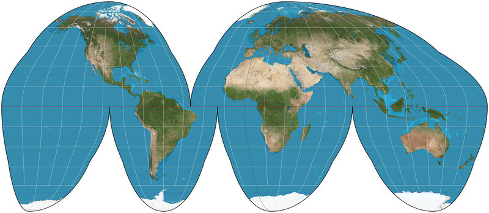

지도 제작자들은 이 사실을 수백 년간 체감해 왔다. 16세기 항해가들에게 정확한 세계지도는 생사의 문제였다. 1569년, 플랑드르의 지리학자 헤라르뒤스 메르카토르(Gerardus Mercator)는 유명한 메르카토르 도법을 발표한다. 이 지도에서 항해사는 직선으로 코스를 그으면 되므로 항해에 편리했다. 하지만 대가가 있었다 — 그린란드가 아프리카와 비슷한 크기로 보인다. 실제로는 아프리카가 14배 넓다.

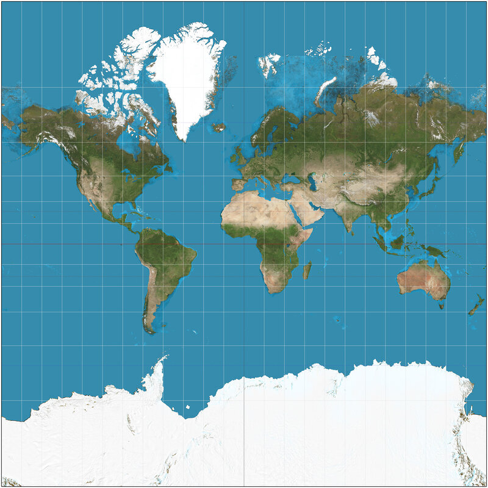

메르카토르 도법만의 문제가 아니다. **어떤 도법을 쓰든** 왜곡은 피할 수 없다. 면적을 보존하면 각도가 틀어지고, 각도를 보존하면 면적이 뒤틀린다. 거리, 면적, 각도를 동시에 보존하는 세계지도는 존재하지 않는다. 이것은 취향의 문제가 아니라 수학적 불가능성이다.

그런데 이상한 점이 있다. 세계지도에서는 그린란드가 저렇게 부풀어 오르는데, 우리나라 지도나 동네 지도를 펼쳐 놓고 왜곡을 느껴 본 적이 있는가? 좁은 지역만 그린 지도에서는 왜곡이 거의 눈에 띄지 않는다. 왜곡이 심해지는 것은 지구 전체를 한 장에 억지로 담으려 할 때다.

그렇다면 이렇게 해 볼 수 있지 않을까? 넓은 땅을 한 장에 담지 말고, 왜곡이 거의 없는 작은 지도를 **여러 장 이어 붙여서** 지구 전체를 덮는 것이다. 완벽한 지도 한 장은 불가능해도, **여러 장의 불완전한 지도**로는 가능할지 모른다.

## 매니폴드: 어디를 확대해도 평면인 공간

여러 장의 지도로 나누어 담으려면, 먼저 지도 한 장이 맡을 조각이 평면처럼 다뤄질 수 있어야 한다. 앞에서 좁은 지역의 지도는 왜곡이 거의 없다고 했다. 이 느낌을 조금 더 정확히 말해 보자.

**각 조각은 평면처럼 다룰 수 있다.** 충분히 작은 영역에서는 지구 표면이 사실상 평평하다. 동네 지도에서 땅의 곡률(휘어진 정도)을 느끼는 사람은 없다.

지구 표면만 그런 것이 아니다. 어느 점에서든 그 둘레만 확대해 보면 평면과 구별할 수 없는 공간은 많다. 이런 공간을 하나의 개념으로 묶어 낸 사람이 있다.

### 역사: 베른하르트 리만 (Bernhard Riemann, 1826–1866)

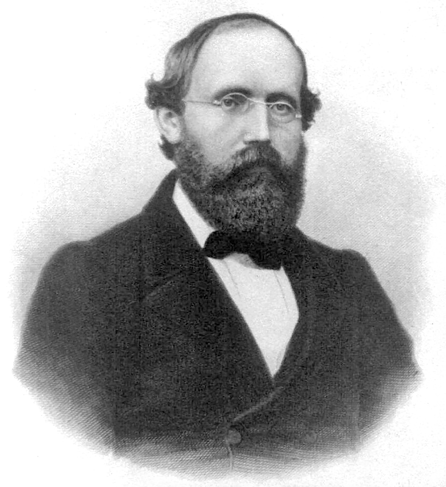

1854년 6월 10일, 괴팅겐 대학교. 스물일곱 살의 수학자 베른하르트 리만이 교수자격 취득을 위한 강연 무대에 선다. 청중 속에는 그의 스승이자 당대 최고의 수학자 카를 프리드리히 가우스가 앉아 있다.

관례상 후보자는 세 가지 주제를 제안하고, 심사위원회가 그중 하나를 고른다. 리만은 세 번째 주제를 "기하학의 기초에 놓여 있는 가설에 대하여(Über die Hypothesen, welche der Geometrie zu Grunde liegen)"라고 적어 넣었다 — 가장 선택될 가능성이 낮다고 판단했기 때문이다. 그런데 가우스가 정확히 그 주제를 골랐다. 이 선택은 리만을 몇 주간의 고뇌로 몰아넣었지만, 결과적으로 수학사에서 가장 영향력 있는 강연 중 하나가 탄생한다.

리만의 핵심 통찰은 이것이었다: **유클리드 기하학은 기하학의 유일한 형태가 아니다.** 공간이란 국소적으로(한 점 가까이만 보면) 좌표를 붙일 수 있는 임의의 대상이며, 그 위에서 거리와 곡률은 장소마다 달라질 수 있다. 이 강연에서 리만은 오늘날 우리가 "매니폴드"라고 부르는 개념의 씨앗을 뿌렸다 — 전체를 하나의 좌표로 덮을 수 없지만, 조각마다 좌표를 붙이고 조각 사이의 번역 규칙을 정하면 되는 공간.

가우스는 이 강연을 듣고 집으로 돌아가며 동료에게 "깊은 감명을 받았다"고 말했다고 전해진다. 하지만 리만의 아이디어가 물리학에서 꽃을 피우려면 60년이 더 필요했다 — 1915년, 아인슈타인이 일반상대성이론에서 시공간을 4차원 매니폴드로 나타냈을 때.

리만 자신은 결핵으로 서른아홉에 세상을 떠났다. 그가 남긴 강연 원고는 불과 수십 쪽이었지만, 그 안에는 이후 150년간 전개될 미분기하학이 풀어 갈 연구 계획 전체가 담겨 있었다.

### 확대하면 평면: 매니폴드의 정의

리만이 씨앗을 뿌린 개념을 오늘날의 말로 적으면 다음과 같다.

- **매니폴드** (확대하면 평면인 공간 / Locally Euclidean Space) — 각 점 둘레가 $\mathbb{R}^n$처럼 생긴 공간. 지구 표면은 2차원 매니폴드이다: 어느 점이든 둘레를 보면 평면과 구별할 수 없다. $n$을 매니폴드의 **차원**이라 한다.

### ML에서: 매니폴드 가설

64×64 픽셀 얼굴 이미지 한 장은 픽셀값 4,096개, 곧 4,096차원 공간의 점 하나다. 그런데 한 얼굴을 고개 방향과 조명만 바꿔 가며 만든 이미지들은 이 넓은 공간을 고르게 채우지 않는다. 테넨바움(J. Tenenbaum) 등이 2000년 『사이언스』에 발표한 Isomap 논문은 이런 얼굴 이미지 698장이 좌우 고개 방향, 상하 고개 방향, 조명 방향이라는 숫자 3개로 거의 다 설명된다는 것을 보였다. 고차원 데이터가 실제로는 저차원 매니폴드 위(또는 그 가까이)에 놓여 있다는 이 생각을 매니폴드 가설(manifold hypothesis)이라 한다.

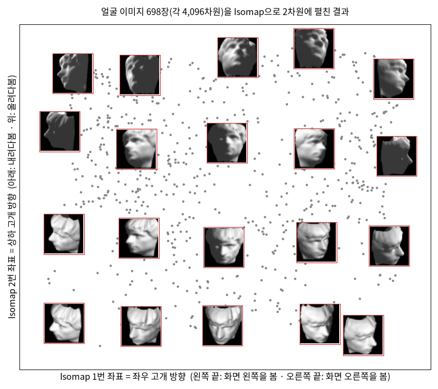

여기서 매니폴드 위를 움직이는 것은 데이터 점이다. 이미지 한 장 근처에서 고개 방향을 조금씩 바꾸면 이미지는 평평한 3차원 조각 위를 움직이는 것처럼 보인다. 하지만 동네 지도가 평평하다고 지구가 평평한 것은 아니듯, 그 조각들이 모여 전체로 어떤 모양을 이루는지는 따로 따져야 한다.

### 문제 1 — 숫자 8은 매니폴드인가

각 문제를 먼저 혼자 풀어 본 뒤, 바로 아래 세션에서 선생님과 두 학생이 어떻게 풀어 가는지 따라가 보자.

확인 다음 중 매니폴드가 **아닌** 것은? (가) 원 (나) 숫자 8 모양의 곡선 (다) 구면 (라) 가장자리를 뺀 원판

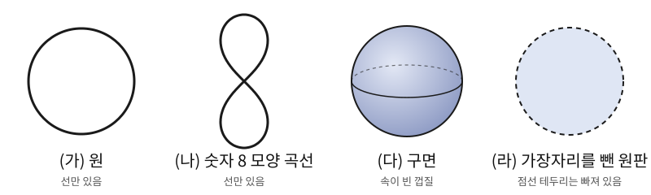

#### 같이 풀기 세션 1

**선생님:** 네 개 중에 매니폴드가 아닌 걸 골라 볼까요?

**김민준:** 다 매니폴드 아니에요? 8자는 원 두 개를 붙인 거잖아요. 원이 매니폴드면 두 개 붙여도 매니폴드일 것 같은데요.

**이서연:** 붙인 자리가 걸리는데. 가운데 교차점을 확대하면 선이 네 갈래로 뻗어 있잖아.

**선생님:** 서연 학생 말대로 확대해 봅시다. 민준 학생, 원 위의 아무 점이나 아주 작게 확대하면 뭐가 보여요?

**김민준:** 짧은 선분이요. 양쪽으로 한 줄씩 뻗은 거요.

**선생님:** 8자의 교차점을 확대하면요?

**김민준 〔M07〕:** 아, X자네요. 선분이랑 X는 다르죠. 선분에서 가운데 한 점을 빼면 두 조각인데, X에서 가운데를 빼면 네 조각이 되니까요.

**선생님:** 바로 그거예요. 매니폴드는 **모든** 점에서 확대한 모양이 $\mathbb{R}^n$과 같아야 해요. 한 점이라도 다르면 탈락이에요. 답은 (나)예요.

**김민준:** 조별 보고서 같네요. 다른 절이 다 멀쩡해도 한 사람이 맡은 절이 양식이 다르면 조교가 바로 돌려보내잖아요.

**선생님:** 하나만 더 해 봅시다. (라)는 가장자리를 뺀 원판이었어요. 그럼 가장자리까지 넣은 원판은 매니폴드일까요?

**김민준:** 테두리 한 줄 더 붙였을 뿐인데요. 안쪽은 그대로 평면이니까 매니폴드 아닐까요?

**이서연 〔S06〕:** 테두리 위의 점을 확대하면 좀 이상한데. 한쪽은 원판 안이고, 반대쪽은 아무것도 없잖아. 평면이 아니라 반쪽짜리 평면이야.

**선생님:** 맞아요. 테두리 위의 점 둘레를 아주 작게 확대하면, 곧은 경계선 한 줄을 끼고 한쪽만 있는 반평면이 보여요. 안쪽 점에서는 어느 방향으로든 조금씩 움직일 수 있는데, 테두리 점에서는 바깥쪽으로 한 걸음만 가도 원판을 벗어나요.

**김민준:** 그래도 반평면이랑 평면이 정말 다른 건지는 모르겠어요. 아까처럼 점 하나 빼고 조각 수를 세서 구별할 수 있어요?

**선생님 〔T14〕:** 2차원에서 바로 하기는 까다로우니 한 차원 내려가 봐요. 양 끝을 포함한 선분 $[0, 1]$에서 끝점 $0$ 둘레를 확대하면 뭐가 보여요?

**김민준 〔M08〕:** $0$에서 오른쪽으로만 뻗은 반직선이요. 거기서 $0$을 빼면… 한 조각 그대로네요. 직선은 어느 점을 빼든 두 조각인데.

**이서연:** 그럼 끝점 둘레는 직선과 모양이 다른 거네요. 가장자리를 포함한 원판도 테두리 점마다 같은 일이 한 차원 올라가서 일어나는 거고요.

**선생님:** 그래요. 그래서 가장자리를 포함한 원판은 매니폴드가 아니에요. 테두리 점에서 확대한 모양이 $\mathbb{R}^2$가 아니라 반평면이니까요. (라)에서 굳이 가장자리를 뺀 이유가 이거예요. 이렇게 가장자리 점에서만 반평면처럼 생긴 공간은 경계가 있는 매니폴드라는 이름으로 따로 다뤄요.

## 아틀라스: 지도 여러 장으로 덮기

조각마다 평면처럼 다룰 수 있다면, 조각마다 평면 지도를 한 장씩 그리면 된다. 그러면 지도가 몇 장이든 모아 놓기만 하면 지구 전체를 담은 것일까?

실제로 우리는 이미 이 방법을 쓰고 있다. 세계지도책(atlas)을 펼쳐 보라. 한 장에 전 세계를 담으려 하지 않는다. 유럽, 아시아, 아메리카 — 각각의 지역을 별도의 페이지에 그린다. 각 페이지에서는 왜곡이 작다. 해당 지역 안에서는 거리와 방향이 대체로 정확하다.

### 왜 하필 구면인가

이 방법을 가장 간단한 곳에서 시험해 보자. 평면이나 평면의 한 조각은 지도 한 장으로 충분하니 시험할 거리가 없다. 지도 한 장으로는 절대 안 되는 곡면 가운데 가장 간단한 것이 구면, 곧 지구 표면이다. 수학에서는 반지름 1인 구면을 $S^2$라 쓴다(2차원 곡면이라서 2). 구면은 두 장이면 덮을 수 있다. 왜 한 장으로는 안 되는지는 이 장 마지막 절(컴팩트성)에서 따진다. 그러니 구면은 "한 장으로는 안 되고, 두 장이면 되는" 가장 작은 시험대다.

남은 문제는 두 장을 어떻게 나누고, 어떻게 이어 붙이느냐다. 이것은 사람들이 실제로 오래 고민한 문제였다.

### 역사: 두 장으로 지구를 싸려던 시행착오

**하늘에서 먼저 쓰인 그림자 지도.** 이야기는 지도가 아니라 하늘에서 시작한다. 고대 그리스의 천문학자 히파르코스(Hipparchus, 기원전 2세기)와 프톨레마이오스(Ptolemy, 2세기)는 둥근 하늘(천구)의 별자리를 평평한 금속판에 새기는 방법을 궁리했다. 그렇게 만든 것이 별의 위치로 시각을 재던 천문 기구 아스트롤라베다. 그들이 쓴 방법은 한 극에서 빛을 비춰 적도 평면에 그림자를 떨어뜨리는 것이었다. 이 그림자 지도에는 놀라운 성질이 있다. 구면 위의 원은 평면에서도 원이 되고(빛을 비추는 극을 지나는 원만 직선이 된다), 각도도 그대로 유지된다. 덕분에 장인은 컴퍼스만으로 별자리 판을 새길 수 있었다. 1613년 프랑수아 다길롱(François d'Aguilon)이 이 방법에 입체사영(stereographic projection)이라는 이름을 붙였다.

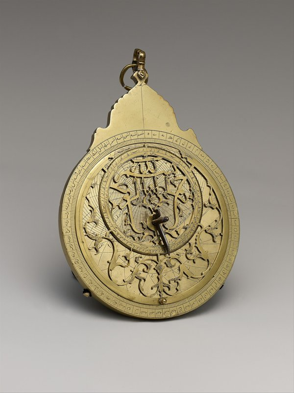

**반구 두 장으로 자르기.** 대항해 시대가 되자 이 그림자 지도가 세계지도에도 쓰였다. 16~17세기 세계지도에는 동반구와 서반구를 동그라미 두 개로 나란히 그린 것이 많은데, 루몰트 메르카토르(Rumold Mercator, 앞에 나온 헤라르뒤스의 아들)가 1587년에 그려 1595년 지도책에 실은 세계지도를 비롯해 상당수가 입체사영으로 그려졌다. 그림 자체는 좋았지만 이음매가 문제였다. 지도를 반구 경계에서 딱 잘랐기 때문에 두 장은 경계선 한 줄에서만 만나고, 겹치는 땅이 없다. 경계선 바로 위의 도시는 두 지도의 맨 가장자리에 걸려 있고, 경계를 넘어가는 배의 항로는 한 지도의 끝에서 끊겼다가 다른 지도의 반대쪽 끝에서 갑자기 다시 나타난다. 게다가 지도의 가장자리는 늘어남이 가장 심한 곳이다. 이어 붙이는 자리가 하필 가장 믿기 어려운 곳인 셈이다.

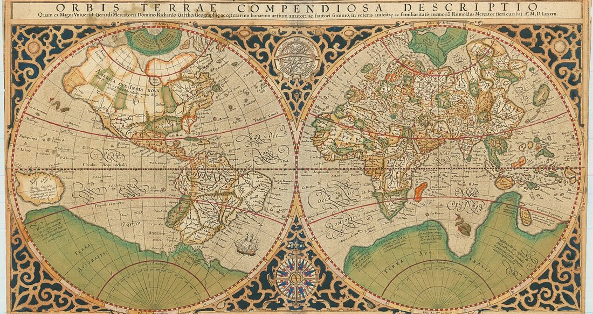

**한 장에 우겨넣기.** 아예 한 장에 다 넣으려는 시도도 있었다. 한 점을 중심으로 방향과 거리를 그대로 살려 그리는 방위 등거리 도법(유엔 깃발의 세계지도가 이 도법으로 그려졌다)은 지구 전체를 원판 하나에 담을 수 있다. 하지만 중심의 정반대편 점 하나가 원판의 테두리 전체로 늘어난다. 한 점이 원 한 바퀴가 되니, 테두리 근처에서는 가까운 두 곳이 지도에서 원판의 양 끝으로 갈라진다. 이 장 첫머리에서 본 대로 어떤 도법을 써도 한 장으로는 어딘가가 찢어진다.

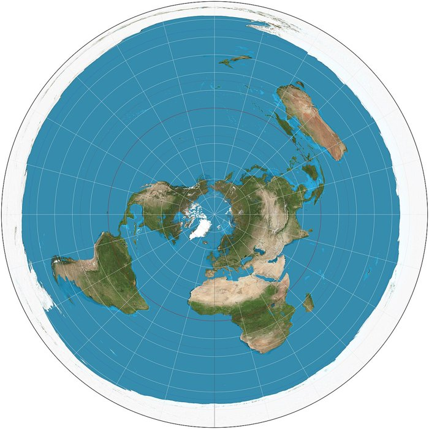

**무엇을 지킬 것인가: 각도.** 모든 것을 지키는 지도가 없다면 무엇을 지킬지 골라야 한다. 바다 위의 항해사에게 답은 분명했다. 나침반만 믿고 가는 배에게 필요한 것은 "북쪽에서 몇 도 틀어서 가라"는 방향이다. 지도 위에서 각도기로 잰 각이 실제 나침반 방위와 같아야, 지도에서 그은 선을 그대로 배의 키로 옮길 수 있다. 메르카토르가 1569년 지도에서 면적을 버리고 지킨 것이 바로 이 각도였다. 땅 위의 측량사도 같았다. 측량은 멀리 있는 표지 사이의 각을 재서 삼각형을 이어 나가는 일(삼각측량)이라, 잰 각을 종이에 그대로 옮길 수 있는 지도가 필요했다. 입체사영이 각도를 지킨다는 사실은 1590년대 영국의 토머스 해리엇(Thomas Harriot)이 처음 증명했지만 발표하지 않았고, 1695년 에드먼드 핼리(Edmond Halley)가 증명을 발표하면서 널리 알려졌다. 1822년에는 하노버 왕국의 측량을 맡고 있던 가우스가, 곡면을 평면에 옮길 때 각도를 지키는 방법 전체를 일반 이론으로 정리했다.

그런데 각도를 지키라는 조건을 붙이면 쓸 수 있는 해답이 확 줄어든다. 그림자 지도만 보아도 알 수 있다. 전등을 어디에 두느냐에 따라 지도가 달라진다. 지구 중심에 두면 대원(구면 위의 가장 짧은 길)이 모두 직선으로 나오지만 각도가 틀어진다. 아주 멀리 두어 평행한 빛을 비추면 우주에서 본 지구 모습이 되지만 가장자리가 짓눌려 역시 각도가 틀어진다. 각도가 지켜지는 자리는 단 하나, 지도 한가운데에 올 점의 정반대편, 곧 구면 위 반대쪽 극뿐이다. 이렇게 각도를 지키는 지도를 등각 지도라 부르는데, 아스트롤라베 장인이 고른 자리가 바로 그 자리였다.

**자르지 말고 넉넉하게 겹치기.** 해법은 반구 지도에서 잘라 버린 부분에 있었다. 입체사영은 원래 반구에서 멈출 필요가 없다. 북극에서 비춘 지도는 북극 한 점만 빼고 구면 전체를 담는다(남반구는 적도 원 안쪽에, 북반구는 바깥쪽에). 남극에서 비춘 지도도 남극 한 점만 뺀다. 이렇게 두 장을 자르지 않고 쓰면, 반구 하나씩을 나눠 맡는 대신 두 극을 뺀 거의 모든 땅이 두 지도에 함께 실린다. 경계선 한 줄에서 아슬아슬하게 만나는 대신 넓게 겹치므로, 어느 도시든 적어도 한 지도에서는 가장자리가 아닌 안쪽에 놓인다. 그리고 겹치는 곳에서 한 지도의 좌표를 다른 지도의 좌표로 바꾸는 규칙도 아주 간단하다(다음 절에서 직접 구한다). 19세기에 리만은 같은 그림자 지도로 복소평면에 "무한히 먼 점" 하나를 보태 구면으로 닫았다. 오늘날 리만 구면이라 부르는 것이다.

정리하면, 좋은 지도책이 되려면 지도 한 장 한 장이 가장자리 없이 열려 있고, 이웃한 지도와 넉넉하게 겹쳐야 한다. 이 교훈이 곧 다음에 나올 차트와 아틀라스의 정의에 그대로 들어간다.

### 지도 한 장, 지도책 한 권

아스트롤라베 장인의 방법으로 구면 $S^2$의 지도 한 장을 직접 만들어 보자. 북극에 전등을 두고, 구면 위 점의 그림자를 적도를 품은 평면에 떨어뜨린다. 앞에서 본 입체사영이다.

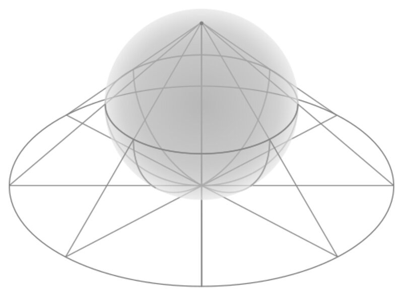

남극 $(0, 0, -1)$의 그림자는 원점 $(0, 0)$에 떨어진다. 적도 위의 점 $(1, 0, 0)$은 이미 그 평면 위에 있으니 제자리 $(1, 0)$이다. 적도 전체는 단위원이 되고, 남반구는 단위원 안쪽, 북반구는 바깥쪽에 그려진다. 북극에 가까운 점일수록 그림자가 멀리 달아나고, 북극 자신은 그림자가 없어서 이 지도에서 빠진다.

이처럼 공간의 한 조각 $U$에 평면 좌표를 붙이는 함수 $\textcolor{#3949ab}{\varphi}: U \to \mathbb{R}^{\textcolor{#c4724f}{n}}$을 차트(chart, 좌표계)라 부르고, 쌍 $(U, \textcolor{#3949ab}{\varphi})$로 쓴다. 지도책의 한 페이지다. 조각 $U$는 가장자리를 포함하지 않는 부분집합(열린 부분집합)으로 잡는다. 위의 지도는 북극을 뺀 구면을 맡는 차트다. 남극에 전등을 두면 남극을 뺀 구면을 맡는 차트가 하나 더 생긴다. 구면 위 점을 $(\textcolor{#ff4314}{X}, \textcolor{#ff4314}{Y}, \textcolor{#ff4314}{Z})$로 쓰면 두 차트는 다음과 같다.

$$
\textcolor{#3949ab}{\varphi_N}(\textcolor{#ff4314}{X}, \textcolor{#ff4314}{Y}, \textcolor{#ff4314}{Z}) = \left(\frac{\textcolor{#ff4314}{X}}{1-\textcolor{#ff4314}{Z}},\ \frac{\textcolor{#ff4314}{Y}}{1-\textcolor{#ff4314}{Z}}\right), \qquad
\textcolor{#3949ab}{\varphi_S}(\textcolor{#ff4314}{X}, \textcolor{#ff4314}{Y}, \textcolor{#ff4314}{Z}) = \left(\frac{\textcolor{#ff4314}{X}}{1+\textcolor{#ff4314}{Z}},\ \frac{\textcolor{#ff4314}{Y}}{1+\textcolor{#ff4314}{Z}}\right)
$$

$$
\begin{array}{ll}
\textcolor{#3949ab}{\varphi_N} & \text{북극을 뺀 구면의 차트 (북극에서 비춘 입체사영)} \\
\textcolor{#3949ab}{\varphi_S} & \text{남극을 뺀 구면의 차트 (남극에서 비춘 입체사영)} \\
\textcolor{#ff4314}{X}, \textcolor{#ff4314}{Y}, \textcolor{#ff4314}{Z} & \text{구면 위 점의 3차원 위치, } \textcolor{#ff4314}{X}^2+\textcolor{#ff4314}{Y}^2+\textcolor{#ff4314}{Z}^2=1
\end{array}
$$

북극은 $\textcolor{#3949ab}{\varphi_S}$가, 남극은 $\textcolor{#3949ab}{\varphi_N}$이 맡으므로 구면의 모든 점이 두 차트 가운데 적어도 하나에 들어간다.

- **아틀라스** (좌표 모음집 / Chart Collection) — 매니폴드 전체를 덮는 차트들의 모음 $\{(U_\alpha, \textcolor{#3949ab}{\varphi_\alpha})\}$. 이름 그대로 세계지도책이다. 모든 점이 적어도 한 차트에 들어가야 한다. 구면은 위의 두 장이면 된다.

### 아틀라스만으로는 부족한 두 조건

차트로 빠짐없이 덮인다는 것만으로는 이상한 공간을 다 막지 못한다. 그래서 세부 조건이 둘 더 붙는다.

지도책을 만들 때는 지도를 모으는 것만으로 끝나지 않는다. 두 지도의 어느 점과 어느 점이 같은 장소인지, 곧 두 장을 어디서 이어 붙일지도 정해야 한다. 구면에서는 두 극을 뺀 모든 점을 같은 장소로 이어 붙였다. 그런데 이 선택을 이상하게 하면 이상한 공간이 생긴다.

가장 간단한 예로, 수직선 모양의 지도 두 장을 이어 붙여 보자. 1번 지도의 1과 2번 지도의 1은 같은 장소, 0.5와 0.5도 같은 장소, −0.001과 −0.001도 같은 장소 … 이렇게 모든 점을 짝지어 붙이되, **0끼리만은 붙이지 않기로** 한다. 0이 아닌 점은 모두 한 장소로 합쳐졌으니 보통 직선과 같다. 하지만 0 자리에는 1번 지도의 0(원점 A)과 2번 지도의 0(원점 B)이 서로 다른 두 점으로 남는다. 원점이 두 개인 직선이다. 각 지도는 멀쩡한 직선이고 두 지도 사이의 번역 규칙도 "같은 숫자는 같은 장소"로 더없이 매끄러우니, 지도책으로서는 흠잡을 데가 없다. 어느 점 둘레를 확대해도 직선처럼 보인다. 그런데 두 원점은 둘레를 아무리 작게 잡아도 서로 겹쳐서 떼어 놓을 수 없다. 서로 다른 두 점은 겹치지 않는 작은 동네로 떼어 놓을 수 있어야 한다는 조건을 하우스도르프 조건이라 부르고, 이런 공간을 막는다.

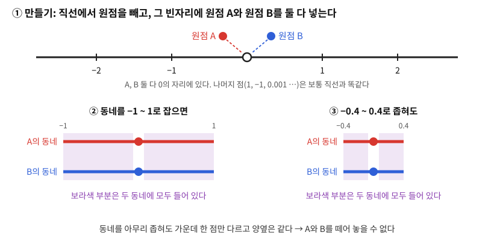

다른 하나는 제2가산 조건(셀 수 있는 개수의 열린 집합만으로 모든 열린 집합을 짜 맞출 수 있을 것)이다. 넓으면 안 된다는 뜻이 아니다. 끝없이 넓은 평면도 중심과 반지름이 유리수인 원판들로 충분하다. 이 조건이 있어야 조각마다 한 계산을 매끄럽게 이어 붙여 공간 전체의 계산(예를 들어 적분)으로 만들 수 있다.

### 두 물음의 이름: 아틀라스와 전이함수

이 절에서 구면을 두고 씨름한 고민은 결국 두 가지 물음이었다. 반구 두 장으로 자를까, 극 하나씩만 빼고 넉넉히 겹칠까 하는 고민은 **공간을 차트 몇 장으로 어떻게 나눌 것인가**라는 물음이다. 이음매에서 항로가 끊기느냐, 0끼리 붙이느냐 마느냐 하는 고민은 **겹치는 곳에서 두 차트의 좌표를 어떻게 이을 것인가**라는 물음이다.

수학은 이 두 물음에 정식 이름을 붙여 두었다. 첫 번째 물음의 답, 곧 공간 전체를 빠짐없이 덮는 차트들의 모음이 앞에서 정의한 아틀라스다. 두 번째 물음의 답, 곧 겹치는 곳에서 한 차트의 좌표를 다른 차트의 좌표로 바꾸는 규칙은 전이함수(transition map)라 부른다. 전이함수는 바로 다음 절에서 본격적으로 다룬다. 이 두 낱말은 이 책 내내 쓰인다. 곡면 위에서 속도를 재든, 거리를 재든, 휘어짐을 재든, 계산은 늘 차트 한 장 안에서 하고, 그 결과가 다른 차트로 옮겨 가도 뜻이 같은지는 전이함수로 확인하기 때문이다.

## 전이함수: 겹치는 곳의 번역 규칙

앞 절 첫머리의 역사에서, 반구 지도 두 장은 이음매에서 항로가 끊겼고 입체사영 두 장은 넉넉히 겹쳐서 그 문제를 풀었다. 그리고 앞 절 끝에서 이 이음매 고민, 곧 겹치는 곳에서 두 차트의 좌표를 어떻게 이을 것인가에 전이함수라는 이름을 붙였다. 이제 그 번역 규칙을 실제로 구해 보자.

문제는 겹치는 부분이다. 지도책의 유럽 지도와 아시아 지도는 터키 근처에서 겹친다.

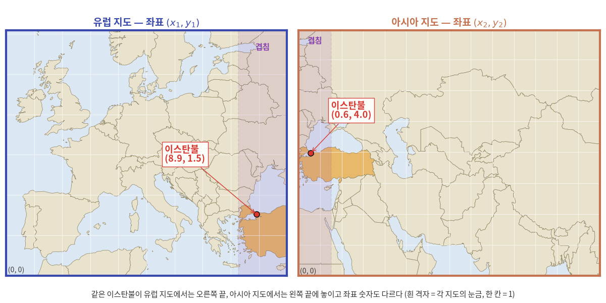

앞에서 본 구면의 두 차트도 마찬가지다. 북극과 남극을 뺀 나머지 점은 모두 두 차트에 함께 들어 있고, 같은 점이 두 차트에서 서로 다른 좌표를 받는다. 두 좌표가 같은 점이라는 것을 어떻게 알아볼 수 있을까?

지도책이 한 권의 지도로 제 구실을 하려면 두 가지가 더 필요하다:

1. **조각들이 겹치는 곳에서는 번역 규칙이 있어야 한다.** 유럽 좌표를 아시아 좌표로, 또는 그 반대로 변환하는 함수가 있어야 한다. 이 함수는 매끄러워야(미분 가능해야) 한다 — 갑자기 좌표가 점프하면 곤란하니까.

2. **이 번역 규칙들이 서로 모순이 없어야 한다.** A → B → C로 가든, A → C로 직접 가든, 결과는 같아야 한다.

이것이 바로 수학자들이 "매니폴드"라고 부르는 것의 핵심 아이디어다. 한 장의 완벽한 지도 대신, 여러 장의 부분 지도와 그것들 사이의 번역 규칙을 들고 다니는 것.

### 좌표 번역기

- **전이함수** (좌표 번역기 / Coordinate Translator) — 겹치는 영역 $U_\alpha \cap U_\beta$에서 한 좌표를 다른 좌표로 변환하는 함수 $\varphi_\beta \circ \varphi_\alpha^{-1}$. 이 함수가 매끄러우면($C^\infty$이면) 두 차트가 "호환된다"고 말한다. 아틀라스의 모든 차트 쌍이 호환되면 매끄러운 아틀라스라 한다.

구면의 두 차트로 번역을 한 건 해 보자. $\textcolor{#3949ab}{\varphi_N}$ 지도에서 $(2, 0)$에 찍힌 점은 구면 위의 $(0.8, 0, 0.6)$이다. 이 점을 $\textcolor{#3949ab}{\varphi_S}$ 지도로 보면 $0.8/(1+0.6) = 0.5$이므로 $(0.5, 0)$에 찍힌다. 같은 점이 한 지도에서는 $(2, 0)$, 다른 지도에서는 $(0.5, 0)$이다. 원점에서의 거리 2가 $1/2$로 뒤집혔다.

두 차트가 겹치는 영역(북극과 남극을 모두 뺀 부분) 전체에서 이 번역을 식 하나로 쓸 수 있다.

$$
\textcolor{#3949ab}{\varphi_S} \circ \textcolor{#3949ab}{\varphi_N}^{-1}(\textcolor{#1b9e77}{x}, \textcolor{#1b9e77}{y}) = \frac{1}{\textcolor{#1b9e77}{x}^2 + \textcolor{#1b9e77}{y}^2}\,(\textcolor{#1b9e77}{x}, \textcolor{#1b9e77}{y})
$$

$$
\begin{array}{ll}
\textcolor{#1b9e77}{x}, \textcolor{#1b9e77}{y} & \text{차트 } \textcolor{#3949ab}{\varphi_N} \text{ 에서 읽은 좌표} \\
\textcolor{#3949ab}{\varphi_S} \circ \textcolor{#3949ab}{\varphi_N}^{-1} & \text{전이함수: } \textcolor{#3949ab}{\varphi_N} \text{ 좌표를 } \textcolor{#3949ab}{\varphi_S} \text{ 좌표로 번역}
\end{array}
$$

이것은 단위원을 거울 삼아 안과 밖을 뒤집는 반전(inversion)이다. 적도는 두 차트 모두에서 단위원 위에 놓이고, 북반구는 $\textcolor{#3949ab}{\varphi_N}$에서는 단위원 밖으로, $\textcolor{#3949ab}{\varphi_S}$에서는 단위원 안으로 간다. 전이함수는 원점에서만 정의되지 않는데, $\textcolor{#3949ab}{\varphi_N}$의 원점은 남극이라 애초에 겹치는 영역에 없다. 겹치는 영역 전체에서 무한히 미분 가능하므로 이 아틀라스는 매끄럽다.

지금까지를 정리하면 다음과 같다:

> 국소적으로 $\mathbb{R}^{\textcolor{#c4724f}{n}}$처럼 보이는 공간은, $\mathbb{R}^{\textcolor{#c4724f}{n}}$으로의 좌표를 붙이는 함수들(차트)의 모음과 겹치는 영역에서의 매끄러운 변환 규칙(전이함수)으로 빠짐없이 나타낼 수 있다.

두 입체사영 차트로 구면을 덮은 아틀라스다. 두 평면 중 어느 쪽에서든 점을 끌면 구면 위의 점이 따라 움직이고, 구면은 끌어서 돌려 볼 수 있다. 점을 북극 쪽으로 가져가면서 $\textcolor{#3949ab}{\varphi_N}$ 좌표가 어떻게 되는지, 그동안 $\textcolor{#3949ab}{\varphi_S}$ 좌표와 전이함수는 어떻게 되는지 지켜보자.

  <noscript>이 시각화를 보려면 JavaScript가 필요합니다.</noscript>

### ML에서: 같은 분포를 두 좌표로 읽기

정규분포 하나는 평균 $\textcolor{#1b9e77}{\mu}$와 표준편차 $\textcolor{#1b9e77}{\sigma} > 0$ 두 숫자로 정해지므로, 정규분포들의 모임은 2차원 매니폴드이고 $(\textcolor{#1b9e77}{\mu}, \textcolor{#1b9e77}{\sigma})$는 그 위의 차트 하나다. 그런데 신경망이 $\textcolor{#1b9e77}{\sigma}$를 직접 내놓게 하면 $\textcolor{#1b9e77}{\sigma} > 0$이라는 제약을 따로 챙겨야 해서, 흔히 로그값을 대신 출력하게 한다. VAE의 인코더가 분산 $\textcolor{#1b9e77}{\sigma}^2$ 대신 $\log \textcolor{#1b9e77}{\sigma}^2$을 내놓는 것이 대표적인 예다.

이렇게 하면 같은 분포 모임에 차트가 두 장 생긴다. 예컨대 $(\textcolor{#1b9e77}{\mu}, \textcolor{#1b9e77}{\sigma})$와 $(\textcolor{#1b9e77}{\mu}, s)$, $s = \log \textcolor{#1b9e77}{\sigma}$ 사이의 전이함수는 $\textcolor{#1b9e77}{\sigma} = e^{s}$, $s = \log\textcolor{#1b9e77}{\sigma}$로 양쪽 모두 무한히 미분 가능하다. 여기서 움직이는 것은 모델이 출력하는 분포의 매개변수이고, 좌표가 달라도 가리키는 분포는 같다. 유럽 지도의 좌표와 아시아 지도의 좌표가 같은 이스탄불을 가리키는 것과 같다.

### 문제 2 — 두 장의 지도에서 같은 점 읽기

계산 단위구 위의 두 점 $A = (0.6,\ 0,\ 0.8)$, $B = (0,\ -0.8,\ -0.6)$의 $\textcolor{#3949ab}{\varphi_N}$ 좌표와 $\textcolor{#3949ab}{\varphi_S}$ 좌표를 구하라. 전이함수로 $\textcolor{#3949ab}{\varphi_N}$ 좌표를 번역하면 $\textcolor{#3949ab}{\varphi_S}$ 좌표가 나오는지 확인하고, 북극 $(0, 0, 1)$에서는 어떻게 되는지 설명하라.

#### 같이 풀기 세션 2

**김민준:** numpy로 먼저 돌려 봤어요. $A$는 $\textcolor{#3949ab}{\varphi_N}(A) = (3, 0)$, $\textcolor{#3949ab}{\varphi_S}(A) = (1/3, 0)$이 나와요. 그런데 전이함수에 $(3, 0)$을 넣으니까 $(27, 0)$이 나와서 안 맞아요. 공식이 틀린 거 아니에요?

**이서연:** 너 $(\textcolor{#1b9e77}{x}, \textcolor{#1b9e77}{y})$에 $\textcolor{#1b9e77}{x}^2 + \textcolor{#1b9e77}{y}^2$를 곱했지? 공식은 나누는 거야. $(3, 0) / 9 = (1/3, 0)$, 딱 맞아.

**선생님:** 곱할지 나눌지 헷갈릴 때 쓸 수 있는 검산이 하나 있어요. 적도는 두 차트에서 어디로 가죠?

**김민준 〔M07〕:** 둘 다 단위원이요. 그러면 북반구에 있는 $A$는 $\textcolor{#3949ab}{\varphi_N}$에선 단위원 밖, $\textcolor{#3949ab}{\varphi_S}$에선 안이어야 하니까, 3이 27로 가면 여전히 밖이라 말이 안 되네요. 안팎을 뒤집으려면 나눠야 하고요.

**김민준:** PyTorch 과제에서 역행렬 대신 행렬을 곱해 놓고 조교한테 "단위벡터 하나 넣어서 검산은 해 봤어요?" 소리 들었던 거랑 똑같아요.

**이서연:** $B$도 해 볼게요. $\textcolor{#3949ab}{\varphi_N}(B) = (0, -0.8)/1.6 = (0, -0.5)$이고 $\textcolor{#3949ab}{\varphi_S}(B) = (0, -0.8)/0.4 = (0, -2)$. 번역하면 $(0, -0.5)/0.25 = (0, -2)$로 맞아요. 그런데 북극은 $\textcolor{#3949ab}{\varphi_N}(0, 0, 1) = (0/0,\ 0/0)$이니까 부정형이잖아요. 극한을 잡으면 값이 나오지 않을까요?

**선생님:** 한번 잡아 보세요. 경도는 고정하고, 북극에서 각도 $t$만큼 떨어진 점에서 출발해서 $t \to 0$으로 보내면요?

**이서연 〔S06〕:** $X = \sin t$, $1 - Z = 1 - \cos t \approx t^2/2$니까 $X/(1-Z) \approx 2/t$. 0으로 수렴하는 게 아니라 무한대로 가네요. 어느 방향에서 다가가든 $|\textcolor{#3949ab}{\varphi_N}| \to \infty$예요.

**선생님:** 그래서 북극은 $\textcolor{#3949ab}{\varphi_N}$의 영역에 처음부터 넣지 않은 거예요. 그 자리는 $\textcolor{#3949ab}{\varphi_S}$가 맡아서 $(0, 0)$으로 멀쩡하게 보여 줘요. 차트 한 장이 못 담는 점은 다른 장이 담으면 돼요.

**이서연:** 해석학 시간에 $1/x$가 $(0, 1]$에서는 연속인데 $0$에서 값을 억지로 붙일 수는 없다고 배운 것과 같네요. 정의역 밖의 점을 극한으로 끌어들이려고 하면 안 되는 거군요.

## 토러스: 팩맨 화면을 두 장의 지도로

전이함수를 구면에서만 보았다. 차트 두 장이 겹치는 곳에서 좌표를 번역한다는 생각이 구면 말고 다른 공간에서도 그대로 통할까? 뜻밖에도 익숙한 곳, 오락실 게임 화면에 좋은 예가 있다.

### 역사: 화면 끝이 반대편 끝으로 이어진 게임

1979년 아타리의 게임 「애스터로이드(Asteroids)」에서는 우주선이 화면 오른쪽 끝으로 나가면 왼쪽 끝에서, 위쪽 끝으로 나가면 아래쪽 끝에서 다시 나타났다. 화면 가장자리에 벽을 세우는 대신 맞은편 가장자리와 이어 붙인 것이다. 이듬해 남코의 「팩맨(Pac-Man)」은 미로 양옆에 통로를 뚫어, 왼쪽 통로로 나간 팩맨이 오른쪽 통로로 들어오게 했다. 게임을 만든 사람들은 좁은 화면을 끝없이 넓어 보이게 하려고 이 방법을 썼지만, 수학으로 보면 이들은 평평한 직사각형 화면으로 전혀 다른 공간을 만든 셈이다.

### 감기 규칙과 두 화면

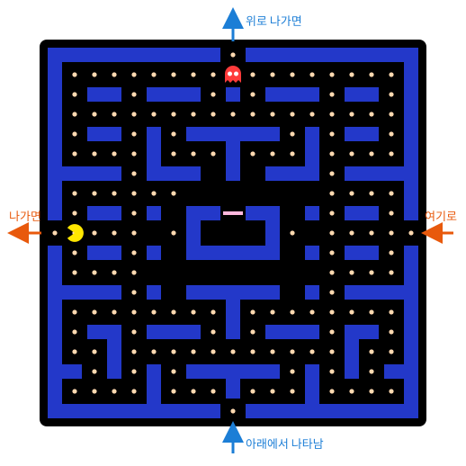

좌우와 위아래가 모두 이어진 화면을 생각하자. 오른쪽 끝과 왼쪽 끝을 붙이면 화면은 원통이 되고, 그 원통의 위쪽 끝과 아래쪽 끝을 다시 붙이면 도넛 표면이 된다.

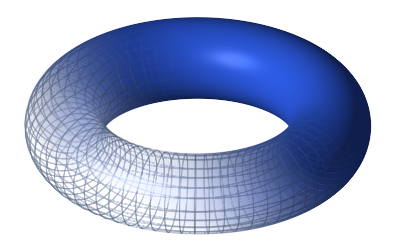

- **토러스** (도넛 표면 / Torus) — 직사각형의 오른쪽 변과 왼쪽 변, 위쪽 변과 아래쪽 변을 각각 이어 붙여 만든 곡면. 팩맨이 실제로 사는 공간이다.

화면을 가로 0~10, 세로 0~10의 좌표로 읽으면 화면은 토러스의 차트 한 장이다. 이 차트를 $\textcolor{#3949ab}{\varphi_A}$라 하자. 그런데 화면 가장자리, 곧 이어 붙인 이음매 위의 점에는 좌표를 하나로 정할 수 없다. 오른쪽 끝의 10과 왼쪽 끝의 0이 같은 자리이기 때문이다. 그래서 차트 $\textcolor{#3949ab}{\varphi_A}$는 이음매를 뺀 열린 정사각형 안쪽만 맡는다.

빠진 이음매는 카메라를 옮긴 두 번째 화면으로 채운다. 화면 A를 가로·세로로 5칸씩 옮겨 찍은 화면 B를 만들면, 화면 A의 이음매가 화면 B에서는 한가운데 십자로 들어온다. 두 화면이 겹치는 곳에서 화면 A의 좌표를 화면 B의 좌표로 바꾸는 전이함수는 다음과 같다. 세로 좌표 $\textcolor{#1b9e77}{y}$에도 같은 규칙을 쓴다.

$$
\textcolor{#3949ab}{\varphi_B} \circ \textcolor{#3949ab}{\varphi_A}^{-1}:\ \textcolor{#1b9e77}{x} \mapsto \begin{cases} \textcolor{#1b9e77}{x} + 5 & (\textcolor{#1b9e77}{x} < 5) \\ \textcolor{#1b9e77}{x} - 5 & (\textcolor{#1b9e77}{x} > 5) \end{cases}
$$

$$
\begin{array}{ll}
\textcolor{#3949ab}{\varphi_A} & \text{화면 A의 차트: 이음매를 뺀 화면, 좌표 } 0 < \textcolor{#1b9e77}{x}, \textcolor{#1b9e77}{y} < 10 \\
\textcolor{#3949ab}{\varphi_B} & \text{화면 B의 차트: 화면 A를 가로·세로 5칸씩 옮긴 화면} \\
\textcolor{#1b9e77}{x}, \textcolor{#1b9e77}{y} & \text{화면 A에서 읽은 가로·세로 좌표}
\end{array}
$$

$\textcolor{#1b9e77}{x} = 5$인 세로줄은 화면 B의 이음매라서 겹치는 곳에 들어가지 않는다. 겹치는 곳은 두 화면의 이음매를 모두 뺀 네 조각이고, 조각마다 전이함수는 5를 더하거나 빼는 평행이동이라 무한히 미분 가능하다. 구면에서 반전이 하던 일을 토러스에서는 평행이동이 한다.

아래 도구에서 화면 A, 화면 B, 토러스를 함께 볼 수 있다. 팩맨을 끌거나 좌표를 직접 넣어 보고, 이음매를 넘을 때 어느 화면의 좌표가 튀는지 지켜보자.

  <noscript>이 시각화를 보려면 JavaScript가 필요합니다.</noscript>

### 문제 3 — 팩맨의 두 화면 좌표

계산 팩맨이 화면 A의 $(\textcolor{#1b9e77}{8}, \textcolor{#1b9e77}{3})$에 있다. (1) 화면 B에서 팩맨의 좌표를 구하라. (2) 팩맨이 오른쪽으로 3칸 가면 화면 A와 화면 B의 좌표는 각각 어떻게 되는가? 어느 화면에서 좌표가 튀는가? (3) 화면 A와 화면 B 어디에도 나타나지 않는 점이 있는가? 있다면 모두 찾아라.

풀이를 마친 뒤 위 도구의 「문제 3 불러오기」를 누르고, 화면 A 좌표를 직접 넣거나 → 버튼으로 한 칸씩 옮기면서 자기 답과 비교해 보자.

#### 같이 풀기 세션 3

**김민준:** (1)은 쉬워요. 5씩 더하면 되니까 $(\textcolor{#1b9e77}{13}, \textcolor{#1b9e77}{8})$이요.

**이서연:** 화면이 0부터 10까지인데 13이 어디 있어? 8은 5보다 크니까 빼야지. $8 - 5 = 3$, $3 + 5 = 8$이라서 $(\textcolor{#1b9e77}{3}, \textcolor{#1b9e77}{8})$.

**선생님:** 도구에 $(8, 3)$을 넣어 보면 화면 B의 팩맨이 가로 3, 세로 8에 있어요. 민준 학생, 13칸째가 없으면 팩맨은 어디로 가죠?

**김민준 〔M04〕:** 10에서 한 바퀴 돌아서 3이요… 결국 서연이 답이랑 같네요. 원형 버퍼에서 인덱스에 `% n` 안 붙였다가 배열 밖을 읽은 거랑 똑같은 실수예요.

**선생님:** (2)로 가 봅시다. 오른쪽으로 3칸 가면요?

**김민준:** 화면 A에서는 $8 \to 9 \to 10$을 지나서 $(\textcolor{#1b9e77}{1}, \textcolor{#1b9e77}{3})$이 돼요. 화면 B에서는 $3 \to 6$이니까 $(\textcolor{#1b9e77}{6}, \textcolor{#1b9e77}{8})$이고요. 화면 A에서는 가로 좌표가 9 다음에 갑자기 0 근처로 떨어져요.

**이서연:** 도구에서 → 버튼을 세 번 누르니까 화면 A의 자취만 오른쪽 끝에서 끊기고 ✕가 찍혀요. 화면 B의 자취는 한 줄로 이어지고요. 토러스 위에서는 당연히 한 줄이고.

**선생님:** 팩맨은 매끄럽게 걸었는데 화면 A의 숫자가 튄 거예요. 튄 건 팩맨이 아니라 화면 A의 이음매예요. 그 자리를 지날 때는 화면 B로 보면 되고요. 그럼 (3), 두 화면 어디에도 없는 점은요?

**이서연 〔S02〕:** 화면 A에는 이음매 두 줄, 가로 0인 세로줄과 세로 0인 가로줄이 빠져요. 화면 B에는 화면 A 기준으로 가로 5인 세로줄과 세로 5인 가로줄이 빠지고요. 두 화면에 다 없으려면 빠진 줄끼리 만나야 하니까… 가로 0이면서 세로 5인 점, 가로 5이면서 세로 0인 점, 두 개예요.

**김민준 〔M08〕:** 잠깐, 가로 0, 세로 5면 화면 왼쪽 끝 한가운데잖아요. 팩맨 그림에서 좌우 통로 입구예요! 가로 5, 세로 0은 위아래 통로 입구고요. 게임에서 제일 자주 지나다니는 자리가 두 화면 어디에도 안 보이는 거네요.

**선생님:** 도구에 $(0, 5)$를 넣어 보면 두 화면 모두에서 팩맨이 점선 동그라미로만 남아요. 그래서 토러스를 빠짐없이 덮으려면 화면이 하나 더 필요해요. 예를 들어 화면 A를 가로·세로 2.5칸씩 옮긴 화면 C는 이음매가 2.5에 있으니 통로 입구 두 점을 모두 담아요.

**이서연:** 구면은 두 장이면 됐는데, 토러스는 이렇게 옮긴 화면으로는 두 장으로 모자라네요.

## 컴팩트성: 좌표 하나로 담을 수 없는 이유

구면에는 차트를 두 장 썼다. 한 장으로는 정말 안 되는 걸까? 가장 단순한 원부터 확인해 보자.

반지름 1인 원 위의 점을 각도 하나로 가리켜 보자. 각도 다이얼(좌표 하나를 돌려 점을 고르는 손잡이)을 $0$에서 $2\pi \approx 6.283$까지 돌리면 원을 한 바퀴 돈다. 각도 $6.27$인 점과 $0.01$인 점은 원 위에서 $0.023$쯤 떨어진 바로 옆 이웃이다. $6.27$에서 조금만 더 가면 $2\pi$를 지나 $0.01$에 닿기 때문이다. 그런데 다이얼 눈금으로는 $6.26$이나 떨어져 있다. 다이얼 하나로 원을 담으려면 어딘가 한 곳을 찢어야 한다.

하지만 이것은 아직 직관이다. 각도 다이얼은 수많은 좌표 가운데 하나일 뿐이다. 누군가 훨씬 기발한 좌표를 들고 와서 "이걸로는 원이 한 장에 담긴다"고 주장하면 어떻게 반박할까? 세상의 모든 좌표를 하나하나 시험해 볼 수는 없다. 구면도 마찬가지다. 지금까지 본 도법들이 모두 어딘가를 찢었다는 것은, 앞으로 나올 도법도 모두 그럴 것이라는 보장이 되지 못한다. 어떤 좌표든 한꺼번에 막아 내는 이유, 곧 증명이 필요하다.

### 역사: 끝없이 쪼개도 어딘가로 모인다

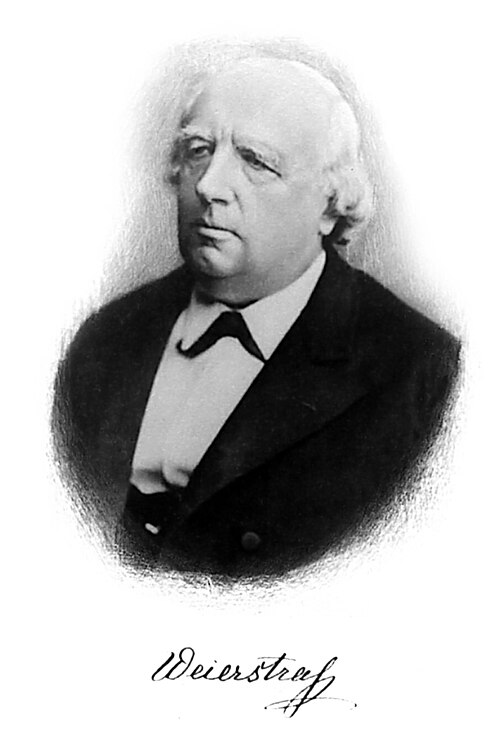

증명의 열쇠는 뜻밖에도 지도가 아니라 "최댓값이 정말 있는가"라는 물음에서 나왔다. 19세기 초까지 수학자들은 연속인 곡선이 닫힌 구간에서 가장 높은 점을 가진다는 것을 당연하게 여겼다. 그림을 그려 보면 늘 그랬기 때문이다. 1817년 프라하의 신부이자 수학자 베르나르트 볼차노(Bernard Bolzano)는 이런 "그림으로 보면 당연한 것"을 그림 없이 증명하려고 나섰고, 그 과정에서 핵심 아이디어를 찾았다. 구간을 반으로, 또 반으로 끝없이 쪼개 가며 점들이 몰려 있는 쪽을 따라가면, 반드시 어느 한 점으로 모여든다는 것이다. 하지만 그의 글은 오랫동안 거의 읽히지 않았다.

이 아이디어를 되살린 사람이 카를 바이어슈트라스(Karl Weierstrass)다. 그는 마흔 가까운 나이까지 독일의 작은 마을 고등학교에서 수학과 체육을 가르치며, 밤마다 혼자 연구했다. 1854년 발표한 논문 한 편으로 단숨에 이름이 알려져 베를린 대학으로 옮긴 뒤, 1860년대부터 그곳 강의에서 미적분을 처음부터 다시 세웠다. "유계인 수열은 반드시 어떤 점으로 모여드는 부분수열을 가진다"(오늘날의 볼차노–바이어슈트라스 정리)와 "닫힌 구간 위의 연속함수는 최댓값을 가진다"(최댓값 정리)를 엄밀하게 증명한 것이 이 강의였다.

그 뒤로 여러 사람이 이 성질을 다듬었다. 1870~90년대에 에두아르트 하이네(Eduard Heine)와 에밀 보렐(Émile Borel)은 닫힌 구간을 열린 구간들로 덮으면 그중 유한 개만 골라도 충분하다는 것을 보였다. 1906년 모리스 프레셰(Maurice Fréchet)가 이런 성질을 가진 공간에 "컴팩트"라는 이름을 붙였고, 1920년대에 파벨 알렉산드로프(Pavel Alexandrov)와 파벨 우리손(Pavel Urysohn)이 오늘날 쓰는 일반적인 정의로 정리했다. 거리를 잴 수 없는 공간에서도 쓸 수 있는 정의였다.

원은 크기가 유한하고(유계), 가장자리로 새어 나가는 점 없이 닫혀 있다. 구면도 그렇다. 이런 공간을 **컴팩트** (유계이고 닫힌 공간 / Compact)하다고 한다. 바이어슈트라스의 최댓값 정리는 닫힌 구간에서만이 아니라 컴팩트한 공간 어디에서나 성립한다. 컴팩트한 공간 위의 연속함수는 반드시 최댓값을 가진다.

### 증명: 구면은 왜 차트 한 장에 담기지 않는가

이제 최댓값 정리 하나로 "어떤 좌표로도 구면을 한 장에 담을 수 없다"를 증명할 수 있다. 누군가 구면 전체를 담는 차트 $\textcolor{#3949ab}{\varphi}$를 찾았다고 해 보자. 차트이니 $\textcolor{#3949ab}{\varphi}$는 연속이고, 그 상(차트가 그리는 지도의 범위) $U$는 가장자리 없는 열린 집합이다.

1. **최댓값을 잡는다.** 구면 위 점 $p$마다 지도 위 가로 좌표 $\textcolor{#1b9e77}{x}(p)$를 대응시키는 함수는 연속이다. 구면은 컴팩트하므로 최댓값 정리에 따라 이 함수는 어떤 점 $p^*$에서 가장 큰 값을 가진다. 지도 위에서 $\textcolor{#3949ab}{\varphi}(p^*)$는 지도 전체에서 가장 오른쪽에 있는 점이다.
2. **열린 집합이라 조금 더 갈 수 있다.** $U$는 열린 집합이므로, $\textcolor{#3949ab}{\varphi}(p^*)$ 둘레의 작은 원판이 통째로 $U$ 안에 들어 있다. 그 원판 안에는 $\textcolor{#3949ab}{\varphi}(p^*)$보다 조금 더 오른쪽에 있는 점도 있다.
3. **모순.** 그 점도 $U$ 안에 있으니 구면의 어떤 점이 그 자리에 그려진다. 그런데 그 점의 가로 좌표는 최댓값보다 크다. 1과 2가 부딪친다.

따라서 구면 전체를 담는 차트는 없다. 이 증명은 차트가 어떤 식으로 생겼는지 한 번도 묻지 않았다. 입체사영이든 메르카토르든 아직 아무도 생각하지 못한 도법이든 똑같이 막힌다. 쓴 것은 두 가지뿐이다. 구면이 컴팩트하다는 것, 그리고 차트의 지도는 가장자리 없이 열려 있어야 한다는 것. 아틀라스 절의 역사에서 반구 지도의 이음매를 두고 고민한 "지도는 가장자리 없이 열려 있어야 한다"는 조건이 여기서 결정적으로 쓰인다. 원도 구면과 똑같이 컴팩트하므로, 같은 논증으로 차트 한 장에 담기지 않는다.

### 따라 계산해 보기 — 원을 두 장의 각도 지도로 덮기

찢지 않으려면 원 $S^1$을 각도 지도 두 장으로 덮는다.

- 차트 1: 점 $(1, 0)$을 뺀 원, 각도 $\textcolor{#1b9e77}{\theta_1} \in (0, 2\pi)$
- 차트 2: 점 $(-1, 0)$을 뺀 원, 각도 $\textcolor{#1b9e77}{\theta_2} \in (-\pi, \pi)$

두 차트가 겹치는 곳은 두 점을 모두 뺀 원, 곧 윗반원과 아랫반원 두 조각이다. 윗반원에서는 두 각도가 같다. 아랫반원에서는 사정이 달라서, 점 $(0, -1)$은 차트 1에서 $\textcolor{#1b9e77}{\theta_1} = 3\pi/2$, 차트 2에서 $\textcolor{#1b9e77}{\theta_2} = -\pi/2$로 $2\pi$만큼 차이가 난다.

$$
\textcolor{#3949ab}{\varphi_2} \circ \textcolor{#3949ab}{\varphi_1}^{-1}(\textcolor{#1b9e77}{\theta_1}) =
\begin{cases}
\textcolor{#1b9e77}{\theta_1} & 0 < \textcolor{#1b9e77}{\theta_1} < \pi \ \ \text{(윗반원)} \\
\textcolor{#1b9e77}{\theta_1} - 2\pi & \pi < \textcolor{#1b9e77}{\theta_1} < 2\pi \ \ \text{(아랫반원)}
\end{cases}
$$

$$
\begin{array}{ll}
\textcolor{#1b9e77}{\theta_1}, \textcolor{#1b9e77}{\theta_2} & \text{차트 1, 차트 2에서 읽은 각도} \\
\textcolor{#3949ab}{\varphi_1}, \textcolor{#3949ab}{\varphi_2} & \text{두 차트 사상 (점을 점으로 보내는 함수)}
\end{array}
$$

전이함수가 식 하나가 아니라 두 조각으로 되어 있다는 점이 눈에 띈다. 그래도 각 조각은 기울기가 1인 직선이라 무한히 미분 가능하고, $2\pi$만큼 뛰는 자리 $\textcolor{#1b9e77}{\theta_1} = \pi$는 점 $(-1, 0)$이라 차트 2에 들어 있지 않다. 전이함수에게 필요한 것은 "겹치는 곳 전체에서 매끄러울 것"이지 "한 줄짜리 공식일 것"이 아니다.

증명에 쓴 것은 컴팩트성뿐, 둥글다는 사실은 한 번도 쓰지 않았다. 그렇다면 둥글어도 컴팩트하지 않으면 한 장으로 담길까? 아래 문제에서 위아래가 열린 원기둥으로 따져 보자.

### 문제 4 — 원기둥에는 차트가 몇 장 필요한가

킬러 위아래 뚜껑이 없는 원기둥 옆면 $\{\textcolor{#ff4314}{X}^2 + \textcolor{#ff4314}{Y}^2 = 1,\ -1 < \textcolor{#ff4314}{Z} < 1\}$을 덮으려면 차트가 최소 몇 개 필요한가? 구면과는 무엇이 다른가?

#### 같이 풀기 세션 4

**선생님:** 이번 문제는 천천히 가 봅시다. 원기둥 옆면에 차트는 최소 몇 장 필요할까요?

**김민준:** 한 장이요. 가위로 세로로 한 줄 자르면 직사각형으로 펴지잖아요. 직사각형은 평면이니까 끝이에요.

**이서연:** 저는 두 장이요. 원기둥은 원이랑 구간을 곱한 거고, 원은 차트가 최소 두 장 필요하잖아요. 곱해도 두 장은 있어야죠.

**선생님:** 답이 갈렸네요. 민준 학생, 가위로 자른 선 위의 점은 어느 차트에 들어가요?

**김민준 〔M04〕:** 어… 자른 선은 직사각형의 왼쪽 끝이기도 하고 오른쪽 끝이기도 한데요. 열린 직사각형으로 잡으면 그 선이 빠지고, 닫힌 걸로 잡으면 한 점이 두 군데로 가네요.

**선생님:** 차트는 한 조각을 평면의 **열린** 집합에 일대일로 보내야 해요. 잘라서 펴는 건 솔기 한 줄을 버리는 일이라, 그 줄을 덮을 차트가 하나 더 필요해져요.

**김민준:** 그럼 서연이 말대로 두 장이네.

**이서연 〔S06〕:** 그런데 이상해요. 원에 두 장이 필요했던 건 원이 컴팩트해서잖아요. 원 전체를 차트 하나로 보내면 그 결과 집합(상)은 컴팩트하면서 열린 집합이어야 하는데, 직선에 그런 집합은 없으니까요. 그런데 원기둥은 위아래가 열려 있어서 컴팩트가 아니에요. 그러면 그 논리가 안 먹혀요.

**선생님:** 좋은 지적이에요. 논리가 안 먹힌다는 건 한 장으로 될 수도 있다는 뜻이죠. 평면에서 원을 한 바퀴 품고 있으면서 열린 집합을 하나 떠올려 볼래요?

**김민준 〔M07〕:** 가운데가 뚫린 고리요! 과녁판에서 한가운데를 뺀 거요.

**선생님:** 그 고리 위에 원기둥을 어떻게 올릴까요?

**이서연:** 높이를 반지름으로 바꾸면 돼요. 아래 가장자리는 안쪽 원으로, 위 가장자리는 바깥 원으로 보내는 거예요.

$$
\textcolor{#3949ab}{\varphi}(\textcolor{#ff4314}{X}, \textcolor{#ff4314}{Y}, \textcolor{#ff4314}{Z}) = e^{\textcolor{#ff4314}{Z}}\,(\textcolor{#ff4314}{X}, \textcolor{#ff4314}{Y}) = (\textcolor{#1b9e77}{x}, \textcolor{#1b9e77}{y}), \qquad e^{-1} < \sqrt{\textcolor{#1b9e77}{x}^2 + \textcolor{#1b9e77}{y}^2} < e
$$

$$
\begin{array}{ll}
\textcolor{#3949ab}{\varphi} & \text{원기둥 전체를 덮는 차트 하나} \\
\textcolor{#1b9e77}{x}, \textcolor{#1b9e77}{y} & \text{고리 모양 영역 안의 좌표} \\
\textcolor{#ff4314}{X}, \textcolor{#ff4314}{Y}, \textcolor{#ff4314}{Z} & \text{원기둥 위 점의 3차원 위치}
\end{array}
$$

**이서연 〔S08〕:** 거꾸로도 갈 수 있어요. 고리 안의 점 $(\textcolor{#1b9e77}{x}, \textcolor{#1b9e77}{y})$에서 $\textcolor{#ff4314}{Z} = \ln\sqrt{\textcolor{#1b9e77}{x}^2 + \textcolor{#1b9e77}{y}^2}$이고, $(\textcolor{#ff4314}{X}, \textcolor{#ff4314}{Y})$는 $(\textcolor{#1b9e77}{x}, \textcolor{#1b9e77}{y})$를 길이 1로 줄인 방향이에요. 양쪽 다 매끄러우니까 한 장으로 충분하네요.

**김민준:** 그럼 제 답 한 장은 맞은 거예요?

**선생님:** 답은 맞았지만 이유가 틀렸어요. 가위로 잘라 펴는 게 아니라, 안쪽으로 눌러서 고리로 펴는 거예요. 서연 학생은 이유를 따지다가 스스로 반례를 찾았고요.

**김민준 〔M04〕:** 중간고사에서 답만 맞고 풀이에 0점 받았던 기억이 나네요. 조교님이 "답이 맞은 건 우연"이라고 써 놓으셨는데.

**이서연:** 나는 "부품에 필요한 장 수를 곱하면 전체에 필요한 장 수"라는 생각부터 버려야겠어요. 위상수학 시간에도 곱공간 성질을 부품에서 그대로 가져왔다가 반례를 맞은 적이 있거든요.

**선생님 〔T13〕:** 그래서 구면이 차트 한 장으로 안 되는 진짜 이유는 "둥글어서"가 아니라 "닫혀 있어서", 곧 컴팩트해서예요. 이 장의 첫 질문이었던 지구가 바로 그 경우죠.

## 자주 하는 실수와 요약

### 자주 하는 실수

| 실수 | 나온 문제 | 바로잡는 법 |
| --- | --- | --- |
| 부품(원)이 매니폴드이면 붙인 것도 매니폴드라고 봄 | 1 | 붙인 자리까지 모든 점을 확대해 본다. 8자의 교차점은 선분이 아니라 X자 |
| 안쪽이 평면이면 가장자리를 붙여도 매니폴드라고 봄 | 1 | 테두리 점도 확대해 본다. 가장자리를 포함한 원판의 테두리 점은 평면이 아니라 반평면 |
| 전이함수에서 나눌 것을 곱함 | 2 | 적도는 두 차트 모두에서 단위원 위. 안팎이 뒤집히는지로 검산한다 |
| 차트에 없는 점(북극)에 극한으로 좌표를 붙이려 함 | 2 | 그 점은 다른 차트($\varphi_S$)가 맡는다 |
| 화면 B 좌표를 구할 때 5를 더하기만 해서 10을 넘김 | 3 | 화면 좌표는 0~10 안에 있어야 한다. 5보다 작으면 더하고, 크면 뺀다 |
| 잘라서 펴면 차트 한 장이라고 봄 | 4 | 차트는 열린 집합으로 일대일. 자른 솔기 한 줄이 빠진다 |
| 부품(원 × 구간)의 차트 수를 전체에 그대로 가져옴 | 4 | 전체 모양으로 따진다. 원기둥은 고리 하나로 덮인다 |
| 한 장이 안 되는 이유를 "둥글어서"로 봄 | 4 | 이유는 컴팩트성. 구면은 닫혀 있어서 한 장으로 안 된다 |

### 요약

구면은 지도 한 장에 왜곡 없이 담을 수 없다. 대신 어느 점이든 둘레를 확대하면 평면처럼 보이므로(매니폴드), 조각마다 차트를 붙이고 차트들로 전체를 덮은 아틀라스와 겹치는 곳의 전이함수로 공간 전체를 나타낸다. 전이함수가 모두 매끄러우면 매끄러운 아틀라스다. 원이나 구면처럼 컴팩트한 공간은 차트 한 장으로 덮을 수 없지만, 위아래가 열린 원기둥처럼 컴팩트하지 않은 공간은 한 장으로 덮일 수도 있다.

### 연결되는 세계들

| 분야 | 연결 |
|------|------|
| 위상수학 | 매니폴드의 위상적 분류, 오일러 수, 호몰로지 |
| 물리학 | 일반상대론의 시공간 = 4차원 유사-리만 매니폴드 |
| 데이터 과학 | 매니폴드 가설: 고차원 데이터는 저차원 매니폴드 위에 놓여 있다 |
| 로보틱스 | 관절 로봇의 관절 각도를 모은 공간(배위공간, configuration space)은 매니폴드 |
| 통계학 | 확률분포의 모임 = 통계적 매니폴드 |

### 막힌 곳

이제 우리는 곡면 위의 점에 좌표를 붙이고, 지도를 바꿀 때 좌표를 번역할 수 있다. 그런데 점이 움직이기 시작하면 어떻게 될까? 곡면 위를 기어가는 개미의 속도는 어느 차트의 좌표로 말해야 하고, 차트를 바꾸면 그 속도는 어떻게 번역될까? 이 질문에는 아직 답하지 못했다.
