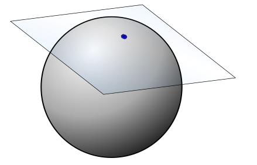
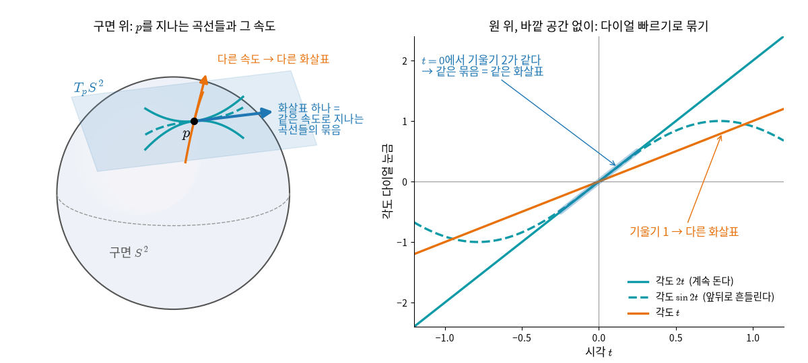
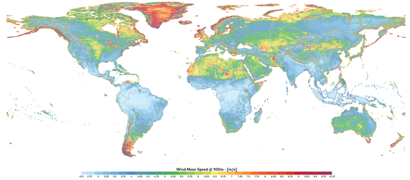
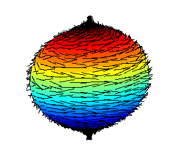

# 곡면 위에서 속도를 말하려면

## 출발 문제

개미 한 마리가 커다란 구슬 위를 기어가고 있다. 이 개미는 꽤 영리해서, 자기가 얼마나 빠르게, 어느 방향으로 움직이고 있는지를 알고 싶어 한다. 평면 위에서라면 이야기가 간단하다. "동쪽으로 초속 2cm"라고 말하면 된다. 속도벡터를 $x$-$y$ 좌표로 적으면 그만이다. 그런데 구면 위에서는 상황이 미묘해진다.

개미가 북극에 서 있다고 하자. 이 개미가 "위쪽으로 가겠다"고 말한다면, 그 "위"란 어디인가? 구면의 북극에서 바깥쪽을 가리키는 벡터는 구면을 뚫고 나가 버린다. 개미는 구면 *위에서만* 살아야 하므로, 구면을 벗어나는 방향은 허용되지 않는다. 개미의 속도벡터는 구면에 "접하는" 방향, 즉 구면의 표면을 스치듯이 지나가는 방향이어야 한다. 마치 테이블 위에 놓인 농구공의 꼭대기에 종이 한 장을 올려놓았을 때, 그 종이가 놓이는 평면 — 바로 그 평면이 개미가 속도를 말할 수 있는 공간이다.

여기서 핵심적인 의문이 떠오른다. 이 "접하는 평면"은 구면 자체가 아니다. 구면은 휘어져 있지만, 속도벡터가 사는 공간은 평평한 평면이다. 게다가 이 평면은 점마다 다르다 — 북극에 접하는 평면과 적도 위 한 점에 접하는 평면은 방향이 다른 별개의 평면이다. 그렇다면 속도벡터는 대체 "어디에" 사는 것인가? 구면 위도 아니고, 3차원 공간 전체도 아니고, 각 점에 붙어 있는 어떤 별도의 공간에 사는 것이다. 이 별도의 공간이 무엇인지를 이해하는 것이 이 장의 주제다.

조금 더 구체적으로 생각해 보자. 개미가 북극에서 적도를 향해 남쪽으로 내려가기 시작했다. 경도 0도를 따라 내려간다고 하자. 매 순간 개미의 속도벡터는 그 점에 접하는 평면에 놓인다. 그런데 북극에 접하는 평면과 적도에 접하는 평면은 완전히 다른 평면이다. 개미가 이동하면서 자기 속도벡터가 "사는 공간" 자체가 바뀌는 것이다. 이것은 마치 아파트에서 방을 옮길 때마다 내가 머무는 방이 바뀌는 것과 같다 — 각 방(접선공간)은 구조는 같지만 서로 다른 별개의 공간이다.

물리학에서도 이 문제는 절실했다. 뉴턴 역학에서 물체의 상태는 위치와 속도로 결정된다. 평면 위의 운동이라면 위치 $(x, y)$와 속도 $(v_x, v_y)$를 합쳐 4차원 공간 $\mathbb{R}^4$에 점 하나로 표현하면 된다. 그런데 구면 위의 운동은? 위치는 구면 위에 있고, 속도는 그 점에 접하는 평면 위에 있다. 위치와 속도를 함께 담는 공간 — 이것이 바로 뒤에서 만날 접선다발(tangent bundle)의 물리적 동기다.

더 근본적인 질문도 있다. 우리가 이 구면을 3차원 공간에 넣어서 생각했기 때문에 "접하는 평면"을 시각적으로 떠올릴 수 있었다. 그런데 만약 구면이 아무 곳에도 박혀 있지 않고, 그 자체로 독립된 세계라면? 2차원 구면 위에 사는 존재가, 바깥의 3차원 공간을 전혀 모른 채로도, 자기 점에서의 "가능한 방향"을 정의할 수 있을까? 놀랍게도 그 답은 "예"이다. 그리고 그 방법이 바로 접선공간의 내재적(바깥 공간 없이 곡면 안에서만 하는) 정의다.

## 접선공간: 한 점에서 낼 수 있는 모든 속도

개미의 속도는 구면 위에도, 3차원 공간 전체에도 살지 않는다고 했다. 그렇다면 정확히 어디에 사는가? 곡면보다 더 단순한 원부터 보자.

원(circle) $S^1$ 위를 움직이는 점을 생각하자. 원 위의 한 점 $p$에서 출발하는 모든 매끄러운 곡선 $\gamma(t)$를 생각한다. $\gamma(0) = p$이고, $\gamma$는 원 위에 머무른다. 이때 $t=0$에서의 속도 $\gamma'(0)$는 원의 접선 방향을 가리킨다. 가능한 속도는 빠르거나 느리거나, 시계방향이거나 반시계방향이거나 — 결국 하나의 실수로 결정된다. 즉 원(1차원 매니폴드. 매니폴드는 어느 점이든 둘레를 확대하면 평평하게 보이는 공간) 위 한 점에서의 접선공간은 $\mathbb{R}^1$과 같다.

구면 $S^2$에서도 같은 논리가 작동한다. 한 점 $p$를 지나는 모든 곡선의 속도벡터를 모으면, 가능한 속도의 집합은 2차원 평면을 이룬다 — 바로 $T_pS^2 \cong \mathbb{R}^2$이다($T_pS^2$는 구면 $S^2$의 점 $p$에 붙은 접선공간을 가리키는 한 덩어리 이름이고, $\cong$는 구조가 똑같다는 기호다). 일반적으로 $n$차원 매니폴드의 각 점에서 접선공간은 $\mathbb{R}^n$과 구조가 똑같은(동형인) 벡터공간이 된다. 핵심 통찰은 이것이다:

1. **각 점에는 자기만의 "방"이 있다.** 이 방 안에는 그 점에서 출발할 수 있는 모든 방향과 속력의 조합이 들어 있다. 이것이 접선공간 $T_pM$이다. 이 기호는 곱셈이 아니라 한 덩어리 이름이다. $T$는 접선(Tangent)의 머리글자, 아래첨자 $p$는 방이 붙은 점, $M$은 매니폴드로, "매니폴드 $M$의 점 $p$에 붙은 접선공간"이라고 읽는다.
2. **이 방은 매니폴드 자체와 다른 공간이다.** 매니폴드가 아무리 구불구불해도, 각 점의 접선공간은 항상 평평한 벡터공간이다. 이것은 마치 울퉁불퉁한 산의 각 지점에 아주 작은 평탄한 헬리패드를 놓는 것과 같다.

### 바깥 공간 없이 정의하기

지금까지는 구면을 3차원 공간에 넣어 두고 "접하는 평면"을 눈으로 보았다. 출발 문제의 마지막 물음처럼, 구면 안에서만 사는 존재도 이 방을 만들 수 있을까?

원 위에 사는 존재가 가진 것은 자기 좌표뿐이다. 좌표는 점마다 숫자 하나를 읽어 주는 다이얼이라고 생각하면 된다. 원이라면 각도 다이얼이다. 각도 0인 점 $p$를 지나는 두 곡선을 보자. 하나는 시각 $t$에 각도 $2t$에 있고, 다른 하나는 각도 $\sin 2t$에 있다. 첫째는 한 방향으로 계속 돌고, 둘째는 앞뒤로 흔들린다. 모양은 전혀 다르다. 그런데 $t = 0$에서 다이얼이 돌아가는 빠르기를 재면 둘 다 2다($\sin 2t$를 미분하면 $2\cos 2t$, $t=0$에서 2). 바깥 공간을 몰라도 원 위의 존재는 "두 곡선이 $p$에서 같은 속도로 지나간다"고 말할 수 있다.

다이얼을 바꿔도 결론은 같다. 각도를 라디안 대신 도(°)로 읽는 다이얼을 쓰면 두 곡선의 빠르기는 둘 다 약 114.6으로 함께 바뀐다. 같은 것은 다른 다이얼로 읽어도 같다(미분의 연쇄법칙 덕분이다). 반면 각도 $t$에 있는 곡선은 빠르기가 1이라 다른 속도다.

그래서 이렇게 정한다. $p$에서 다이얼 빠르기가 같은 곡선들을 한 묶음으로 모으고, 그 묶음 하나를 화살표 하나, 곧 접선벡터라 부른다(한 점에서의 순간 속도, 방향과 크기를 함께 가진 것). 묶음 전체를 모은 것이 접선공간 $T_pM$이고, $M$이 $n$차원이면 다이얼이 $n$개라 빠르기도 숫자 $n$개로 적힌다. 같은 화살표를 "함수 값이 그 방향으로 얼마나 빨리 변하는가"를 재는 방향미분으로 보는 정의도 있다. 원 위의 높이 $\sin(\text{각도})$를 두 곡선으로 재면 $t=0$에서 둘 다 2가 나오듯, 같은 묶음은 어떤 함수로 재도 같은 값을 낸다.

- **접선공간** (방향의 방 / Tangent Space, $T_pM$) — 한 점에 붙은 모든 가능한 방향의 집합. 그 점에서 출발할 수 있는 모든 속도벡터의 방(room)이며, $\dim M$차원의 벡터공간이다.

### ML에서: 이미지를 살짝 돌리는 방향

손글씨 숫자 이미지를 아주 조금 회전하면, 이미지는 픽셀값 공간 안에서 곡선을 그리며 움직인다. 회전 각도 $t$를 0에서 조금 늘릴 때 이 곡선의 $t=0$ 속도가 바로 그 이미지 점에서의 접선벡터 하나다. 시마르(P. Simard)·르쾽(Y. LeCun) 등이 1990년대 초 NIPS에 발표한 Tangent Prop은, 회전·이동처럼 숫자의 정체를 바꾸지 않는 변환이 만드는 접선벡터 방향으로 분류기 출력의 방향미분이 0에 가깝도록 벌점을 더했다. 여기서 움직이는 것은 데이터 점이고, 접선공간은 그 점에서 데이터가 움직일 수 있는 방향들을 모아 둔 방이다.

## 접선다발: 위치와 속도를 한 공간에

개미가 북극에서 적도로 내려가는 동안 속도가 사는 방은 매 순간 바뀐다. 개미의 상태, 곧 "어디에 있고 어느 쪽으로 얼마나 빨리 가는가"를 점 하나로 적고 싶다면 이 방들을 어떻게 모아야 할까? 평면이라면 위치 2개와 속도 2개를 이어 붙여 $\mathbb{R}^4$의 점 하나로 쓰면 끝이었다. 곡면에서도 같은 생각을 한다.

원에서 먼저 해 보자. 원 위의 상태는 숫자 두 개로 적힌다. 각도 다이얼 하나와, 그 자리에서 다이얼이 돌아가는 빠르기 하나. 예를 들어 (0.5, 2)는 "각도 0.5인 자리에서 빠르기 2로 돌고 있다"는 상태다. 각도는 원을 따라 한 바퀴 돌아 제자리로 오고, 빠르기는 음수부터 양수까지 어떤 실수든 될 수 있다. 원의 점마다 그 점의 속도 직선을 하나씩 세워 늘어놓으면, 원을 따라 세운 직선들이 원기둥을 이룬다. 원의 상태 공간은 원기둥이고, 원기둥은 2차원이다.

구면이라면 위치 2개와 속도 2개, 모두 4개의 숫자다. 일반적으로 $M$이 $n$차원이면 모든 점의 방을 한데 모은 공간은 $2n$차원의 매니폴드다 — 위치 $n$개, 속도 $n$개.

- **접선다발** (방향의 방 모음 / Tangent Bundle, $TM$) — 모든 점의 접선공간을 한데 모은 것. $TM$도 곱셈이 아니라 이름이다. 접선공간 $T_pM$에서 특정한 점 $p$를 떼어 내, "매니폴드 $M$의 모든 점의 접선공간"을 뜻한다. 그 자체가 $2\dim M$차원의 매니폴드이고, 위치와 속도를 한꺼번에 나타내는 무대다.

이처럼 점마다 같은 모양의 방을 붙이되 전체가 하나의 매끄러운 공간이 되게 하는 구조에는 따로 역사가 있다.

### 역사: 샤를 에레스만 (Charles Ehresmann, 1905–1979)

"접선다발"이라는 말을 처음 들으면, 매니폴드의 각 점에 접선공간이라는 방을 하나씩 붙인다는 이미지가 떠오른다. 이처럼 "점마다 같은 모양의 방을 붙이되 전체가 하나의 매끄러운 공간을 이룬다"는 구조를 일반적인 틀로 다듬은 핵심 인물이 샤를 에레스만이다. 1930년대 해슬러 휘트니(Hassler Whitney)가 구면다발로 길을 열었고, 에레스만이 그것을 오늘날의 파이버 다발 이론으로 정리했다.

에레스만은 스트라스부르 출신의 프랑스 수학자였다. 1930년대, 엘리 카르탕(Élie Cartan)의 지도 아래 미분기하학을 공부하던 그는 하나의 질문에 사로잡힌다: 매니폴드 위에서 "연속적으로 변하는 구조"를 어떻게 하나의 틀로 나타낼 수 있는가?

1940년대 초, 그는 파이버 다발(fibre bundle)의 일반 이론을 세운다. 바탕이 되는 공간의 각 점에 같은 모양의 공간(파이버)을 하나씩 붙이되, 전체가 매끄러운 매니폴드를 이루는 구조다. 접선다발은 그 가장 자연스러운 예다. 바탕은 매니폴드 $M$이고, 각 점에 붙은 파이버는 그 점의 접선공간이다. 원을 따라 속도 직선을 세운 원기둥이 바로 이 구조다.

에레스만은 또한 다발 위에서 이웃한 점의 벡터를 비교하는 규칙(에레스만 접속)을 도입하여, 곡선을 따라 벡터를 돌리지 않고 옮기는 일반적 방법을 제시했다.

### ML에서: 모멘텀 옵티마이저의 상태

모멘텀을 쓰는 경사하강법은 매 단계 매개변수 $\theta$와 함께 "지금까지 움직여 온 속도" $v$를 기억한다. 옵티마이저의 상태는 (위치, 속도) 한 쌍이고, 매개변수가 $n$개면 상태는 $2n$개의 숫자다. $n$차원 매니폴드의 접선다발이 $2n$차원인 것과 같은 셈이다. 매개변수 공간이 평평한 $\mathbb{R}^n$이면 $(\theta, v)$는 그냥 숫자 $2n$개의 묶음이라 다발 구조가 드러나지 않는다. 하지만 매개변수를 길이 1인 벡터로 묶어 두면 매개변수는 구면 위를 움직이고, 속도 $v$는 그 점의 접선공간 안에 있어야 한다는 제약이 생긴다. 위치가 바뀌면 속도가 들어갈 방도 바뀐다.

### 문제 1 — 접선공간은 몇 차원인가

확인 3차원 공간에 놓인 구면 $S^2$의 한 점 $p$에서 접선공간 $T_pS^2$는 몇 차원인가? 접선다발 $TS^2$는 몇 차원 매니폴드인가?

#### 같이 풀기 세션 1

**김민준:** 3차원이요. numpy로 접선공간의 벡터를 뽑아 보면 성분이 $(x, y, z)$ 세 개씩 나오거든요. 그러면 접선다발은 위치 3개에 속도 3개니까 6차원이겠네요.

**이서연:** 성분이 세 개라고 3차원은 아니지. 접선공간의 벡터는 법선(곡면에 수직으로 선 방향)과 수직이라는 조건을 하나 만족해야 하잖아. 자유롭게 고를 수 있는 건 두 개야.

**선생님:** 민준 학생, 접선공간의 벡터 $(a, b, c)$를 하나 마음대로 골라 보세요. 몇 개까지 마음대로 정할 수 있어요?

**김민준 〔M07〕:** 두 개를 정하면 세 번째는 법선과 수직이 되게 저절로 정해지네요. 그럼 $T_pS^2$는 2차원이고, 구면 위의 위치도 2개니까 $TS^2$는 4차원이에요.

**선생님:** 맞아요. 성분의 개수는 우리가 구면을 어디에 넣어 두었느냐에 달려 있지만, 차원은 구면이 스스로 정해요.

**김민준:** 보고서 표에 칸이 세 개 있어도 셋째 칸이 앞의 두 칸으로 계산되는 합계 칸이면, 조교님이 "실제로 입력한 값은 두 개네요" 하시는 거랑 같네요.

## 좌표 기저: 좌표 한 칸만큼 가는 화살표

접선공간이 벡터공간이라는 것은 알았다. 하지만 개미가 "내 속도는 이것"이라고 말하려면 숫자로 적어야 한다. 구면 안에서만 사는 개미는 $x, y, z$를 모르고 자기 좌표만 안다. 좌표만 가지고 화살표에 이름을 붙일 수 있을까?

구면의 다이얼은 둘이다. 북극에서 잰 각 $\theta$(여위도)와 경도 $\phi$. 경도 다이얼만 0.01 돌리고 $\theta$는 그대로 두면 점은 동쪽으로 조금 움직인다. 적도에서는 거의 정확히 0.01만큼, 북극에서 30도 떨어진 곳($\theta = 30°$)에서는 0.005만큼 움직인다. 같은 "경도 0.01"이라도 위도에 따라 실제 거리가 $\sin\theta$배로 줄어든다. 이렇게 다이얼 하나만 조금 돌릴 때 점이 움직이는 화살표를 그 다이얼의 기저 화살표 $\partial_\phi$라 부르고, 그 길이는 $\sin\theta$다. 다이얼마다 하나씩 이런 화살표가 있고, 어떤 속도든 "$\theta$ 화살표 몇 개와 $\phi$ 화살표 몇 개"로 적을 수 있다.

좌표가 여럿일 때 쓰는 표기 세 가지를 먼저 풀어 둔다. 좌표는 $x^1, x^2, \ldots$처럼 번호를 위에 붙여 $x^i$라 적는다. 이 위첨자는 거듭제곱이 아니라 몇 번째 좌표인지 알려 주는 번호다. $x^i$ 다이얼의 기저 화살표는 $\partial_i$라 적는다. 곱셈이 아니라 한 덩어리 이름이고, 그 방향으로 함수가 변하는 빠르기를 재는 일이 곧 편미분 $\partial/\partial x^i$라서 미분 기호를 빌려 쓴다. 그리고 $v^i\,\partial_i$처럼 같은 첨자가 위와 아래에 한 번씩 나오면 그 첨자에 대해 모두 더한다고 약속한다(아인슈타인 합 규약).

- **좌표 기저** (좌표 한 칸 화살표 / Coordinate Basis) — 좌표 $x^i$ 하나만 늘리고 나머지 좌표는 그대로 둘 때 점이 움직이는 방향의 접선벡터 $\partial_i = \partial/\partial x^i$들의 모임. 길이가 1이라는 보장은 없다.

$$
\textcolor{#1f77b4}{v} = \textcolor{#1f77b4}{v^i}\, \textcolor{#1f77b4}{\partial_i}\big|_p = \textcolor{#1f77b4}{v^1}\,\textcolor{#1f77b4}{\partial_1} + \cdots + \textcolor{#1f77b4}{v^n}\,\textcolor{#1f77b4}{\partial_n}
$$

$$
\begin{array}{ll}
\textcolor{#1f77b4}{v} & \text{점 } p \text{ 의 접선벡터} \\
\textcolor{#1f77b4}{v^i} & \text{그 좌표계에서의 성분 (위첨자, 같은 첨자는 더한다)} \\
\textcolor{#1f77b4}{\partial_i} & \text{좌표 기저벡터 } \partial/\partial \textcolor{#1b9e77}{x^i}
\end{array}
$$

### 좌표를 바꾸면 성분이 바뀐다

양수 하나를 적는 다이얼 $\textcolor{#1b9e77}{x}$와, 그 로그를 적는 다이얼 $\textcolor{#1b9e77}{\tilde x} = \log\textcolor{#1b9e77}{x}$가 있다고 하자. 같은 점을 가리키는 두 이름표다. $\textcolor{#1b9e77}{x} = 2$에서 $\textcolor{#1b9e77}{x}$ 다이얼을 0.01 돌리면 $\textcolor{#1b9e77}{\tilde x}$ 다이얼은 $\log 2.01 - \log 2 \approx 0.00499$, 거의 0.005 돌아간다. 이 자리에서는 $\textcolor{#1b9e77}{\tilde x}$가 $\textcolor{#1b9e77}{x}$의 $1/\textcolor{#1b9e77}{x} = 1/2$배만큼 움직인다. 그러니 $\textcolor{#1b9e77}{x}$ 다이얼로 성분이 1인 화살표는 $\textcolor{#1b9e77}{\tilde x}$ 다이얼로는 성분이 $1/2$이다. 이 "1/2배"를 적어 둔 것이 번역표, 곧 야코비 행렬이다. 다이얼이 여럿이면 번역표는 "이 다이얼을 조금 돌리면 저 다이얼이 얼마나 돌아가는가"를 칸마다 적은 행렬이 되고, 성분은 이 표를 한 번 곱해 옮긴다.

$$
\textcolor{#1f77b4}{\tilde v^i} = \frac{\partial \textcolor{#1b9e77}{\tilde x^i}}{\partial \textcolor{#1b9e77}{x^j}}\, \textcolor{#1f77b4}{v^j}
$$

$$
\begin{array}{ll}
\textcolor{#1b9e77}{x^j}, \textcolor{#1b9e77}{\tilde x^i} & \text{옛 좌표, 새 좌표} \\
\textcolor{#1f77b4}{v^j}, \textcolor{#1f77b4}{\tilde v^i} & \text{같은 벡터의 옛 성분, 새 성분} \\
\partial \textcolor{#1b9e77}{\tilde x^i} / \partial \textcolor{#1b9e77}{x^j} & \text{야코비 행렬 (새 좌표를 옛 좌표로 미분)}
\end{array}
$$

화살표 자체는 그대로이고 부르는 숫자(성분)만 바뀐다. 좌표를 바꾸는 함수가 점의 이름을 번역한다면, 번역표는 그 점에 붙은 화살표의 이름을 번역한다.

### 따라 계산해 보기 — 구면 위 개미의 속도를 기저로 나누기

반지름 1인 구면을 구면좌표 $(\textcolor{#1b9e77}{\theta}, \textcolor{#1b9e77}{\phi})$로 쓰자. $\textcolor{#1b9e77}{\theta}$는 북극에서 잰 각(여위도), $\textcolor{#1b9e77}{\phi}$는 경도다. 3차원 안에서 점의 위치는 $r(\textcolor{#1b9e77}{\theta}, \textcolor{#1b9e77}{\phi}) = (\sin\textcolor{#1b9e77}{\theta}\cos\textcolor{#1b9e77}{\phi},\ \sin\textcolor{#1b9e77}{\theta}\sin\textcolor{#1b9e77}{\phi},\ \cos\textcolor{#1b9e77}{\theta})$이고, 좌표 기저벡터는 이 위치를 각 좌표로 미분한 화살표다.

$$
\textcolor{#1f77b4}{\partial_\theta} = (\cos\textcolor{#1b9e77}{\theta}\cos\textcolor{#1b9e77}{\phi},\ \cos\textcolor{#1b9e77}{\theta}\sin\textcolor{#1b9e77}{\phi},\ -\sin\textcolor{#1b9e77}{\theta}), \qquad
\textcolor{#1f77b4}{\partial_\phi} = (-\sin\textcolor{#1b9e77}{\theta}\sin\textcolor{#1b9e77}{\phi},\ \sin\textcolor{#1b9e77}{\theta}\cos\textcolor{#1b9e77}{\phi},\ 0)
$$

$$
\begin{array}{ll}
\textcolor{#1b9e77}{\theta}, \textcolor{#1b9e77}{\phi} & \text{여위도(북극에서 잰 각), 경도} \\
\textcolor{#1f77b4}{\partial_\theta} & \text{남쪽으로 가는 기저벡터, 길이 } 1 \\
\textcolor{#1f77b4}{\partial_\phi} & \text{동쪽으로 가는 기저벡터, 길이 } \sin\textcolor{#1b9e77}{\theta}
\end{array}
$$

앞에서 경도 다이얼 0.01로 확인한 대로 $\textcolor{#1f77b4}{\partial_\phi}$의 길이는 $\sin\textcolor{#1b9e77}{\theta}$다. 기저벡터는 "좌표 1칸"이지 "길이 1"이 아니다.

이제 개미가 적도 위의 점 $(\textcolor{#1b9e77}{\theta}, \textcolor{#1b9e77}{\phi}) = (\pi/2, 0)$을 지나며 곡선 $\textcolor{#0e9aa7}{\gamma}(\textcolor{#6a7a00}{t}) = (\pi/2 - \textcolor{#6a7a00}{t},\ \textcolor{#6a7a00}{t})$를 따라 북동쪽으로 간다고 하자. 좌표를 시간으로 미분하면 성분이 바로 나온다: $\dot{\textcolor{#1b9e77}{\theta}} = -1$, $\dot{\textcolor{#1b9e77}{\phi}} = 1$. 그러므로 속도는 $\textcolor{#0e9aa7}{\gamma}'(0) = -\textcolor{#1f77b4}{\partial_\theta} + \textcolor{#1f77b4}{\partial_\phi}$이다. 이 점에서 $\textcolor{#1f77b4}{\partial_\theta} = (0, 0, -1)$, $\textcolor{#1f77b4}{\partial_\phi} = (0, 1, 0)$이므로 3차원 화살표로는 $(0, 1, 1)$이다.

검산해 보자. 곡선을 3차원 위치로 쓰면 $(\cos^2 \textcolor{#6a7a00}{t},\ \cos \textcolor{#6a7a00}{t} \sin \textcolor{#6a7a00}{t},\ \sin \textcolor{#6a7a00}{t})$이고, 이것을 $\textcolor{#6a7a00}{t} = 0$에서 미분하면 정확히 $(0, 1, 1)$이 나온다. 성분 $(-1, 1)$은 구면 안에서만 사는 개미가 자기 좌표로 적은 속도이고, $(0, 1, 1)$은 바깥에서 본 같은 속도다.

구면 위의 한 점에 접선공간을 붙이고, 그 점을 지나는 곡선의 속도를 좌표 기저 $\textcolor{#1f77b4}{\partial_\theta}$, $\textcolor{#1f77b4}{\partial_\phi}$로 나누어 보는 위젯이다. 점을 북극 쪽으로 옮기면서 같은 성분 $(\textcolor{#1f77b4}{v^\theta}, \textcolor{#1f77b4}{v^\phi})$가 실제로 얼마나 빠른 속도가 되는지, 기저벡터 $\textcolor{#1f77b4}{\partial_\phi}$가 어떻게 줄어드는지 지켜보자. 구면은 끌어서 돌려 볼 수 있다.

  <noscript>이 시각화를 보려면 JavaScript가 필요합니다.</noscript>

### ML에서: $\sigma$로 적을까 $\log\sigma$로 적을까

정규분포의 표준편차 $\textcolor{#1b9e77}{\sigma}$를 학습할 때는 흔히 $\textcolor{#1b9e77}{\sigma}$ 대신 $s = \log\textcolor{#1b9e77}{\sigma}$를 매개변수로 둔다. 같은 분포 모임에 좌표가 두 벌 생기는 셈이고, 같은 변화(접선벡터)도 두 좌표에서 성분이 다르다. 앞의 로그 다이얼과 똑같이 번역표는 $ds/d\textcolor{#1b9e77}{\sigma} = 1/\textcolor{#1b9e77}{\sigma}$ 하나뿐이라 $\dot s = \dot{\textcolor{#1b9e77}{\sigma}}/\textcolor{#1b9e77}{\sigma}$이다. $\textcolor{#1b9e77}{\sigma} = 1$에서는 두 성분이 같지만, $\textcolor{#1b9e77}{\sigma} = 0.01$에서는 $\dot{\textcolor{#1b9e77}{\sigma}} = 1$이 $\dot s = 100$이 된다. 움직이는 것은 모델 분포의 매개변수이고, 화살표는 하나인데 이름표만 100배 차이 난다.

### 문제 2 — 동쪽 화살표를 극좌표로 부르면

계산 평면의 점 $(\textcolor{#1b9e77}{x}, \textcolor{#1b9e77}{y}) = (1, 1)$에서 동쪽을 가리키는 벡터 $\textcolor{#1f77b4}{v} = \textcolor{#1f77b4}{\partial_x}$를 극좌표 기저 $\textcolor{#1f77b4}{\partial_r}$, $\textcolor{#1f77b4}{\partial_\theta}$로 나타내라. 즉 성분 $(\textcolor{#1f77b4}{v^r}, \textcolor{#1f77b4}{v^\theta})$를 구하라.

#### 같이 풀기 세션 2

**김민준:** 이건 그림으로 보여요. 점 $(1, 1)$에서 동쪽은 바깥쪽 단위벡터 $\hat r$와 45도, 반시계 방향 단위벡터 $\hat\theta$의 반대쪽과도 45도로 벌어져 있으니까, $\frac{1}{\sqrt2}\hat r - \frac{1}{\sqrt2}\hat\theta$예요. 그러니까 $(\textcolor{#1f77b4}{v^r}, \textcolor{#1f77b4}{v^\theta}) = (1/\sqrt2,\ -1/\sqrt2)$요.

**이서연:** 난 변환 규칙으로 했어. 야코비 행렬을 곱하면 되니까 $\textcolor{#1f77b4}{v^r} = \partial \textcolor{#1b9e77}{x}/\partial \textcolor{#1b9e77}{r} = \cos\textcolor{#1b9e77}{\theta} = 1/\sqrt2$, $\textcolor{#1f77b4}{v^\theta} = \partial \textcolor{#1b9e77}{x}/\partial \textcolor{#1b9e77}{\theta} = -\textcolor{#1b9e77}{r}\sin\textcolor{#1b9e77}{\theta} = -1$. 둘째 성분이 민준이랑 다르네.

**선생님:** 두 답이 다르니 검산해 봅시다. 성분을 기저에 곱해서 다시 더하면 $(1, 0)$이 나와야 해요. 서연 학생, 평면에서 $\textcolor{#1f77b4}{\partial_\theta}$는 어떤 화살표예요?

**이서연:** 위치 $(\textcolor{#1b9e77}{r}\cos\textcolor{#1b9e77}{\theta}, \textcolor{#1b9e77}{r}\sin\textcolor{#1b9e77}{\theta})$를 $\textcolor{#1b9e77}{\theta}$로 미분하면 $(-\textcolor{#1b9e77}{r}\sin\textcolor{#1b9e77}{\theta}, \textcolor{#1b9e77}{r}\cos\textcolor{#1b9e77}{\theta})$니까, 이 점에서 $(-1, 1)$이에요. $\textcolor{#1f77b4}{\partial_r}$은 $(1/\sqrt2, 1/\sqrt2)$고요. 그러면 제 답은 $\frac{1}{\sqrt2}(1/\sqrt2, 1/\sqrt2) - 1\cdot(-1, 1) = (3/2, -1/2)$이 돼요.

**이서연 〔S06〕:** 어, $(1, 0)$이 안 나와요. 제가 행렬을 거꾸로 썼네요. 새 성분은 새 좌표를 옛 좌표로 미분한 $\partial \textcolor{#1b9e77}{r}/\partial \textcolor{#1b9e77}{x}$, $\partial\textcolor{#1b9e77}{\theta}/\partial \textcolor{#1b9e77}{x}$로 만들어야 하는데, 옛 좌표를 새 좌표로 미분한 걸 썼어요.

**선생님:** 그래요. $\partial \textcolor{#1b9e77}{r}/\partial \textcolor{#1b9e77}{x} = \textcolor{#1b9e77}{x}/\textcolor{#1b9e77}{r} = 1/\sqrt2$, $\partial\textcolor{#1b9e77}{\theta}/\partial \textcolor{#1b9e77}{x} = -\textcolor{#1b9e77}{y}/\textcolor{#1b9e77}{r}^2 = -1/2$예요. 그럼 민준 학생 답은 어디서 틀렸을까요?

**김민준 〔M04〕:** 저는 방향은 맞게 봤는데… 아, $\textcolor{#1f77b4}{\partial_\theta}$는 길이가 $\textcolor{#1b9e77}{r} = \sqrt2$라서 $\hat\theta$랑 달라요. 같은 화살표를 만들려면 계수를 $\sqrt2$로 나눠야 하니까 $-1/\sqrt2 \div \sqrt2 = -1/2$. 서연이 고친 답이랑 같아요.

**선생님:** 정답은 $\textcolor{#1f77b4}{v} = \frac{1}{\sqrt2}\,\textcolor{#1f77b4}{\partial_r} - \frac12\,\textcolor{#1f77b4}{\partial_\theta}$이에요. 검산하면 $\frac12(1, 1) - \frac12(-1, 1) = (1, 0)$으로 딱 맞죠. 좌표 기저는 "좌표 1칸"이지 "길이 1"이 아니에요.

**김민준:** 조교님이 과제에서 "단위 붙여서 쓰세요"라고 빨간 펜으로 쓰셨던 게 생각나요. 성분만 보고 기저가 뭔지 안 적으면 아무도 못 알아본다는 거였는데.

**이서연:** 선형대수 시간에 기저 변환 행렬 $P$랑 $P^{-1}$을 헷갈려서 좌표가 거꾸로 나왔던 거랑 똑같은 실수다. 벡터 성분은 기저와 반대로 변한다는 게 이 얘기였네.

## 여접벡터: 화살표를 받아 숫자를 내는 눈금자

성분 $v^\theta$는 화살표 $v$에서 숫자 하나를 뽑아낸 것이다. 그렇다면 "화살표를 넣으면 숫자가 나오는 장치" 자체를 하나의 대상으로 다룰 수는 없을까?

구면 위 개미를 다시 보자. 적도 위 점 $(\theta, \phi) = (\pi/2, 0)$에서 개미의 속도는 $v = -\partial_\theta + \partial_\phi$, 바깥에서 보면 $(0, 1, 1)$이었다. 이 화살표를 받아 "이 방향으로 가면 높이 $z = \cos\theta$가 얼마나 빨리 변하는가"를 돌려주는 장치를 생각하자. 이 장치를 $dz$라 적고 눈금자라 부른다($dz$는 $d$와 $z$의 곱이 아니라 한 덩어리 이름이다. $d$는 미분(differential)의 머리글자로, "$z$가 변하는 빠르기를 재는 눈금자"라고 읽는다). 개미의 화살표를 넣으면 1이 나온다. 바깥에서 본 화살표의 높이 성분이 1이니 맞는 값이다. 개미의 좌표로도 확인할 수 있다. $z = \cos\theta$는 $\theta$가 1 늘 때 $-\sin\theta$, 적도에서는 $-1$만큼 변하고, 개미의 $\theta$ 성분이 $-1$이니 $(-1) \times (-1) = 1$이다.

눈금자는 화살표를 넣으면 숫자 하나가 나오고, 화살표를 두 배로 하면 숫자도 두 배가 된다. 가장 단순한 눈금자는 성분을 그대로 읽는 것이다. $d\theta$는 화살표의 $\theta$ 성분을 읽어 개미의 화살표에서 $-1$을 내고, $d\phi$는 $\phi$ 성분을 읽어 1을 낸다. 일반 좌표 $(x^1, \ldots, x^n)$에서도 눈금자 $dx^i$는 $i$번째 성분을 읽는다. 그러니 기저 화살표 $\partial_j$를 넣으면 $i = j$일 때만 1이 나온다.

$$
\textcolor{#a100c1}{dx^i}\left(\textcolor{#1f77b4}{\partial_j}\right) = \delta^i_j =
\begin{cases} 1 & i = j \\ 0 & i \neq j \end{cases}
$$

$$
\begin{array}{ll}
\textcolor{#1f77b4}{\partial_j} & \text{좌표 기저벡터 } \partial/\partial \textcolor{#1b9e77}{x^j} \text{: } \textcolor{#1b9e77}{x^j} \text{ 만 늘리는 방향} \\
\textcolor{#a100c1}{dx^i} & \text{좌표 1-형식: 벡터를 받아 그 } \textcolor{#1b9e77}{x^i} \text{ 성분을 읽어 내는 눈금자} \\
\delta^i_j & \text{크로네커 델타}
\end{array}
$$

이런 눈금자 하나하나를 여접벡터라 부른다.

- **여접공간** (측정의 방 / Cotangent Space, $T^*_p\textcolor{#0098c7}{M}$) — 한 점의 화살표를 받아 숫자를 내는 눈금자(여접벡터)를 모두 모은 공간. 화살표가 사는 방이 접선공간이라면, 눈금자가 사는 방이 여접공간이다. $T^*_p\textcolor{#0098c7}{M}$도 곱셈이 아니라 한 덩어리 이름이다. 접선공간 $T_p\textcolor{#0098c7}{M}$에 별표를 붙인 것으로, 별표는 그 방의 화살표를 받아 숫자를 내는 눈금자들의 방이라는 표시다. "매니폴드 $\textcolor{#0098c7}{M}$의 점 $p$에 붙은 여접공간"이라고 읽는다.

점마다 눈금자를 하나씩 매끄럽게 배정한 것은 1-형식이라 부른다(눈금자의 지도). 위의 $\textcolor{#a100c1}{dz}$처럼 함수 하나의 변화율을 재는 $\textcolor{#a100c1}{df}$가 가장 흔한 예다.

### ML에서: 그래디언트는 화살표가 아니라 눈금자

그래디언트(gradient)는 흔히 가장 가파른 방향의 벡터로 배운다. 그런데 손실 $\textcolor{#6b6b6b}{L}$의 미분 $\textcolor{#a100c1}{dL}$은 방향 $\textcolor{#1f77b4}{v}$를 받아 "그 방향으로 가면 손실이 얼마나 변하는가"를 돌려주는 눈금자다: $\textcolor{#a100c1}{dL}(\textcolor{#1f77b4}{v}) = \frac{\partial \textcolor{#6b6b6b}{L}}{\partial \textcolor{#1b9e77}{\theta^i}} \textcolor{#1f77b4}{v^i}$. PyTorch가 `.grad`에 담아 주는 숫자 묶음 $\partial \textcolor{#6b6b6b}{L}/\partial\textcolor{#1b9e77}{\theta^i}$는 이 눈금자의 성분 $\textcolor{#a100c1}{dL}(\textcolor{#1f77b4}{\partial_i})$이다.

눈금자의 성분은 화살표의 성분과 반대로 변한다. 앞 절처럼 $s = \log\textcolor{#1b9e77}{\sigma}$로 좌표를 바꾸면 $\partial \textcolor{#6b6b6b}{L}/\partial s = \textcolor{#1b9e77}{\sigma}\,\partial \textcolor{#6b6b6b}{L}/\partial\textcolor{#1b9e77}{\sigma}$라서, $\textcolor{#1b9e77}{\sigma} = 0.01$에서 그래디언트 성분은 100분의 1로 줄어든다(화살표 성분은 100배 커졌다). 그래서 경사하강법의 한 걸음 $\textcolor{#1b9e77}{\theta} \leftarrow \textcolor{#1b9e77}{\theta} - \eta\,\partial \textcolor{#6b6b6b}{L}/\partial\textcolor{#1b9e77}{\theta}$는 눈금자의 성분을 화살표의 성분처럼 더하는 셈이고, 걸음의 크기가 좌표에 따라 달라진다. $\textcolor{#1b9e77}{\sigma} = 0.01$에서 같은 학습률로 $s$ 좌표에서 한 걸음 내디디면, $\textcolor{#1b9e77}{\sigma}$는 $\textcolor{#1b9e77}{\sigma}$ 좌표에서 내디딘 걸음의 약 $\textcolor{#1b9e77}{\sigma}^2 = 0.0001$배, 곧 1만분의 1만큼만 움직인다.

## 벡터장: 모든 점에 화살표 하나씩

지금까지는 한 점에 붙은 화살표 하나를 다뤘다. 그런데 바람은 한 곳에서만 불지 않는다. 매 점마다 화살표를 하나씩 골라 붙이면 무엇이 되고, 그렇게 붙이는 데 걸림돌은 없을까?

일기예보에서 보는 바람 지도를 생각해 보라. 지구 표면의 매 지점에 바람의 방향과 빠르기를 나타내는 화살표가 하나씩 붙어 있다.

이것이 바로 벡터장이다 — 매니폴드의 각 점 $p$에서 접선공간 $T_pM$의 원소를 하나 골라, 그것이 점에 따라 매끄럽게 변하도록 한 것이다.

- **벡터장** (바람 지도 / Vector Field) — 매니폴드 위의 매 점에 벡터를 하나씩 매끄럽게 배정한 것. 일기예보의 바람 지도처럼, 공간의 모든 곳에 화살표가 붙어 있다. 형식적으로는 점마다 그 점의 접선공간에서 화살표 하나를 고르는 매끄러운 함수, 곧 단면(section) $X: M \to TM$.

여기서 재미있는 사실 하나. 모공정리(Hairy Ball Theorem)라 불리는 정리에 따르면, 구면 위에서 모든 점에 0이 아닌 접선벡터를 연속적으로 배정하는 것은 불가능하다. 쉽게 말해, 털이 빽빽한 공을 아무리 빗어도 어딘가에는 머리의 가마처럼 털이 한 점을 중심으로 소용돌이치거나 곤두서는 곳이 생긴다. 그 점에서는 털이 누울 방향이 없으므로 벡터장이 0이 된다.

### ML에서: 신경망이 배우는 벡터장

첸(R. T. Q. Chen) 등이 2018년 NeurIPS에 발표한 신경 상미분방정식(Neural ODE)은 층을 쌓는 대신, 은닉 상태 $h$가 있는 곳마다 "지금 어느 쪽으로 얼마나 빨리 가라"는 화살표 $f(h, t)$를 신경망으로 배운다. 입력은 이 벡터장을 따라 흘러가 출력이 된다. 움직이는 것은 은닉 상태이고, 매 순간 그 점의 화살표를 속도로 삼는 곡선(벡터장의 적분곡선)이 곧 순전파다.

### 문제 3 — 털 난 공을 가마 없이 빗을 수 있을까

킬러 구면 위의 벡터장 $X = \partial_\theta$(모든 점에서 남쪽을 가리키는 길이 1인 화살표)는 어디서도 0이 아닌 것처럼 보인다. 이것은 모공정리의 반례인가? 도넛 모양의 곡면(토러스)에서는 어디서도 0이 아닌 벡터장을 만들 수 있는가?

#### 같이 풀기 세션 3

**김민준:** 반례 같은데요. $\partial_\theta$ 길이는 어디서나 1이잖아요. 방금 계산에서도 $|\partial_\theta| = 1$이었고요. 코드로 구면 위에 격자를 깔고 $\partial_\theta$를 다 그려 봐도 0인 화살표는 하나도 없었어요.

**이서연:** 격자가 극을 지나지는 않았지? 격자 점은 $\theta = 0$을 피해서 잡는 경우가 많잖아.

**선생님:** 좋은 의심이에요. 민준 학생, 북극에서 $\partial_\theta$는 어느 쪽을 가리켜요?

**김민준 〔M05〕:** 북극에서 남쪽이요… 그런데 북극에서는 모든 방향이 남쪽이네요. 경도 $\phi$가 0이면 이쪽, $\phi$가 $\pi$면 반대쪽이라, 한 방향으로 정해지지가 않아요.

**선생님:** 그래요. $\partial_\theta$는 좌표가 무너지는 극에서 정의되지 않아요. 극에서 값을 정해 줄 수 없으니 구면 전체의 연속 벡터장이 아니고, 반례가 되지 못해요.

**이서연:** 그럼 $\sin\theta$를 곱한 $\sin\theta\,\partial_\theta$는 극에서 길이가 0으로 줄어드니까 연속으로 이어 붙일 수 있어. 대신 극에서 0이 되니 정리가 말하는 영점이 거기 있네. 그러니까 이 정리는 결국 닫힌 곡면이면 어디서나 성립하는 거죠? 닫혀 있으면 어딘가에 가마가 생긴다고요.

**선생님:** 도넛은 닫힌 곡면이죠. 도넛을 빗어 볼까요?

**이서연 〔S06〕:** 도넛에서는… 가로 방향으로 한 바퀴 도는 화살표를 모든 점에 붙이면 끝나네요. 어디서도 0이 아니고 연속이에요. 반례가 있어요. 닫힌 곡면이라고 다 되는 게 아니군요.

**선생님:** 그래서 정리는 "짝수 차원 구면"에 대해서만 말해요. 가마의 개수를 부호까지 세어 더하면 곡면의 오일러 수가 나오는데, 구면은 2이고 도넛은 0이에요. 0이면 가마 없이 빗을 수 있는 거죠.

**김민준 〔M07〕:** 결국 제 코드는 격자 때문에 "문제의 점"을 안 본 거였네요. 과제 테스트 케이스에서 경계값을 빼 먹고 "다 통과했어요" 했다가 조교님 채점 스크립트에서 0점 나온 적 있어요.

**이서연:** 나는 선형대수의 홀짝 이야기가 떠올라. 홀수 차원 실행렬은 반드시 실수 고윳값이 있지만 짝수 차원이면 없을 수도 있잖아. 조건 하나(차원, 모양)를 바꾸면 결론이 뒤집히니까, 정리를 쓸 때는 가정부터 봐야겠어.

## 자주 하는 실수와 요약

### 자주 하는 실수

| 실수 | 나온 문제 | 바로잡는 법 |
| --- | --- | --- |
| 성분의 개수를 차원으로 봄 | 1 | 법선과 수직이라는 조건을 빼고 자유롭게 고를 수 있는 수를 센다. $T_pS^2$는 2차원 |
| 야코비 행렬을 거꾸로 씀 | 2 | 새 성분은 새 좌표를 옛 좌표로 미분한 $\partial \tilde x^i/\partial x^j$로 만든다. 성분을 기저에 곱해 다시 더해 검산한다 |
| 좌표 기저 $\partial_\theta$를 단위벡터 $\hat\theta$로 봄 | 2 | 좌표 기저는 "좌표 한 칸"이지 "길이 1"이 아니다. 평면 극좌표의 $\partial_\theta$ 길이는 $r$ |
| 극을 피한 격자만 보고 연속 벡터장이라고 봄 | 3 | 좌표가 무너지는 점(극)에서 벡터장이 정의되는지부터 본다 |
| 닫힌 곡면이면 모두 가마가 생긴다고 봄 | 3 | 모공정리는 짝수 차원 구면의 정리다. 도넛은 가마 없이 빗을 수 있다 |

### 요약

곡면 위를 움직이는 점의 속도는 곡면 자체가 아니라 각 점에 붙은 평평한 벡터공간, 곧 접선공간 $T_pM$에 산다. 접선벡터는 바깥 공간 없이도 한 점에서 같은 빠르기로 지나가는 곡선들의 묶음으로 정의되고, $T_pM$은 $\dim M$차원이다. 모든 점의 접선공간을 모은 접선다발 $TM$은 위치와 속도를 함께 담는 $2\dim M$차원 매니폴드다. 좌표를 잡으면 좌표 기저 $\partial_i$로 화살표를 성분으로 적을 수 있고, 좌표를 바꾸면 성분은 야코비 행렬로 번역된다. 화살표를 받아 숫자를 내는 눈금자(여접벡터, 1-형식)는 기저 $dx^i$로 적고, 그 성분은 화살표 성분과 반대로 변한다. 점마다 화살표를 하나씩 붙인 것이 벡터장이며, 짝수 차원 구면 위의 연속 벡터장은 반드시 어딘가에서 0이 된다.

### 연결되는 세계들

| 분야 | 연결 |
|------|------|
| 미분방정식 | 벡터장의 적분곡선 = 미분방정식의 해 |
| 물리학 | 상태공간(위치–운동량 공간, phase space)은 여접다발 $T^*M$ |
| 기계학습 | 매개변수 공간에서의 그래디언트 = 여접벡터(눈금자), 한 걸음 = 접선벡터(화살표) |
| 유체역학 | 유체의 속도장 = 매니폴드 위의 벡터장 |
| 위상수학 | 모공정리: 짝수 차원 구면의 벡터장은 영점이 반드시 존재 |

### 막힌 곳

좌표 기저 $\partial_\phi$의 길이가 $\sin\theta$라고 했지만, 그 길이는 구면을 3차원 공간에 넣어 두고 잰 것이었다. 구면 안에서만 사는 개미는 화살표의 방향과 성분은 말할 수 있어도, 그 화살표가 얼마나 긴지, 두 화살표가 몇 도로 벌어졌는지는 아직 잴 수 없다. 또 그래디언트라는 눈금자를 한 걸음이라는 화살표로 바꾸려면 무엇이 더 있어야 할까? 이 장의 도구만으로는 답하지 못했다.
