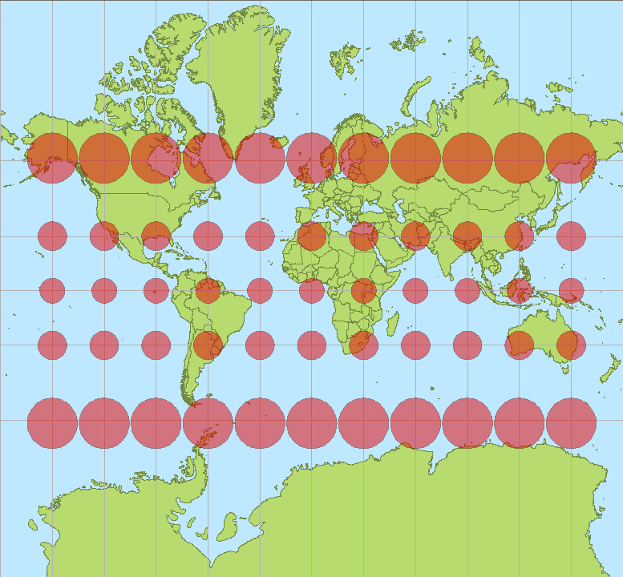

# 거리를 재는 눈금이 장소마다 다르다

## 출발 문제

교실에 걸린 세계지도를 본 적이 있는가? 메르카토르 도법으로 그려진 그 지도에서 그린란드는 거대하다. 아프리카와 거의 비슷한 크기로 보인다. 하지만 실제로는 아프리카가 그린란드보다 14배 넓다. 아프리카 대륙 안에 미국, 중국, 인도, 일본, 유럽 전체를 다 넣고도 남는다. 지도가 우리에게 거짓말을 하고 있는 것이다.

왜 이런 일이 벌어지는가? 메르카토르 도법은 1569년, 플랑드르의 지도 제작자 게라르두스 메르카토르가 항해사들을 위해 만든 지도 투영법이다. 이 도법의 장점은 뚜렷하다: 지도 위에서 직선으로 그은 경로가 실제 항해에서 일정한 나침반 방위를 유지하는 경로(항정선)가 된다. 대항해시대의 선원에게 이것은 생사가 걸린 실용성이었다. 하지만 대가가 있었다. 구면을 평면에 펼치면서 극지방 근처가 가로 방향으로 엄청나게 늘어난다. 위도가 높아질수록 지도의 1cm가 나타내는 실제 거리가 줄어드는 것이다. 적도에서 1cm는 약 111km이지만, 위도 80도에서 1cm는 약 19km밖에 안 된다.

이 현상의 본질을 꿰뚫어 보면 이런 질문에 도달한다: **곡면 위에서 "거리"란 무엇인가?** 평면 위에서는 피타고라스 정리 하나면 충분하다. 두 점 사이의 거리는 $\sqrt{(\Delta x)^2 + (\Delta y)^2}$이다. 어디에서 재든 이 공식은 같다. 하지만 구면 위에서는 "이 근처에서 1cm"의 의미가 장소에 따라 달라진다 — 적어도 지도 좌표 위에서는 그렇다. 경도 1도의 실제 거리가 적도에서와 극지방에서 전혀 다르지 않은가.

사실 이 문제는 지도에만 국한되지 않는다. 우리가 일상에서 "거리"를 말할 때도 같은 문제가 숨어 있다. 서울에서 부산까지의 거리는? 직선거리, 도로 거리, 철도 거리가 모두 다르다. "거리"라는 개념 자체가 "어떤 경로를 따라 재는가"에 의존하고, 각 경로의 길이를 구하려면 경로 위의 각 지점에서 "이 근처에서 1km란 어느 정도인가"를 알아야 한다.

아인슈타인의 일반상대성이론에서도 이 문제가 핵심이다. 시공간은 4차원 매니폴드이고, 질량과 에너지가 시공간을 구부린다. 구부러진 시공간에서 두 사건 사이의 "간격"을 정의하려면, 각 점마다 "여기서 시간 1초와 공간 1미터는 이 정도다"라는 국소적 눈금이 있어야 한다. 이 눈금이 바로 계량 텐서이며, 아인슈타인 방정식은 물질이 이 눈금을 어떻게 바꾸는지를 기술한다.

그렇다면 곡면 위에서 거리를 제대로 정의하려면, 각 장소마다 "여기서는 이렇게 재라"는 국소적인 눈금 규칙이 필요하다. 이 눈금 규칙이 바로 계량 텐서이며, 이것이 리만 기하학의 출발점이다.

## 패턴

일상의 비유로 시작하자. 고무판 위에 격자를 그린다고 생각해 보라. 격자 간격이 1cm인 정사각형들이 빼곡하다. 이 고무판을 잡아늘이면 어떤 부분은 격자가 넓어지고, 어떤 부분은 좁아진다. 이제 고무판 위의 두 점 사이의 "진짜 거리"를 재고 싶다면? 늘어나기 전의 격자 1칸은 어디서든 1cm였지만, 늘어난 뒤에는 장소마다 다르다. 각 지점에서 "격자 1칸이 실제로 몇 cm인지"를 알려주는 규칙이 있어야 한다.

음악에서 비유를 하나 더 빌려오자. 같은 악보(곡선)가 있어도, 템포(계량)가 다르면 연주 시간(길이)이 달라진다. 알레그로로 연주하면 3분, 아다지오로 연주하면 8분이다. 악보의 각 마디마다 "이 마디는 이 빠르기로 연주하라"는 지시가 붙어 있는 것 — 이것이 계량 텐서가 하는 일과 본질적으로 같다.

수학적으로 정리하면 이렇다:

1. **각 점의 접선공간에 내적이 필요하다.** 2장에서 각 점에 접선공간이라는 "방"이 붙어 있음을 보았다. 그런데 방 안에 자(ruler)가 없으면 벡터의 길이도, 두 벡터 사이의 각도도 정의할 수 없다. 내적 $g_p(v, w)$가 바로 그 자다.
2. **이 내적은 점마다 달라질 수 있다.** 평면에서는 표준 내적 $v \cdot w = v_1 w_1 + v_2 w_2$가 어디서든 같지만, 구면이나 안장면 같은 곡면에서는 내적의 계수가 위치에 따라 변한다. 좌표 $(x^1, x^2)$로 쓰면 $g_p = g_{ij}(p)\, dx^i \otimes dx^j$로, 계수 $g_{ij}$가 $p$의 함수다.
3. **내적이 부드럽게 변하면 곡선의 길이를 정의할 수 있다.** 곡선 $\gamma(t)$를 따라 매 순간의 속도벡터 $\gamma'(t)$의 크기를 $\sqrt{g_{\gamma(t)}(\gamma'(t), \gamma'(t))}$로 재고, 이것을 적분하면 곡선의 길이가 된다. 바로 $L(\gamma) = \int_a^b \sqrt{g_{ij}\, \dot{\gamma}^i\, \dot{\gamma}^j}\, dt$이다.

이렇게 "각 점마다 내적을 부드럽게 배정하는 것"이 리만 계량이며, 리만 계량이 주어진 매니폴드를 리만 매니폴드라 부른다. 거리, 각도, 넓이, 부피 — 우리가 기하학에서 원하는 거의 모든 양적 개념이 이 하나의 구조에서 흘러나온다.

구체적인 예를 하나 보자. 구면 위의 계량을 구면좌표 $(\theta, \phi)$로 쓰면 $ds^2 = R^2(d\theta^2 + \sin^2\theta\, d\phi^2)$이다. 적도($\theta = \pi/2$)에서는 $d\phi$ 방향의 눈금이 $R$이지만, 위도가 높아질수록 $\sin\theta$가 줄어들어 같은 $d\phi$ 변화가 더 짧은 실제 거리에 해당한다. 바로 이것이 메르카토르 지도에서 극지방이 뻥튀기되는 이유다 — 지도는 $d\phi$를 일정한 폭으로 그리지만, 실제 거리는 $\sin\theta$만큼 줄어든다.

또 다른 매력적인 예는 포앙카레 원판 모형이다. 단위 원판 $\{(x,y) : x^2 + y^2 < 1\}$ 위에 계량 $ds^2 = \frac{4(dx^2 + dy^2)}{(1 - x^2 - y^2)^2}$을 부여하면, 이것은 일정한 음의 곡률을 가진 쌍곡 평면이 된다. 원판의 가장자리에 가까워질수록 분모가 0에 가까워져 눈금이 폭발적으로 커진다 — 원판의 가장자리는 "무한히 먼 곳"이 된다. 에셔(M.C. Escher)의 유명한 목판화 *Circle Limit* 시리즈는 바로 이 쌍곡 기하학을 시각화한 것이다.

## 정리

매니폴드 $M$ 위에서 곡선의 길이, 벡터의 크기, 두 벡터 사이의 각도를 정의하려면, 각 점 $p$의 접선공간 $T_pM$에 내적(양의 정부호 이차형식) $g_p$를 부여해야 한다.

이 내적이 점에 따라 부드럽게($C^\infty$) 변하면, 이를 **리만 계량**이라 하고, 쌍 $(M, g)$를 **리만 매니폴드**라 한다. 리만 계량이 주어지면 곡선 $\gamma: [a, b] \to M$의 길이를

$$L(\gamma) = \int_a^b \sqrt{g_{\gamma(t)}(\gamma'(t),\, \gamma'(t))}\, dt$$

로 정의할 수 있으며, 두 점 사이의 거리를 그 두 점을 잇는 모든 곡선의 길이의 하한(infimum)으로 정의할 수 있다. 이 거리 함수는 매니폴드의 본래 위상과 양립하는 거리공간 구조를 유도한다.

중요한 사실: 모든 매니폴드는 (파라컴팩트이기만 하면) 리만 계량을 가질 수 있다. 단위분할(partition of unity)을 이용하여 국소적 내적들을 부드럽게 이어붙이면 된다. 따라서 "계량이 존재하는가"는 문제가 아니고, "어떤 계량을 고르는가"가 진짜 질문이다.

계량이 정해지면 **측지선**(geodesic)도 정의된다 — 두 점을 잇는 "가장 짧은 경로"(더 정확히는 길이의 임계점)가 바로 측지선이다. 평면에서는 직선, 구면에서는 대원(great circle), 쌍곡 평면에서는 원판을 수직으로 자르는 원호가 측지선이다. 같은 매니폴드에 다른 계량을 부여하면 측지선도 달라진다. 계량은 공간의 "기하학적 성격"을 결정하는 가장 근본적인 데이터인 셈이다.

## 정의

- **계량 텐서** (국소 눈금 / Local Ruler, $g_{ij}$) — 각 점에서 접선벡터 두 개를 받아 "내적"을 돌려주는 규칙. 그 점에서의 자(ruler)이자 각도기다. 좌표를 잡으면 $n \times n$ 대칭행렬로 표현된다.
- **리만 계량** (부드러운 자 / Smooth Ruler) — 점마다 부드럽게 변하는 양의 정부호 계량 텐서. 매니폴드 전체에 걸쳐 일관되게 거리를 재는 규칙이며, 이것 하나로 길이·각도·넓이·부피가 모두 정의된다.
- **선소** (미소 거리 / Infinitesimal Distance, $ds^2$) — $ds^2 = g_{ij}\, dx^i\, dx^j$, 무한소 수준에서의 거리 레시피. "아주 가까운 두 점 사이의 거리의 제곱"을 좌표 변화량으로 표현한 것이다. 물리학에서 가장 자주 만나는 형태.
- **등거리 사상** (자를 보존하는 변환 / Ruler-Preserving Map) — 계량을 바꾸지 않는 매니폴드 사이의 함수. 두 공간의 자가 완벽히 일치하는 변환으로, 구겨지거나 늘어나는 것이 전혀 없는 이상적인 "복사"다.

## 핵심 인물과 일화

### 카를 프리드리히 가우스 (Carl Friedrich Gauss, 1777–1855)

가우스가 순수한 호기심만으로 곡면의 기하학을 연구한 것은 아니다. 1818년, 하노버 왕국은 가우스에게 영토의 정밀 측지 사업을 의뢰한다. 이후 14년간 가우스는 직접 측량 장비를 들고 산꼭대기에 올라 삼각측량을 수행했다.

문제는 이것이었다: 지구는 평면이 아니다. 측량 데이터 — 각도, 거리, 높이 — 를 하나의 일관된 지도로 합치려면, **곡면 위에서 거리를 재는 규칙**이 필요했다. 측량기사가 어떤 지점에서 잰 "1미터"가 다른 지점에서 잰 "1미터"와 같은 의미인지를 수학적으로 보장해야 했다.

이 실용적 필요가 가우스를 $ds^2 = E\,du^2 + 2F\,du\,dv + G\,dv^2$라는 공식으로 이끌었다. 여기서 $E$, $F$, $G$는 곡면 위의 위치에 따라 달라지는 함수들이다. 이것이 바로 계량 텐서의 원형이다 — 각 점에서 "이 근처에서 거리를 이렇게 재라"는 국소적 눈금.

가우스는 1827년 *Disquisitiones generales circa superficies curvas*(곡면에 관한 일반 연구)를 출판하며 이 이론을 정리했다. 이 논문에서 그는 계량 텐서가 곡면의 내재적 기하학을 완전히 결정한다는 것을 보였다. 가우스의 계량은 2차원 곡면에 한정되어 있었지만, 27년 뒤 리만이 이것을 임의 차원으로 일반화한다.

측량 사업은 가우스에게 지루하고 소모적인 일이기도 했다 — 그는 편지에서 날씨와 조수들에 대한 불만을 늘어놓곤 했다. 하지만 진흙 속에서 삼각형의 각도를 재며 보낸 그 시간이, 결국 "장소마다 달라지는 눈금"이라는 아이디어의 물리적 기반을 제공한 셈이다.

## 시각화 아이디어

  <noscript>이 시각화를 보려면 JavaScript가 필요합니다.</noscript>

- 왜곡 격자: 지구본 위의 정사각형 격자가 메르카토르 도법으로 펼쳐지면 어떻게 변형되는지
- 늘어나는 자: 포앙카레 원판 위에서 원점 근처의 1cm와 경계 근처의 1cm가 실제로는 전혀 다른 거리
- 음악적 비유: 계량 = 박자와 템포. 같은 멜로디(곡선)도 템포(계량)가 다르면 길이(연주 시간)가 달라진다

## 연결되는 세계들

| 분야 | 연결 |
|------|------|
| 일반상대론 | 민코프스키 계량: 시간과 공간의 부호가 다르다 |
| 정보기하학 | 피셔 정보행렬 = 확률분포 공간 위의 리만 계량 |
| 탄성역학 | 변형 텐서 = 변형 전후의 계량 차이 |
| 컴퓨터 그래픽 | 텍스처 매핑 = 매니폴드 사이의 사상, 왜곡 최소화 |
| 최적수송 | 바서슈타인 거리: 확률분포 공간의 또 다른 계량 |
