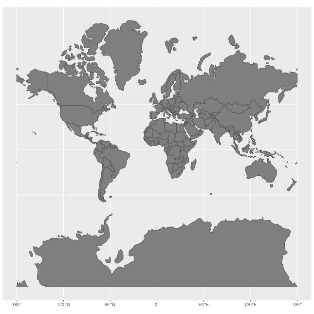
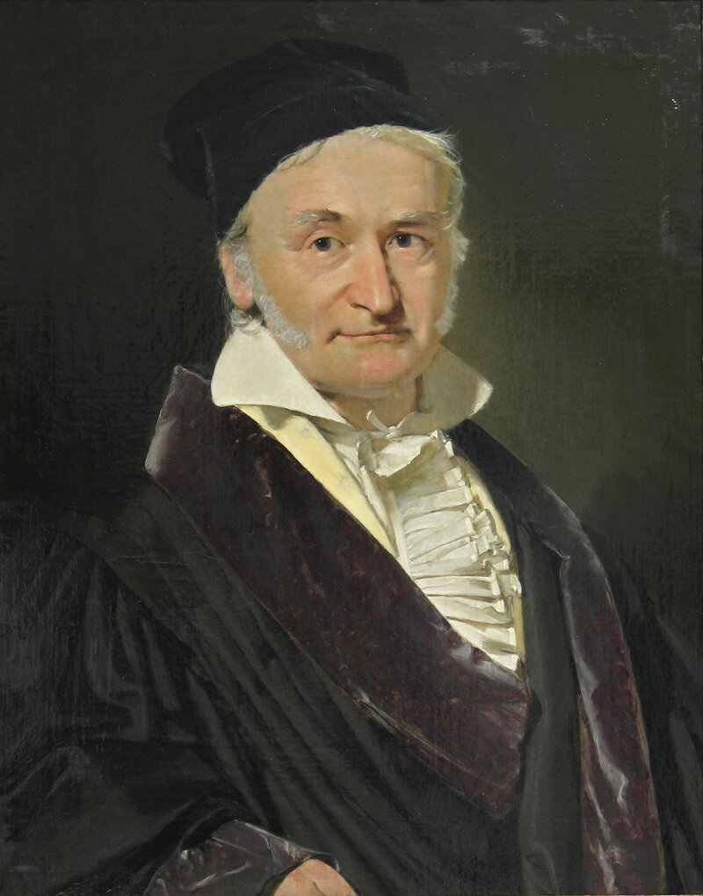
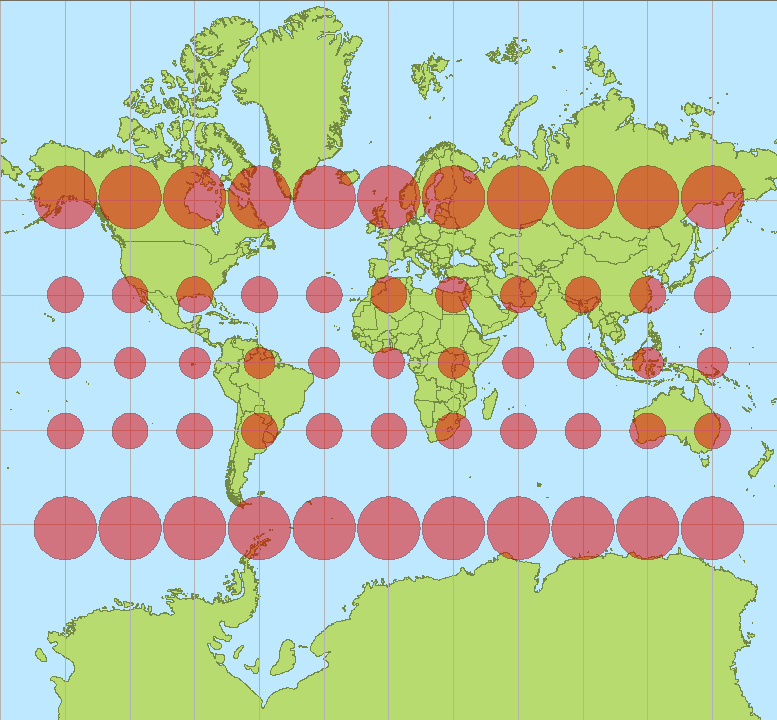
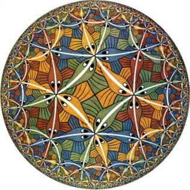

# 거리를 재는 눈금이 장소마다 다르다

## 출발 문제

교실에 걸린 세계지도를 본 적이 있는가? 메르카토르 도법으로 그려진 그 지도에서 그린란드는 거대하다. 아프리카와 거의 비슷한 크기로 보인다. 하지만 실제로는 아프리카가 그린란드보다 14배 넓다. 아프리카 대륙 안에 미국, 중국, 인도, 일본, 유럽 전체를 다 넣고도 남는다. 지도가 우리에게 거짓말을 하고 있는 것이다.

왜 이런 일이 벌어지는가? 메르카토르 도법은 1569년, 플랑드르의 지도 제작자 게라르두스 메르카토르가 항해사들을 위해 만든 지도 투영법이다. 이 도법의 장점은 뚜렷하다: 지도 위에서 직선으로 그은 경로가 실제 항해에서 일정한 나침반 방위를 유지하는 경로(항정선)가 된다. 대항해시대의 선원에게 이것은 생사가 걸린 실용성이었다. 하지만 대가가 있었다. 지도에서는 모든 경도선이 똑같은 간격의 세로줄로 그려지므로, 극으로 갈수록 좁아지는 실제 위도선이 가로로 잡아늘여진다. 메르카토르는 각도를 지키려고 같은 비율만큼 세로로도 늘였고, 그 결과 극지방은 가로세로 모두 부풀어 오른다. 위도가 높아질수록 지도의 1cm가 나타내는 실제 거리가 줄어드는 것이다. 적도에서 1cm는 약 111km이지만, 위도 80도에서 1cm는 약 19km밖에 안 된다.

이 현상의 본질을 꿰뚫어 보면 이런 질문에 도달한다: **곡면 위에서 "거리"란 무엇인가?** 평면 위에서는 피타고라스 정리 하나면 충분하다. 두 점 사이의 거리는 $\sqrt{(\Delta x)^2 + (\Delta y)^2}$이다. 어디에서 재든 이 공식은 같다. 하지만 구면 위에서는 "이 근처에서 1cm"의 의미가 장소에 따라 달라진다 — 적어도 지도 좌표 위에서는 그렇다. 경도 1도의 실제 거리가 적도에서와 극지방에서 전혀 다르지 않은가.

사실 이 문제는 지도에만 국한되지 않는다. 우리가 일상에서 "거리"를 말할 때도 같은 문제가 숨어 있다. 서울에서 부산까지의 거리는? 직선거리, 도로 거리, 철도 거리가 모두 다르다. "거리"라는 개념 자체가 "어떤 경로를 따라 재는가"에 의존하고, 각 경로의 길이를 구하려면 경로 위의 각 지점에서 "이 근처에서 1km란 어느 정도인가"를 알아야 한다.

아인슈타인의 일반상대성이론에서도 이 문제가 핵심이다. 시공간은 4차원 매니폴드(어느 점이든 둘레를 확대하면 평평하게 보이는 공간)이고, 질량과 에너지가 시공간을 구부린다. 구부러진 시공간에서 두 사건(시공간의 한 점, 곧 언제 어디서) 사이의 "간격"을 정의하려면, 각 점마다 "여기서 시간 1초와 공간 1미터는 이 정도다"라는 국소적(한 점 가까이에서만 통하는) 눈금이 있어야 한다. 이 눈금이 바로 계량 텐서이며, 아인슈타인 방정식은 물질이 이 눈금을 어떻게 바꾸는지를 나타낸다. 여기서 텐서는 좌표를 바꿀 때 성분이 정해진 규칙대로만 바뀌는 양을 말하며, PyTorch의 tensor(다차원 배열)와는 이름만 같다.

그렇다면 곡면 위에서 거리를 제대로 정의하려면, 각 장소마다 "여기서는 이렇게 재라"는 국소적인 눈금 규칙이 필요하다. 이 눈금 규칙이 바로 계량 텐서이며, 이것이 리만 기하학의 출발점이다.

## 계량 텐서: 한 점 근처의 눈금

곡면 위의 먼 거리를 재기 전에, 더 작은 물음부터 풀어야 한다. 한 점 바로 근처에서 "좌표 한 칸"은 실제로 얼마인가?

일상의 비유로 시작하자. 고무판 위에 격자를 그린다고 생각해 보라. 격자 간격이 1cm인 정사각형들이 빼곡하다. 이 고무판을 잡아늘이면 어떤 부분은 격자가 넓어지고, 어떤 부분은 좁아진다. 이제 고무판 위의 두 점 사이의 "진짜 거리"를 재고 싶다면? 늘어나기 전의 격자 1칸은 어디서든 1cm였지만, 늘어난 뒤에는 장소마다 다르다. 각 지점에서 "격자 1칸이 실제로 몇 cm인지"를 알려주는 규칙이 있어야 한다.

음악에서 비유를 하나 더 빌려오자. 같은 악보(곡선)가 있어도, 템포(계량)가 다르면 연주 시간(길이)이 달라진다. 알레그로로 연주하면 3분, 아다지오로 연주하면 8분이다. 악보의 각 마디마다 "이 마디는 이 빠르기로 연주하라"는 지시가 붙어 있는 것 — 이것이 계량 텐서가 하는 일과 본질적으로 같다.

수학적으로 정리하면 이렇다:

1. **각 점의 접선공간에 내적이 필요하다.** 각 점에는 가능한 모든 속도를 모은 접선공간이라는 "방"이 붙어 있다. 그런데 방 안에 자(ruler)가 없으면 벡터의 길이도, 두 벡터 사이의 각도도 정의할 수 없다. 내적 $g_p(v, w)$가 바로 그 자다.

2. **이 내적은 점마다 달라질 수 있다.** 평면에서는 표준 내적 $v \cdot w = v_1 w_1 + v_2 w_2$가 어디서든 같지만, 구면이나 말안장처럼 휜 곡면(안장면)에서는 내적의 계수가 위치에 따라 변한다. 좌표 $(x^1, x^2)$로 쓰면 $g_p = g_{ij}(p)\, dx^i \otimes dx^j$로, 계수 $g_{ij}$가 $p$의 함수다.

좌표로 적으면 이 모든 것이 "아주 가까운 두 점 사이 거리의 제곱" 한 줄에 담긴다.

$$
\textcolor{#d62728}{ds}^2 = \textcolor{#d62728}{g_{ij}}\, d\textcolor{#1b9e77}{x^i}\, d\textcolor{#1b9e77}{x^j} = \textcolor{#d62728}{g_{11}}\,(d\textcolor{#1b9e77}{x^1})^2 + 2\textcolor{#d62728}{g_{12}}\,d\textcolor{#1b9e77}{x^1}\,d\textcolor{#1b9e77}{x^2} + \textcolor{#d62728}{g_{22}}\,(d\textcolor{#1b9e77}{x^2})^2
$$

$$
\begin{array}{ll}
\textcolor{#d62728}{ds} & \text{선소: 아주 가까운 두 점 사이의 실제 거리} \\
\textcolor{#d62728}{g_{ij}} & \text{계량 성분 (점마다 다른 대칭행렬의 칸)} \\
d\textcolor{#1b9e77}{x^i} & \text{좌표의 작은 변화량}
\end{array}
$$

평면의 직교좌표에서는 $\textcolor{#d62728}{g_{11}} = \textcolor{#d62728}{g_{22}} = 1$, $\textcolor{#d62728}{g_{12}} = 0$이라 피타고라스 정리 $\textcolor{#d62728}{ds}^2 = d\textcolor{#1b9e77}{x}^2 + d\textcolor{#1b9e77}{y}^2$로 돌아온다. 계량이란 피타고라스 정리의 계수를 장소마다 바꿀 수 있게 한 것이다.

이 눈금과, 눈금으로 적은 거리 공식에 이름을 붙이자.

- **계량 텐서** (국소 눈금 / Local Ruler, $\textcolor{#d62728}{g_{ij}}$) — 각 점에서 접선벡터 두 개를 받아 "내적"을 돌려주는 규칙. 그 점에서의 자(ruler)이자 각도기다. 좌표를 잡으면 $\textcolor{#c4724f}{n} \times \textcolor{#c4724f}{n}$ 대칭행렬로 표현된다.

- **선소** (미소 거리 / Infinitesimal Distance, $\textcolor{#d62728}{ds}^2$) — $\textcolor{#d62728}{ds}^2 = \textcolor{#d62728}{g_{ij}}\, d\textcolor{#1b9e77}{x^i}\, d\textcolor{#1b9e77}{x^j}$, 무한소 수준에서의 거리 레시피. "아주 가까운 두 점 사이의 거리의 제곱"을 좌표 변화량으로 표현한 것이다. 물리학에서 가장 자주 만나는 형태.

### 역사: 카를 프리드리히 가우스 (Carl Friedrich Gauss, 1777–1855)

가우스가 순수한 호기심만으로 곡면의 기하학을 연구한 것은 아니다. 1818년, 하노버 왕국은 가우스에게 영토의 정밀 측량 사업을 의뢰한다. 이후 14년간 가우스는 직접 측량 장비를 들고 산꼭대기에 올라 삼각측량을 수행했다.

문제는 이것이었다: 지구는 평면이 아니다. 측량 데이터 — 각도, 거리, 높이 — 를 하나의 일관된 지도로 합치려면, **곡면 위에서 거리를 재는 규칙**이 필요했다. 측량기사가 어떤 지점에서 잰 "1미터"가 다른 지점에서 잰 "1미터"와 같은 의미인지를 수학적으로 보장해야 했다.

이 실용적 필요가 가우스를 다음 공식으로 이끌었다.

$$
\textcolor{#d62728}{ds}^2 = \textcolor{#d62728}{E}\,d\textcolor{#1b9e77}{u}^2 + 2\textcolor{#d62728}{F}\,d\textcolor{#1b9e77}{u}\,d\textcolor{#1b9e77}{v} + \textcolor{#d62728}{G}\,d\textcolor{#1b9e77}{v}^2
$$

$$
\begin{array}{ll}
\textcolor{#1b9e77}{u}, \textcolor{#1b9e77}{v} & \text{곡면 위의 좌표} \\
\textcolor{#d62728}{E}, \textcolor{#d62728}{F}, \textcolor{#d62728}{G} & \text{가우스의 계량 성분 } (g_{11},\ g_{12},\ g_{22}) \text{, 위치의 함수}
\end{array}
$$

여기서 $\textcolor{#d62728}{E}$, $\textcolor{#d62728}{F}$, $\textcolor{#d62728}{G}$는 곡면 위의 위치에 따라 달라지는 함수들이다. 이것이 바로 계량 텐서의 원형이다 — 각 점에서 "이 근처에서 거리를 이렇게 재라"는 국소적 눈금.

가우스는 1827년 *Disquisitiones generales circa superficies curvas*(곡면에 관한 일반 연구)를 출판하며 이 이론을 정리했다. 이 논문에서 그는 계량 텐서가 곡면의 내재적 기하학(곡면 안에서만 잴 수 있는 기하)을 완전히 결정한다는 것을 보였다. 가우스의 계량은 2차원 곡면에 한정되어 있었지만, 27년 뒤 리만이 이것을 임의 차원으로 일반화한다.

측량 사업은 가우스에게 지루하고 소모적인 일이기도 했다 — 그는 편지에서 날씨와 조수들에 대한 불만을 늘어놓곤 했다. 하지만 진흙 속에서 삼각형의 각도를 재며 보낸 그 시간이, 결국 "장소마다 달라지는 눈금"이라는 아이디어의 물리적 기반을 제공한 셈이다.

### ML에서: 마할라노비스 거리

데이터가 어떤 방향으로는 넓게, 어떤 방향으로는 좁게 퍼져 있을 때, 두 점의 차이 $\Delta x$를 그냥 유클리드 거리로 재면 좁게 퍼진 방향의 벗어남을 과소평가한다. 마할라노비스 거리는 공분산 행렬 $\Sigma$의 역행렬을 끼워 $d^2 = \Delta x^\top \Sigma^{-1} \Delta x$로 잰다. 이것은 계량 성분을 어디서나 $\textcolor{#d62728}{g_{ij}} = (\Sigma^{-1})_{ij}$로 고정한 선소와 같은 꼴이다. 표준편차가 작은 방향으로 한 칸 벗어나면 더 멀리 간 것으로 치는 눈금이다. 여기서 움직이는 것은 데이터 점이고, 눈금은 장소마다 바뀌지 않는다. 가우시안 판별 분석이나 이상치 탐지에서 이 거리를 쓴다.

### 문제 1 — 행렬 하나가 바꾸는 길이와 각도

각 문제를 먼저 혼자 풀어 본 뒤, 바로 아래 세션에서 선생님과 두 학생이 어떻게 풀어 가는지 따라가 보자.

확인 좌표 $(\textcolor{#1b9e77}{u}, \textcolor{#1b9e77}{v})$에서 계량이 어디서나 $\textcolor{#d62728}{g_{ij}} = \begin{pmatrix} 1 & 0 \\ 0 & 4 \end{pmatrix}$인 곡면이 있다. 성분이 $(1, 1)$인 벡터 $w$의 길이는 얼마인가? $\textcolor{#1f77b4}{\partial_u}$와 $w$ 사이의 각도는?

#### 같이 풀기 세션 1

**김민준:** `np.linalg.norm([1, 1])` 하면 $\sqrt2 \approx 1.41$이요. 각도는 대각선이니까 45도고요.

**이서연:** 길이는 계량으로 재야지. $\textcolor{#d62728}{g}(w, w) = 1\cdot1\cdot1 + 4\cdot1\cdot1 = 5$니까 $\sqrt5$야. 각도는 그림에서 보이는 대로 45도가 맞고.

**선생님:** 서연 학생, 길이를 잴 때 계량을 썼으면 각도를 잴 때는 무엇을 써야 할까요?

**이서연 〔S06〕:** 코사인도 내적으로 정의하니까… $\cos\alpha = \textcolor{#d62728}{g}(\textcolor{#1f77b4}{\partial_u}, w) / (|\textcolor{#1f77b4}{\partial_u}|\,|w|) = 1 / (1 \cdot \sqrt5)$. 그러면 약 63.4도네요. 45도가 아니에요.

**김민준:** 저는 둘 다 평면 공식으로 한 거네요. 계량 행렬을 넣으면 `np.sqrt(w @ G @ w)`로 고쳐야겠어요.

**선생님:** 맞아요. 좌표 그림은 이름표일 뿐이라, 거기서 보이는 길이도 각도도 믿으면 안 돼요. 이 곡면에서는 $\textcolor{#1b9e77}{v}$ 방향 한 칸이 실제로는 2만큼이니, 그림 속 대각선이 실제로는 $\textcolor{#1b9e77}{v}$ 쪽으로 더 기울어 있는 거예요.

**이서연:** 선형대수 시간에 배운 "내적만 바꾸면 직교성도 바뀐다"는 말이 이제야 그림으로 보이네. 가중 내적을 쓰면 같은 두 벡터가 수직이 되기도 하고 아니기도 했잖아.

## 리만 계량: 장소마다 바뀌는 눈금으로 길이 재기

한 점 근처의 눈금은 얻었다. 그런데 서울에서 부산까지처럼 먼 거리는 어떻게 재는가? 눈금이 장소마다 다르다면, 길을 따라가며 그 자리의 눈금으로 조금씩 재서 더해야 한다.

곡선 $\gamma(t)$를 따라 매 순간의 속도벡터 $\gamma'(t)$의 크기를 그 자리의 눈금으로 $\sqrt{g_{\gamma(t)}(\gamma'(t), \gamma'(t))}$처럼 재고, 이것을 적분하면 곡선의 길이가 된다. 그러려면 내적이 점마다 매끄럽게 변해야 한다.

매니폴드 $M$ 위에서 곡선의 길이, 벡터의 크기, 두 벡터 사이의 각도를 정의하려면, 각 점 $p$의 접선공간 $T_pM$에 내적(0이 아닌 벡터를 넣으면 늘 양수가 나오는 이차식, 곧 양의 정부호 이차형식) $g_p$를 부여해야 한다.

이 내적이 점에 따라 매끄럽게($C^\infty$) 변하면, 이를 **리만 계량**이라 하고, 쌍 $(M, g)$를 **리만 매니폴드**라 한다. 리만 계량이 주어지면 곡선 $\gamma: [a, b] \to M$의 길이를

$$
\textcolor{#6314ff}{L}(\textcolor{#0e9aa7}{\gamma}) = \int_{\textcolor{#6a7a00}{a}}^{\textcolor{#6a7a00}{b}} \sqrt{\textcolor{#d62728}{g}_{\textcolor{#0e9aa7}{\gamma(t)}}\left(\textcolor{#0e9aa7}{\gamma'(t)},\, \textcolor{#0e9aa7}{\gamma'(t)}\right)}\, d\textcolor{#6a7a00}{t}
= \int_{\textcolor{#6a7a00}{a}}^{\textcolor{#6a7a00}{b}} \sqrt{\textcolor{#d62728}{g_{ij}}\,\dot{\textcolor{#0e9aa7}{\gamma}}^i\,\dot{\textcolor{#0e9aa7}{\gamma}}^j}\, d\textcolor{#6a7a00}{t}
$$

$$
\begin{array}{ll}
\textcolor{#0e9aa7}{\gamma}, \textcolor{#0e9aa7}{\gamma'(t)} & \text{곡선과 그 속도벡터} \\
\textcolor{#d62728}{g} & \text{계량: 곡선이 지나는 점 } \textcolor{#0e9aa7}{\gamma}(\textcolor{#6a7a00}{t}) \text{ 에서의 내적} \\
\textcolor{#6314ff}{L} & \text{곡선의 길이 (손실 함수 } \textcolor{#6314ff}{L} \text{ 이 아니다)} \\
\textcolor{#6a7a00}{t},\ \textcolor{#6a7a00}{a},\ \textcolor{#6a7a00}{b} & \text{시각과 그 구간}
\end{array}
$$

로 정의할 수 있으며, 두 점 사이의 거리를 그 두 점을 잇는 모든 곡선의 길이의 하한(infimum)으로 정의할 수 있다. 이렇게 정한 거리는 매니폴드가 원래 가진 위상(무엇이 무엇 가까이 이어져 있는지)과 어긋나지 않는다.

중요한 사실: 매니폴드가 두 세부 조건(서로 다른 두 점을 겹치지 않는 동네로 떼어 놓을 수 있다는 하우스도르프 조건, 셀 수 있는 개수의 열린 집합으로 모든 열린 집합을 짜 맞출 수 있다는 제2가산 조건)을 만족하면 언제나 리만 계량을 가질 수 있다. 단위분할(partition of unity)을 이용하여 국소적 내적들을 매끄럽게 이어붙이면 된다. 따라서 "계량이 존재하는가"는 문제가 아니고, "어떤 계량을 고르는가"가 진짜 질문이다.

- **리만 계량** (매끄러운 자 / Smooth Ruler) — 점마다 매끄럽게 변하는 양의 정부호 계량 텐서. 매니폴드 전체에 걸쳐 일관되게 거리를 재는 규칙이며, 이것 하나로 길이·각도·넓이·부피가 모두 정의된다.

구체적인 예를 하나 보자. 반지름 $\textcolor{#0561ff}{R}$인 구면을 구면좌표 $(\textcolor{#1b9e77}{\theta}, \textcolor{#1b9e77}{\phi})$로 쓰면($\textcolor{#1b9e77}{\theta}$는 북극에서 잰 각, $\textcolor{#1b9e77}{\phi}$는 경도) 계량은 다음과 같다.

$$
\textcolor{#d62728}{ds}^2 = \textcolor{#0561ff}{R}^2\left(d\textcolor{#1b9e77}{\theta}^2 + \sin^2\textcolor{#1b9e77}{\theta}\, d\textcolor{#1b9e77}{\phi}^2\right),
\qquad
\textcolor{#d62728}{g_{ij}} = \begin{pmatrix} \textcolor{#0561ff}{R}^2 & 0 \\ 0 & \textcolor{#0561ff}{R}^2\sin^2\textcolor{#1b9e77}{\theta} \end{pmatrix}
$$

$$
\begin{array}{ll}
\textcolor{#1b9e77}{\theta}, \textcolor{#1b9e77}{\phi} & \text{북극에서 잰 각(여위도), 경도} \\
\textcolor{#0561ff}{R} & \text{구의 반지름 (휘어진 정도인 곡률이 아니라 길이 상수)} \\
\textcolor{#d62728}{g_{ij}} & \text{구면 계량의 성분 행렬, 비대각 성분 0}
\end{array}
$$

적도($\textcolor{#1b9e77}{\theta} = \pi/2$)에서는 $d\textcolor{#1b9e77}{\phi}$ 방향의 눈금이 $\textcolor{#0561ff}{R}$이지만, 극으로 갈수록 $\sin\textcolor{#1b9e77}{\theta}$가 줄어들어 같은 $d\textcolor{#1b9e77}{\phi}$ 변화가 더 짧은 실제 거리에 해당한다. 이 계량은 외워야 할 식이 아니다. 3차원 공간의 평범한 자로 구면 위 작은 변화의 길이를 재면 그대로 나온다. 비대각 성분이 0이라는 것은 경도선과 위도선이 어디서나 직각으로 만난다는 뜻이다. 메르카토르 지도에서 극지방이 부풀어 오르는 이유도 여기 있다. 지도는 $d\textcolor{#1b9e77}{\phi}$를 어디서나 같은 폭으로 그리지만 실제 거리는 $\sin\textcolor{#1b9e77}{\theta}$배로 줄어드니, 지도는 극에서 $1/\sin\textcolor{#1b9e77}{\theta}$배만큼 과장한다.

### 따라 계산해 보기 1 — 위도선 한 바퀴의 길이

북극에서 각 $\textcolor{#1b9e77}{\theta_0}$만큼 떨어진 위도선을 한 바퀴 도는 곡선은 $\textcolor{#0e9aa7}{\gamma}(\textcolor{#6a7a00}{t}) = (\textcolor{#1b9e77}{\theta_0},\ \textcolor{#6a7a00}{t})$, $0 \le \textcolor{#6a7a00}{t} \le 2\pi$다. 속도 성분은 $\dot{\textcolor{#1b9e77}{\theta}} = 0$, $\dot{\textcolor{#1b9e77}{\phi}} = 1$이므로 계량에 넣으면 $\textcolor{#d62728}{g_{ij}}\dot{\textcolor{#0e9aa7}{\gamma}}^i\dot{\textcolor{#0e9aa7}{\gamma}}^j = \textcolor{#0561ff}{R}^2\sin^2\textcolor{#1b9e77}{\theta_0}$이다. 적분하면 다음과 같다.

$$
\textcolor{#6314ff}{L} = \int_0^{2\pi} \sqrt{\textcolor{#0561ff}{R}^2 \sin^2\textcolor{#1b9e77}{\theta_0}}\; d\textcolor{#6a7a00}{t} = 2\pi \textcolor{#0561ff}{R} \sin\textcolor{#1b9e77}{\theta_0}
$$

$$
\begin{array}{ll}
\textcolor{#1b9e77}{\theta_0} & \text{위도선의 여위도 (위도 } 90^\circ - \textcolor{#1b9e77}{\theta_0} \text{)} \\
\textcolor{#0561ff}{R} & \text{구의 반지름}
\end{array}
$$

지구($\textcolor{#0561ff}{R} \approx 6371$ km)의 적도는 $\textcolor{#1b9e77}{\theta_0} = 90^\circ$라 약 40,030 km이고, 북위 60도 위도선은 $\textcolor{#1b9e77}{\theta_0} = 30^\circ$라 $\sin 30^\circ = 1/2$, 곧 약 20,015 km로 적도의 딱 절반이다. 메르카토르 지도에서는 두 선이 같은 길이로 그려진다.

첫 번째 위젯은 메르카토르 지도 위에 "실제로는 모두 같은 크기인" 작은 원(티소의 지시원)을 그린다. 위도를 움직이며 지도가 원을 몇 배로 부풀리는지, 그 배율이 구면 계량의 $\sin\textcolor{#1b9e77}{\theta}$와 어떻게 맞물리는지 보자.

  <noscript>이 시각화를 보려면 JavaScript가 필요합니다.</noscript>

### ML에서: 분포 공간의 눈금, 피셔 정보

정규분포 $N(\textcolor{#1b9e77}{\mu}, \textcolor{#1b9e77}{\sigma}^2)$들의 모임에서 평균 $\textcolor{#1b9e77}{\mu}$를 0.1만큼 옮기는 일은 어디서나 같은 크기의 변화일까? $\textcolor{#1b9e77}{\sigma} = 1$인 넓은 분포에서는 거의 티가 나지 않지만, $\textcolor{#1b9e77}{\sigma} = 0.1$인 좁은 분포에서는 분포가 확 달라진다. 이 차이를 재는 눈금이 피셔 정보 행렬이다. $(\textcolor{#1b9e77}{\mu}, \textcolor{#1b9e77}{\sigma})$ 좌표에서 그 성분은 $\mathrm{diag}(1/\textcolor{#1b9e77}{\sigma}^2,\ 2/\textcolor{#1b9e77}{\sigma}^2)$로 $\textcolor{#1b9e77}{\sigma}$에 따라 바뀌는 리만 계량이다. 같은 $d\textcolor{#1b9e77}{\mu} = 0.1$이 $\textcolor{#1b9e77}{\sigma} = 1$에서는 길이 0.1, $\textcolor{#1b9e77}{\sigma} = 0.1$에서는 길이 1이 된다. 여기서 움직이는 것은 모델 분포의 매개변수이고, 계량은 "분포가 실제로 얼마나 달라졌는가"를 잰다.

### 문제 2 — 북위 60도 한 바퀴

계산 지구를 반지름 $\textcolor{#0561ff}{R} = 6371$ km인 구로 보고, 북위 60도 위도선 한 바퀴의 길이와 그 위도선에서 경도 1도 사이의 거리를 구하라. 적도와 비교하면 몇 배인가?

#### 같이 풀기 세션 2

**김민준:** 공식 $2\pi \textcolor{#0561ff}{R}\sin\textcolor{#1b9e77}{\theta}$에 $\textcolor{#1b9e77}{\theta} = 60^\circ$를 넣으면 $2\pi \cdot 6371 \cdot 0.866 \approx 34{,}667$ km예요. 적도의 87%네요.

**이서연:** 87%면 생각보다 긴데? 북위 60도면 오슬로나 헬싱키쯤이잖아. 지구본에서 보면 그 위도선은 적도보다 한참 작던데.

**선생님:** 서연 학생 감각이 맞아요. 민준 학생, 공식의 $\textcolor{#1b9e77}{\theta}$는 어디서부터 잰 각이었죠?

**김민준 〔M04〕:** 아, 북극에서부터요. 위도 60도면 북극에서는 30도 떨어져 있으니까 $\textcolor{#1b9e77}{\theta} = 30^\circ$를 넣어야 해요. 그럼 $\sin 30^\circ = 0.5$라서 약 20,015 km, 적도의 딱 절반이에요.

**선생님:** 경도 1도 사이의 거리는요?

**김민준:** 적도에서는 $40{,}030/360 \approx 111.2$ km니까, 북위 60도에서는 그 절반인 약 55.6 km요. 메르카토르 지도에서는 이게 적도와 같은 폭으로 그려지니까 두 배로 부풀려진 거네요.

**김민준:** 과제에서 각도를 도(degree)로 넣어야 하는데 라디안 함수에 넣어서 틀린 적이 있는데, 이번엔 기준점을 잘못 잡았네요. 조교님이 "변수 정의부터 읽으세요"라고 했던 게 이거였어요.

**이서연:** 위도와 여위도가 $\sin$과 $\cos$을 바꿔 놓으니까, $\cos(\text{위도})$로 외우는 게 덜 헷갈리겠다.

## 쌍곡 평면: 유한한 원판에 담긴 끝없는 평면

메르카토르 지도는 구면의 극지방을 부풀려 그렸다. 그렇다면 반대로, 가장자리로 갈수록 한없이 줄여 그리는 눈금도 가능할까? 그러면 유한한 그림 안에 무엇을 담을 수 있을까?

그런 눈금의 대표가 포앙카레 원판 모형이다. 단위 원판 $\{(x,y) : x^2 + y^2 < 1\}$ 위에 다음 계량을 부여하면, 이것은 어디서나 말안장처럼 같은 정도로 휜(일정한 음의 곡률을 가진) 쌍곡 평면이 된다.

$$
\textcolor{#d62728}{ds}^2 = \frac{4\left(d\textcolor{#1b9e77}{x}^2 + d\textcolor{#1b9e77}{y}^2\right)}{\left(1 - \textcolor{#1b9e77}{x}^2 - \textcolor{#1b9e77}{y}^2\right)^2}
$$

$$
\begin{array}{ll}
\textcolor{#1b9e77}{x}, \textcolor{#1b9e77}{y} & \text{원판 위의 좌표, } \textcolor{#1b9e77}{x}^2+\textcolor{#1b9e77}{y}^2<1 \\
\textcolor{#d62728}{ds} & \text{쌍곡 계량으로 잰 실제 거리}
\end{array}
$$

원판의 가장자리에 가까워질수록 분모가 0에 가까워져 눈금이 폭발적으로 커진다 — 원판의 가장자리는 "무한히 먼 곳"이 된다. 에셔(M.C. Escher)의 유명한 목판화 *Circle Limit* 시리즈는 바로 이 쌍곡 기하학을 시각화한 것이다.

### 따라 계산해 보기 2 — 포앙카레 원판의 가장자리는 얼마나 먼가

원판의 중심에서 오른쪽으로 곧게 나가 유클리드 반지름 $\textcolor{#1b9e77}{r}$에 이르는 선분 $\textcolor{#0e9aa7}{\gamma}(\textcolor{#6a7a00}{t}) = (\textcolor{#6a7a00}{t}, 0)$, $0 \le \textcolor{#6a7a00}{t} \le \textcolor{#1b9e77}{r}$의 길이를 재 보자. 속도는 $(1, 0)$이므로 계량이 주는 빠르기는 $2/(1 - \textcolor{#6a7a00}{t}^2)$이다.

$$
\textcolor{#6314ff}{L}(\textcolor{#1b9e77}{r}) = \int_0^{\textcolor{#1b9e77}{r}} \frac{2}{1 - \textcolor{#6a7a00}{t}^2}\, d\textcolor{#6a7a00}{t} = \ln\frac{1 + \textcolor{#1b9e77}{r}}{1 - \textcolor{#1b9e77}{r}}
$$

$$
\begin{array}{ll}
\textcolor{#1b9e77}{r} & \text{원판 좌표로 본 중심에서의 거리 (유클리드)} \\
\textcolor{#6314ff}{L}(\textcolor{#1b9e77}{r}) & \text{쌍곡 계량으로 잰 실제 거리}
\end{array}
$$

$\textcolor{#1b9e77}{r} = 0.5$이면 $\textcolor{#6314ff}{L} = \ln 3 \approx 1.10$, $\textcolor{#1b9e77}{r} = 0.9$이면 $\ln 19 \approx 2.94$, $\textcolor{#1b9e77}{r} = 0.99$이면 $\ln 199 \approx 5.29$다. 그림 위에서는 겨우 0.09를 더 갔을 뿐인데 실제 거리는 2.35나 늘었다. $\textcolor{#1b9e77}{r} \to 1$이면 $\textcolor{#6314ff}{L} \to \infty$이므로, 그림 속 원판은 유한하지만 그 안에 사는 존재에게 경계는 영원히 닿을 수 없는 지평선이다.

두 번째 위젯은 포앙카레 원판 위의 "늘어나는 자"다. 원판 안에서 점을 끌면, 그 자리에서 쌍곡 거리 0.5에 해당하는 원이 그려지고 중심에서의 실제 거리가 계산된다. 가장자리로 갈수록 같은 거리가 점점 작은 원으로 보인다.

  <noscript>이 시각화를 보려면 JavaScript가 필요합니다.</noscript>

계량이 정해지면 **측지선**(geodesic)도 정의된다 — 두 점을 잇는 "가장 짧은 경로"(더 정확히는 곡선을 살짝 비틀어도 길이가 1차로는 변하지 않는 곡선, 곧 길이의 임계점)가 바로 측지선이다. 평면에서는 직선, 구면에서는 대원(구의 중심을 지나는 큰 원, great circle), 포앙카레 원판에서는 원판의 지름과, 경계원에 직각으로 만나는 원호가 측지선이다. 같은 매니폴드에 다른 계량을 부여하면 측지선도 달라진다. 계량은 공간의 "기하학적 성격"을 결정하는 가장 근본적인 데이터인 셈이다.

원판을 중심에 대해 돌려도 계량 식은 $\textcolor{#1b9e77}{x}^2 + \textcolor{#1b9e77}{y}^2$와 $d\textcolor{#1b9e77}{x}^2 + d\textcolor{#1b9e77}{y}^2$에만 기대므로 그대로다. 이처럼 계량을 바꾸지 않는 변환에 이름을 붙이자.

- **등거리 사상** (자를 보존하는 변환 / Ruler-Preserving Map) — 계량을 바꾸지 않는 매니폴드 사이의 함수. 두 공간의 자가 완벽히 일치하는 변환으로, 구겨지거나 늘어나는 것이 전혀 없는 이상적인 "복사"다.

포앙카레 원판에는 회전뿐 아니라 중심을 원판 안의 어느 점으로든 옮기는 등거리 사상도 있다. 그래서 쌍곡 평면 안에 사는 존재에게는 가장자리 근처도 중심과 똑같은 곳이다. 에셔 그림의 가장자리 물고기가 작아 보이는 것은 그림의 눈금 때문일 뿐이다.

### ML에서: 쌍곡 공간에 나무 구조 담기

니켈(M. Nickel)과 키엘라(D. Kiela)는 2017년 NeurIPS에 발표한 Poincaré Embeddings에서, 워드넷(WordNet)의 명사 계층처럼 나무 모양으로 갈라지는 데이터를 포앙카레 원판(의 고차원판인 공) 안에 임베딩했다. 뿌리에 가까운 일반적인 낱말은 중심 근처에, 잎에 가까운 구체적인 낱말은 경계 근처에 놓인다. 나무는 깊이 내려갈수록 가지 수가 기하급수적으로 늘어나는데, 쌍곡 계량에서는 경계 쪽으로 갈수록 담을 수 있는 '자리'도 그만큼 빠르게 늘어나 적은 차원으로도 계층을 담을 수 있다. 여기서 움직이는 것은 낱말마다 붙은 임베딩 벡터이고, 학습은 쌍곡 거리로 잰 손실을 줄인다.

### 문제 3 — 유한한 원판 안의 무한한 평면

킬러 포앙카레 원판에서 중심에서 경계까지의 거리는 얼마인가? 원판 그림의 넓이는 $\pi$로 유한한데, 이것은 모순이 아닌가? 점 $(0.9, 0)$에서 그림 위로 0.01만큼 옮기면 실제로는 얼마나 움직인 것인가?

#### 같이 풀기 세션 3

**김민준:** `scipy.integrate.quad`로 $2/(1-\textcolor{#6a7a00}{t}^2)$를 0부터 1까지 적분했더니 경고가 뜨면서 이상한 값이 나왔어요. 수치 오류 같아서 끝을 0.9999로 잘랐더니 약 9.9요. 그러니까 대략 10이라고 하면 될 것 같아요.

**이서연:** 경고가 뜬 건 오류가 아니라 적분값이 유한하지 않아서야. 원시함수가 $\ln\frac{1+\textcolor{#1b9e77}{r}}{1-\textcolor{#1b9e77}{r}}$이니까 $\textcolor{#1b9e77}{r} \to 1$이면 무한대로 가. 거리는 무한이야.

**선생님:** 민준 학생, 끝을 0.99999로 잘라 보면 어떻게 될까요?

**김민준 〔M05〕:** 0.9999에서 9.9면 0.99999에서는… $\ln 199999 \approx 12.2$요. 9가 하나 늘 때마다 2.3씩 계속 커지네요. 수렴하는 게 아니었어요.

**이서연 〔S06〕:** 그런데 그러면 이상해요. 원판은 반지름 1인 원 안에 다 들어가잖아요. 넓이도 $\pi$로 유한한데, 그 안에 끝이 무한히 먼 평면이 있다는 게 말이 되나요?

**선생님:** 좋은 질문이에요. 넓이 $\pi$는 어떤 자로 잰 거예요?

**이서연:** 유클리드 자로요… 아, 계량이 다르면 넓이도 달라지죠. 쌍곡 계량의 넓이 요소는 $4/(1-\textcolor{#1b9e77}{r}^2)^2$배로 커지니까, 경계 쪽에서 적분하면 넓이도 무한이에요. $\pi$는 그림의 넓이지 이 공간의 넓이가 아니네요.

**선생님:** 그래요. 앞에서 좌표는 이름표라고 했죠. 원판은 무한한 평면에 붙인 이름표 체계이고, 거리와 넓이는 계량이 정해요. 마지막 질문도 계량으로 풀어 봅시다.

**김민준:** 점 $(0.9, 0)$에서는 빠르기가 $2/(1 - 0.81) \approx 10.5$배니까, 그림 위 0.01은 실제로 약 0.105예요. 원판 중심에서였으면 0.02였을 텐데 다섯 배 넘게 차이 나네요.

**김민준 〔M07〕:** 에셔 그림에서 가장자리 물고기가 작아 보이는 게 바로 이거네요. 실제로는 다 같은 크기인데 그림이 줄여서 보여 주는 거고요.

**선생님 〔T13〕:** 맞아요. 메르카토르 지도가 극지방을 부풀렸다면, 포앙카레 원판은 가장자리를 한없이 줄여서 무한한 평면을 유한한 그림에 담아요. 방향은 반대지만 원리는 같아요. 그림의 눈금과 실제 눈금이 장소마다 다른 거예요.

**김민준:** 수치 적분 경고를 무시하고 잘라 낸 게 제 실수였어요. 과제 코드에서 `nan`이 나오면 `nan_to_num`으로 덮었다가 조교님께 "경고는 버그 신고서예요"라는 말을 들은 적이 있거든요.

## 자주 하는 실수와 요약

### 자주 하는 실수

| 실수 | 나온 문제 | 바로잡는 법 |
| --- | --- | --- |
| 좌표 성분에 평면 공식(`norm`)을 그대로 써서 길이를 잼 | 1 | 길이는 $\sqrt{g_{ij} w^i w^j}$. 계량 행렬을 끼운다 |
| 길이는 계량으로 재고 각도는 그림에서 읽음 | 1 | 코사인도 내적이다. $\cos\alpha = g(v, w)/(\lvert v\rvert\,\lvert w\rvert)$ |
| 구면좌표의 $\theta$ 자리에 위도를 넣음 | 2 | $\theta$는 북극에서 잰 각(여위도). 위도 60도는 $\theta = 30^\circ$ |
| 수치 적분 경고를 무시하고 끝을 잘라 유한한 값으로 봄 | 3 | 원시함수 $\ln\frac{1+r}{1-r}$로 $r \to 1$ 극한을 본다. 무한대로 간다 |
| 그림 속 원판의 넓이 $\pi$를 공간의 넓이로 봄 | 3 | 넓이도 계량으로 잰다. 쌍곡 넓이 요소는 $4/(1-r^2)^2$배 |

### 요약

곡면 위에서 거리를 재려면 각 점의 접선공간에 내적(계량 텐서 $g_{ij}$)을 붙여야 한다. 좌표로 적으면 선소 $ds^2 = g_{ij}\,dx^i\,dx^j$이고, 평면 직교좌표에서는 피타고라스 정리로 돌아온다. 내적이 점마다 매끄럽게 변하면 리만 계량이며, 곡선의 길이는 매 순간 속도의 크기를 그 자리의 눈금으로 재서 적분한 값이다. 구면의 계량 $R^2(d\theta^2 + \sin^2\theta\,d\phi^2)$은 위도선이 극으로 갈수록 짧아짐을 담고, 포앙카레 원판의 계량은 유한한 원판을 끝없는 쌍곡 평면으로 만든다. 좌표 그림에서 보이는 길이·각도·넓이는 믿을 수 없고, 모두 계량으로 다시 재야 한다.

### 연결되는 세계들

| 분야 | 연결 |
|------|------|
| 일반상대론 | 민코프스키 계량: 시간과 공간의 부호가 다르다 |
| 정보기하학 | 피셔 정보행렬 = 확률분포 공간 위의 리만 계량 |
| 탄성역학 | 변형 텐서 = 변형 전후의 계량 차이 |
| 컴퓨터 그래픽 | 텍스처 매핑 = 매니폴드 사이의 함수, 왜곡 최소화 |
| 최적수송 | 바서슈타인 거리: 확률분포 공간의 또 다른 계량 |

### 막힌 곳

계량이 있으면 곡선 하나의 길이는 잴 수 있다. 그런데 두 점을 잇는 가장 짧은 길, 곧 측지선은 수많은 곡선을 모두 재 보지 않고 어떻게 찾는가? 또 구면과 포앙카레 원판은 계량의 모양이 달랐는데, 계량 성분만 보고 그 공간이 얼마나, 어느 쪽으로 휘었는지 알아낼 수 있을까? 이 장의 도구로는 아직 답하지 못했다.
