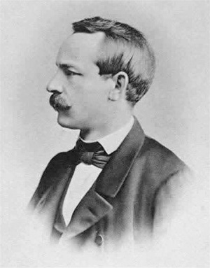

# 미분했더니 좌표가 섞여 들어온다

## 출발 문제

평면 위에서 벡터장을 미분하는 것은 아주 자연스럽다. 벡터장 $\mathbf{V} = V^x \hat{\mathbf{x}} + V^y \hat{\mathbf{y}}$가 있으면, $x$ 방향으로의 변화율은 각 성분을 편미분하면 된다: $\partial V^x / \partial x$와 $\partial V^y / \partial x$를 구하면 끝이다. 기저벡터 $\hat{\mathbf{x}}$, $\hat{\mathbf{y}}$는 어디서든 같은 방향, 같은 크기를 유지하므로 건드릴 것이 없다.

이제 같은 평면을 극좌표 $(r, \theta)$로 기술해 보자. 기저벡터 $\hat{\mathbf{r}}$과 $\hat{\boldsymbol{\theta}}$를 떠올려 보라. $\hat{\mathbf{r}}$은 원점에서 바깥으로 향하는 방향이고, $\hat{\boldsymbol{\theta}}$는 원을 따라 도는 방향이다. 문제는 이 기저벡터들이 장소마다 방향이 변한다는 것이다. $(r, 0)$에서의 $\hat{\mathbf{r}}$과 $(r, \pi/2)$에서의 $\hat{\mathbf{r}}$은 전혀 다른 방향을 가리킨다. 이제 상수 벡터장 — 예를 들어 "어디서든 동쪽으로 1"인 벡터장 — 을 극좌표로 표현하면 어떻게 되는가? 직교좌표에서 $\mathbf{V} = \hat{\mathbf{x}}$인 이 벡터장은 극좌표에서 $\mathbf{V} = \cos\theta\, \hat{\mathbf{r}} - \sin\theta\, \hat{\boldsymbol{\theta}}$가 된다. 성분이 $\theta$에 의존한다!

이 벡터장을 $\theta$에 대해 편미분하면 $\partial V^r / \partial \theta = -\sin\theta$, $\partial V^\theta / \partial \theta = -\cos\theta$가 나온다. 0이 아니다. 하지만 이 벡터장은 원래 상수이다 — 물리적으로 전혀 변하지 않는 벡터장이다. 변하는 것은 벡터장이 아니라 좌표계의 기저벡터다. 편미분이 잡아낸 것은 벡터장의 진짜 변화가 아니라, **좌표 격자 자체가 비틀리면서 생긴 허상**이다.

계산을 직접 해보면 더 선명해진다. 극좌표에서 $\hat{\mathbf{r}} = \cos\theta\, \hat{\mathbf{x}} + \sin\theta\, \hat{\mathbf{y}}$이므로, $\partial \hat{\mathbf{r}} / \partial \theta = -\sin\theta\, \hat{\mathbf{x}} + \cos\theta\, \hat{\mathbf{y}} = \hat{\boldsymbol{\theta}}$이다. 기저벡터 자체가 $\theta$에 대한 미분이 0이 아니다! 이것이 크리스토펠 기호 $\Gamma^\theta_{r\theta}$의 원형이다 — 기저벡터의 변화율을 기저벡터로 다시 표현한 계수.

이 함정은 극좌표뿐 아니라, 구면좌표, 원통좌표, 그리고 일반적인 곡선좌표 어디서든 나타난다. 곡면 위에서는 더 심각하다: 구면에서는 직교좌표 자체가 존재하지 않으므로, 편미분은 항상 좌표 잡음을 포함한다. 심지어 일반상대성이론에서 중력을 기술할 때, 크리스토펠 기호는 "좌표계의 가속"과 "진짜 중력"이 뒤섞인 형태로 나타난다. 아인슈타인의 등가 원리 — 중력과 가속이 국소적으로 구분 불가능하다는 것 — 의 수학적 표현이 바로 여기에 있다.

그렇다면 질문은 명확하다 — 어떻게 하면 좌표의 잡음을 걸러내고, 벡터장의 **순수한** 변화만 볼 수 있는가?

## 패턴

해결의 열쇠는 의외로 단순한 아이디어에 있다: **편미분이 잡아낸 변화에서 좌표 격자의 변화를 빼면 된다.**

비유를 하나 들어 보자. 기차 안에서 테이블 위의 커피잔을 관찰하고 있다고 하자. 기차가 커브를 돌 때 커피잔이 미끄러진다. 이것은 커피잔의 "진짜 움직임"인가? 기차 밖에서 보면 커피잔은 관성에 의해 직선 운동을 하고 있을 뿐이고, 움직인 것은 기차(좌표계)이다. 기차의 가속을 보정해야 커피잔의 진짜 운동을 볼 수 있다. 물리학에서 "관성력"이라 부르는 것이 바로 이 좌표 잡음이고, 크리스토펠 기호가 하는 역할이 정확히 이것이다.

구체적으로 써보자. 벡터장 $W = W^i \partial_i$를 방향 $v = v^j \partial_j$로 미분한다고 하자. 편미분만으로는:

$$v^j \frac{\partial W^i}{\partial x^j}$$

이 되는데, 여기에는 기저벡터 $\partial_i$가 위치에 따라 변하는 효과가 빠져 있다. 기저벡터의 변화를 $\partial_j \partial_k = \Gamma^i_{jk} \partial_i$로 정의하면, 보정된 미분은:

$$\nabla_v W = v^j \left( \frac{\partial W^i}{\partial x^j} + \Gamma^i_{jk} W^k \right) \partial_i$$

가 된다. 핵심 통찰을 정리하면:

1. **편미분은 두 가지를 동시에 잡는다** — 벡터장의 진짜 변화와 좌표 격자의 변화. 이 둘이 뒤섞여 있기 때문에 편미분 결과는 좌표를 바꾸면 달라진다.
2. **크리스토펠 기호 $\Gamma^i_{jk}$는 좌표 격자가 얼마나 휘어져 있는지를 수치화한 것이다.** 직교좌표에서는 격자가 전혀 휘지 않으므로 $\Gamma = 0$이다. 극좌표에서는 격자가 돌아가므로 $\Gamma \neq 0$이다.
3. **$\Gamma$를 보정 항으로 더하면, 좌표 잡음이 상쇄되어 좌표에 무관한 결과를 얻는다.** 이 보정된 미분이 공변미분 $\nabla$이다.

그런데 한 가지 걱정이 생긴다. 보정 항 $\Gamma$를 어떻게 정할 것인가? 다르게 고르면 다른 공변미분이 나오지 않는가? 실제로 그렇다 — 접속은 여러 가지가 가능하다. 접속의 공간은 무한차원이어서, 원칙적으로 "좌표 보정법"은 무한히 많은 선택지가 있다.

하지만 3장에서 계량 $g$가 주어졌으므로, 자연스러운 조건을 걸 수 있다. 첫째, **계량 호환**(metric compatibility): 벡터를 평행이동시킬 때 길이와 각도가 변하지 않아야 한다. 즉 $\nabla g = 0$. 둘째, **비틀림 없음**(torsion-free): $\nabla_X Y - \nabla_Y X = [X, Y]$. 이 두 조건을 동시에 만족하는 접속은 단 하나로 결정된다. 그것이 레비-치비타 접속이다.

비유하자면, 계량은 "자(ruler)"이고 접속은 "자를 들고 걸어다니는 방법"이다. 자를 들고 곡면 위를 걸을 때, 자의 길이가 변하지 않고(계량 호환), 걸음걸이에 "비틀림"이 없는(torsion-free) 걸어다니기 방법은 유일하다.

## 정리

매니폴드 위에서 벡터장(더 일반적으로 텐서장)을 좌표에 무관하게 미분하려면, 편미분에 더해지는 보정 규칙이 필요하다. 이 보정 규칙을 **접속**(connection)이라 하며, 형식적으로는 $\nabla: \mathfrak{X}(M) \times \mathfrak{X}(M) \to \mathfrak{X}(M)$로서 특정 선형성과 라이프니츠 조건을 만족하는 연산이다.

리만 매니폴드 $(M, g)$에서는 다음 두 조건을 동시에 만족하는 접속이 **유일하게** 존재한다:
- **계량 호환**: $\nabla g = 0$, 즉 평행이동하면 벡터의 길이와 각도가 보존된다.
- **비틀림 없음**: $\nabla_X Y - \nabla_Y X = [X, Y]$, 즉 좌표 격자의 "뒤틀림"이 없다.

이 유일한 접속을 **레비-치비타 접속**이라 하며, 그 크리스토펠 기호는 계량으로부터 명시적으로 계산된다:

$$\Gamma^i_{jk} = \frac{1}{2} g^{il} \left( \frac{\partial g_{lj}}{\partial x^k} + \frac{\partial g_{lk}}{\partial x^j} - \frac{\partial g_{jk}}{\partial x^l} \right)$$

이 공식은 "계량만 알면 접속을 계산할 수 있다"는 것을 뜻한다. 자(ruler)를 정하면 미분 규칙이 자동으로 따라온다 — 리만 기하학의 핵심적인 경제성이다.

## 정의

- **접속** (방향 비교기 / Direction Comparator, $\nabla$) — 서로 다른 점의 접선벡터를 비교하는 규칙. 곡면 위에서는 두 점의 접선공간이 다른 "방"이므로, 벡터를 한 방에서 다른 방으로 옮기는 규칙이 있어야 비교가 가능하다.
- **공변미분** (보정된 미분 / Corrected Derivative, $\nabla_v W$) — 벡터장 $W$를 방향 $v$로 미분하되 좌표 잡음을 보정한 것. "기차의 가속을 빼고 커피잔의 진짜 움직임만 본다."
- **크리스토펠 기호** (좌표 보정값 / Coordinate Correction Term, $\Gamma^i_{jk}$) — 공변미분에서 편미분에 더해지는 보정 항. 좌표 격자가 얼마나 휘어져 있는지의 척도이며, 텐서가 아니다(좌표를 바꾸면 변환 규칙이 다르다). 바로 그 비-텐서적 성질 덕분에 편미분의 잡음을 상쇄할 수 있다.
- **레비-치비타 접속** (계량이 정하는 유일한 비교기 / Metric-Compatible Torsion-Free Comparator) — 계량을 보존하고 비틀림이 없는 유일한 접속. 리만 기하학의 "기본 접속"이며, 측지선·곡률 등 거의 모든 후속 개념이 여기서 출발한다.

## 핵심 인물과 일화

### 엘빈 브루노 크리스토펠 (Elwin Bruno Christoffel, 1829–1900)

리만이 곡면 위의 기하학이라는 거대한 비전을 제시했을 때, 그것을 실제로 계산 가능한 도구로 만든 사람은 크리스토펠이었다.

크리스토펠은 1869년 논문에서 핵심적인 질문을 던진다: 곡면 위에서 텐서를 미분할 때, 좌표의 변화가 끼어드는 "잡음"을 체계적으로 보정하려면 어떤 양이 필요한가? 그 답으로 그는 계량 텐서의 편미분으로부터 계산되는 보정 계수를 도출했다 — 오늘날 "크리스토펠 기호 $\Gamma^i_{jk}$"라 불리는 것이다.

크리스토펠 기호 자체는 텐서가 아니다 — 좌표를 바꾸면 변환 규칙이 텐서와 다르다. 하지만 바로 이 "비-텐서적" 성질 덕분에, 편미분에 크리스토펠 기호를 더하면 좌표 변환에 깔끔하게 따라가는 공변미분이 된다. 잡음을 잡는 보정 항이 정확히 잡음과 같은 유형이기 때문에, 둘이 상쇄되어 좌표 독립적인 결과를 낳는 것이다.

### 툴리오 레비-치비타 (Tullio Levi-Civita, 1873–1941)

크리스토펠이 대수적 보정 항을 발견했다면, 레비-치비타는 거기에 기하학적 의미를 부여했다. 1917년, 레비-치비타는 크리스토펠 기호가 사실은 **평행이동** — 벡터를 곡면 위에서 "회전시키지 않고" 옮기는 것 — 의 수학적 표현이라는 것을 간파한다.

이탈리아 파도바 대학의 교수였던 레비-치비타는 스승 그레고리오 리치-쿠르바스트로와 함께 "텐서 해석학(calcolo tensoriale)"을 체계화한 인물이기도 하다. 아인슈타인은 일반상대성이론을 구축하면서 리치와 레비-치비타의 텐서 형식론에 크게 의존했고, 레비-치비타와 활발히 서신을 교환했다.

레비-치비타의 접속 개념은 후대에 "계량을 보존하면서 비틀림이 없는 유일한 접속"으로 정밀하게 특성화되었다. 오늘날 **레비-치비타 접속**이라 불리는 이 접속은, 리만 기하학에서 가장 자연스러운 미분 규칙의 위치를 차지한다.

파시스트 정권의 인종법으로 1938년 교수직에서 쫓겨난 레비-치비타는 고립 속에서 1941년 세상을 떠났다. 그러나 그가 놓은 다리 — 대수적 보정 항과 기하학적 평행이동 사이의 연결 — 는 미분기하학 전체의 기둥으로 남아 있다.

## 시각화 아이디어

  <noscript>이 시각화를 보려면 JavaScript가 필요합니다.</noscript>

- 극좌표의 함정: $\mathbb{R}^2$ 위의 벡터장을 극좌표로 바꾸면 편미분이 0이 아니다
- 보정 항 슬라이더: 편미분 결과 + $\Gamma$ 보정 항을 분리하여 on/off
- GPS 보정: GPS 내비게이션이 지구 곡률을 보정하는 과정의 비유

## 연결되는 세계들

| 분야 | 연결 |
|------|------|
| 게이지 이론 | 양-밀스 접속 = 파이버 다발 위의 접속 |
| 신경망 | 자연 경사법의 핵심: 매개변수 공간의 접속이 학습 역학을 결정 |
| 수치해석 | 매니폴드 위의 ODE 풀이: 보정 없이 적분하면 해가 매니폴드를 이탈 |
| 일반상대론 | 크리스토펠 기호 = 중력장의 좌표 표현 |
| 정보기하학 | $\alpha$-접속족: 계량이 정하는 접속 외에 무한히 많은 접속이 존재 |
