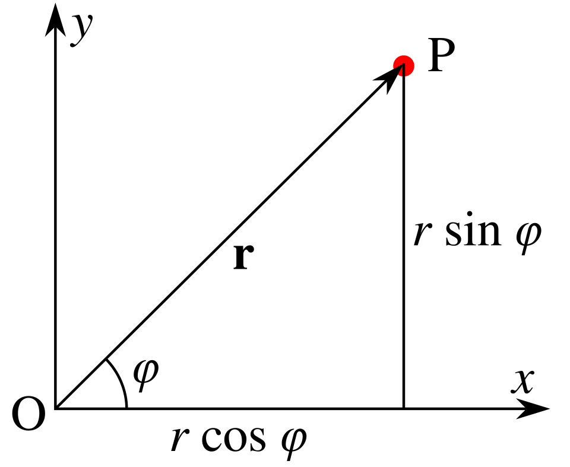
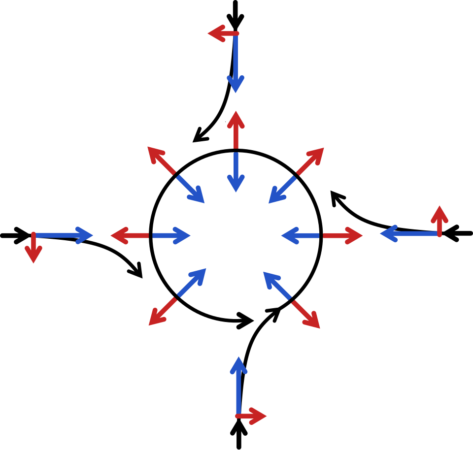
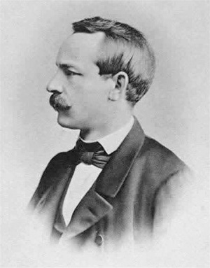
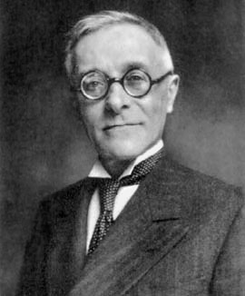

# 미분했더니 좌표가 섞여 들어온다

## 출발 문제

평면 위에서 벡터장을 미분하는 것은 아주 자연스럽다. 벡터장 $\mathbf{V} = V^x \hat{\mathbf{x}} + V^y \hat{\mathbf{y}}$가 있으면, $x$ 방향으로의 변화율은 각 성분을 편미분하면 된다: $\partial V^x / \partial x$와 $\partial V^y / \partial x$를 구하면 끝이다. 기저벡터 $\hat{\mathbf{x}}$, $\hat{\mathbf{y}}$는 어디서든 같은 방향, 같은 크기를 유지하므로 건드릴 것이 없다.

이제 같은 평면을 극좌표 $(r, \theta)$로 기술해 보자.

기저벡터 $\hat{\mathbf{r}}$과 $\hat{\boldsymbol{\theta}}$를 떠올려 보라. $\hat{\mathbf{r}}$은 원점에서 바깥으로 향하는 방향이고, $\hat{\boldsymbol{\theta}}$는 원을 따라 도는 방향이다. 문제는 이 기저벡터들이 장소마다 방향이 변한다는 것이다. $(r, 0)$에서의 $\hat{\mathbf{r}}$과 $(r, \pi/2)$에서의 $\hat{\mathbf{r}}$은 전혀 다른 방향을 가리킨다. 이제 상수 벡터장 — 예를 들어 "어디서든 동쪽으로 1"인 벡터장 — 을 극좌표로 표현하면 어떻게 되는가? 직교좌표에서 $\mathbf{V} = \hat{\mathbf{x}}$인 이 벡터장은 극좌표에서 $\mathbf{V} = \cos\theta\, \hat{\mathbf{r}} - \sin\theta\, \hat{\boldsymbol{\theta}}$가 된다. 성분이 $\theta$에 의존한다!

이 벡터장을 $\theta$에 대해 편미분하면 $\partial V^r / \partial \theta = -\sin\theta$, $\partial V^\theta / \partial \theta = -\cos\theta$가 나온다. 0이 아니다. 하지만 이 벡터장은 원래 상수이다 — 물리적으로 전혀 변하지 않는 벡터장이다. 변하는 것은 벡터장이 아니라 좌표계의 기저벡터다. 편미분이 잡아낸 것은 벡터장의 진짜 변화가 아니라, **좌표 격자 자체가 비틀리면서 생긴 허상**이다.

계산을 직접 해보면 더 선명해진다. 극좌표에서 $\hat{\mathbf{r}} = \cos\theta\, \hat{\mathbf{x}} + \sin\theta\, \hat{\mathbf{y}}$이므로, $\partial \hat{\mathbf{r}} / \partial \theta = -\sin\theta\, \hat{\mathbf{x}} + \cos\theta\, \hat{\mathbf{y}} = \hat{\boldsymbol{\theta}}$이다. 기저벡터 자체가 $\theta$에 대한 미분이 0이 아니다! 이것이 크리스토펠 기호 $\Gamma^\theta_{r\theta}$의 원형이다 — 기저벡터의 변화율을 기저벡터로 다시 표현한 계수.

이 함정은 극좌표뿐 아니라, 구면좌표, 원통좌표, 그리고 일반적인 곡선좌표 어디서든 나타난다. 곡면 위에서는 더 심각하다. 구면에는 평면의 직교좌표처럼 어느 동네에서나 격자가 곧게 뻗은 좌표계가 아예 없으므로, 어떤 좌표를 고르든 편미분에는 좌표 잡음이 섞여 들어온다. 심지어 일반상대성이론에서 중력을 기술할 때, 크리스토펠 기호는 "좌표계의 가속"과 "진짜 중력"이 뒤섞인 형태로 나타난다. 아인슈타인의 등가 원리 — 중력과 가속이 국소적으로 구분 불가능하다는 것 — 의 수학적 표현이 바로 여기에 있다.

그렇다면 질문은 명확하다 — 어떻게 하면 좌표의 잡음을 걸러내고, 벡터장의 **순수한** 변화만 볼 수 있는가?

## 패턴

해결의 열쇠는 의외로 단순한 아이디어에 있다: **편미분이 잡아낸 변화에서 좌표 격자의 변화를 빼면 된다.**

비유를 하나 들어 보자. 기차 안에서 테이블 위의 커피잔을 관찰하고 있다고 하자. 기차가 커브를 돌 때 커피잔이 미끄러진다. 이것은 커피잔의 "진짜 움직임"인가? 기차 밖에서 보면 커피잔은 관성에 의해 직선 운동을 하고 있을 뿐이고, 움직인 것은 기차(좌표계)이다. 기차의 가속을 보정해야 커피잔의 진짜 운동을 볼 수 있다. 물리학에서 "관성력"이라 부르는 것이 바로 이 좌표 잡음이고, 크리스토펠 기호가 하는 역할이 정확히 이것이다.

구체적으로 써보자. 벡터장 $W = W^i \partial_i$를 방향 $v = v^j \partial_j$로 미분한다고 하자. 성분만 편미분하면 다음과 같다.

$$
\textcolor{#1f77b4}{v}^j \frac{\partial \textcolor{#e8710a}{W}^i}{\partial \textcolor{#1b9e77}{x}^j}
$$

$$
\begin{array}{ll}
\textcolor{#1f77b4}{v}^j & \text{미분하는 방향 벡터의 성분} \\
\textcolor{#e8710a}{W}^i & \text{미분되는 벡터장의 성분} \\
\textcolor{#1b9e77}{x}^j & \text{좌표} \\
i, j & \text{성분 번호 (반복되는 첨자는 모두 더한다)}
\end{array}
$$

여기에는 기저벡터 $\partial_i$ 자체가 위치에 따라 변하는 효과가 빠져 있다. 그래서 기저벡터 하나를 다른 기저 방향으로 미분한 결과를 다시 기저벡터들로 풀어 쓰고, 그 계수에 이름을 붙인다.

$$
\textcolor{#9467bd}{\nabla}_{\textcolor{#1f77b4}{\partial_j}} \textcolor{#1f77b4}{\partial_k} = \textcolor{#9467bd}{\Gamma}^i_{jk}\, \textcolor{#1f77b4}{\partial_i}
$$

$$
\begin{array}{ll}
\textcolor{#1f77b4}{\partial_j}, \textcolor{#1f77b4}{\partial_k}, \textcolor{#1f77b4}{\partial_i} & \text{좌표 기저벡터 (좌표 } x^j \text{ 방향)} \\
\textcolor{#9467bd}{\nabla} & \text{접속 (보정된 미분)} \\
\textcolor{#9467bd}{\Gamma}^i_{jk} & \text{크리스토펠 기호: } \partial_k \text{ 를 } \partial_j \text{ 방향으로 옮길 때 생기는 } \partial_i \text{ 성분}
\end{array}
$$

이 보정을 성분의 편미분에 더하면 보정된 미분이 된다.

$$
\textcolor{#9467bd}{\nabla}_{\textcolor{#1f77b4}{v}} \textcolor{#e8710a}{W} = \textcolor{#1f77b4}{v}^j \left( \frac{\partial \textcolor{#e8710a}{W}^i}{\partial \textcolor{#1b9e77}{x}^j} + \textcolor{#9467bd}{\Gamma}^i_{jk} \textcolor{#e8710a}{W}^k \right) \textcolor{#1f77b4}{\partial_i}
$$

$$
\begin{array}{ll}
\textcolor{#9467bd}{\nabla}_{\textcolor{#1f77b4}{v}} \textcolor{#e8710a}{W} & \text{공변미분: } W \text{ 를 } v \text{ 방향으로 미분한 좌표 무관한 결과} \\
\dfrac{\partial \textcolor{#e8710a}{W}^i}{\partial \textcolor{#1b9e77}{x}^j} & \text{성분의 변화 (진짜 변화 + 좌표 잡음)} \\
\textcolor{#9467bd}{\Gamma}^i_{jk} \textcolor{#e8710a}{W}^k & \text{기저벡터가 변한 몫을 되돌리는 보정 항}
\end{array}
$$

핵심 통찰을 정리하면 다음과 같다.

1. **편미분은 두 가지를 동시에 잡는다** — 벡터장의 진짜 변화와 좌표 격자의 변화. 이 둘이 뒤섞여 있기 때문에 편미분 결과는 좌표를 바꾸면 달라진다.
2. **크리스토펠 기호 $\Gamma^i_{jk}$는 좌표 격자가 얼마나 휘어져 있는지를 수치화한 것이다.** 직교좌표에서는 격자가 전혀 휘지 않으므로 $\Gamma = 0$이다. 극좌표에서는 격자가 돌아가므로 $\Gamma \neq 0$이다.
3. **$\Gamma$를 보정 항으로 더하면, 좌표 잡음이 상쇄되어 좌표에 무관한 결과를 얻는다.** 이 보정된 미분이 공변미분 $\nabla$이다.

그런데 한 가지 걱정이 생긴다. 보정 항 $\Gamma$는 어떻게 정하는가? 다르게 고르면 다른 공변미분이 나오지 않는가? 실제로 그렇다. 두 접속의 차이 $\nabla - \nabla'$은 좌표를 바꿔도 제대로 변환되는 텐서가 되므로, 접속 하나에 아무 텐서장(첨자 셋짜리)을 더해도 또 다른 접속이 된다. 좌표 보정법은 원칙적으로 무한히 많다.

하지만 3장에서 계량 $g$가 주어졌으므로 자연스러운 조건을 걸 수 있다. 첫째는 **계량 호환**(metric compatibility)으로, 벡터를 평행이동시킬 때 길이와 각도가 변하지 않아야 한다는 조건 $\nabla g = 0$이다. 둘째는 **비틀림 없음**(torsion-free)으로, $\nabla_X Y - \nabla_Y X = [X, Y]$라는 조건이다. 두 방향으로 조금씩 번갈아 움직여 만든 아주 작은 평행사변형이 틈 없이 닫힌다는 뜻이다(아래 두 번째 위젯). 이 두 조건을 동시에 만족하는 접속은 단 하나로 결정되는데, 그것이 레비-치비타 접속이다.

비유하자면, 계량은 "자(ruler)"이고 접속은 "자를 들고 걸어다니는 방법"이다. 자를 들고 곡면 위를 걸을 때, 자의 길이가 변하지 않고(계량 호환), 걸음걸이에 "비틀림"이 없는(torsion-free) 걸어다니기 방법은 유일하다.

## 정리

매니폴드 위에서 벡터장(더 일반적으로 텐서장)을 좌표에 무관하게 미분하려면, 편미분에 더해지는 보정 규칙이 필요하다. 이 보정 규칙을 **접속**(connection)이라 하며, 형식적으로는 $\nabla: \mathfrak{X}(M) \times \mathfrak{X}(M) \to \mathfrak{X}(M)$로서 특정 선형성과 라이프니츠 조건을 만족하는 연산이다.

리만 매니폴드 $(M, g)$에서는 다음 두 조건을 동시에 만족하는 접속이 **유일하게** 존재한다:
- **계량 호환**: $\nabla g = 0$, 즉 평행이동하면 벡터의 길이와 각도가 보존된다.
- **비틀림 없음**: $\nabla_X Y - \nabla_Y X = [X, Y]$, 즉 아주 작은 평행사변형이 틈 없이 닫힌다. 좌표 기저로 쓰면 $\Gamma^i_{jk} = \Gamma^i_{kj}$(아래 두 첨자에 대해 대칭)와 같은 조건이다.

이 유일한 접속을 **레비-치비타 접속**이라 하며, 그 크리스토펠 기호는 계량으로부터 명시적으로 계산된다.

$$
\textcolor{#9467bd}{\Gamma}^i_{jk} = \frac{1}{2} \textcolor{#d62728}{g}^{il} \left( \frac{\partial \textcolor{#d62728}{g}_{lj}}{\partial \textcolor{#1b9e77}{x}^k} + \frac{\partial \textcolor{#d62728}{g}_{lk}}{\partial \textcolor{#1b9e77}{x}^j} - \frac{\partial \textcolor{#d62728}{g}_{jk}}{\partial \textcolor{#1b9e77}{x}^l} \right)
$$

$$
\begin{array}{ll}
\textcolor{#9467bd}{\Gamma}^i_{jk} & \text{레비-치비타 접속의 크리스토펠 기호} \\
\textcolor{#d62728}{g}_{ij} & \text{계량 성분 (3장의 눈금)} \\
\textcolor{#d62728}{g}^{il} & \text{계량 행렬의 역행렬 성분} \\
\textcolor{#1b9e77}{x}^k & \text{좌표} \\
l & \text{더해지는 첨자}
\end{array}
$$

이 공식은 "계량만 알면 접속을 계산할 수 있다"는 것을 뜻한다. 자(ruler)를 정하면 미분 규칙이 자동으로 따라온다 — 리만 기하학의 핵심적인 경제성이다.

접속이 정해지면, 벡터의 **평행이동**(parallel transport)이 가능해진다. 곡선 $\gamma(t)$를 따라 벡터 $V$를 $\nabla_{\gamma'} V = 0$이라는 조건 아래 옮기는 것이다. 평면에서는 이것이 그냥 "벡터를 그대로 들고 이동하는 것"이지만, 곡면에서는 놀라운 일이 벌어진다 — 벡터를 구면 위에서 삼각형을 따라 평행이동시키면, 출발점으로 돌아왔을 때 원래 벡터와 달라져 있다. 다음 장에서 이 현상을 직접 보고, 이 "돌아왔는데 달라져 있는 정도"를 7장에서 **곡률**로 정리한다.

### 따라 계산해 보기 — 극좌표의 크리스토펠 기호

극좌표 $(r, \theta)$에서 평면의 계량은 $ds^2 = dr^2 + r^2 d\theta^2$, 곧 $g_{rr} = 1$, $g_{\theta\theta} = r^2$, $g_{r\theta} = 0$이다. 역행렬은 $g^{rr} = 1$, $g^{\theta\theta} = 1/r^2$이다. 계량 성분 가운데 0이 아닌 미분은 $\partial_r g_{\theta\theta} = 2r$ 하나뿐이므로, 위 공식의 괄호 안에서 살아남는 항도 이것뿐이다.

$$
\begin{aligned}
\textcolor{#9467bd}{\Gamma}^r_{\theta\theta} &= \frac{1}{2}\textcolor{#d62728}{g}^{rr}\left(0 + 0 - \frac{\partial \textcolor{#d62728}{g}_{\theta\theta}}{\partial \textcolor{#1b9e77}{r}}\right) = \frac{1}{2}\cdot 1 \cdot (-2\textcolor{#1b9e77}{r}) = -\textcolor{#1b9e77}{r} \\[4pt]
\textcolor{#9467bd}{\Gamma}^\theta_{r\theta} &= \frac{1}{2}\textcolor{#d62728}{g}^{\theta\theta}\left(0 + \frac{\partial \textcolor{#d62728}{g}_{\theta\theta}}{\partial \textcolor{#1b9e77}{r}} - 0\right) = \frac{1}{2}\cdot\frac{1}{\textcolor{#1b9e77}{r}^2}\cdot 2\textcolor{#1b9e77}{r} = \frac{1}{\textcolor{#1b9e77}{r}}
\end{aligned}
$$

$$
\begin{array}{ll}
\textcolor{#1b9e77}{r}, \textcolor{#1b9e77}{\theta} & \text{극좌표 (반지름, 각도)} \\
\textcolor{#d62728}{g}_{\theta\theta} = \textcolor{#1b9e77}{r}^2 & \text{각도 방향 눈금: 반지름 } r \text{ 인 원에서 각도 1의 길이는 } r \\
\textcolor{#9467bd}{\Gamma}^r_{\theta\theta} & \partial_\theta \text{ 를 } \theta \text{ 방향으로 옮기면 생기는 } \partial_r \text{ 성분} \\
\textcolor{#9467bd}{\Gamma}^\theta_{r\theta} = \textcolor{#9467bd}{\Gamma}^\theta_{\theta r} & \partial_\theta \text{ 를 } r \text{ 방향으로 옮기면 생기는 } \partial_\theta \text{ 성분}
\end{array}
$$

나머지 $\Gamma$(예: $\Gamma^r_{rr}$, $\Gamma^\theta_{\theta\theta}$)는 모두 0이다. 두 값은 그림으로도 확인된다. $\partial_\theta = (-r\sin\theta,\ r\cos\theta)$를 $\theta$로 미분하면 $(-r\cos\theta,\ -r\sin\theta) = -r\,\partial_r$로 원의 안쪽을 향하고, $r$로 미분하면 $(-\sin\theta,\ \cos\theta) = \frac{1}{r}\partial_\theta$로 원 둘레 방향의 기저가 바깥으로 갈수록 길어지는 몫이 나온다.

이제 출발 문제의 "어디서나 동쪽으로 1"인 벡터장을 다시 보자. 좌표 기저 $\partial_r, \partial_\theta$로 쓰면 성분은 $W^r = \cos\theta$, $W^\theta = -\sin\theta / r$이다(출발 문제에서는 길이 1짜리 $\hat{\boldsymbol\theta}$를 써서 $-\sin\theta$였고, $\partial_\theta = r\hat{\boldsymbol\theta}$이므로 $r$로 나눈다). $\theta$ 방향 공변미분을 계산하면 편미분과 보정 항이 정확히 상쇄된다.

$$
\begin{aligned}
\frac{\partial \textcolor{#e8710a}{W}^r}{\partial \textcolor{#1b9e77}{\theta}} + \textcolor{#9467bd}{\Gamma}^r_{\theta\theta}\textcolor{#e8710a}{W}^\theta &= -\sin\theta + (-\textcolor{#1b9e77}{r})\left(-\frac{\sin\theta}{\textcolor{#1b9e77}{r}}\right) = 0 \\[4pt]
\frac{\partial \textcolor{#e8710a}{W}^\theta}{\partial \textcolor{#1b9e77}{\theta}} + \textcolor{#9467bd}{\Gamma}^\theta_{\theta r}\textcolor{#e8710a}{W}^r &= -\frac{\cos\theta}{\textcolor{#1b9e77}{r}} + \frac{1}{\textcolor{#1b9e77}{r}}\cos\theta = 0
\end{aligned}
$$

$$
\begin{array}{ll}
\textcolor{#e8710a}{W}^r, \textcolor{#e8710a}{W}^\theta & \text{동쪽 벡터장의 좌표 기저 성분} \\
\textcolor{#9467bd}{\Gamma}\,\textcolor{#e8710a}{W} & \text{보정 항: 기저가 돈 몫}
\end{array}
$$

$r$ 방향 공변미분도 같은 식으로 0이 된다. 편미분이 잡았던 $-\sin\theta$와 $-\cos\theta$는 벡터장의 변화가 아니라, 기저가 돌아간 몫이었다.

## 정의

- **접속** (방향 비교기 / Direction Comparator, $\nabla$) — 서로 다른 점의 접선벡터를 비교하는 규칙. 곡면 위에서는 두 점의 접선공간이 다른 "방"이므로, 벡터를 한 방에서 다른 방으로 옮기는 규칙이 있어야 비교가 가능하다.
- **공변미분** (보정된 미분 / Corrected Derivative, $\nabla_v W$) — 벡터장 $W$를 방향 $v$로 미분하되 좌표 잡음을 보정한 것. "기차의 가속을 빼고 커피잔의 진짜 움직임만 본다."
- **크리스토펠 기호** (좌표 보정값 / Coordinate Correction Term, $\Gamma^i_{jk}$) — 공변미분에서 편미분에 더해지는 보정 항. 좌표 격자가 얼마나 휘어져 있는지의 척도이며, 텐서가 아니다(좌표를 바꾸면 변환 규칙이 다르다). 바로 그 비-텐서적 성질 덕분에 편미분의 잡음을 상쇄할 수 있다.
- **레비-치비타 접속** (계량이 정하는 유일한 비교기 / Metric-Compatible Torsion-Free Comparator) — 계량을 보존하고 비틀림이 없는 유일한 접속. 리만 기하학의 "기본 접속"이며, 측지선·곡률 등 거의 모든 후속 개념이 여기서 출발한다.

## 핵심 인물과 일화

### 엘빈 브루노 크리스토펠 (Elwin Bruno Christoffel, 1829–1900)

리만이 곡면 위의 기하학이라는 거대한 비전을 제시했을 때, 그것을 실제로 계산 가능한 도구로 만든 사람은 크리스토펠이었다.

크리스토펠은 1869년 논문에서 핵심적인 질문을 던진다: 곡면 위에서 텐서를 미분할 때, 좌표의 변화가 끼어드는 "잡음"을 체계적으로 보정하려면 어떤 양이 필요한가? 그 답으로 그는 계량 텐서의 편미분으로부터 계산되는 보정 계수를 도출했다 — 오늘날 "크리스토펠 기호 $\Gamma^i_{jk}$"라 불리는 것이다.

크리스토펠 기호 자체는 텐서가 아니다 — 좌표를 바꾸면 변환 규칙이 텐서와 다르다. 하지만 바로 이 "비-텐서적" 성질 덕분에, 편미분에 크리스토펠 기호를 더하면 좌표 변환에 깔끔하게 따라가는 공변미분이 된다. 잡음을 잡는 보정 항이 정확히 잡음과 같은 유형이기 때문에, 둘이 상쇄되어 좌표 독립적인 결과를 낳는 것이다.

### 툴리오 레비-치비타 (Tullio Levi-Civita, 1873–1941)

크리스토펠이 대수적 보정 항을 발견했다면, 레비-치비타는 거기에 기하학적 의미를 부여했다. 1917년, 레비-치비타는 크리스토펠 기호가 사실은 **평행이동** — 벡터를 곡면 위에서 "회전시키지 않고" 옮기는 것 — 의 수학적 표현이라는 것을 간파한다.

이탈리아 파도바 대학의 교수였던 레비-치비타는 스승 그레고리오 리치-쿠르바스트로와 함께 "텐서 해석학(calcolo tensoriale)"을 체계화한 인물이기도 하다. 아인슈타인은 일반상대성이론을 구축하면서 리치와 레비-치비타의 텐서 형식론에 크게 의존했고, 레비-치비타와 활발히 서신을 교환했다.

레비-치비타의 접속 개념은 후대에 "계량을 보존하면서 비틀림이 없는 유일한 접속"으로 정밀하게 특성화되었다. 오늘날 **레비-치비타 접속**이라 불리는 이 접속은, 리만 기하학에서 가장 자연스러운 미분 규칙의 위치를 차지한다.

파시스트 정권의 인종법으로 1938년 교수직에서 쫓겨난 레비-치비타는 고립 속에서 1941년 세상을 떠났다. 그러나 그가 놓은 다리 — 대수적 보정 항과 기하학적 평행이동 사이의 연결 — 는 미분기하학 전체의 기둥으로 남아 있다.

## 직접 움직여 보기

첫 번째 위젯은 반지름 $r$인 원을 따라 벡터 $V$를 평행이동시킨다. 평면이므로 화살표는 실제로 전혀 돌지 않지만, 극좌표 성분 $V^r$, $V^\theta$는 위치에 따라 계속 변한다. 아래 수식 패널에서 성분의 편미분과 $\Gamma$ 보정 항이 매 순간 정확히 상쇄되는 것을 확인하고, 반지름 $r$을 바꾸면 $\Gamma^r_{\theta\theta} = -r$, $\Gamma^\theta_{\theta r} = 1/r$이 어떻게 변하는지 보자. "성분 고정"을 켜면 보정 없이 성분만 붙들고 옮긴 가짜 평행이동이 얼마나 돌아가 버리는지 보인다.

  <noscript>이 시각화를 보려면 JavaScript가 필요합니다.</noscript>

두 번째 위젯은 비틀림 조건을 그림으로 보여 준다. 한 점에서 $u$만큼 간 뒤 $v$를 옮겨 와서 $v$만큼 가는 길과, 순서를 바꾼 길이 같은 곳에서 만나는가? 비틀림이 있는 접속에서는 두 끝점 사이에 틈 $T(u, v)$가 생기고, 그 틈은 평행사변형의 넓이에 비례한다. 레비-치비타 접속은 이 틈이 언제나 0이다.

  <noscript>이 시각화를 보려면 JavaScript가 필요합니다.</noscript>

## 연습문제와 같이 풀기

각 문제를 먼저 혼자 풀어 본 뒤, 바로 아래 세션에서 선생님과 두 학생이 어떻게 풀어 가는지 따라가 보자.

### 문제 1 — 직교좌표에선 0, 극좌표에선 −r

확인 평면의 직교좌표 $(x, y)$에서는 모든 $\Gamma^i_{jk}$가 0이다. 그런데 앞의 계산에서 극좌표로는 $\Gamma^r_{\theta\theta} = -r$이었다. 둘 중 하나가 계산 실수인가? $\Gamma$가 텐서라면 어떻게 되어야 하는가?

#### 같이 풀기 세션 1

**선생님:** 직교좌표에서는 $\Gamma$가 전부 0이고, 극좌표에서는 $-r$이 나왔어요. 둘 중 하나가 틀렸을까요?

**김민준:** 극좌표 쪽이 틀린 것 같아요. $\Gamma$도 첨자가 셋 달린 텐서잖아요. 텐서는 한 좌표계에서 0이면 모든 좌표계에서 0이라고 배웠으니까, 극좌표에서도 0이어야죠.

**이서연:** 텐서라면 그렇지. 그런데 극좌표 쪽은 방금 그림으로도 확인했잖아. $\partial_\theta$를 $\theta$로 미분하니까 정말 원 안쪽을 향했어.

**선생님:** 그럼 두 계산이 다 맞다고 해 봅시다. 민준 학생의 전제 가운데 어디를 의심해야 할까요?

**김민준 〔M04〕:** …$\Gamma$가 텐서라는 거요? 첨자가 달렸다고 다 텐서는 아닌가 보네요.

**선생님:** 맞아요. 좌표를 바꿀 때 $\Gamma$는 텐서의 변환 규칙에 좌표 변환의 **2차 미분**이 들어간 항이 하나 더 붙어요. 직교좌표에서 극좌표로 가는 변환은 휘어 있어서 그 항이 0이 아니고, 그게 바로 $-r$을 만들어요. 그래서 $\Gamma$는 텐서가 아니고, 그 덕분에 편미분의 잡음을 지울 수 있는 거예요. 둘 다 계산 실수가 아니에요.

**김민준:** PyTorch에서는 다 `torch.Tensor`라고 부르니까 헷갈렸나 봐요. 과제에서 이미지 배열이랑 가중치 배열을 모양이 같다고 그냥 더했다가, 조교님이 "모양이 같다고 같은 물건은 아니다"라고 써 주셨던 게 딱 이거네요.

### 문제 2 — 구면 좌표의 크리스토펠 기호

계산 반지름 1인 구면을 북극에서 잰 각도 $\theta$와 경도 $\phi$로 쓰면 계량은 $ds^2 = d\theta^2 + \sin^2\theta\, d\phi^2$이다. $\Gamma^\theta_{\phi\phi}$와 $\Gamma^\phi_{\theta\phi}$를 구하라.

#### 같이 풀기 세션 2

**김민준:** sympy로 돌려 봤어요. $\Gamma^\theta_{\phi\phi} = -2\sin\theta\cos\theta$가 나와요.

**이서연:** 난 손으로 했는데 $\Gamma^\theta_{\phi\phi} = -\sin\theta\cos\theta$야. 대신 $\Gamma^\phi_{\theta\phi} = \sin\theta\cos\theta$가 나왔어.

**선생님:** 한 개씩 다르네요. 검산할 거리가 하나 있어요. 민준 학생 코드에 극좌표 계량을 넣으면 $\Gamma^r_{\theta\theta}$가 얼마로 나와요?

**김민준 〔M04〕:** …$-2r$이요. 그런데 아까 그림으로 $-r$을 확인했잖아요. 아, 코드에 $\frac{1}{2}$을 안 넣었어요. 괄호 안 세 항만 더했네요.

**김민준:** 답을 이미 아는 경우로 먼저 돌려 보라던 조교님 말이 이제 이해돼요. 테스트 없이 과제를 냈다가 결과가 전부 두 배로 나와서 감점당한 적이 있거든요.

**선생님:** 이번엔 서연 학생 차례예요. $\Gamma^\phi_{\theta\phi}$는 $\partial_\phi$를 $\theta$ 방향으로 옮길 때 생기는 $\partial_\phi$ 성분이에요. $\partial_\phi$의 길이는 얼마죠?

**이서연:** $\sin\theta$요. 그 위도선의 반지름이니까요.

**선생님:** 북쪽이나 남쪽으로 조금 움직이면 그 길이는 얼마만큼의 비율로 변해요?

**이서연 〔S07〕:** 상대 변화율이니까 $(\sin\theta)'/\sin\theta = \cot\theta$요. 그러면 $\Gamma^\phi_{\theta\phi} = \cot\theta$여야 해요. 저는 공식의 역행렬 자리에 $g^{\theta\theta} = 1$을 넣었어요. 위첨자가 $\phi$니까 $g^{\phi\phi} = 1/\sin^2\theta$를 넣어야 했는데요.

$$
\begin{aligned}
\textcolor{#9467bd}{\Gamma}^\theta_{\phi\phi} &= \frac{1}{2}\textcolor{#d62728}{g}^{\theta\theta}\left(-\frac{\partial \textcolor{#d62728}{g}_{\phi\phi}}{\partial \textcolor{#1b9e77}{\theta}}\right) = -\sin\textcolor{#1b9e77}{\theta}\cos\textcolor{#1b9e77}{\theta} \\[4pt]
\textcolor{#9467bd}{\Gamma}^\phi_{\theta\phi} &= \frac{1}{2}\textcolor{#d62728}{g}^{\phi\phi}\,\frac{\partial \textcolor{#d62728}{g}_{\phi\phi}}{\partial \textcolor{#1b9e77}{\theta}} = \frac{2\sin\textcolor{#1b9e77}{\theta}\cos\textcolor{#1b9e77}{\theta}}{2\sin^2\textcolor{#1b9e77}{\theta}} = \cot\textcolor{#1b9e77}{\theta}
\end{aligned}
$$

$$
\begin{array}{ll}
\textcolor{#1b9e77}{\theta}, \textcolor{#1b9e77}{\phi} & \text{구면 좌표 (북극에서 잰 각도, 경도)} \\
\textcolor{#d62728}{g}_{\phi\phi} = \sin^2\textcolor{#1b9e77}{\theta} & \text{경도 방향 눈금의 제곱} \\
\textcolor{#d62728}{g}^{\phi\phi} = 1/\sin^2\textcolor{#1b9e77}{\theta} & \text{역행렬 성분 (위첨자 } \phi \text{ 와 짝)} \\
\textcolor{#9467bd}{\Gamma}^\theta_{\phi\phi}, \textcolor{#9467bd}{\Gamma}^\phi_{\theta\phi} & \text{0이 아닌 크리스토펠 기호 } (\Gamma^\phi_{\phi\theta} \text{ 도 같은 값})
\end{array}
$$

**이서연:** 선형대수 시간에 첨자 짝을 안 맞춘 채 행렬 곱을 전개했다가, 교수님이 "첨자는 문법이다"라고 하셨던 게 생각나. 위첨자가 $\phi$면 $g^{\phi l}$의 첫 첨자도 $\phi$여야지.

**선생님 〔T14〕:** 좋아요. 이 두 값은 다음 문제에서 바로 써요.

### 문제 3 — 적도에서는 Γ가 전부 0이다

킬러 문제 2의 구면 좌표에서 적도($\theta = \pi/2$) 위의 점에서는 $\Gamma$가 모두 0이다. (1) 적도 위의 점에서 공변미분과 성분의 편미분은 같은가? (2) 그렇다면 적도 근처의 구면은 평면과 구별할 수 없는가? (3) 적도를 따라 벡터를 평행이동시키면 성분은 어떻게 되는가?

#### 같이 풀기 세션 3

**선생님:** 문제 2의 값을 적도에 넣어 볼까요?

**이서연:** $\Gamma^\theta_{\phi\phi} = -\sin\frac{\pi}{2}\cos\frac{\pi}{2} = 0$, $\Gamma^\phi_{\theta\phi} = \cot\frac{\pi}{2} = 0$. 나머지는 원래 0이니까 적도 위에서는 정말 전부 0이네.

**김민준:** 그러면 (1)은 같아요. 보정할 게 없으니까요. 그리고 $\Gamma$가 0이면 편미분만으로 되는 거니까, 적도 근처는 평면이랑 똑같은 거 아니에요? 적도에서는 구면 좌표가 직교좌표처럼 행동하는 거죠.

**선생님:** (1)은 맞아요. (2)가 문제예요. 민준 학생, 적도에서 북쪽으로 아주 조금, $\theta = \pi/2 - 0.1$로 가면 $\Gamma^\theta_{\phi\phi}$는요?

**김민준:** $-\sin\theta\cos\theta$니까… 약 $-0.099$요. 0이 아니네요.

**선생님:** 적도 위에서는 0인데 바로 옆에서는 0이 아니에요. 그러면 적도에서 $\Gamma$의 값 말고 무엇을 봐야 할까요?

**이서연 〔S02〕:** 변화율이요. $\partial_\theta \Gamma^\theta_{\phi\phi} = -\cos 2\theta$이고 적도에서는 1이에요. 값은 0인데 기울기는 0이 아니에요.

**선생님:** 바로 그거예요. 사실 어느 곡면이든 한 점을 골라 좌표를 잘 잡으면, 그 점에서 $\Gamma$를 전부 0으로 만들 수 있어요. 한 점에서 $\Gamma = 0$이라는 건 "이 좌표가 그 점에 잘 맞춰져 있다"는 뜻일 뿐, 평평하다는 뜻이 아니에요. 휘어짐은 $\Gamma$의 **미분**에 들어 있고, 그걸 좌표에 무관한 양으로 모은 게 7장의 곡률이에요.

**김민준 〔M05〕:** 그럼 $\Gamma$가 0인지 아닌지로는 평평한지 알 수가 없는 거예요? 문제 1에서는 $\Gamma$가 0이 아닌데 평면이었고, 여기서는 $\Gamma$가 0인데 구면이고요.

**선생님:** 그래요. $\Gamma$는 좌표를 바꾸면 달라지는 양이라 어느 쪽으로도 판정을 못 해요.

**김민준:** 학습 곡선을 한 에폭만 찍어 놓고 보고서에 "수렴했다"고 썼다가, 조교님이 "한 점의 값 말고 추세를 보라"고 빨간 줄 그어 주셨던 거랑 같네요.

**선생님:** 그럼 (3)이요. 서연 학생, 적도를 따라 벡터를 옮기면요?

**이서연:** 적도의 속도는 $\partial_\phi$ 방향이니까 평행이동 식은 $dW^k/d\phi + \Gamma^k_{\phi j} W^j = 0$이고, 적도 위에서는 이 $\Gamma$가 전부 0이에요. 그러면 $dW^k/d\phi = 0$이라 성분이 그대로예요. 적도 위에서는 "성분 고정"이 곧 평행이동이네요.

**선생님 〔T13〕:** 맞아요. 적도를 따라 옮기는 동안에는 적도 위의 $\Gamma$만 쓰이니까, 그 선 위에서 0이면 충분해요. (2)와 헷갈리면 안 되는 지점이 바로 여기예요.

**김민준:** 그럼 적도 말고 다른 위도선을 따라가면요?

**이서연:** 그때는 $\Gamma^\theta_{\phi\phi}$랑 $\Gamma^\phi_{\phi\theta}$가 0이 아니니까 성분이 서로 섞이겠지. 한 바퀴 돌면…

**선생님:** 돌아왔을 때 벡터가 어떻게 되어 있는지는 다음 장에서 직접 돌려 봐요.

## 연결되는 세계들

| 분야 | 연결 |
|------|------|
| 게이지 이론 | 양-밀스 접속 = 파이버 다발 위의 접속 |
| 신경망 | 자연 경사법의 핵심: 매개변수 공간의 접속이 학습 역학을 결정 |
| 수치해석 | 매니폴드 위의 ODE 풀이: 보정 없이 적분하면 해가 매니폴드를 이탈 |
| 일반상대론 | 크리스토펠 기호 = 중력장의 좌표 표현 |
| 정보기하학 | $\alpha$-접속족: 계량이 정하는 접속 외에 무한히 많은 접속이 존재 |
