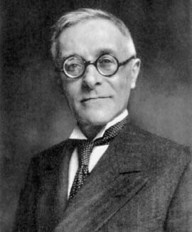
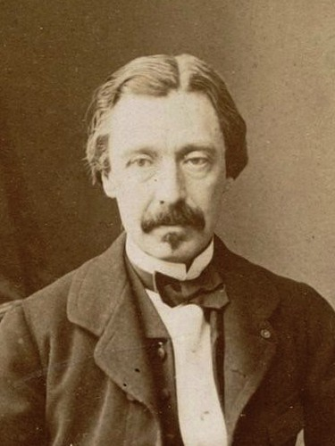

# 벡터를 옮기면 달라진다

## 출발 문제

당신이 지금 북극점에 서 있다고 상상해 보자. 손에는 남쪽을 가리키는 화살표가 들려 있다. 이제 아주 중요한 규칙 하나를 정한다: 이 화살표를 절대로, 어떤 이유로도 **회전시키지 않겠다**. 오직 "앞으로 밀기"만 허용한다. 화살표가 가리키는 방향을 내 의지로 돌리는 행위는 금지다.

이 규칙을 지키며 걸어가 보자. 먼저 경도 0° 자오선을 따라 적도까지 내려간다. 화살표는 여전히 남쪽을 가리킨다 — 여기까지는 자연스럽다. 이제 적도를 따라 동쪽으로 90° 이동한다. 적도 위에서 화살표를 회전시키지 않고 옮기면, 화살표는 계속 남쪽을 가리킨다(적도에서 "남쪽"은 적도와 수직 방향이다). 마지막으로 경도 90° 자오선을 따라 다시 북극으로 올라온다. 화살표를 한 번도 회전시키지 않았으니, 당연히 원래 방향을 가리키고 있어야 하지 않을까?

놀랍게도, 화살표는 원래 방향에서 정확히 **90° 돌아가 있다**. 원래 남쪽(경도 0° 방향)을 가리키던 화살표가 이제 서쪽(경도 270° 방향)을 가리킨다. 한 번도 회전시키지 않았는데 돌아왔다! 이것은 마술이 아니다. 평평한 바닥에서는 절대 일어나지 않는 이 현상은 구면이 **휘어져 있기 때문에** 벌어지는 일이다.

이 실험에서 한 가지만 바꿔 보자. 적도를 따라 90°가 아니라 180° 이동한 뒤 북극으로 돌아오면? 화살표는 180° 돌아가 있다. 360° 전체를 돌면? 화살표는 원래대로 돌아온다. 회전량이 경로가 둘러싼 면적과 정확히 비례한다는 느낌이 든다. 이 직감은 정확히 맞다.

## 패턴

평면 위에서 화살표를 들고 어떤 경로를 따라 걸어간 뒤 출발점으로 돌아오면, 화살표는 반드시 원래 방향을 가리킨다. 경로가 직선이든 구불구불하든, 크든 작든 상관없다. 이것은 평면의 가장 기본적인 성질이다 — 너무 당연해서 평소에는 의식하지 못한다.

그런데 구면 위에서는 이것이 깨진다. 벡터를 "회전 없이" 옮기는 행위, 즉 **평행이동**의 결과가 경로에 의존한다. 같은 출발점에서 같은 도착점으로 가더라도, 어떤 경로를 택하느냐에 따라 화살표의 최종 방향이 달라진다. 이 경로 의존성이야말로 "공간이 휘어져 있다"는 것의 수학적 본질이다.

더 놀라운 패턴이 있다. 구면 위에서 닫힌 삼각형 경로를 따라 평행이동한 벡터의 회전각은, 그 삼각형이 둘러싼 **면적**과 정확히 같다(단위 구면에서). 이 관계는 삼각형뿐 아니라 어떤 닫힌 경로에 대해서도 성립한다: 회전각 = 둘러싼 영역의 곡률의 적분. 곡률은 이 회전의 "밀도"인 셈이다.

이 현상은 놀랍도록 물리적이다. 1851년 파리 판테온에서 레옹 푸코가 매단 거대한 진자는, 진동면이 하루 동안 천천히 회전하는 것이 관측되었다. 이것은 지구의 자전 증거로 유명하지만, 기하학적으로 보면 정확히 평행이동의 홀로노미다. 진자의 진동면이라는 "벡터"가 위도선이라는 "닫힌 경로"를 따라 평행이동되며, 하루 뒤 회전한 각도 $2\pi\sin\phi$ ($\phi$는 위도)는 그 위도선이 둘러싼 구면의 입체각과 같다. 북극($\phi = 90°$)에서는 $2\pi$ 회전, 적도($\phi = 0°$)에서는 회전 없음 — 곡률이 있는 공간 위의 물리학이다.

## 정리

닫힌 경로를 따라 평행이동한 벡터의 회전량은, 그 경로가 둘러싼 영역의 곡률의 적분과 같다. 이것을 **홀로노미 정리**라 부른다.

수식으로 쓰면, 곡면 위의 닫힌 곡선 $C$가 영역 $\Omega$를 둘러쌀 때, $C$를 따른 평행이동의 회전각 $\Delta\theta$는 다음과 같다:

$$\Delta\theta = \iint_\Omega K \, dA$$

여기서 $K$는 가우스 곡률이고 $dA$는 면적 원소이다. 단위 구면에서 $K = 1$이므로 회전각은 단순히 둘러싼 면적이 된다. 앞의 구면 삼각형 예시에서, 꼭짓점이 (북극, 적도-경도0°, 적도-경도90°)인 삼각형의 면적은 $4\pi/8 = \pi/2$이고, 실제로 화살표는 $\pi/2 = 90°$ 회전했다 — 정확히 일치한다.

이 정리가 말하는 것은 심오하다: **곡률은 홀로노미의 무한소 버전**이다. 닫힌 경로를 점점 작게 줄여 한 점으로 수축시키면, 면적당 회전량의 극한이 그 점에서의 곡률이 된다. 거꾸로, 넓은 영역의 홀로노미는 각 점의 곡률을 모두 합산한(적분한) 것이다. 국소적 정보(곡률)와 전역적 정보(홀로노미)가 적분으로 연결되는, 미분기하학의 가장 아름다운 관계 중 하나다.

고차원으로 가면 사정이 좀 더 복잡해진다. 2차원에서는 회전량이 하나의 각도로 표현되지만, $n$차원 매니폴드에서는 평행이동의 결과가 접선공간의 회전(직교변환)이 된다. 회전각 하나가 아니라 회전 행렬 전체가 필요하다. 이것이 바로 홀로노미 군의 개념으로 이어진다.

## 정의

- **평행이동** (방향 택배 / Direction Shipping) — 접속을 사용해 벡터를 경로를 따라 "회전 없이" 옮기는 것. 수학적으로는, 곡선 $\gamma(t)$를 따라 벡터장 $V(t)$가 $\nabla_{\gamma'}V = 0$을 만족하도록 옮기는 것이다. 직관적으로, 접선평면 위에서 벡터를 "그냥 밀고" 다시 곡면에 사영하는 과정의 극한이다.
- **홀로노미** (되돌아옴의 어긋남 / Return Discrepancy) — 닫힌 경로를 따라 평행이동한 벡터의 최종 회전량. 평평한 공간에서는 항상 0이지만, 휘어진 공간에서는 경로가 둘러싼 곡률에 비례하여 어긋난다. 곡면이 휘어져 있다는 것의 가장 직접적인 측정이다.
- **홀로노미 군** (어긋남의 모임 / Group of Return Discrepancies) — 한 점에서 가능한 모든 닫힌 경로에 대한 홀로노미의 집합. 이것은 군(group) 구조를 가지며, 매니폴드의 기하학적 성질을 놀라울 정도로 많이 결정한다. 예를 들어 홀로노미 군이 $SU(n)$이면 칼라비-야우 매니폴드이다.

## 핵심 인물과 일화

### 툴리오 레비-치비타 — 평행이동의 발명 (1917)

크리스토펠 기호는 1869년부터 존재했지만, 거의 50년간 순수하게 계산 도구로만 쓰였다. 이 기호들에 기하학적 생명을 불어넣은 것은 레비-치비타의 1917년 논문 "평행이동의 개념(Nozione di parallelismo)"이다.

레비-치비타의 질문은 놀라울 정도로 단순했다: 곡면 위의 한 점에서 다른 점으로 화살표를 옮길 때, "회전시키지 않는다"는 것은 무슨 뜻인가? 평면에서는 자명하다 — 그냥 밀면 된다. 하지만 구면 위에서는? 화살표를 들고 곡면을 따라 걸어갈 때, 발밑의 곡면이 휘어져 있기 때문에 "그냥 밀기"가 정의되지 않는다.

레비-치비타의 답은 이것이었다: 곡면 위의 곡선을 따라 아주 짧은 구간마다, 곡면에 접하는 평면 위에서 벡터를 밀고, 다시 곡면에 사영하라. 이 과정의 극한이 평행이동이며, 크리스토펠 기호는 바로 이 사영 과정에서 나타나는 보정 항이었다.

### 레옹 푸코 (Léon Foucault, 1819–1868)

레비-치비타보다 66년 앞선 1851년, 파리의 물리학자 레옹 푸코는 판테온의 돔에서 길이 67미터의 진자를 매달았다. 진자의 진동면은 천천히 회전하며 하루 만에 원래 방향에서 벗어났다. 지구가 자전하고 있다는 직접적 증거였다.

하지만 이 실험에는 더 깊은 기하학이 숨어 있다. 푸코 진자의 진동면은 일종의 벡터이며, 지구의 자전에 의해 이 벡터가 위도선을 따라 "평행이동"된다. 하루 동안의 회전각은 $2\pi \sin\phi$ ($\phi$는 위도)인데, 이것은 정확히 위도선이 둘러싼 구면의 입체각 — 즉 **홀로노미**이다.

푸코 자신은 이것을 미분기하학의 언어로 이해하지 못했다. 하지만 그의 실험은 "닫힌 경로를 따라 벡터를 옮기면 원래로 돌아오지 않는다"는 현상의 가장 극적인 물리적 시연이었다. 70여 년 뒤 레비-치비타가 수학적 형식을 갖추었고, 또 70여 년 뒤 마이클 베리(Michael Berry)가 같은 구조를 양자역학에서 재발견한다 — "베리 위상(Berry phase)"이라는 이름으로.

## 시각화 아이디어

  <noscript>이 시각화를 보려면 JavaScript가 필요합니다.</noscript>

- 구면 삼각형 평행이동: 구면 위에서 삼각형 경로를 따라 화살표를 옮기는 애니메이션
- 원뿔 전개도: 원뿔을 펼치면 평면. 꼭짓점 주위를 한 바퀴 돌 때의 홀로노미 = 결손각
- 푸코 진자 시뮬레이션: 위도를 바꾸면 진자의 진동면 회전 속도가 달라지는 것

## 연결되는 세계들

| 분야 | 연결 |
|------|------|
| 양자역학 | 베리 위상 = 매개변수 공간 위의 홀로노미 |
| 로보틱스 | 비홀로노믹 제약조건: 평행주차가 가능한 이유 |
| 제어이론 | 비가환적 제어 입력의 효과가 경로 의존적 |
| 게이지 이론 | 윌슨 루프 = 게이지 접속의 홀로노미 |
| 기계학습 | 매개변수 공간에서의 경로 의존적 학습 |
