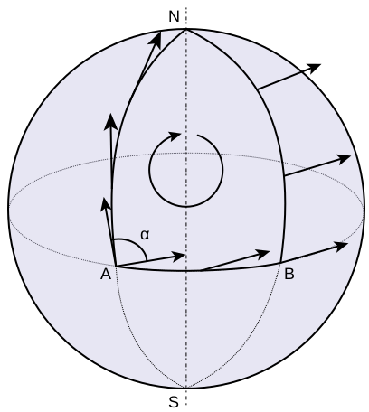
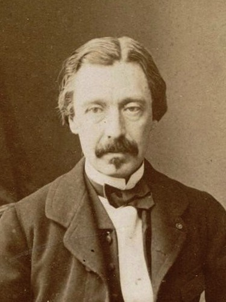
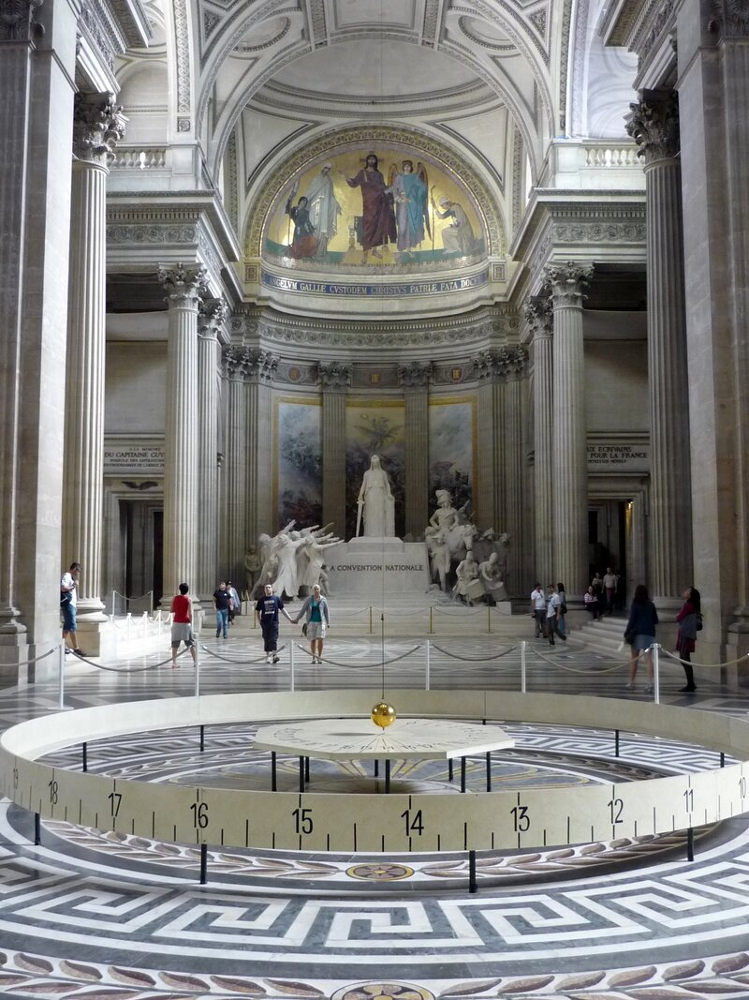

# 벡터를 옮기면 달라진다

## 출발 문제

당신이 지금 북극점에 서 있다고 상상해 보자. 손에는 남쪽을 가리키는 화살표가 들려 있다. 이제 아주 중요한 규칙 하나를 정한다: 이 화살표를 절대로, 어떤 이유로도 **회전시키지 않겠다**. 오직 "앞으로 밀기"만 허용한다. 화살표가 가리키는 방향을 내 의지로 돌리는 행위는 금지다.

이 규칙을 지키며 걸어가 보자. 먼저 경도 0° 자오선(북극과 남극을 잇는 반원)을 따라 적도까지 내려간다. 화살표는 여전히 남쪽을 가리킨다 — 여기까지는 자연스럽다. 이제 적도를 따라 동쪽으로 90° 이동한다. 적도 위에서 화살표를 회전시키지 않고 옮기면, 화살표는 계속 남쪽을 가리킨다(적도에서 "남쪽"은 적도와 수직 방향이다). 마지막으로 경도 90° 자오선을 따라 다시 북극으로 올라온다. 화살표를 한 번도 회전시키지 않았으니, 당연히 원래 방향을 가리키고 있어야 하지 않을까?

놀랍게도, 화살표는 원래 방향에서 정확히 **90° 돌아가 있다**. 처음에는 경도 0° 자오선 쪽을 가리키던 화살표가, 이제는 방금 올라온 경도 90° 자오선 쪽을 가리킨다. 한 번도 회전시키지 않았는데 돌아간 것이다. 마술이 아니라, 평평한 바닥에서는 절대 일어나지 않는 이 현상은 구면이 **휘어져 있기 때문에** 벌어진다.

이 실험에서 한 가지만 바꿔 보자. 적도를 따라 90°가 아니라 180° 이동한 뒤 북극으로 돌아오면 화살표는 180° 돌아가 있다. 적도를 360° 전부 돌면 360°, 곧 원래 방향으로 돌아온다. 적도를 따라 간 거리가 두 배가 되면 경로가 둘러싼 면적도 두 배가 되고 회전량도 두 배가 되니, 회전량이 면적에 비례한다는 느낌이 든다. 이 직감은 정확히 맞다.

## 평행이동: 돌리지 않고 옮긴다는 것

출발 문제의 화살표는 한 번도 돌리지 않았는데 돌아가 있었다. 그렇다면 "돌리지 않는다"는 말이 정확히 무슨 뜻인지부터 따져 봐야 한다.

평면 위에서는 답이 분명하다. 화살표를 들고 어떤 경로를 따라 걸어간 뒤 출발점으로 돌아오면, 화살표는 반드시 원래 방향을 가리킨다. 경로가 직선이든 구불구불하든, 크든 작든 상관없다. 이것은 평면의 가장 기본적인 성질이다 — 너무 당연해서 평소에는 의식하지 못한다. 곡면 위에서도 이 "그냥 밀기"를 정의할 수 있을까?

### 역사: 툴리오 레비-치비타 (Tullio Levi-Civita, 1873–1941)

크리스토펠 기호는 1869년부터 존재했지만, 거의 50년간 순수하게 계산 도구로만 쓰였다. 이 기호들에 기하학적 생명을 불어넣은 것은 레비-치비타의 1917년 논문 "평행이동의 개념(Nozione di parallelismo)"이다.

레비-치비타의 질문은 놀라울 정도로 단순했다: 곡면 위의 한 점에서 다른 점으로 화살표를 옮길 때, "회전시키지 않는다"는 것은 무슨 뜻인가? 평면에서는 자명하다 — 그냥 밀면 된다. 하지만 구면 위에서는? 화살표를 들고 곡면을 따라 걸어갈 때, 발밑의 곡면이 휘어져 있기 때문에 "그냥 밀기"가 정의되지 않는다.

레비-치비타의 답은 이것이었다: 곡면 위의 곡선을 따라 아주 짧은 구간마다, 곡면에 접하는 평면 위에서 벡터를 밀고, 다시 곡면 위로 수직으로 눌러 내려라(사영, projection). 이 과정의 극한이 평행이동이며, 크리스토펠 기호는 바로 이 사영 과정에서 나타나는 보정 항이었다.

### 접선공간에서 밀고 곡면으로 되돌리기

레비-치비타의 답에 이름을 붙이면 다음과 같다.

- **평행이동** (방향 택배 / Direction Shipping) — 접속(이웃한 점의 벡터를 비교하는 규칙)을 사용해 벡터를 경로를 따라 "회전 없이" 옮기는 것. 수학적으로는, 곡선 $\gamma(t)$를 따라 벡터장 $V(t)$의 공변미분(좌표 탓 가짜 변화를 뺀 미분) $\nabla_{\gamma'}V$가 0이 되도록 옮기는 것이다. 좌표로 풀어 쓰면 아래처럼 한 번 미분한 양만 든 연립 미분방정식이 되고, 출발점의 벡터만 정하면 경로 위의 벡터가 하나로 정해진다. 직관적으로는 접선공간(그 점에서 곡면에 닿는 평면) 위에서 벡터를 "그냥 밀고" 다시 곡면에 사영하는 과정의 극한이다.

$$
\frac{d\textcolor{#e8710a}{V}^k}{d\textcolor{#6a7a00}{t}} + \textcolor{#9467bd}{\Gamma}^k_{ij}\, \dot{\textcolor{#0e9aa7}{\gamma}}^i\, \textcolor{#e8710a}{V}^j = 0
$$

$$
\begin{array}{ll}
\textcolor{#e8710a}{V}^k & \text{옮겨지는 벡터의 } k \text{ 번째 성분} \\
\dot{\textcolor{#0e9aa7}{\gamma}}^i & \text{경로 } \textcolor{#0e9aa7}{\gamma} \text{ 의 속도 성분} \\
\textcolor{#9467bd}{\Gamma}^k_{ij} & \text{크리스토펠 기호 (좌표 보정값)} \\
\textcolor{#6a7a00}{t} & \text{시각 (경로 위 어디쯤인지 알려 주는 수)}
\end{array}
$$

성분이 변하는 속도 $d\textcolor{#e8710a}{V}^k/d\textcolor{#6a7a00}{t}$가 0이 아니어도 된다. 좌표 격자가 비틀리는 만큼($\textcolor{#9467bd}{\Gamma}$ 항) 성분이 바뀌어야 오히려 "진짜로는 안 돌렸다"가 된다.

### ML에서: 곡면 위 최적화에서 모멘텀 옮기기

매개변수가 평평한 공간이 아니라 휘어진 공간 위에 살아야 하는 모델이 있다. 단어나 그래프의 노드를 쌍곡 공간(hyperbolic space)의 점으로 나타내는 ML 임베딩(단어·노드의 벡터 표현)이 그런 예다. 이런 매개변수를 모멘텀이 있는 최적화 방법으로 학습하면 문제가 하나 생긴다. 지난 걸음들에서 쌓은 모멘텀 벡터는 옛 점의 접선공간에 있는데, 다음 걸음은 새 점에서 내디뎌야 한다. 옛 점의 화살표를 새 점으로 "돌리지 않고" 옮겨야 하는 것이다.

베시뇔(G. Bécigneul)과 가네아(O.-E. Ganea)가 2019년 ICLR에 발표한 논문 "Riemannian Adaptive Optimization Methods"는 Adam 같은 방법을 이런 공간으로 옮기면서, 모멘텀을 새 점으로 넘길 때 평행이동을 쓴다. 여기서 경로를 따라 옮겨지는 것은 매개변수 공간 위의 모멘텀 벡터다.

## 홀로노미: 한 바퀴 돌고 온 화살표의 어긋남

이렇게 정의한 평행이동을 구면 위에서 해 보면, 평면에서 당연했던 성질이 깨진다. 벡터를 "회전 없이" 옮긴 결과가 경로에 의존한다. 같은 출발점에서 같은 도착점으로 가더라도, 어떤 경로를 택하느냐에 따라 화살표의 최종 방향이 달라진다. 이 경로 의존성이야말로 "공간이 휘어져 있다"는 것의 수학적 본질이다.

출발 문제에서는 적도를 따라 간 거리를 두 배로 늘리면 회전량도 두 배가 되었다. 회전량이 경로가 둘러싼 넓이에 비례하는 것처럼 보였는데, 정말 그럴까?

### 되돌아옴의 어긋남과 홀로노미 정리

출발점으로 돌아온 화살표가 얼마나 어긋났는지에 이름을 붙이자.

- **홀로노미** (되돌아옴의 어긋남 / Return Discrepancy) — 닫힌 경로를 따라 평행이동한 벡터의 최종 회전량. 평평한 공간에서는 항상 0이지만, 휘어진 공간에서는 경로가 둘러싼 영역의 곡률(휘어진 정도)에 비례하여 어긋난다. 곡면이 휘어져 있다는 것의 가장 직접적인 측정이다.

구면 위에서 닫힌 삼각형 경로를 따라 평행이동한 벡터의 회전각은, 그 삼각형이 둘러싼 **면적**과 정확히 같다(단위 구면에서). 이 관계는 삼각형뿐 아니라 어떤 닫힌 경로에 대해서도 성립한다: 회전각 = 둘러싼 영역의 곡률의 적분. 이것을 홀로노미 정리라 부르며, 곡면 전체의 곡률 합을 다루는 가우스-보네 정리를 곡면 한 조각에 쓴 꼴이다.

여기서 곡률은 가우스 곡률 $K$로, 곡면의 한 점 근처가 얼마나 휘었는지를 나타내는 수다. 평면에서는 0이고, 종이를 말아 만든 원기둥이나 원뿔의 옆면도 0이며, 반지름 1인 구면에서는 어디서나 1이다.

수식으로 쓰면, 곡면 위의 닫힌 곡선 $C$가 구멍 없는 한 조각의 영역 $\Omega$를 둘러쌀 때, $C$를 따라 한 바퀴(영역을 왼쪽에 두고) 평행이동한 벡터의 회전각 $\Delta\theta$는 다음과 같다.

$$
\textcolor{#a0522d}{\Delta\theta} = \iint_{\textcolor{#964079}{\Omega}} \textcolor{#b8860b}{K} \, \textcolor{#f320e5}{dA}
$$

$$
\begin{array}{ll}
\textcolor{#a0522d}{\Delta\theta} & \text{홀로노미: 한 바퀴 평행이동한 벡터가 돌아간 각도 (좌표 } \theta \text{ 와 다른 뜻)} \\
\textcolor{#b8860b}{K} & \text{가우스 곡률} \\
\textcolor{#964079}{\Omega} & \text{닫힌 경로가 둘러싼 영역} \\
\textcolor{#f320e5}{dA} & \text{넓이 요소}
\end{array}
$$

반지름 1인 구면에서는 어디서나 $\textcolor{#b8860b}{K} = 1$이므로 회전각은 둘러싼 넓이 그 자체다. 앞의 구면 삼각형은 구면 전체 넓이 $4\pi$의 8분의 1이라 넓이가 $\pi/2$이고, 실제로 화살표는 $\pi/2 = 90°$ 돌아갔다. 각도는 한 바퀴 $2\pi$를 더하거나 빼도 같은 방향이므로, 회전각은 $2\pi$의 배수를 무시하고 비교한다.

구면 위의 닫힌 경로를 따라 화살표를 평행이동하는 실험실이다. 경로를 구면 삼각형이나 위도선으로 고르고 크기를 바꾼 뒤 재생해 보자. 한 바퀴를 다 돌면, 위젯이 직접 계산한 회전각(측정)과 둘러싼 넓이로 예측한 값 $\iint \textcolor{#b8860b}{K}\,\textcolor{#f320e5}{dA}$가 나란히 나온다. 구면은 끌어서 돌릴 수 있다.

  <noscript>이 시각화를 보려면 JavaScript가 필요합니다.</noscript>

### 문제 1 — 원기둥을 한 바퀴 감는 원

각 문제를 먼저 혼자 풀어 본 뒤, 바로 아래 세션에서 선생님과 두 학생이 어떻게 풀어 가는지 따라가 보자.

확인 원기둥 옆면에서 둘레를 한 바퀴 감는 수평 원을 따라 화살표를 평행이동한다. 제자리로 돌아왔을 때 화살표는 몇 도 돌아가 있는가?

#### 같이 풀기 세션 1

**김민준:** 360°요. 원기둥을 한 바퀴 빙 돌았으니까 화살표도 같이 한 바퀴 돌았겠죠.

**이서연:** 아니야, 0°. 원기둥은 종이를 말아서 만든 거라 $\textcolor{#b8860b}{K} = 0$이잖아. 그러면 $\iint \textcolor{#b8860b}{K}\, \textcolor{#f320e5}{dA} = 0$이야.

**선생님:** 서연 학생, 그 적분의 $\textcolor{#964079}{\Omega}$는 어디예요? 이 원이 원기둥 위에서 둘러싸는 영역이요.

**이서연 〔S06〕:** 어… 원 위쪽도 아래쪽도 고리 모양 띠라서, 원이 감싸는 원판 같은 "안쪽"이 원기둥 위에 없네요. 정리의 조건이 성립하지 않아요.

**선생님:** 맞아요. 답 0°는 맞지만, 그 이유로는 말할 수 없어요. 다른 이유를 찾아볼까요? 민준 학생, 원기둥을 한 줄 잘라서 펴면 이 원은 뭐가 돼요?

**김민준 〔M07〕:** 직사각형 위의 가로 선분이요! 평면에서 선분 따라 화살표를 밀면 방향이 그대로니까… 다시 말아 붙여도 0°네요. 제가 말한 360°는 원기둥 밖에서 본 방향이었어요. 곡면 위의 개미한테는 한 번도 안 돌린 거고요.

**김민준:** 조교님이 제 코드 보고 "좌표축을 같이 돌려놓고 값이 변했다고 하면 안 된다"고 한 거랑 같네요. 기준이 같이 돌아가면 안 된 것도 된 것처럼 보이잖아요.

**이서연:** 정리를 쓰기 전에 가정부터 확인해야지. 해석학 시간에 그린 정리를 구멍 난 영역에 그냥 썼다가 틀린 적 있는데, 똑같은 실수를 할 뻔했어.

## 위도선의 홀로노미: 푸코 진자가 도는 까닭

지금까지 본 경로는 대원(구의 중심을 지나는 평면이 구면을 자른 가장 큰 원. 적도나 자오선) 조각을 이어 붙인 삼각형이었다. 대원이 아닌 원, 이를테면 위도선을 따라 한 바퀴 돌면 화살표는 얼마나 돌아갈까? 그리고 이 어긋남을 실제 지구 위에서 눈으로 볼 수 있을까?

### 역사: 레옹 푸코 (Léon Foucault, 1819–1868)

레비-치비타보다 66년 앞선 1851년, 파리의 물리학자 레옹 푸코는 판테온의 돔에서 길이 67미터의 진자를 매달았다. 진자가 흔들리는 평면(진동면)은 천천히 회전하며 하루 만에 원래 방향에서 벗어났다. 지구가 자전하고 있다는 직접적 증거였다.

지구 자전의 증거로 유명하지만, 기하학적으로 보면 이것은 평행이동의 홀로노미다. 땅 위에서 보면 진자의 진동면이라는 "벡터"가 위도선이라는 "닫힌 경로"를 따라 하루에 한 바퀴 평행이동된다.

푸코 자신은 이것을 미분기하학의 언어로 이해하지 못했다. 하지만 그의 실험은 "닫힌 경로를 따라 벡터를 옮기면 원래로 돌아오지 않는다"는 현상의 가장 극적인 물리적 시연이었다. 60여 년 뒤 레비-치비타가 수학적 형식을 갖추었고, 또 60여 년 뒤 마이클 베리(Michael Berry)가 같은 구조를 양자역학에서 재발견한다 — "베리 위상(Berry phase)"이라는 이름으로.

### 위도선 한 바퀴의 회전각

푸코 진자의 회전을 계산하려면 먼저 위도선을 따라 도는 화살표의 홀로노미를 알아야 한다. 위도선이 둘러싼 극지방 모자의 넓이를 적분하면 된다.

### 따라 계산해 보기 — 위도선을 한 바퀴 돌면 화살표는 얼마나 돌아가나

북극에서 잰 각도(여위도)가 $\textcolor{#1b9e77}{\theta}_0$인 위도선을 동쪽으로 한 바퀴 돈다고 하자. 위도선은 대원이 아니지만, 경로를 따라 평행이동하는 것은 마찬가지로 할 수 있다. 홀로노미 정리에 따르면 회전각은 위도선이 둘러싼 극지방 모자의 넓이다. 반지름 1인 구면의 넓이 요소는 $dA = \sin\theta\, d\theta\, d\phi$이므로,

$$
\textcolor{#a0522d}{\Delta\theta} = \int_0^{2\pi}\!\!\int_0^{\textcolor{#1b9e77}{\theta}_0} \textcolor{#b8860b}{K}\, \sin\textcolor{#1b9e77}{\theta}\; d\textcolor{#1b9e77}{\theta}\, d\textcolor{#1b9e77}{\phi} = 2\pi\left(1 - \cos\textcolor{#1b9e77}{\theta}_0\right) \qquad (\textcolor{#b8860b}{K} = 1)
$$

$$
\begin{array}{ll}
\textcolor{#a0522d}{\Delta\theta} & \text{한 바퀴 돈 뒤 화살표가 돌아간 각도 (홀로노미)} \\
\textcolor{#1b9e77}{\theta}, \textcolor{#1b9e77}{\phi} & \text{구면 좌표: 북극에서 잰 각도, 경도} \\
\textcolor{#1b9e77}{\theta}_0 & \text{돌고 있는 위도선의 여위도} \\
\textcolor{#b8860b}{K} & \text{가우스 곡률, 반지름 1인 구면에서 1}
\end{array}
$$

북위 60° 위도선이면 $\textcolor{#1b9e77}{\theta}_0 = 30°$이므로 $\textcolor{#a0522d}{\Delta\theta} = 2\pi(1 - \cos 30°) \approx 0.842\ \text{rad} \approx 48.2°$다. 극에 가까운 작은 원일수록 둘러싼 넓이가 작아 회전도 작고, 적도($\textcolor{#1b9e77}{\theta}_0 = 90°$)에서는 반구 전체를 둘러싸므로 $2\pi$, 곧 원래 방향으로 돌아온다.

푸코 진자는 이 계산을 **땅의 눈금**으로 본 것이다. 위도선을 따라 걸으면 "동쪽" 방향 자체가 한 바퀴($2\pi$) 돌아가므로, 동쪽에 대해 잰 진동면의 회전은

$$
2\pi - \textcolor{#a0522d}{\Delta\theta} = 2\pi\cos\textcolor{#1b9e77}{\theta}_0 = 2\pi\sin(\text{위도})
$$

$$
\begin{array}{ll}
2\pi & \text{한 바퀴 도는 동안 경로 방향(동쪽)이 돌아간 각도} \\
\textcolor{#a0522d}{\Delta\theta} & \text{홀로노미} \\
\textcolor{#1b9e77}{\theta}_0 & \text{여위도} = 90° - \text{위도}
\end{array}
$$

가 된다. 북위 60°에서는 하루(항성일: 먼 별을 기준으로 지구가 한 바퀴 도는 시간, 약 23.93시간)에 $311.8°$, 서울(북위 37.5°)에서는 $219.2°$ 돌아가서, 진동면이 한 바퀴 도는 데 약 39.3시간이 걸린다. 홀로노미와 푸코 회전은 합이 $360°$인 한 쌍이다.

정리하면 진동면은 땅에 대해 하루에 $2\pi\sin(\text{위도})$만큼 돌아가 보이고, 이것은 한 바퀴 $2\pi$에서 위도선이 둘러싼 극지방 넓이 $2\pi(1-\sin(\text{위도}))$를 뺀 값이라 방향으로 따지면 홀로노미와 같은 어긋남이다. 북극에서는 하루에 한 바퀴, 적도에서는 전혀 돌지 않는다.

### 문제 2 — 북위 60°의 화살표와 서울의 푸코 진자

계산 (가) 북위 60° 위도선을 동쪽으로 한 바퀴 평행이동한 화살표의 회전각 $\textcolor{#a0522d}{\Delta\theta}$를 구하라. (나) 서울(북위 37.5°)의 푸코 진자는 항성일(약 23.93시간) 동안 땅에 대해 몇 도 돌아가며, 진동면이 한 바퀴 도는 데 몇 시간이 걸리는가?

#### 같이 풀기 세션 2

**이서연:** (가)는 공식에 넣으면 끝이야. $2\pi(1 - \cos 60°) = \pi$, 그러니까 $180°$.

**김민준:** 난 푸코 공식으로 했는데 $2\pi\sin 60° \approx 311.8°$가 나와. 둘 중 하나는 틀렸네.

**선생님:** 둘 다 멈춰 봅시다. 서연 학생, 북위 60°의 원은 북극에 가까워요, 적도에 가까워요?

**이서연 〔S06〕:** 북극에 가까워요. 그러면 둘러싼 극지방이 작아서 회전도 작아야 하는데, $180°$면 반구의 절반이나 둘러싼 셈이에요. 아, 공식의 $\textcolor{#1b9e77}{\theta}_0$는 북극에서 잰 각도라서 $90° - 60° = 30°$를 넣어야 했어요. $2\pi(1 - \cos 30°) \approx 48.2°$예요.

**선생님:** 좋아요. 민준 학생의 $311.8°$는 뭘 잰 걸까요?

**김민준 〔M04〕:** 그건… 땅에 대해 잰 진자 회전이요. 홀로노미는 원래 화살표랑 비교한 거고요. 그런데 $48.2 + 311.8 = 360$이네요?

**선생님:** 위도선을 한 바퀴 도는 동안 "동쪽"이라는 기준 자체가 한 바퀴 돌거든요. 같은 어긋남을 다른 자로 잰 거예요.

**김민준:** 채점 기준표랑 모범답안을 섞어서 본 거랑 같네요. 둘 다 맞는 숫자인데 뭐에 대한 숫자인지 안 적으면 조교가 0점 줘요.

**이서연:** 그럼 (나)는 땅 기준이니까 $360° \times \sin 37.5° \approx 219.2°$이고, 한 바퀴는 $23.93 / \sin 37.5° \approx 39.3$시간이야.

**김민준:** numpy로 돌려도 같아. $219.15°$, $39.32$시간.

## 곡률은 홀로노미의 밀도: 경로를 한 점으로 줄이면

홀로노미는 경로가 둘러싼 넓이를 따라 커지고 줄어든다. 그렇다면 거꾸로, 경로를 점점 작게 줄여 한 점으로 모으면 무엇이 남을까?

이 정리가 말하는 것은 심오하다: **곡률은 아주 작은 고리에서 잰 홀로노미**다. 닫힌 경로를 점점 작게 줄여 한 점으로 수축시키면, 면적당 회전량의 극한이 그 점에서의 곡률이 된다. 거꾸로, 넓은 영역의 홀로노미는 각 점의 곡률을 모두 합산한(적분한) 것이다. 국소적 정보(한 점 근처의 곡률)와 전역적 정보(넓은 영역 전체의 홀로노미)가 적분으로 연결되는, 미분기하학의 가장 아름다운 관계 중 하나다.

넓이당 회전량이 곡률이라면, 곡률이 곡면 전체에 고르게 퍼져 있을 필요는 없다. 어느 한 곳에 몰려 있어도 그 곳을 둘러싼 경로의 홀로노미는 곡률의 총량을 정확히 드러낸다. 아래 킬러 문제가 바로 그런 경우다.

고차원으로 가면 사정이 좀 더 복잡해진다. 2차원에서는 회전량이 하나의 각도로 표현되지만, $n$차원 매니폴드(곡면을 $n$차원으로 넓힌 공간)에서는 평행이동의 결과가 접선공간의 회전(직교변환: 길이와 각을 지키는 변환)이 된다. 회전각 하나가 아니라 회전 행렬 전체가 필요하다. 한 점에서 출발해 돌아오는 모든 닫힌 경로의 홀로노미를 모은 것을 홀로노미 군(어긋남의 모임 / Group of Return Discrepancies)이라 한다. 이것은 군(group) 구조를 가지며, 매니폴드의 기하학적 성질을 놀라울 정도로 많이 결정한다.

### 문제 3 — 원뿔 꼭짓점에 숨은 곡률

킬러 중심각 $270°$인 부채꼴 종이를 말아 원뿔을 만들었다. 꼭짓점을 한 바퀴 감는 원을 따라 화살표를 평행이동하면 몇 도 돌아가는가? 원뿔 옆면은 어디서나 $K = 0$인데, 홀로노미 정리와 어떻게 맞아떨어지는가?

#### 같이 풀기 세션 3

**선생님:** 이번 문제는 천천히 가 볼게요. 먼저 답부터 걸어 볼까요?

**김민준:** $0°$요. 원뿔도 종이를 말아 만든 거라 $K = 0$이고, 문제 1의 원기둥이랑 똑같잖아요.

**이서연:** 이번엔 원이 원뿔 위에서 꼭짓점 쪽 영역을 둘러싸. 그러니까 $\Omega$는 있어. 그런데 꼭짓점은 매끄럽지 않아서 $K$가 정의되지 않잖아.

**선생님:** 그럼 정리는 잠시 두고, 문제 1에서처럼 펴서 봅시다. 원뿔을 펴면 뭐가 돼요?

**김민준:** 중심각 $270°$인 부채꼴이요. 원은 부채꼴 안의 원호가 되고요.

**이서연:** 부채꼴 안에서는 평면이니까 화살표를 그냥 평행하게 밀면 돼. 한쪽 가장자리에서 출발해서 다른 쪽 가장자리까지 가면… 그 두 가장자리는 말았을 때 붙는 선이고, 한쪽을 $270°$ 돌리면 다른 쪽에 겹쳐. 그러니까 화살표는 $270°$ 돌아간 셈이야.

**선생님:** 부채꼴이 거의 원판에 가까워지면, 그러니까 중심각이 $360°$에 가까우면 원뿔은 어떻게 돼요?

**이서연 〔S06〕:** 거의 평면이요. 그러면 회전도 $0$에 가까워야 하는데, 제 식이면 $360°$에 가까워져요. 아, $360°$ 돌아간 건 제자리니까 맞긴 한데… 그러면 $270°$ 돌아간 건 반대로 $90°$ 돌아간 거랑 같아요. 의미 있는 양은 $360° - 270° = 90°$, 부채꼴에서 잘라낸 각이에요.

**김민준 〔M05〕:** 잠깐, 그럼 $K = 0$인 곳만 돌았는데 $90°$가 생겼다고? $\iint K\, dA$는 $0$이잖아.

**선생님:** 원이 둘러싼 영역 안에 딱 한 점, 꼭짓점이 있죠. 곡률이 옆면에 퍼져 있는 대신 그 한 점에 몽땅 몰려 있다고 보면 돼요. 꼭짓점이 품은 곡률의 총량이 바로 잘라낸 각 $90°$예요.

**김민준 〔M08〕:** 아, 부채꼴에서 잘라 버린 조각만큼이 꼭짓점에 곡률로 뭉쳐 있는 거네요! 옆면을 아무리 뒤져도 $K$가 $0$인 이유가 그거였어요.

**이서연:** 꼭짓점을 아주 작은 구면 조각으로 둥글게 깎으면 $K$가 그 근처에만 크게 생기고, 적분하면 $90°$가 되겠네. 매끄럽게 만들어도 총량은 그대로고.

**선생님 〔T13〕:** 그게 가우스-보네의 정신이에요. 곡률은 어디에 몰려 있든 총량을 속일 수 없어요.

**김민준:** 팀플 때 한 명이 발표 준비를 몰아서 다 한 거랑 비슷하네요. 다른 사람 기여도는 0이어도 팀 점수 총합은 그대로 나오잖아요.

## 자주 하는 실수와 요약

### 자주 하는 실수

| 실수 | 나온 문제 | 바로잡는 법 |
| --- | --- | --- |
| 곡면 밖(3차원)에서 본 방향 변화를 평행이동의 회전으로 봄 | 1 | 곡면 위의 개미 기준으로 본다. 펴서 평면이 되는 곡면이면 펴 놓고 밀어 본다 |
| 둘러싼 영역이 있는지 확인하지 않고 $\iint K\,dA$를 씀 | 1 | 정리의 가정부터 확인한다. 원기둥을 감는 원은 곡면 위에 "안쪽"이 없다 |
| 위도를 여위도 자리에 넣음 | 2 | $\theta_0$는 북극에서 잰 각도. 극에 가까운 원일수록 회전이 작아야 한다는 것으로 검산 |
| 땅(동쪽)에 대한 진자 회전과 홀로노미를 같은 양으로 봄 | 2 | 무엇에 대해 잰 각인지 적는다. 둘의 합은 $360°$ |
| 원뿔 옆면이 $K = 0$이니 회전도 $0$이라고 봄 | 3 | 둘러싼 영역 안에 꼭짓점이 있다. 곡률이 한 점에 몰려 있다 |
| 부채꼴의 중심각 $270°$를 회전량으로 봄 | 3 | 각도는 $360°$의 배수를 무시한다. 의미 있는 양은 잘라낸 각 $90°$ |

### 요약

평면에서는 화살표를 어떤 경로로 옮겨도 제자리에 오면 원래 방향이지만, 곡면에서는 "돌리지 않고 옮기기"(평행이동)의 결과가 경로에 따라 달라진다. 닫힌 경로를 돌고 온 화살표의 어긋남이 홀로노미이고, 그 크기는 경로가 둘러싼 영역의 곡률을 적분한 값이다(홀로노미 정리). 반지름 1인 구면에서는 둘러싼 넓이가 곧 회전각이며, 푸코 진자는 땅의 눈금으로 잰 같은 어긋남을 보여 준다. 경로를 한 점으로 줄이면 넓이당 회전량이 곡률이 되고, 원뿔 꼭짓점처럼 곡률이 한 점에 몰려 있어도 둘러싼 경로의 홀로노미는 그 총량을 드러낸다.

### 연결되는 세계들

| 분야 | 연결 |
|------|------|
| 양자역학 | 베리 위상 = 매개변수 공간 위의 홀로노미 |
| 로보틱스 | 비홀로노믹 제약조건: 평행주차가 가능한 이유 |
| 제어이론 | 순서를 바꾸면 결과가 달라지는 제어 입력의 효과가 경로 의존적 |
| 게이지 이론 | 윌슨 루프 = 게이지 접속의 홀로노미 |
| 기계학습 | 매개변수 공간에서의 경로 의존적 학습 |

### 막힌 곳

평행이동을 계산할 때 크리스토펠 기호를 썼고, 그 기호는 곡면 위에서 거리를 재는 방법에서 나온다. 그렇다면 "돌리지 않고 옮긴다"는 규칙은 거리 재는 법이 정해지면 저절로 하나로 정해지는 것일까, 아니면 다른 규칙을 골라도 되는 것일까? 또 이 장에서는 화살표를 정해진 경로를 따라 옮기기만 했다. 경로를 따라 걷는 발걸음의 방향 자체를 평행이동하며 걸으면 어떤 경로가 생길지는 아직 따져 보지 않았다.
