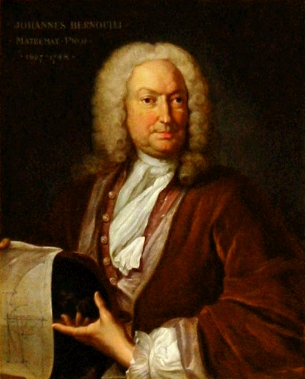
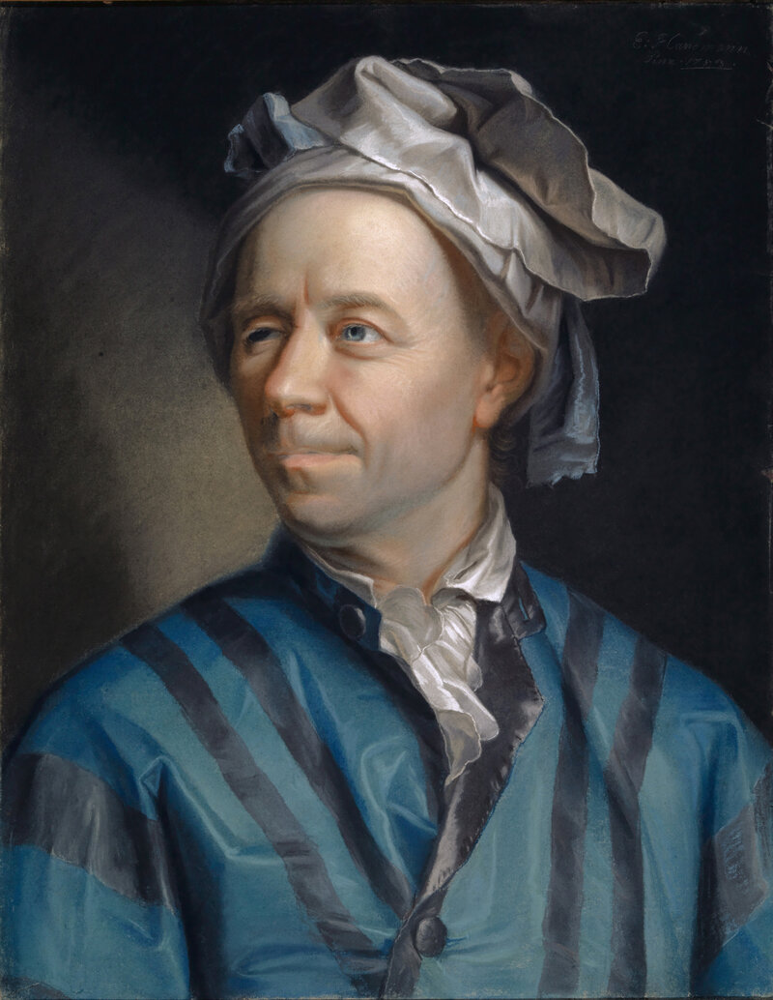

# 곡면 위의 직선은 뭔가

## 출발 문제

서울에서 뉴욕까지 비행기를 타 본 적이 있다면, 좌석 앞 모니터에 뜬 비행경로가 이상하게 북쪽으로 크게 휘어져 있는 것을 봤을 것이다. 알래스카 근처를 지나가는 이 경로는 세계지도 위에 직선으로 그은 경로보다 훨씬 "돌아가는" 것처럼 보인다. 하지만 사실 이것이 **최단경로**다.

비밀은 메르카토르 도법에 있다. 메르카토르 지도는 구면을 평면에 펼치는 과정에서 고위도 지역을 크게 늘린다. 그린란드가 아프리카만 해 보이는 것이 그 증거다. 이 왜곡된 지도 위에서의 "직선"은 실제 구면 위에서는 직선이 아니다. 진짜 최단경로는 **대원(great circle)** — 구의 중심을 지나는 평면이 구면과 만나는 원 — 의 호이며, 메르카토르 위에서는 이것이 휘어져 보인다.

이 사실은 근본적인 질문을 던진다: 곡면 위에서 "직선"이란 도대체 무엇인가? 평면에서는 너무 당연해서 정의할 필요조차 느끼지 못하는 이 개념이, 휘어진 공간에서는 전혀 자명하지 않다. 실을 팽팽하게 당기면 직선이 된다고? 구면 위에서 실을 팽팽히 당기면 대원이 된다. 그러면 대원이 "구면 위의 직선"인가?

더 생각해 보면 질문은 복잡해진다. 안장 모양의 곡면에서는? 도넛(토러스) 위에서는? 곡면의 형태가 달라질 때마다 "직선"의 의미가 바뀐다면, 이 모든 것을 아우르는 통일된 정의가 있을까? 답을 찾기 위해, 평면에서 직선이 가진 성질을 분해해 보자.

## 패턴

유클리드 평면에서 직선의 성질을 곰곰이 생각하면, 두 가지 독립적인 특성이 보인다.

첫째, 직선은 **최단경로**다. 두 점 사이를 잇는 모든 곡선 중에서 길이가 가장 짧은 것이 직선이다. 이것은 "실을 팽팽히 당기면 직선이 된다"는 직관과 맞닿아 있다. 둘째, 직선은 **가속도가 0인 곡선**이다. 직선 위를 등속으로 달리는 자동차의 핸들은 돌릴 필요가 없다 — 가속도(방향의 변화율)가 0이다. 이것은 "관성의 법칙"과 같은 말이다: 외력이 없으면 직선으로 간다.

평면에서는 이 두 성질이 동일한 곡선(직선)을 정의하므로 구별할 필요가 없다. 하지만 곡면 위로 가면 이 두 성질을 별개로 일반화해야 한다. "최단경로"를 일반화하면 **변분법의 문제**가 된다 — 경로의 길이 범함수를 극소화하는 곡선을 찾아라. "가속도 0"을 일반화하면 **미분방정식의 문제**가 된다 — 접선벡터를 자기 자신을 따라 평행이동했을 때 변하지 않는 곡선을 찾아라.

기적 같은 사실은 이것이다: 레비-치비타 접속(계량과 양립하고 비틀림이 없는 유일한 접속)을 사용하면, 이 두 조건은 **정확히 같은 곡선**을 준다. 최단경로를 찾든, 가속도 0인 경로를 찾든, 같은 결과가 나온다. 이 곡선이 바로 **측지선**이다. 구면에서는 대원이고, 원통에서는 나선이며, 평면에서는 당연히 직선이다.

비유를 하나 들어 보자. 개미가 곡면 위를 걸어간다고 하자. 개미는 자기 발밑의 곡면만 느낄 수 있고, 3차원 공간에서 곡면이 어떻게 생겼는지는 모른다. 이 개미가 "가능한 한 직진하겠다" — 왼쪽으로도 오른쪽으로도 틀지 않겠다 — 고 결심하면, 개미가 걷는 경로가 바로 측지선이다. 개미는 자신이 직진하고 있다고 느끼지만, 3차원에서 바라보면 경로가 휘어져 있을 수 있다. 이것이 "곡면 위의 직선"의 핵심이다.

## 정리

리만 매니폴드 위에서, 레비-치비타 접속에 대해 접선벡터의 공변미분이 0인 곡선은 국소적으로 거리를 최소화한다. 이 곡선을 **측지선**이라 부르며, 좌표로 표현하면 다음 방정식을 만족한다:

$$\ddot{\gamma}^k + \Gamma^k_{ij}\, \dot{\gamma}^i\, \dot{\gamma}^j = 0$$

이 **측지선 방정식**을 한 항씩 읽어 보자. $\ddot{\gamma}^k$는 곡선의 좌표 가속도, 즉 유클리드 의미에서의 가속도다. $\Gamma^k_{ij}\, \dot{\gamma}^i\, \dot{\gamma}^j$는 공간의 휘어짐이 만들어내는 "겉보기 가속도"다. 둘의 합이 0이라는 것은, 좌표 가속도가 정확히 공간의 휘어짐을 상쇄하도록 조정된다는 뜻이다. 마치 롤러코스터 위의 구슬이 레일을 따라 "관성 운동"하는 것과 같다.

이 방정식은 2계 상미분방정식이므로, 초기 위치 $\gamma(0) = p$와 초기 속도 $\dot{\gamma}(0) = v$가 주어지면 해가 유일하게 결정된다. 즉, 한 점에서 한 방향으로 "직진"하면 경로는 하나뿐이다 — 평면에서 한 점과 기울기가 직선을 유일하게 결정하는 것과 똑같다.

주의할 점이 하나 있다. 측지선은 **국소적으로** 최단이지 **전역적으로** 최단일 필요는 없다. 구면에서 두 점을 잇는 대원의 호는 두 개가 있는데(짧은 쪽과 긴 쪽), 둘 다 측지선이지만 짧은 쪽만 진짜 최단경로다. 이것은 직선도 마찬가지다: 직선의 아주 짧은 조각은 항상 최단이지만, 매니폴드의 위상에 따라 전역적으로 더 짧은 경로가 존재할 수 있다.

## 정의

- **측지선** (관성의 길 / Inertial Path) — 접선벡터를 자기 자신을 따라 평행이동해도 변하지 않는 곡선, 즉 $\nabla_{\gamma'}\gamma' = 0$을 만족하는 곡선. 직관적으로, 곡면 위에서 핸들을 돌리지 않고 직진하는 경로다. 구면에서는 대원, 원통에서는 직선과 나선, 평면에서는 직선이 된다.
- **측지선 방정식** (관성의 방정식) — $\ddot{\gamma}^k + \Gamma^k_{ij}\, \dot{\gamma}^i\, \dot{\gamma}^j = 0$. 크리스토펠 기호 $\Gamma^k_{ij}$가 공간의 휘어짐을 인코딩하며, 이 항이 0이면 유클리드 공간의 직선 방정식 $\ddot{\gamma}^k = 0$으로 환원된다.
- **지수 사상** (방향 발사기 / Direction Launcher, $\exp_p$) — 접선공간의 벡터 $v$를 받아 $p$에서 $v$ 방향으로 측지선을 단위 시간만큼 따라간 점을 돌려주는 함수. 접선공간(평면)과 매니폴드(곡면)를 연결하는 다리 역할을 한다. $v$가 작을 때 $\exp_p$는 거의 항등 사상이지만, $v$가 커지면 곡면의 곡률에 의해 결과가 평면과 달라진다. 마치 대포를 쏘는 것과 같다 — 방향과 힘(속도)을 정하면 착탄점이 결정된다.

## 핵심 인물과 일화

### 요한 베르누이 (Johann Bernoulli, 1667–1748)

1696년 6월, 요한 베르누이는 유럽의 수학자들에게 도전장을 던진다. *Acta Eruditorum* 학술지에 실린 문제: "중력 하에서 한 점에서 다른 점까지 가장 빠르게 미끄러지는 곡선은 무엇인가?" 이것이 유명한 **최속강하선(brachistochrone) 문제**다.

이 문제는 단순히 최단거리를 묻는 것이 아니었다. 직선으로 미끄러지면 처음에 가속이 느리다. 처음에 급경사를 타고 속도를 얻은 뒤 완만하게 이동하는 것이 더 빠를 수 있다. 베르누이는 답이 사이클로이드임을 알고 있었지만, 다른 수학자들이 풀 수 있는지 궁금했다.

뉴턴, 라이프니츠, 로피탈, 그리고 형 야코프 베르누이가 각자 해를 보냈다. 뉴턴은 익명으로 풀이를 보냈지만, 베르누이는 "발톱 자국으로 사자를 알아볼 수 있다(ex ungue leonem)"라며 저자를 알아챘다고 한다.

### 레온하르트 오일러 (Leonhard Euler, 1707–1783)

최속강하선 문제는 전혀 새로운 유형의 수학적 질문을 열었다: 숫자가 아닌 **함수**를 최적화하는 문제. 이 문제 유형을 체계적 이론으로 완성한 사람이 오일러다.

오일러는 1744년 *Methodus inveniendi lineas curvas*(곡선을 구하는 방법)에서 변분법의 기초를 세운다. 핵심 결과는 오늘날 **오일러-라그랑주 방정식**으로 불리는 것이다: 범함수를 극값으로 만드는 곡선은 특정 미분방정식을 만족해야 한다.

이것이 측지선과 무슨 관계인가? "곡면 위에서 두 점 사이의 최단경로를 구하라"는 문제는 정확히 변분법의 문제이다. 경로의 길이 $\int ds = \int \sqrt{g_{ij}\, \dot{\gamma}^i\, \dot{\gamma}^j}\, dt$를 극소화하는 곡선 $\gamma$를 찾아야 한다. 오일러-라그랑주 방정식을 이 범함수에 적용하면, 측지선 방정식 $\ddot{\gamma}^k + \Gamma^k_{ij}\, \dot{\gamma}^i\, \dot{\gamma}^j = 0$이 튀어나온다.

"가장 빠른 미끄럼 경로가 무엇인가?"라는 물리학적 호기심이, 결국 "휘어진 공간 위의 직선이 무엇인가?"라는 기하학의 핵심 질문에 대한 답을 낳은 셈이다. 베르누이의 도전장에서 시작된 이 여정은, 1세기 뒤 리만의 매니폴드 위에서 완성된다.

## 시각화 아이디어

  <noscript>이 시각화를 보려면 JavaScript가 필요합니다.</noscript>

- 대원 항로 시각화: 3D 지구본에서 두 도시를 클릭하면 대원을 그리고, 메르카토르 위에서 같은 경로가 어떻게 휘어져 보이는지
- 다양한 곡면 위의 측지선: 구, 안장, 토러스, 원뿔 위에서 측지선 비교
- 지수 사상 시각화: 접선평면과 곡면 위에 동시에 직선/측지선을 그려서 차이를 보여줌

## 연결되는 세계들

| 분야 | 연결 |
|------|------|
| 일반상대론 | 자유낙하 = 시공간의 측지선, 중력은 시공간의 휘어짐 |
| 최적화 | 리만 최적화: 매니폴드 위에서의 경사하강법 |
| 정보기하학 | m-측지선 vs e-측지선: 접속이 다르면 "직선"이 다르다 |
| 컴퓨터 비전 | 형상 공간에서의 측지거리 |
| 변분법 | 오일러-라그랑주 방정식의 기하학적 해석 |
