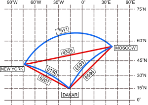
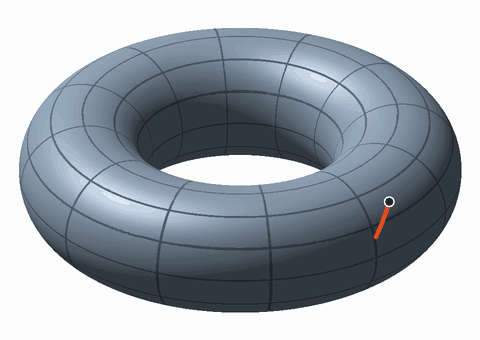
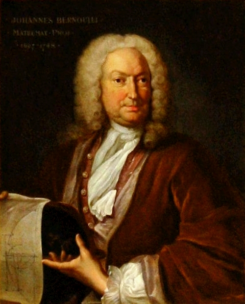
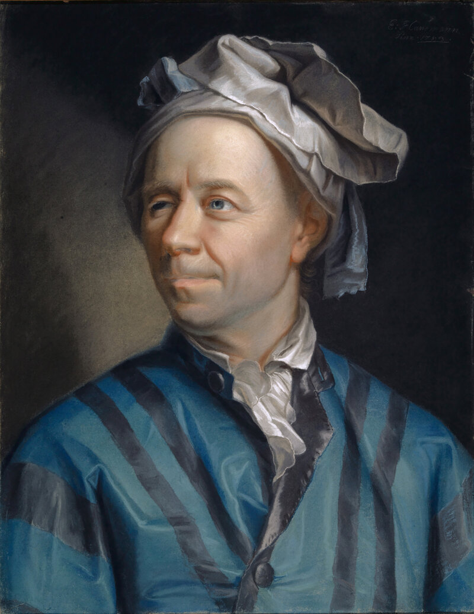

# 곡면 위의 직선은 뭔가

## 출발 문제

서울에서 뉴욕까지 비행기를 타 본 적이 있다면, 좌석 앞 모니터에 뜬 비행경로가 이상하게 북쪽으로 크게 휘어져 있는 것을 봤을 것이다. 알래스카 근처를 지나가는 이 경로는 세계지도 위에 직선으로 그은 경로보다 훨씬 "돌아가는" 것처럼 보인다. 하지만 사실 이것이 **최단경로**다.

비밀은 메르카토르 도법에 있다. 메르카토르 지도는 구면을 평면에 펼치는 과정에서 고위도 지역을 크게 늘린다. 그린란드가 아프리카만 해 보이는 것이 그 증거다. 이 왜곡된 지도 위에서의 "직선"은 실제 구면 위에서는 직선이 아니다. 진짜 최단경로는 **대원(great circle)** — 구의 중심을 지나는 평면이 구면과 만나는 원 — 의 호이며, 메르카토르 위에서는 이것이 휘어져 보인다.

이 사실은 근본적인 질문을 던진다: 곡면 위에서 "직선"이란 도대체 무엇인가? 평면에서는 너무 당연해서 정의할 필요조차 느끼지 못하는 이 개념이, 휘어진 공간에서는 전혀 자명하지 않다. 실을 팽팽하게 당기면 직선이 된다고? 구면 위에서 실을 팽팽히 당기면 대원이 된다. 그러면 대원이 "구면 위의 직선"인가?

더 생각해 보면 질문은 복잡해진다. 안장 모양의 곡면에서는? 도넛(토러스) 위에서는? 곡면의 형태가 달라질 때마다 "직선"의 의미가 바뀐다면, 이 모든 것을 아우르는 통일된 정의가 있을까? 답을 찾기 위해, 평면에서 직선이 가진 성질을 분해해 보자.

## 측지선: 핸들을 꺾지 않고 가는 길

곡면 위의 "직선"을 정의하려면, 평면의 직선이 무엇 때문에 직선인지부터 알아야 한다.

유클리드 평면에서 직선의 성질을 곰곰이 생각하면, 두 가지 독립적인 특성이 보인다.

첫째, 직선은 **최단경로**다. 두 점 사이를 잇는 모든 곡선 중에서 길이가 가장 짧은 것이 직선이다. 이것은 "실을 팽팽히 당기면 직선이 된다"는 직관과 맞닿아 있다. 둘째, 직선은 **가속도가 0인 곡선**이다. 직선 위를 등속으로 달리는 자동차의 핸들은 돌릴 필요가 없다 — 가속도(방향의 변화율)가 0이다. 이것은 "관성의 법칙"과 같은 말이다: 바깥에서 미는 힘이 없으면 직선으로 간다.

평면에서는 이 두 성질이 동일한 곡선(직선)을 정의하므로 구별할 필요가 없다. 하지만 곡면 위로 가면 두 성질을 따로 일반화해야 한다. 먼저 "가속도 0" 쪽부터 가 보자. 곡면 위에서 가속도가 0이라는 것은, 곡선의 접선벡터(진행 방향)를 곡선 자신을 따라 평행이동(곡선을 따라 돌리지 않고 옮기기)했을 때 변하지 않는다는 뜻이다. 걸어가면서 진행 방향을 "돌리지 않고" 들고 가는 것이다.

### 개미의 직진

개미가 곡면 위를 걸어간다고 하자. 개미는 자기 발밑의 곡면만 느낄 수 있고, 3차원 공간에서 곡면이 어떻게 생겼는지는 모른다. 이 개미가 왼쪽으로도 오른쪽으로도 틀지 않고 가능한 한 직진하겠다고 결심하면, 개미가 걷는 경로가 곡면 위의 직선이다. 개미는 자신이 직진하고 있다고 느끼지만, 3차원에서 바라보면 경로가 휘어져 있을 수 있다.

- **측지선** (관성의 길 / Inertial Path) — 접선벡터를 자기 자신을 따라 평행이동해도 변하지 않는 곡선, 즉 $\nabla_{\gamma'}\gamma' = 0$을 만족하는 곡선. 곡면 위에서 핸들을 돌리지 않고 직진하는 경로다. 구면에서는 대원, 평면에서는 직선이 된다.

### 문제 1 — 원기둥 위의 나선은 직선인가

각 문제를 먼저 혼자 풀어 본 뒤, 바로 아래 세션에서 선생님과 두 학생이 어떻게 풀어 가는지 따라가 보자.

확인 원기둥 옆면 위의 세 곡선 (가) 세로 모선(옆면을 위아래로 곧게 지나는 직선) (나) 수평 원 (다) 일정한 기울기로 감아 올라가는 나선 중 측지선인 것을 모두 고르라.

#### 같이 풀기 세션 1

**김민준:** (가)랑 (나)요. 나선은 3차원에서 보면 빙빙 꼬이잖아요. 그걸 직선이라고 하긴 좀 그렇죠.

**이서연:** 원기둥을 한 줄 잘라서 펴 봐. 나선은 직사각형 위의 비스듬한 직선이 돼.

**선생님:** 민준 학생, 원기둥 위를 기어가는 개미는 3차원을 볼 수 있을까요?

**김민준 〔M07〕:** 아니요, 발밑밖에 못 보죠. 펴 놓으면 직선이니까 개미는 한 번도 안 꺾은 거고… 셋 다 측지선이네요. 수평 원도 펴면 가로 선분이고요.

**선생님:** 맞아요. 3차원에서 휘어 보이는 건 곡면이 휘어서지, 곡선이 방향을 튼 게 아니에요.

**김민준:** 발표 자료에 그래프를 로그 스케일로 붙였더니 조교님이 "곡선이 휜 게 아니라 축이 휜 거"라고 하셨던 거랑 같네요.

## 측지선 방정식: 좌표로 검사하는 직진

원기둥은 펴서 평면으로 만들 수 있었기 때문에 측지선인지 아닌지를 눈으로 가릴 수 있었다. 구면처럼 펼 수 없는 곡면에서는 어떻게 할까? 개미가 직진하고 있는지를 좌표 숫자만으로 검사할 방법이 필요하다.

### 좌표로 쓴 "가속도 0"

먼저 평면에서 해 보자. 직선 $\textcolor{#1b9e77}{x} = 1$ 위를 속력 1로 걸으면(시각 $\textcolor{#6a7a00}{t}$에 위치 $(1, \textcolor{#6a7a00}{t})$) 누가 봐도 직진이다. 그런데 같은 걸음을 극좌표 $(\textcolor{#0e9aa7}{r}, \textcolor{#0e9aa7}{\theta})$로 읽으면 반지름 좌표는 $\textcolor{#0e9aa7}{r}(\textcolor{#6a7a00}{t}) = \sqrt{1 + \textcolor{#6a7a00}{t}^2}$이고, 이것을 두 번 미분하면 $\textcolor{#6a7a00}{t} = 0$에서 $\ddot{\textcolor{#0e9aa7}{r}} = 1$이다. 좌표 숫자만 보면 가속하는 것처럼 보인다.

이 겉보기 가속도는 좌표 격자 탓이다. 극좌표 격자는 각도를 따라가면 방향이 함께 돌아가므로, 크리스토펠 기호(좌표 격자가 휘는 만큼을 적은 보정값) $\textcolor{#9467bd}{\Gamma}^r_{\theta\theta} = -\textcolor{#0e9aa7}{r}$가 있다. 보정 항 $\textcolor{#9467bd}{\Gamma}^r_{\theta\theta}\dot{\textcolor{#0e9aa7}{\theta}}^2 = -\textcolor{#0e9aa7}{r}\dot{\textcolor{#0e9aa7}{\theta}}^2$를 더해 보자.

| 시각 | 좌표 가속도 | 보정 항 | 합 |
| --- | --- | --- | --- |
| 0 | 1 | −1 | 0 |
| 1 | 0.354 | −0.354 | 0 |

어느 시각에서나 합이 0이다. 곧게 걷는 걸음은 "좌표 가속도 + 격자 보정 = 0"을 만족한다. 이것을 곡면 위에서, 모든 좌표 성분에 대해 쓴 것이 접선벡터의 공변미분(좌표 탓 가짜 변화를 뺀 미분 $\nabla$)이 0이라는 조건이고, 다음 방정식이 된다.

$$
\ddot{\textcolor{#0e9aa7}{\gamma}}^k + \textcolor{#9467bd}{\Gamma}^k_{ij}\, \dot{\textcolor{#0e9aa7}{\gamma}}^i\, \dot{\textcolor{#0e9aa7}{\gamma}}^j = 0
$$

$$
\begin{array}{ll}
\textcolor{#0e9aa7}{\gamma}^k(\textcolor{#6a7a00}{t}) & \text{곡선의 } k \text{ 번째 좌표 성분} \\
\dot{\textcolor{#0e9aa7}{\gamma}}^i,\ \ddot{\textcolor{#0e9aa7}{\gamma}}^k & \text{좌표 속도, 좌표 가속도 (} \textcolor{#6a7a00}{t} \text{ 로 한 번, 두 번 미분)} \\
\textcolor{#9467bd}{\Gamma}^k_{ij} & \text{크리스토펠 기호} \\
i, j, k & \text{좌표 번호, 위아래로 같은 첨자는 모두 더한다}
\end{array}
$$

이 방정식을 한 항씩 읽어 보자. $\ddot{\textcolor{#0e9aa7}{\gamma}}^k$는 좌표를 숫자로만 보고 잰 가속도다. $\textcolor{#9467bd}{\Gamma}^k_{ij}\, \dot{\textcolor{#0e9aa7}{\gamma}}^i\, \dot{\textcolor{#0e9aa7}{\gamma}}^j$는 좌표 격자가 휘고 비틀리는 탓에 생기는 "겉보기 가속도"다. 둘의 합이 0이라는 것은, 좌표로 본 가속도가 격자의 휘어짐을 정확히 상쇄해서 곡면 위에서는 조금도 방향을 틀지 않는다는 뜻이다.

이 방정식은 두 번 미분한 양이 든 상미분방정식이므로, 초기 위치 $\textcolor{#0e9aa7}{\gamma}(0) = p$와 초기 속도 $\dot{\textcolor{#0e9aa7}{\gamma}}(0) = \textcolor{#1f77b4}{v}$가 주어지면 해가 유일하게 결정된다. 즉, 한 점에서 한 방향으로 "직진"하면 경로는 하나뿐이다 — 평면에서 한 점과 기울기가 직선을 유일하게 결정하는 것과 똑같다.

- **측지선 방정식** (관성의 방정식) — 위의 방정식. 크리스토펠 기호 $\textcolor{#9467bd}{\Gamma}^k_{ij}$가 좌표 격자의 휘어짐을 담으며, 이 항이 0인 직교좌표에서는 직선의 방정식 $\ddot{\textcolor{#0e9aa7}{\gamma}}^k = 0$으로 돌아간다.

### 따라 계산해 보기 — 적도는 측지선이고 위도선은 아니다

반지름 1인 구면을 구면 좌표 $(\textcolor{#1b9e77}{\theta}, \textcolor{#1b9e77}{\phi})$로 쓰면 계량(점마다 거리를 재는 눈금)은 $\textcolor{#d62728}{ds}^2 = d\textcolor{#1b9e77}{\theta}^2 + \sin^2\textcolor{#1b9e77}{\theta}\, d\textcolor{#1b9e77}{\phi}^2$이고, 크리스토펠 기호 공식으로 계산한 값 중 0이 아닌 것은 $\textcolor{#9467bd}{\Gamma}^\theta_{\phi\phi} = -\sin\textcolor{#1b9e77}{\theta}\cos\textcolor{#1b9e77}{\theta}$, $\textcolor{#9467bd}{\Gamma}^\phi_{\theta\phi} = \textcolor{#9467bd}{\Gamma}^\phi_{\phi\theta} = \cot\textcolor{#1b9e77}{\theta}$뿐이다. 곡선을 $(\textcolor{#0e9aa7}{\theta}(\textcolor{#6314ff}{s}), \textcolor{#0e9aa7}{\phi}(\textcolor{#6314ff}{s}))$로 쓰면 측지선 방정식 두 개는 다음과 같다.

$$
\ddot{\textcolor{#0e9aa7}{\theta}} \underbrace{-\,\sin\textcolor{#0e9aa7}{\theta}\cos\textcolor{#0e9aa7}{\theta}\; \dot{\textcolor{#0e9aa7}{\phi}}^2}_{\textcolor{#9467bd}{\Gamma}^\theta_{\phi\phi}\dot{\textcolor{#0e9aa7}{\phi}}\dot{\textcolor{#0e9aa7}{\phi}}} = 0,
\qquad
\ddot{\textcolor{#0e9aa7}{\phi}} + \underbrace{2\cot\textcolor{#0e9aa7}{\theta}\; \dot{\textcolor{#0e9aa7}{\theta}}\, \dot{\textcolor{#0e9aa7}{\phi}}}_{2\textcolor{#9467bd}{\Gamma}^\phi_{\theta\phi}\dot{\textcolor{#0e9aa7}{\theta}}\dot{\textcolor{#0e9aa7}{\phi}}} = 0
$$

$$
\begin{array}{ll}
\textcolor{#0e9aa7}{\theta}(\textcolor{#6314ff}{s}), \textcolor{#0e9aa7}{\phi}(\textcolor{#6314ff}{s}) & \text{곡선 } \textcolor{#0e9aa7}{\gamma} \text{ 의 좌표 성분: 북극에서 잰 각도, 경도} \\
\textcolor{#9467bd}{\Gamma}^\theta_{\phi\phi}, \textcolor{#9467bd}{\Gamma}^\phi_{\theta\phi} & \text{구면의 크리스토펠 기호} \\
\textcolor{#6314ff}{s} & \text{호의 길이 (속력 1로 걸을 때의 시각), 점은 } \textcolor{#6314ff}{s} \text{ 미분}
\end{array}
$$

- **적도** $\textcolor{#0e9aa7}{\theta} = \pi/2$, $\textcolor{#0e9aa7}{\phi} = \textcolor{#6314ff}{s}$: $\ddot{\textcolor{#0e9aa7}{\theta}} = 0$이고 $\cos(\pi/2) = 0$이라 첫 식이 성립한다. $\dot{\textcolor{#0e9aa7}{\theta}} = 0$, $\ddot{\textcolor{#0e9aa7}{\phi}} = 0$이라 둘째 식도 성립한다. 측지선이다.
- **자오선**(북극과 남극을 잇는 반원) $\textcolor{#0e9aa7}{\phi}$가 상수, $\textcolor{#0e9aa7}{\theta} = \textcolor{#6314ff}{s}$: $\dot{\textcolor{#0e9aa7}{\phi}} = \ddot{\textcolor{#0e9aa7}{\phi}} = 0$, $\ddot{\textcolor{#0e9aa7}{\theta}} = 0$이라 두 식이 모두 성립한다. 측지선이다. 구의 회전은 거리를 바꾸지 않으므로 적도나 자오선을 기울인 모든 대원도 측지선이다.
- **위도선** $\textcolor{#0e9aa7}{\theta} = \textcolor{#1b9e77}{\theta_0} \ne \pi/2$: 속력이 1이 되려면 $\textcolor{#0e9aa7}{\phi} = \textcolor{#6314ff}{s}/\sin\textcolor{#1b9e77}{\theta_0}$이어야 한다. 둘째 식은 성립하지만, 첫 식의 좌변은 $0 - \sin\textcolor{#1b9e77}{\theta_0}\cos\textcolor{#1b9e77}{\theta_0} \cdot (1/\sin\textcolor{#1b9e77}{\theta_0})^2 = -\cot\textcolor{#1b9e77}{\theta_0}$로 0이 아니다.

이 남는 값 $\cot\textcolor{#1b9e77}{\theta_0}$가 위도선을 따라가려면 매 순간 핸들을 꺾어야 하는 양, 곧 측지 곡률(곡면 위에서 매 순간 방향을 트는 양)이다. 북위 60°($\textcolor{#1b9e77}{\theta_0} = 30°$)에서는 $\cot 30° \approx 1.73$으로, 극에 가까울수록 작은 원을 도느라 핸들을 크게 꺾어야 한다. 적도에서는 $0$이 되어 핸들을 놓아도 된다.

왼쪽은 메르카토르 지도, 오른쪽은 끌어서 돌릴 수 있는 지구본이다. 두 도시를 고르면 대원(측지선)과 항정선(지도 위의 직선, 나침반 방위를 일정하게 유지하는 길)이 함께 그려진다. 「지점」 슬라이더로 경로 위의 한 점을 골라, 그 점에서 측지선 방정식의 두 항이 서로 상쇄되는지 확인해 보자. 대원에서는 합이 0이 되고, 항정선에서는 0이 되지 않는다.

  <noscript>이 시각화를 보려면 JavaScript가 필요합니다.</noscript>

### 문제 2 — 북위 60°를 따라 걷는 사람의 핸들

계산 지구를 반지름 6,371 km인 구로 보자. (가) 북위 60° 위도선을 따라 등속으로 걷는 것은 측지선인가? 아니라면 반지름 1인 구에서 속력 1로 걸을 때 매 순간 꺾어야 하는 양(측지 곡률)은 얼마인가? (나) 북위 60° 위의 경도 0° 지점과 경도 180° 지점 사이의 거리를, 위도선을 따라갈 때와 대원을 따라갈 때 각각 구하라.

#### 같이 풀기 세션 2

**김민준:** (가)는 측지선이요. 위도를 계속 60°로 유지하면서 동쪽으로 쭉 가잖아요. 방향을 한 번도 안 바꿨는데요.

**이서연:** 그럼 식에 넣어 보자. $\textcolor{#0e9aa7}{\theta} = 30°$로 고정, $\textcolor{#0e9aa7}{\phi} = \textcolor{#6314ff}{s}$로 두면 첫 식이 $0 - \sin 30°\cos 30° = -0.433$이야. 0이 아니니까 측지선은 아니네.

**선생님:** 서연 학생, 같은 방법으로 북위 30°($\textcolor{#0e9aa7}{\theta} = 60°$)도 해 볼래요?

**이서연 〔S06〕:** $-\sin 60°\cos 60° = -0.433$이요. 어? 똑같아요. 북극 근처의 작은 원이랑 적도 근처의 큰 원에서 꺾는 양이 같다는 건 말이 안 되는데요.

**선생님:** $\textcolor{#0e9aa7}{\phi} = \textcolor{#6314ff}{s}$로 두면 두 위도선에서 걷는 속력이 같나요?

**이서연 〔S07〕:** 아니요. 속력이 $\sin\textcolor{#0e9aa7}{\theta}$라서 북위 60°에서는 더 천천히 걸은 거예요. 속력이 1이 되게 $\textcolor{#0e9aa7}{\phi} = \textcolor{#6314ff}{s}/\sin\textcolor{#1b9e77}{\theta_0}$로 두면 $-\cot\textcolor{#1b9e77}{\theta_0}$가 나와요. 북위 60°는 $\cot 30° \approx 1.73$, 북위 30°는 $\cot 60° \approx 0.58$이에요. 이제야 작은 원일수록 많이 꺾네요.

**이서연:** 극한 계산할 때 변수의 크기를 맞추지 않고 비교하다가 해석학 조교님께 "단위부터 맞추세요" 소리 들은 거랑 같아.

**김민준 〔M04〕:** 그런데 난 핸들 안 꺾었다니까? 계속 동쪽으로 갔는데.

**선생님:** 민준 학생이 북위 60°에서 동쪽을 보고 서 있다고 해 봐요. 그 방향으로 대원을 따라 똑바로 가면 위도가 어떻게 돼요?

**김민준 〔M07〕:** …적도 쪽으로 내려가네요. 대원은 적도를 두 번 지나니까요. 60°를 계속 유지하려면 계속 왼쪽, 북극 쪽으로 틀어야 하는 거고요. "동쪽"이라는 방향 자체가 걸을 때마다 돌아가서 제가 틀고 있다는 걸 못 느낀 거예요.

**김민준:** (나)는 numpy로 했어요. 위도선은 반원이니까 $\pi \times 6371 \times \sin 30° \approx 10{,}008$ km, 대원은 북극을 넘어가면 중심각이 $30° + 30° = 60°$라 $6371 \times \pi/3 \approx 6{,}672$ km예요. 3,300 km 넘게 차이 나네요.

## 최단경로: 변분법이 찾아낸 측지선

지금까지는 평면 직선의 둘째 성질, "가속도 0"만 곡면으로 가져왔다. 첫째 성질인 "최단경로"는 어떻게 될까? 출발 문제의 비행기가 따라가는 대원은 가장 짧은 길이면서, 동시에 측지선이기도 했다. 우연일까?

"최단경로"를 일반화하면 **변분법의 문제**가 된다 — 경로의 길이 범함수(곡선 하나를 받아 숫자 하나를 내는 함수)를 극소화하는 곡선을 찾아라. "가속도 0"을 일반화한 것은 앞에서 본 **미분방정식의 문제**였다 — 접선벡터를 자기 자신을 따라 평행이동했을 때 변하지 않는 곡선을 찾아라. 숫자가 아니라 곡선 전체를 놓고 가장 짧은 것을 고르는 이 문제는, 17세기 말의 도전장 하나에서 시작되었다.

### 역사: 요한 베르누이 (Johann Bernoulli, 1667–1748)

1696년 6월, 요한 베르누이는 유럽의 수학자들에게 도전장을 던진다. *Acta Eruditorum* 학술지에 실린 문제: "중력 하에서 한 점에서 다른 점까지 가장 빠르게 미끄러지는 곡선은 무엇인가?" 이것이 유명한 **최속강하선(brachistochrone) 문제**다.

이 문제는 단순히 최단거리를 묻는 것이 아니었다. 직선으로 미끄러지면 처음에 가속이 느리다. 처음에 급경사를 타고 속도를 얻은 뒤 완만하게 이동하는 것이 더 빠를 수 있다. 베르누이는 답이 사이클로이드(굴러가는 바퀴 테두리의 한 점이 그리는 곡선)임을 알고 있었지만, 다른 수학자들이 풀 수 있는지 궁금했다.

뉴턴, 라이프니츠, 로피탈, 그리고 형 야코프 베르누이가 각자 해를 보냈다. 뉴턴은 익명으로 풀이를 보냈지만, 베르누이는 "발톱 자국으로 사자를 알아볼 수 있다(ex ungue leonem)"라며 저자를 알아챘다고 한다.

### 역사: 레온하르트 오일러 (Leonhard Euler, 1707–1783)

최속강하선 문제는 전혀 새로운 유형의 수학적 질문을 열었다: 숫자가 아닌 **함수**를 최적화하는 문제. 이 문제 유형을 체계적 이론으로 완성한 사람이 오일러다.

오일러는 1744년 *Methodus inveniendi lineas curvas*(곡선을 구하는 방법)에서 변분법의 기초를 세운다. 핵심 결과는 오늘날 **오일러-라그랑주 방정식**으로 불리는 것이다: 범함수를 극값으로 만드는 곡선은 특정 미분방정식을 만족해야 한다.

이것이 측지선과 무슨 관계인가? "곡면 위에서 두 점 사이의 최단경로를 구하라"는 문제는 정확히 변분법의 문제다. "가장 빠른 미끄럼 경로가 무엇인가?"라는 물리학적 호기심이, 결국 "휘어진 공간 위의 직선이 무엇인가?"라는 기하학의 핵심 질문에 대한 답을 낳은 셈이다. 베르누이의 도전장에서 시작된 이 여정은, 1세기 뒤 리만의 매니폴드(평면처럼 좌표를 깔 수 있는 곡면을 몇 차원으로든 넓힌 공간) 위에서 완성된다.

### 길이 대신 에너지를 줄인다

경로의 길이 $\int \sqrt{g_{ij}\, \dot{\gamma}^i\, \dot{\gamma}^j}\, dt$는 제곱근이 있어 다루기 까다롭다. 그래서 보통은 제곱근을 걷어 낸 "에너지", 곧 속력의 제곱을 시간에 대해 더한 값의 절반을 대신 줄인다. 평면에서 1초 동안 가는 세 가지 방법을 비교해 보자.

| 가는 방법 | 길이 | 에너지 |
| --- | --- | --- |
| 곧은 길, 속력 1로 고르게 | 1 | 0.5 |
| 곧은 길, 앞 0.5초는 속력 1.5, 뒤 0.5초는 속력 0.5 | 1 | 0.625 |
| 돌아가는 길, 속력 1.2로 고르게 | 1.2 | 0.72 |

길이는 얼마나 빨리 달리든 같지만(첫째·둘째 줄), 에너지는 속력이 고르지 않으면 커진다. 속력이 고르면 에너지는 (길이)²의 절반이라 짧은 길일수록 작다(첫째·셋째 줄). 그래서 에너지가 가장 작은 경로는 등속으로 달리는 가장 짧은 경로다.

$$
\textcolor{#966b40}{E}(\textcolor{#0e9aa7}{\gamma}) = \frac{1}{2}\int_{\textcolor{#6a7a00}{a}}^{\textcolor{#6a7a00}{b}} \textcolor{#d62728}{g}_{ij}\, \dot{\textcolor{#0e9aa7}{\gamma}}^i\, \dot{\textcolor{#0e9aa7}{\gamma}}^j\, d\textcolor{#6a7a00}{t}
$$

$$
\begin{array}{ll}
\textcolor{#966b40}{E} & \text{경로의 에너지 (속력 제곱의 적분)} \\
\textcolor{#d62728}{g}_{ij} & \text{계량 성분} \\
\dot{\textcolor{#0e9aa7}{\gamma}}^i & \text{경로의 좌표 속도} \\
\textcolor{#6a7a00}{a}, \textcolor{#6a7a00}{b} & \text{출발·도착 시각}
\end{array}
$$

이 범함수에 오일러-라그랑주 방정식을 적용하면 측지선 방정식이 그대로 튀어나오고, 이때 계량의 미분을 모은 계수가 바로 크리스토펠 기호다.

### 두 조건이 한 방정식으로

두 조건은 **같은 방정식**으로 모인다. 등속으로 달리는 곡선에서 "길이가 가까운 경로들 중 극값"이라는 조건과 "가속도 0"이라는 조건이 똑같은 미분방정식이 된다. 여기서 "가속도 0"은 레비-치비타 접속으로 잰다. 접속(이웃한 점의 벡터를 비교하는 규칙) 가운데, 화살표를 옮겨도 길이와 각이 바뀌지 않도록 계량에 맞춰 하나로 정한 것이다. 그 곡선이 바로 측지선이다. 구면에서는 대원이고, 원기둥에서는 모선과 수평 원, 그리고 나선이며, 평면에서는 당연히 직선이다. 그래서 측지선은 짧은 구간에서는 거리를 최소화한다.

단, 측지선이 늘 가장 짧은 길인 것은 아니다. 그 이야기는 다음 절에서 한 점에서 쏘아 보낸 측지선들을 모아 보며 한다.

## 지수 사상: 한 점에서 쏘아 보낸 측지선들

측지선 방정식은 출발점과 출발 속도만 정하면 경로를 하나로 정해 준다. 그렇다면 한 점에서 모든 방향, 모든 속력으로 측지선을 쏘아 보내면 곡면 위에 어떤 그림이 생길까?

### 방향과 힘을 정하면 떨어지는 곳이 정해진다

대포를 쏘는 것과 같다. 방향과 힘(속도)을 정하면 포탄이 떨어지는 곳이 정해진다. 반지름 1인 구의 북극에서 같은 발사 속력으로 두 발을 쏘아 보자. 한 발은 경도 0° 쪽, 한 발은 경도 90° 쪽이다. 포탄은 측지선을 따라 1초 동안 날아가 떨어진다. 접선공간(북극에서 구에 닿는 평면)에 그린 두 발사 화살표는 끝끼리 발사 속력의 $\sqrt{2}$배만큼 떨어져 있다. 이것을 곡면 위 두 착탄점 사이의 거리(대원을 따라 잰)와 비교하면 다음과 같다.

| 발사 속력 | 평면에서 두 화살표 끝의 거리 | 곡면에서 두 착탄점의 거리 |
| --- | --- | --- |
| 0.1 | 0.1414 | 0.1413 |
| 1 | 1.414 | 1.275 |
| $\pi$ | 4.443 | 0 (둘 다 남극) |

발사 속력이 작으면 평면에 그린 그림을 곡면에 거의 그대로 옮겨 붙일 수 있다. 속력이 커질수록 곡률 때문에 어긋나고, 속력이 $\pi$이면 어느 방향으로 쏘아도 모두 남극 한 곳에 떨어진다.

- **지수 사상** (방향 발사기 / Direction Launcher, $\exp_p$) — 접선공간(그 점에서 곡면에 닿는 평면)의 벡터 $v$를 받아, $p$에서 속도 $v$로 출발한 측지선을 시간 1만큼 따라간 점을 돌려주는 함수. 접선공간(평면)과 매니폴드(곡면)를 잇는 다리다.

구면에서 길이 $\pi$인 벡터가 모두 대척점(구의 중심을 지나 정반대편에 있는 점, 북극이면 남극) 한 곳으로 모인다는 것은, 한 점에서 출발한 측지선들이 반 바퀴 뒤 다시 한 점에서 만난다는 뜻이다. 이것이 측지선의 "최단 자격"과 관련이 있다.

주의할 점이 하나 있다. 측지선은 **국소적으로** 최단이지 **전역적으로** 최단일 필요는 없다. 구면에서 두 점을 잇는 대원의 호는 두 개가 있는데(짧은 쪽과 긴 쪽), 둘 다 측지선이지만 짧은 쪽만 진짜 최단경로다. 이것은 직선도 마찬가지다: 직선의 아주 짧은 조각은 항상 최단이지만, 매니폴드의 위상(topology: 전체가 어떻게 이어져 있는지. 원기둥처럼 한 바퀴 감기는 구조)에 따라 전역적으로 더 짧은 경로가 존재할 수 있다.

### ML에서: 곡면 위의 경사하강법

평면에서의 경사하강법은 $x \leftarrow x - \eta\, \nabla f(x)$로, 현재 점에서 그래디언트(가장 가파른 방향의 벡터) 반대 방향으로 한 걸음 옮긴다. 매개변수가 구면이나 길이 제약이 있는 행렬처럼 휘어진 공간 위에 있으면, 이 뺄셈은 공간 밖으로 튀어 나간다. 대신 그래디언트를 접선공간의 벡터로 구한 뒤, 지수 사상으로 그 방향의 측지선을 따라 곡면 위에서 한 걸음 간다: $x \leftarrow \exp_x(-\eta\, \mathrm{grad}\, f(x))$. 보나벨(S. Bonnabel)이 2013년 『IEEE Transactions on Automatic Control』에 발표한 논문 "Stochastic Gradient Descent on Riemannian Manifolds"는 이런 확률적 경사하강법의 수렴을 다뤘다. 여기서 움직이는 것은 모델의 매개변수이고, 실제 구현에서는 지수 사상을 계산이 싼 근사로 바꿔 쓰는 경우가 많다.

### 문제 3 — 측지선은 언제까지 가장 짧은가

킬러 (가) 서울에서 대원을 따라 25,000 km를 간 경로는 최단경로인가? (나) 서울에서 대척점(지구 반대편 정반대 점)까지 대원을 따라 가는 약 20,015 km의 경로는 최단경로인가? 최단경로는 하나뿐인가?

#### 같이 풀기 세션 3

**김민준:** 둘 다 최단이죠. 측지선은 최단경로라고 배웠잖아요.

**선생님:** 민준 학생, 지구 둘레가 몇 km예요?

**김민준:** 약 40,030 km요. 그럼 25,000 km를 갔으면… 반대 방향으로 가면 40,030 − 25,000 = 15,030 km밖에 안 되네요.

**김민준 〔M04〕:** 측지선인데 최단이 아니라고요? 핸들을 한 번도 안 꺾었는데요?

**선생님:** 측지선은 "가까운 경로들 중에서" 짧은 거예요. 조금만 흔들어 본 경로보다는 짧지만, 완전히 다른 쪽으로 도는 경로까지 이긴다는 보장은 없어요.

**이서연:** (가)는 최단이 아니고, 그럼 (나)는 대척점까지니까 짧은 쪽 호 그 자체잖아. 최단이고, 최단이면 하나뿐이야. 강볼록 함수의 최솟점은 유일하다고 배웠거든.

**선생님:** 서연 학생, 서울에서 북쪽으로 출발한 대원과 남쪽으로 출발한 대원은 각각 어디로 가요?

**이서연 〔S05〕:** 둘 다 대척점으로 가요. 동쪽으로 출발해도, 어느 방향으로 출발해도 반 바퀴 가면 전부 대척점에서 만나요. 길이도 전부 20,015 km로 같고요. 최단경로가 무한히 많아요.

**이서연 〔S07〕:** 길이 범함수는 볼록하지 않구나. 구면이 둥글어서 경로 공간이 휘어 있으니 유일성을 공짜로 얻을 수 없는 거야.

**선생님:** 맞아요. 한 점에서 나간 측지선들이 다시 한 점에 모이는 곳을 **켤레점**이라고 불러요. 측지선은 켤레점에 닿기 전까지만 가까운 경로들보다 짧아요. 구면에서는 켤레점이 바로 대척점이라서 (가)의 경로는 대척점을 지나는 순간 최단 자격을 잃었어요.

**김민준 〔M08〕:** 그러니까 측지선은 "지금 당장은 직진이 제일 빠르다"는 뜻이지, "끝까지 제일 빠르다"는 뜻은 아니네요!

**김민준:** PyTorch 과제에서 처음 그래디언트 방향으로 계속 밀고 나갔더니 loss가 줄다가 어느 순간부터 다시 늘었던 거랑 비슷해요. 처음에 제일 좋은 방향이 끝까지 제일 좋은 방향은 아니었어요.

**선생님 〔T13〕:** 원기둥에서도 생각해 볼 만해요. 한 점에서 바로 위의 점까지 가는 나선 측지선은 몇 바퀴 감느냐에 따라 무수히 많은데, 그중 최단은 감지 않는 세로 모선 하나예요.

## 자주 하는 실수와 요약

### 자주 하는 실수

| 실수 | 나온 문제 | 바로잡는 법 |
| --- | --- | --- |
| 3차원에서 꼬여 보이는 곡선(나선)은 측지선이 아니라고 봄 | 1 | 곡면 위의 개미 기준으로 본다. 원기둥은 펴 보면 나선이 직선이다 |
| 위도를 유지하며 동쪽으로 가면 직진이라고 봄 | 2 | 그 방향의 대원은 적도 쪽으로 내려간다. "동쪽"이라는 기준이 걸을 때마다 돌아간다 |
| 속력을 맞추지 않고 두 위도선의 꺾는 양을 비교함 | 2 | 속력이 1이 되게 시각을 맞춘 뒤 비교한다($\phi = s/\sin\theta_0$) |
| 측지선이면 언제나 최단경로라고 봄 | 3 | 측지선은 가까운 경로들보다만 짧다. 켤레점(구면에서는 대척점)을 지나면 최단 자격을 잃는다 |
| 최단경로는 하나뿐이라고 봄 | 3 | 길이 범함수는 볼록하지 않다. 대척점까지의 최단경로는 무한히 많다 |

### 요약

평면의 직선은 "최단경로"이면서 "가속도 0인 곡선"이다. 곡면 위에서 가속도 0, 곧 진행 방향을 자기 자신을 따라 평행이동해도 변하지 않는 곡선이 측지선이며, 좌표로 쓰면 측지선 방정식 $\ddot{\gamma}^k + \Gamma^k_{ij}\dot{\gamma}^i\dot{\gamma}^j = 0$이 된다. 대원은 이 방정식을 만족하고, 위도선은 매 순간 측지 곡률만큼 핸들을 꺾어야 한다. 에너지를 극소화하는 변분 문제도 같은 방정식을 주므로 측지선은 국소적으로 최단이지만, 한 점에서 쏘아 보낸 측지선들(지수 사상)이 다시 모이는 켤레점을 지나면 더는 최단이 아니다.

### 연결되는 세계들

| 분야 | 연결 |
|------|------|
| 일반상대론 | 자유낙하 = 시공간의 측지선, 중력은 시공간의 휘어짐 |
| 최적화 | 리만 최적화: 매니폴드 위에서의 경사하강법 |
| 정보기하학 | m-측지선 vs e-측지선: 접속이 다르면 "직선"이 다르다 |
| 컴퓨터 비전 | 형상 공간에서의 측지거리 |
| 변분법 | 오일러-라그랑주 방정식의 기하학적 해석 |

### 막힌 곳

구면에서는 한 점에서 출발한 측지선들이 반 바퀴 뒤 대척점에서 다시 모였고, 평면에서는 영원히 벌어지기만 한다. 측지선들이 모이느냐 벌어지느냐는 곡면이 어떻게 휘었는지에 달려 있는 것 같은데, 그 휘어진 정도를 한 점에서 숫자 하나로 말하는 방법은 이 장에서 아직 찾지 못했다.
