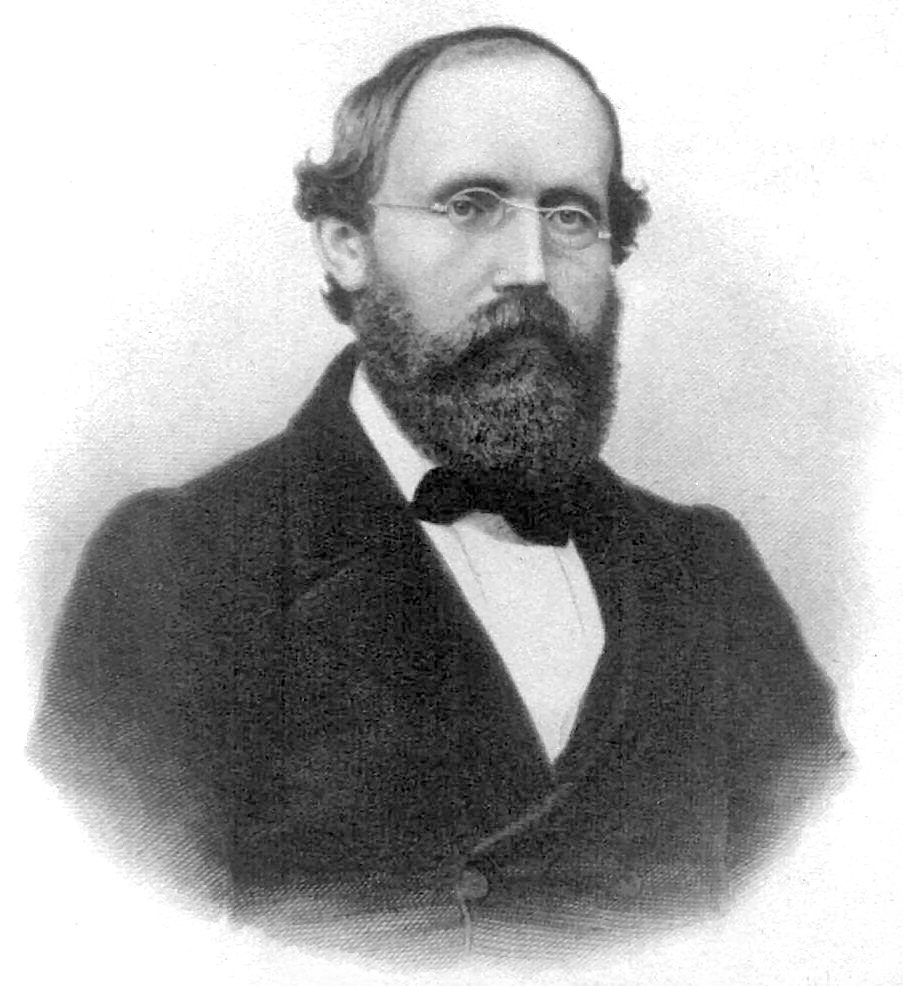

# 얼마나 휘었는지를 어떻게 숫자로 말하나

## 출발 문제

"이 공간은 휘어져 있다"라고 말은 하는데, 얼마나? 어떤 방향으로? 한 숫자로 말할 수 있는가, 아니면 더 복잡한 구조가 필요한가?

## 패턴

닫힌 경로를 따른 평행이동의 어긋남을 무한소 수준으로 줄이면, "이 점에서 이 평면 방향으로 얼마나 휘어져 있는가"를 말할 수 있다. 이것은 스칼라가 아니라 텐서이다.

## 정리

공변미분의 교환불가능성($\nabla_u\nabla_v W - \nabla_v\nabla_u W \neq 0$)을 측정하는 텐서가 존재하며, 이것이 곡률의 완전한 정보를 담고 있다.

## 정의

- **리만 곡률 텐서** (방향별 휘어짐 / Directional Curvature, $R^i{}_{jkl}$) — 두 방향으로 공변미분한 순서를 바꿨을 때의 차이
- **단면곡률** (평면 조각의 휘어짐 / Slice Curvature) — 접선공간의 2차원 평면 하나를 골라 그 방향의 곡률만 본 것
- **비앙키 항등식** (곡률의 대칭율 / Curvature Symmetry Law) — 곡률 텐서의 성분들 사이에 성립하는 항등식들

## 핵심 인물과 일화

### 베른하르트 리만 — 곡률을 텐서로 (1854)

리만의 1854년 취임강연은 매니폴드와 계량만을 다룬 것이 아니었다. 강연의 후반부에서 리만은 더 깊은 질문으로 나아간다: 이 공간이 **얼마나** 휘어져 있는가를 어떻게 측정하는가?

가우스는 2차원 곡면의 곡률을 하나의 숫자(가우스 곡률 $K$)로 표현할 수 있음을 보였다. 하지만 3차원 이상에서는 하나의 숫자로는 부족하다. 3차원 공간에서는 $xy$-평면 방향, $yz$-평면 방향, $xz$-평면 방향의 곡률이 각각 다를 수 있다. 일반적인 $n$차원에서는 가능한 2차원 방향의 수가 $\binom{n}{2}$이고, 곡률 정보는 텐서 — 4개의 첨자를 가진 양 — 로 표현되어야 한다.

리만은 이 텐서의 존재와 기본적인 대칭성을 강연에서 제시했다. 하지만 당시 텐서 표기법이 아직 없었기 때문에, 리만은 이것을 좌표 계산이 아닌 개념적 수준에서 서술했다. 오늘날 우리가 사용하는 $R^i{}_{jkl}$ 표기는 크리스토펠(1869)과 리치-쿠르바스트로(1880년대)를 거쳐 완성된 것이다.

리만 곡률 텐서의 핵심 아이디어는 이것이다: 두 방향 $u$, $v$를 골라 아주 작은 평행사변형을 그리고, 그 경로를 따라 벡터를 평행이동한다. 돌아왔을 때의 어긋남이 그 방향에서의 곡률이다. 무한소 수준의 홀로노미.

리만은 이 아이디어를 제시했을 때 27세였고, 39세에 세상을 떠났다. 그가 더 오래 살았더라면 곡률 텐서의 이론이 어디까지 발전했을지는 알 수 없다. 하지만 적어도 이것은 확실하다: 곡률을 "하나의 숫자"가 아닌 "방향에 따라 달라지는 텐서"로 파악한 그 발상의 전환이 없었다면, 아인슈타인의 일반상대성이론도 불가능했을 것이다.

## 시각화 아이디어

  <noscript>이 시각화를 보려면 JavaScript가 필요합니다.</noscript>

- 미소 평행사변형: 곡면 위에서 아주 작은 평행사변형을 따라 벡터를 평행이동
- 곡률 히트맵: 토러스 같은 곡면 위에서 곡률의 값을 색으로 표시
- 미분 순서 교환: $\nabla_x\nabla_y$ vs $\nabla_y\nabla_x$의 차이를 두 경로의 결과 비교로 시각화

## 연결되는 세계들

| 분야 | 연결 |
|------|------|
| 일반상대론 | 아인슈타인 방정식: $R_{\mu\nu} - \frac{1}{2}g_{\mu\nu}R = 8\pi T_{\mu\nu}$ |
| 위상수학 | 가우스-보네 정리: 곡률의 적분 = 위상적 불변량 |
| 기계학습 | 손실 풍경의 곡률 → 학습률 선택, 안장점 탈출 전략 |
| 비교기하학 | 단면곡률의 부호가 매니폴드의 전체 형태를 제약 |
| 재료과학 | 결정의 결함 = 곡률과 비틀림의 물리적 실현 |
