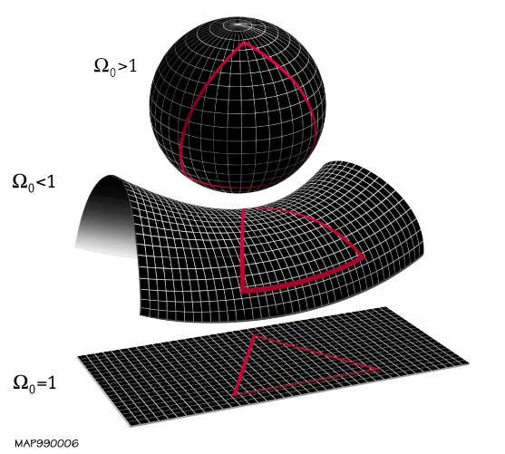
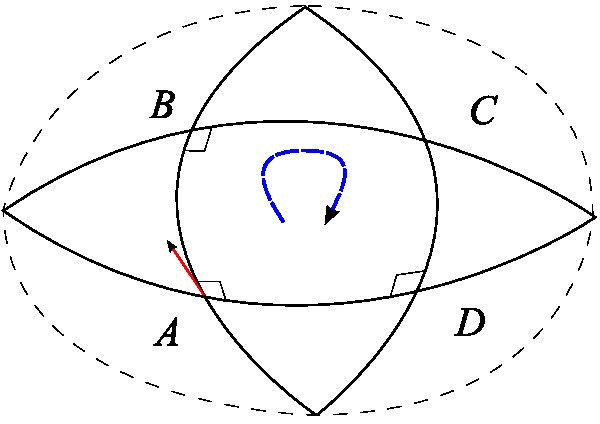

# 얼마나 휘었는지를 어떻게 숫자로 말하나

## 출발 문제

"이 공간은 휘어져 있다." 우리는 이 말을 이미 여러 번 했다. 평행이동(곡선을 따라 돌리지 않고 옮기기)의 경로 의존성으로 확인했고, 측지선(곡면 위의 곧은 길)이 직선과 다르게 행동하는 것도 보았다. 하지만 한 가지 질문이 남아 있다: **얼마나** 휘어져 있는가?

2차원 곡면에서는 비교적 단순했다. 가우스 곡률 $K$라는 하나의 숫자가 각 점의 휘어짐을 완전히 나타냈다. 구면은 $K > 0$, 안장은 $K < 0$, 평면은 $K = 0$. 하지만 3차원으로 넘어가면 이야기가 달라진다. 3차원 공간의 한 점에서 $xy$-방향, $yz$-방향, $xz$-방향의 휘어짐이 모두 다를 수 있다. 하나의 숫자로는 이 정보를 담을 수 없다.

$n$차원에서는 사정이 더 복잡해진다. 접선공간(한 점에서 공간에 닿는 평평한 공간)에서 2차원 평면을 고르는 방법이 $\binom{n}{2}$가지이고, 각 방향에서 곡률이 다를 수 있다. 4차원 시공간에서는 6개의 독립적인 2차원 방향이 있으며, 곡률 정보는 20개의 독립 성분을 가진 텐서(좌표를 바꿀 때 성분이 정해진 규칙대로만 바뀌는 양. PyTorch의 tensor(다차원 배열)와 이름만 같다)로 표현된다. 아인슈타인이 일반상대성이론을 세우기 위해 텐서 해석학을 배워야 했던 이유가 여기에 있다.

그렇다면 이 "방향별 휘어짐"을 체계적으로 담는 수학적 도구는 무엇인가? 어떤 방향에서 얼마나 휘어져 있는지를 모든 방향에 대해 한꺼번에 적어 두는 구조가 필요하다. 그 답이 **리만 곡률 텐서**다.

## 리만 곡률 텐서: 아주 작은 고리를 돌 때의 어긋남

휘어진 곡면에서 벡터를 닫힌 경로를 따라 평행이동하면, 돌아왔을 때 처음 방향과 어긋난다. 이 어긋남(홀로노미)의 크기는 경로가 둘러싼 영역의 곡률을 적분한 값이었다. 넓은 영역을 도는 경로는 여러 점의 휘어짐을 뭉뚱그려 보여 준다. 그렇다면 한 점의 휘어짐만 알고 싶을 때는 어떻게 해야 할까? 이 아이디어를 극한까지 밀어붙여 보자.

### 역사: 베른하르트 리만 (Bernhard Riemann, 1826–1866)

리만의 1854년 교수 자격 강연(Habilitationsvortrag)은 매니폴드(곡면을 몇 차원으로든 넓힌 공간)와 계량(점마다 거리를 재는 눈금)만을 다룬 것이 아니었다. 강연의 후반부에서 리만은 더 깊은 질문으로 나아간다: 이 공간이 **얼마나** 휘어져 있는가를 어떻게 측정하는가?

가우스는 2차원 곡면의 곡률을 하나의 숫자(가우스 곡률 $K$)로 표현할 수 있음을 보였다. 리만은 3차원 이상에서는 숫자 하나로 부족하다는 것을 알아차렸고, 1854년 강연에서 "방향 평면마다의 곡률"이라는 아이디어, 곧 오늘날의 단면곡률을 제시했다. 곡률 텐서에 해당하는 식을 실제로 적은 것은 1861년 파리 과학 아카데미에 낸 상금이 걸린 공모 논문(열전도 문제를 다룬 *Commentatio*)에서였다. 당시에는 텐서 표기법이 없었기 때문에, 리만의 서술은 오늘날의 좌표 계산과 모양이 사뭇 다르다. 오늘날 우리가 사용하는 $R^i{}_{jkl}$ 표기는 크리스토펠(1869)과 리치-쿠르바스트로(1880년대)를 거쳐 완성된 것이다.

리만은 강연 당시 27세였고, 39세에 세상을 떠났다. 그가 더 오래 살았더라면 곡률 텐서의 이론이 어디까지 발전했을지는 알 수 없다. 하지만 적어도 이것은 확실하다: 곡률을 "하나의 숫자"가 아닌 "방향에 따라 달라지는 텐서"로 파악한 그 발상의 전환이 없었다면, 아인슈타인의 일반상대성이론도 불가능했을 것이다.

### 아주 작은 평행사변형을 한 바퀴

반지름 1인 구 위의 한 점에서 동쪽으로 0.1, 북쪽으로 0.1씩 가는 작은 정사각형 고리를 그리자. 화살표(벡터) 하나를 돌리지 않고 이 고리를 따라 한 바퀴 옮기면, 돌아온 화살표는 처음보다 약 $\textcolor{#a0522d}{\Delta\theta} \approx 0.0100$ 라디안(0.57°) 돌아가 있다. 고리의 넓이도 약 $0.1 \times 0.1 = 0.01$이다. 회전각을 넓이로 나누면 1, 곧 이 구의 가우스 곡률 $\textcolor{#b8860b}{K} = 1$이 나온다. 고리를 작게 줄일수록 이 나눗셈은 그 한 점의 값에 가까워진다.

이제 3차원으로 가 보자. 구면의 각 점에 위아래로 곧은 직선을 하나씩 붙인 공간(구×직선)이다. 한 점에서 고를 수 있는 방향은 동쪽·북쪽·위쪽 셋이다. 동쪽-북쪽 평면에 한 변 0.1 고리를 그리면, 구면 쪽을 가리키던 화살표는 여전히 약 0.01 라디안 돈다. 그런데 동쪽-위쪽 평면에 같은 크기의 고리를 그리면 어떤 화살표도 돌지 않는다. 그 평면 방향으로 뻗은 면은 원기둥 옆면처럼 펴서 평평하게 만들 수 있기 때문이다. 같은 점인데도 고리를 어느 평면에 그리느냐에 따라 답이 다르다.

그래서 한 점의 휘어짐을 숫자 하나로는 말할 수 없다. "어느 평면에 고리를 그렸을 때, 어느 화살표가, 넓이 1당 얼마나 돌아가는가"를 방향별로 모두 적은 표가 필요하다. 이 표를 리만 곡률 텐서라 부른다. 입력은 방향 두 개(고리를 그릴 평면)와 벡터 하나(옮길 화살표), 출력은 벡터 하나(어긋남)다. 텐서는 좌표를 바꿀 때 성분이 정해진 규칙대로만 바뀌는 양이다(PyTorch의 tensor와 이름만 같다).

식으로 쓰면, 한 점에서 두 방향 $\textcolor{#1f77b4}{u}$, $\textcolor{#1f77b4}{v}$로 각각 $\textcolor{#b95b64}{\epsilon}$만큼 가서 만든 작은 평행사변형을 따라 벡터 $\textcolor{#e8710a}{W}$를 옮기고, 돌아온 변화량을 넓이 $\textcolor{#b95b64}{\epsilon}^2$으로 나눈 뒤 $\textcolor{#b95b64}{\epsilon} \to 0$으로 보낸다. 그 극한이 곡률 텐서가 $\textcolor{#1f77b4}{u}$, $\textcolor{#1f77b4}{v}$, $\textcolor{#e8710a}{W}$에 대해 내놓는 값이다.

### 공변미분의 순서를 바꾸면

같은 내용을 미분으로도 말할 수 있다. 평평한 종이 위에서는 편미분의 순서가 상관없다: $\frac{\partial^2 f}{\partial x \partial y} = \frac{\partial^2 f}{\partial y \partial x}$. 휘어진 공간의 공변미분(좌표 탓 가짜 변화를 뺀 미분. 이웃한 점의 벡터를 비교하는 규칙인 접속을 쓴다)에서는 이것이 깨질 수 있다. $\textcolor{#9467bd}{\nabla}_{\textcolor{#1f77b4}{u}}\textcolor{#9467bd}{\nabla}_{\textcolor{#1f77b4}{v}} \textcolor{#e8710a}{W}$는 "먼저 $\textcolor{#1f77b4}{v}$ 방향으로 미분하고, 그 결과를 $\textcolor{#1f77b4}{u}$ 방향으로 미분"한 것이고, $\textcolor{#9467bd}{\nabla}_{\textcolor{#1f77b4}{v}}\textcolor{#9467bd}{\nabla}_{\textcolor{#1f77b4}{u}} \textcolor{#e8710a}{W}$는 순서를 바꾼 것이다. $\textcolor{#1f77b4}{v}$ 먼저 가는 길과 $\textcolor{#1f77b4}{u}$ 먼저 가는 길은 함께 작은 평행사변형 하나를 이루므로, 두 순서의 차이가 곧 그 고리를 한 바퀴 돈 어긋남이다. 그래서 곡률 텐서를 다음과 같이 정의한다.

$$
\textcolor{#c2185b}{R}(\textcolor{#1f77b4}{u},\textcolor{#1f77b4}{v})\textcolor{#e8710a}{W} = \textcolor{#9467bd}{\nabla}_{\textcolor{#1f77b4}{u}}\textcolor{#9467bd}{\nabla}_{\textcolor{#1f77b4}{v}} \textcolor{#e8710a}{W} - \textcolor{#9467bd}{\nabla}_{\textcolor{#1f77b4}{v}}\textcolor{#9467bd}{\nabla}_{\textcolor{#1f77b4}{u}} \textcolor{#e8710a}{W} - \textcolor{#9467bd}{\nabla}_{[\textcolor{#1f77b4}{u},\textcolor{#1f77b4}{v}]}\textcolor{#e8710a}{W}
$$

$$
\begin{array}{ll}
\textcolor{#c2185b}{R}(\textcolor{#1f77b4}{u},\textcolor{#1f77b4}{v}) & \text{리만 곡률 텐서: 벡터를 받아 “한 바퀴 돌았을 때의 어긋남”을 돌려준다} \\
\textcolor{#1f77b4}{u}, \textcolor{#1f77b4}{v} & \text{미소 평행사변형을 이루는 두 방향} \\
\textcolor{#e8710a}{W} & \text{평행이동되는 벡터(장)} \\
\textcolor{#9467bd}{\nabla} & \text{접속 (공변미분)} \\
[\textcolor{#1f77b4}{u},\textcolor{#1f77b4}{v}] & \text{리 괄호. 좌표 방향끼리는 } 0
\end{array}
$$

마지막 항의 $[\textcolor{#1f77b4}{u},\textcolor{#1f77b4}{v}]$는 리 괄호(Lie bracket)로, $\textcolor{#1f77b4}{u}$ 방향과 $\textcolor{#1f77b4}{v}$ 방향으로 번갈아 조금씩 갔다가 되돌아왔을 때 제자리로 닫히지 않고 남는 틈이다. 좌표를 다이얼(값을 돌려 맞추는 손잡이)로 보면, $\textcolor{#1b9e77}{x}$ 다이얼을 0.1, $\textcolor{#1b9e77}{y}$ 다이얼을 0.1 돌린 뒤 둘을 거꾸로 되돌리면 정확히 제자리다. 그래서 좌표 방향끼리는 $[\textcolor{#1f77b4}{u},\textcolor{#1f77b4}{v}] = 0$이고 마지막 항이 사라진다. 좌표 성분으로 쓰면 곡률은 크리스토펠 기호와 그 미분만으로 계산된다.

$$
\textcolor{#c2185b}{R}^i{}_{jkl} = \partial_k \textcolor{#9467bd}{\Gamma}^i_{lj} - \partial_l \textcolor{#9467bd}{\Gamma}^i_{kj} + \textcolor{#9467bd}{\Gamma}^i_{km}\textcolor{#9467bd}{\Gamma}^m_{lj} - \textcolor{#9467bd}{\Gamma}^i_{lm}\textcolor{#9467bd}{\Gamma}^m_{kj}
$$

$$
\begin{array}{ll}
\textcolor{#c2185b}{R}^i{}_{jkl} & \textcolor{#c2185b}{R}(\partial_k, \partial_l)\,\partial_j \text{ 의 } \partial_i \text{ 성분} \\
\textcolor{#9467bd}{\Gamma}^i_{jk} & \text{크리스토펠 기호} \\
\partial_k & \text{좌표 } \textcolor{#1b9e77}{x}^k \text{ 에 대한 편미분} \\
i, j, k, l, m & \text{첨자. 같은 첨자가 위아래로 두 번 나오면 합한다}
\end{array}
$$

- **리만 곡률 텐서** (방향별 휘어짐 / Directional Curvature, $\textcolor{#c2185b}{R}^i{}_{jkl}$) — 두 방향 $\textcolor{#1f77b4}{u}$, $\textcolor{#1f77b4}{v}$로 공변미분한 순서를 바꿨을 때의 차이를 측정하는 $(1,3)$-텐서(위첨자 1개·아래첨자 3개, 곧 벡터 셋을 받아 벡터 하나를 내놓는 텐서). 직관적으로, 미소 평행사변형을 따라 벡터를 평행이동했을 때 "얼마나 어긋나는가"를 점과 방향의 함수로 기록한 것이다.

## 곡률의 대칭: 독립 성분은 몇 개인가

$R^i{}_{jkl}$에는 첨자가 네 개 있다. 첨자마다 $n$개의 값을 가질 수 있으니, 4차원 시공간이라면 곡률을 말하는 데 숫자가 $4^4 = 256$개나 필요할까? 그런데 출발 문제에서는 4차원의 곡률이 20개의 독립 성분이면 충분하다고 했다. 나머지는 어디로 갔을까?

먼저 표로 보자. 칸 수는 첨자 네 개가 가질 수 있는 값의 조합이고, 독립 성분은 그중 정말로 따로 정해야 하는 숫자다.

| 차원 $n$ | 칸 수 $n^4$ | 독립 성분 |
| --- | --- | --- |
| 2 | 16 | 1 |
| 3 | 81 | 6 |
| 4 | 256 | 20 |

칸 대부분은 다른 칸이 정해지면 저절로 정해진다. 성분들 사이에 늘 성립하는 관계가 셋 있기 때문이다. 첫째, 앞 두 첨자를 맞바꾸거나 뒤 두 첨자를 맞바꾸면 부호만 바뀐다(반대칭성, $R_{ijkl} = -R_{ijlk} = -R_{jikl}$). 둘째, 앞 두 첨자 묶음과 뒤 두 첨자 묶음을 통째로 맞바꿔도 값이 같다(쌍 대칭성, $R_{ijkl} = R_{klij}$). 셋째, 뒤 세 첨자를 돌려 가며 더하면 0이다(제1 비앙키 항등식, $R_{ijkl} + R_{iklj} + R_{iljk} = 0$). 이 관계들을 모두 반영하면 독립 성분의 수는 다음과 같다.

$$
\#\{\text{독립 성분}\} = \frac{\textcolor{#c4724f}{n}^2(\textcolor{#c4724f}{n}^2 - 1)}{12}
$$

$$
\begin{array}{ll}
\textcolor{#c4724f}{n} & \text{공간의 차원. } \textcolor{#c4724f}{n} = 2, 3, 4 \text{ 이면 } 1, 6, 20 \text{ 개}
\end{array}
$$

그래서 4차원에서 독립 성분은 $256$개가 아니라 $20$개뿐이다. 곡률 텐서의 미분 사이에도 제2 비앙키 항등식이라는 관계가 하나 더 있다. 성분 개수를 줄이지는 않지만, 물리에서는 아인슈타인 방정식이 에너지 보존과 모순 없이 맞물리게 해 준다.

- **비앙키 항등식** (곡률의 대칭률 / Curvature Symmetry Law) — 곡률 텐서의 성분들 사이에 성립하는 항등식들. 제1 비앙키는 대수적 대칭성(독립 성분 수를 줄임), 제2 비앙키는 미분에 대한 제약(물리에서 보존 법칙을 보장)이다. 이 항등식들이 없다면 곡률 텐서는 다루기 어려운 거대한 배열에 불과했을 것이다.

### 문제 1 — 곡률 텐서에는 숫자가 몇 개 들어 있나

각 문제를 먼저 혼자 풀어 본 뒤, 바로 아래 세션에서 선생님과 두 학생이 어떻게 풀어 가는지 따라가 보자.

확인 2차원, 3차원, 4차원 공간에서 리만 곡률 텐서의 독립 성분은 각각 몇 개인가? 반대칭성, 쌍 대칭성, 제1 비앙키 항등식이 각각 개수를 어떻게 줄이는지 설명하라.

#### 같이 풀기 세션 1

**김민준:** numpy로 $\textcolor{#c4724f}{n}^4$짜리 배열을 만들어 놓고 세어 봤어요. 앞 두 첨자 반대칭으로 반, 뒤 두 첨자 반대칭으로 또 반이니까 $\textcolor{#c4724f}{n}^4/4$요. 2차원 4개, 3차원 20개, 4차원 64개.

**이서연:** 나는 다르게 셌어. 곡률은 결국 방향 평면마다 숫자 하나잖아. 평면을 고르는 방법이 $\binom{\textcolor{#c4724f}{n}}{2}$가지니까 1개, 3개, 6개.

**선생님:** 둘 다 그럴듯한데 답이 꽤 다르네요. 민준 학생, 2차원 곡면의 휘어짐을 가우스는 숫자 몇 개로 말했죠?

**김민준 〔M04〕:** 가우스 곡률 $\textcolor{#b8860b}{K}$ 하나요. 그런데 저는 4개가 나왔으니까… 뭔가를 덜 줄였네요.

**선생님:** 반대칭성은 "$i$와 $j$를 바꾸면 부호가 바뀐다"는 뜻이라, $\textcolor{#c2185b}{R}_{11kl}$처럼 같은 첨자가 겹치는 성분은 0이 돼요. 그러면 앞 두 첨자 자리에 올 수 있는 것은 뭐죠?

**김민준 〔M07〕:** 서로 다른 두 첨자의 쌍, 곧 $\binom{\textcolor{#c4724f}{n}}{2}$가지요. 절반이 아니라 "대각선 빼고 절반"이었네요. 뒤 두 첨자도 마찬가지고요. 그러면 $\binom{\textcolor{#c4724f}{n}}{2} \times \binom{\textcolor{#c4724f}{n}}{2}$짜리 행렬이 되는데, 쌍 대칭성 $\textcolor{#c2185b}{R}_{ijkl} = \textcolor{#c2185b}{R}_{klij}$가 있으니까 이 행렬이 대칭이에요.

**김민준:** 공분산 행렬을 저장할 때 조교님이 "대칭이니까 위 삼각만 저장해"라고 했던 게 딱 이거네요. 저는 대칭을 절반으로만 생각하고 대각선을 빼먹었어요.

**선생님:** 서연 학생은 평면마다 숫자 하나라고 했죠. 3차원에서 서로 다른 두 평면이 섞인 성분, 예를 들어 $\textcolor{#c2185b}{R}_{1213}$은 어디에 들어가요?

**이서연 〔S06〕:** 아… $\textcolor{#c2185b}{R}_{1213}$은 평면 $(1,2)$와 평면 $(1,3)$을 짝지은 성분이네요. 평면 하나의 휘어짐만 세면 대각 성분만 센 거고, 평면 둘이 섞인 비대각 성분을 빠뜨렸어요. $N = \binom{\textcolor{#c4724f}{n}}{2}$라고 두면 대칭행렬이니까 $N(N+1)/2$개예요.

**선생님:** 마지막으로 제1 비앙키 항등식이 네 첨자가 모두 다를 때 하나씩 제약을 더해요. 그 개수는 $\binom{\textcolor{#c4724f}{n}}{4}$예요.

**이서연:** 그러면 2차원은 $N=1$이라 $1$, 3차원은 $N=3$이라 $6$, 4차원은 $N=6$이라 $21 - 1 = 20$이에요. 공식 $\textcolor{#c4724f}{n}^2(\textcolor{#c4724f}{n}^2-1)/12$와 딱 맞아요. 선형대수 시간에 대칭행렬 공간의 차원을 $N(N+1)/2$로 세던 게 그대로 쓰이네요.

## 리만 정규좌표: 한 점에서 지울 수 있는 것과 없는 것

"공간이 휘었다"고 말하려면 무언가 곧은 기준이 있어야 할 것 같다. 그런데 그 기준은 공간 바깥에 있지 않다. 기준은 **각 점에서의 평평함**이다.

### 한 점에서 계량을 평평하게 만들기

어느 점 $p$를 잡든, 좌표를 잘 고르면 그 점에서 계량을 유클리드 형태로 만들고 1차 미분까지 모두 0으로 만들 수 있다. 1차 미분이 0이면 크리스토펠 기호도 0이다. 예컨대 구면 좌표에서는 적도 위의 점에서 $\Gamma^\theta_{\phi\phi} = -\sin\theta\cos\theta$와 $\Gamma^\phi_{\theta\phi} = \cot\theta$가 모두 0이 되는데, 이런 일은 사실 어느 점에서나 좌표만 잘 고르면 일어난다.

$$
\textcolor{#d62728}{g}_{ij}(p) = \delta_{ij}, \qquad \partial_k \textcolor{#d62728}{g}_{ij}(p) = 0
$$

$$
\begin{array}{ll}
\textcolor{#d62728}{g}_{ij} & \text{계량 성분} \\
\delta_{ij} & i = j \text{ 이면 } 1, \text{ 아니면 } 0 \text{ (유클리드 계량)} \\
\partial_k & \text{좌표 } \textcolor{#1b9e77}{x}^k \text{ 에 대한 편미분}
\end{array}
$$

이런 좌표를 **리만 정규좌표**(normal coordinates. 정규분포·정규화와는 무관하다)라 하고, 물리학에서는 국소 관성계(좁은 한 곳에서만 통하는 관성 좌표계)라 부른다. 자유낙하하는 엘리베이터 안에서 중력이 사라지는 것이 바로 이 현상이다. 여기서 멈추면 "공간은 언제나 평평하다"는 결론이 나올 것 같지만, 조금만 떨어지면 어긋남이 보인다.

반지름 1인 구의 북극에서 이런 평평한 지도를 만들어 보자. 북극에서 각 방향으로 구면 위의 곧은 길(측지선)을 따라 잰 거리를 지도 위 거리로 그대로 쓴다. 이 지도가 북극에서의 리만 정규좌표다. 북극 바로 그 자리에서는 지도의 자와 구면의 자(거리를 재는 눈금, 곧 계량)가 딱 맞는다. 지도 위 반지름 0.1인 원의 둘레는 $2\pi \times 0.1 = 0.62832$인데, 구면 위 실제 둘레는 $2\pi \sin 0.1 = 0.62727$로 0.17% 짧다. 반지름 0.2에서는 0.66% 짧다. 거리를 두 배로 늘리자 어긋남이 약 네 배가 되었다. 어긋남이 거리의 제곱으로 자란다는 뜻이다. 1차 어긋남은 좌표로 지웠지만 2차 어긋남은 남았다. **2차 미분은 좌표를 어떻게 바꿔도 다 지울 수 없고, 지워지지 않고 남는 그 양이 정확히 곡률 텐서다.**

개수를 세어 보면 이 말이 숫자로 확인된다. 점 $p$를 원점에 두고 좌표 변환을 테일러 전개하면 $\textcolor{#1b9e77}{x}'^i = A^i{}_j \textcolor{#1b9e77}{x}^j + B^i{}_{jk} \textcolor{#1b9e77}{x}^j \textcolor{#1b9e77}{x}^k + C^i{}_{jkl} \textcolor{#1b9e77}{x}^j \textcolor{#1b9e77}{x}^k \textcolor{#1b9e77}{x}^l + \cdots$ 꼴이고, 각 차수의 계수가 계량의 같은 차수 미분을 지우는 데 쓰인다. $B$는 아래 두 첨자에, $C$는 아래 세 첨자에 대해 대칭이다.

| 차수 | 지우려는 것 | 개수 | 쓸 수 있는 계수 | 개수 | 남는 것 |
|---|---|---|---|---|---|
| 0차 | $\textcolor{#d62728}{g}_{ij}(p)$ | $\tfrac{\textcolor{#c4724f}{n}(\textcolor{#c4724f}{n}+1)}{2}$ | $A$ | $\textcolor{#c4724f}{n}^2$ | 0 (여분 $\tfrac{\textcolor{#c4724f}{n}(\textcolor{#c4724f}{n}-1)}{2}$개는 회전) |
| 1차 | $\partial_k \textcolor{#d62728}{g}_{ij}(p)$ | $\textcolor{#c4724f}{n} \cdot \tfrac{\textcolor{#c4724f}{n}(\textcolor{#c4724f}{n}+1)}{2}$ | $B$ | $\textcolor{#c4724f}{n} \cdot \tfrac{\textcolor{#c4724f}{n}(\textcolor{#c4724f}{n}+1)}{2}$ | 0 |
| 2차 | $\partial_k\partial_l \textcolor{#d62728}{g}_{ij}(p)$ | $\big(\tfrac{\textcolor{#c4724f}{n}(\textcolor{#c4724f}{n}+1)}{2}\big)^2$ | $C$ | $\textcolor{#c4724f}{n} \cdot \tfrac{\textcolor{#c4724f}{n}(\textcolor{#c4724f}{n}+1)(\textcolor{#c4724f}{n}+2)}{6}$ | $\tfrac{\textcolor{#c4724f}{n}^2(\textcolor{#c4724f}{n}^2-1)}{12}$ |

2차의 남는 개수를 계산하면 위에서 대칭성으로 구한 독립 성분 수와 똑같이 나온다.

$$
\left(\frac{\textcolor{#c4724f}{n}(\textcolor{#c4724f}{n}+1)}{2}\right)^2 - \textcolor{#c4724f}{n}\cdot\frac{\textcolor{#c4724f}{n}(\textcolor{#c4724f}{n}+1)(\textcolor{#c4724f}{n}+2)}{6} = \frac{\textcolor{#c4724f}{n}^2(\textcolor{#c4724f}{n}^2-1)}{12}
$$

$$
\begin{array}{ll}
\left(\frac{\textcolor{#c4724f}{n}(\textcolor{#c4724f}{n}+1)}{2}\right)^2 & \text{계량의 2차 미분 } \partial_k\partial_l \textcolor{#d62728}{g}_{ij}(p) \text{ 의 개수} \\
\textcolor{#c4724f}{n}\cdot\frac{\textcolor{#c4724f}{n}(\textcolor{#c4724f}{n}+1)(\textcolor{#c4724f}{n}+2)}{6} & \text{좌표 변환의 3차 계수 } C^i{}_{jkl} \text{ 의 개수} \\
\textcolor{#c4724f}{n} & \text{공간의 차원}
\end{array}
$$

2차원이면 $9 - 8 = 1$개가 남고 그것이 가우스 곡률 $\textcolor{#b8860b}{K}$ 하나다. 4차원 시공간이면 $100 - 80 = 20$개가 남는다. 좌표를 아무리 영리하게 골라도 지워지지 않는 이 20개의 수가 시공간의 곡률이다. 정리하면, 곡률의 기준은 바깥 공간이 아니라 **한 점에서의 평평함을 그 이웃까지 넓히려 할 때 생기는 실패의 양**이다.

### 문제 2 — 원기둥의 곡률은 좌표를 바꾸면 달라질까

계산 반지름 $\textcolor{#0561ff}{a}$인 원기둥 옆면의 계량 $\textcolor{#d62728}{ds}^2 = \textcolor{#0561ff}{a}^2 d\textcolor{#1b9e77}{\phi}^2 + d\textcolor{#1b9e77}{z}^2$에서 리만 곡률 텐서를 구하라. 좌표를 비스듬하게 바꾸면($\textcolor{#1b9e77}{\xi} = \textcolor{#1b9e77}{\phi} + \textcolor{#1b9e77}{z}$, $\textcolor{#1b9e77}{\zeta} = \textcolor{#1b9e77}{z}$처럼) 곡률 텐서가 0이 아니게 될 수 있는가? 크리스토펠 기호는 어떤가?

#### 같이 풀기 세션 2

**이서연:** 계량 성분이 전부 상수라서 크리스토펠 기호가 다 0이고, 성분 공식의 네 항도 0이야. 그러니까 $\textcolor{#c2185b}{R} = 0$.

**김민준:** 그건 좌표를 원기둥에 딱 맞게 골라서 그런 거 아냐? 비스듬한 좌표로 바꾸면 계량에 교차항이 생기니까 곡률도 0이 아닐 수 있잖아.

**선생님:** 민준 학생, $\textcolor{#1b9e77}{\xi} = \textcolor{#1b9e77}{\phi} + \textcolor{#1b9e77}{z}$로 바꾸면 계량 성분은 어떻게 돼요?

**김민준:** $d\textcolor{#1b9e77}{\phi} = d\textcolor{#1b9e77}{\xi} - d\textcolor{#1b9e77}{\zeta}$니까 $\textcolor{#d62728}{ds}^2 = \textcolor{#0561ff}{a}^2(d\textcolor{#1b9e77}{\xi} - d\textcolor{#1b9e77}{\zeta})^2 + d\textcolor{#1b9e77}{\zeta}^2$이요. 교차항 $-2\textcolor{#0561ff}{a}^2\,d\textcolor{#1b9e77}{\xi}\,d\textcolor{#1b9e77}{\zeta}$가 생겼어요.

**선생님:** 성분은 여전히 상수죠?

**김민준 〔M07〕:** 아, 상수네요. 그러면 이 좌표에서도 $\textcolor{#9467bd}{\Gamma} = 0$이고 $\textcolor{#c2185b}{R} = 0$이에요. 그래도 좌표를 더 구불구불하게 바꾸면요?

**이서연:** 그때는 $\textcolor{#9467bd}{\Gamma}$는 0이 아니게 될 수 있어. 평면의 극좌표처럼. 그런데 $\textcolor{#c2185b}{R}$은 텐서라서 새 좌표의 성분이 옛 성분에 야코비안을 곱해 더한 선형 조합이야. 옛 성분이 전부 0이면 새 성분도 전부 0일 수밖에 없어.

**선생님:** 그게 핵심이에요. $\textcolor{#9467bd}{\Gamma}$는 좌표가 만든 가짜 변화라 좌표를 바꾸면 생겼다 없어졌다 하지만, $\textcolor{#c2185b}{R}$은 한 좌표계에서 0이면 모든 좌표계에서 0이에요. 그래서 "휘었다/안 휘었다"를 판정하는 데 $\textcolor{#c2185b}{R}$을 쓰는 거예요.

**김민준:** 성적 환산이랑 같네요. 100점 만점을 10점 만점으로 바꾸든 20점 만점으로 바꾸든, 0점은 어떻게 환산해도 0점이에요.

**이서연:** 기본 점수를 얹어 주는 환산이면 0점도 바뀌어. 텐서 변환은 성분에 야코비안을 곱해서 모아 더할 뿐, 성분과 상관없는 항을 따로 얹지 않으니까 0은 0으로 가는 거고. $\textcolor{#9467bd}{\Gamma}$의 변환식에는 성분과 상관없는 2차 미분 항이 따로 붙어서, 0이던 것이 0이 아니게 될 수 있는 거야.

**김민준 〔M12〕:** 기본 점수 얹어 주는 교수님이 계셨으면 좋겠다. 아무튼 $\textcolor{#c2185b}{R}$은 기본 점수가 없는 환산이라는 거지?

## 단면곡률: 방향 평면 하나의 휘어짐

곡률 텐서는 모든 방향의 휘어짐을 빠짐없이 담지만, 4차원이면 숫자가 20개다. 한 방향 평면의 휘어짐만 궁금할 때, 그것을 숫자 하나로 뽑아낼 수는 없을까?

곡률 텐서를 공간의 "성격표"라고 생각해 보자. 각 점에서 모든 방향 평면의 휘어짐을 빠짐없이 적은 종합 보고서다. 궁금한 평면이 하나뿐이면 보고서에서 그 줄만 읽으면 된다.

반지름 1인 구면의 각 점에 위아래로 곧은 직선을 붙인 3차원 공간(구×직선)에서 몇 줄을 읽어 보자. 한 점에서 방향은 동쪽·북쪽·위쪽 셋이다.

| 방향 평면 | 그 평면에 그린 작은 고리의 넓이 1당 회전 |
| --- | --- |
| 동쪽-북쪽 (구면 방향 둘) | 1 |
| 동쪽-위쪽 | 0 |
| 북쪽-위쪽 | 0 |
| 동쪽과, 북쪽·위쪽의 한가운데(45°) 방향 | $\cos^2 45° = 0.5$ |

마지막 줄의 평면은 구면 쪽으로 반쯤 기울어 있어서 휘어짐도 중간값이 나온다. 이렇게 평면 하나를 골라 읽은 숫자를 단면곡률이라 부른다. 접선공간(한 점에서 공간에 닿는 평평한 공간)에서 두 방향 $\textcolor{#1f77b4}{u}$, $\textcolor{#1f77b4}{v}$가 펼치는 평면 $\sigma$에 대해, 곡률 텐서에서 이 숫자를 꺼내는 식은 다음과 같다.

$$
\textcolor{#b8860b}{K}(\sigma) = \frac{\textcolor{#d62728}{g}\big(\textcolor{#c2185b}{R}(\textcolor{#1f77b4}{u},\textcolor{#1f77b4}{v})\textcolor{#1f77b4}{v},\ \textcolor{#1f77b4}{u}\big)}{\textcolor{#d62728}{g}(\textcolor{#1f77b4}{u},\textcolor{#1f77b4}{u})\,\textcolor{#d62728}{g}(\textcolor{#1f77b4}{v},\textcolor{#1f77b4}{v}) - \textcolor{#d62728}{g}(\textcolor{#1f77b4}{u},\textcolor{#1f77b4}{v})^2}
$$

$$
\begin{array}{ll}
\textcolor{#b8860b}{K}(\sigma) & \text{단면곡률: 평면 } \sigma \text{ 방향의 휘어짐. 2차원이면 가우스 곡률} \\
\textcolor{#1f77b4}{u}, \textcolor{#1f77b4}{v} & \text{평면 } \sigma \text{ 를 펼치는 두 방향} \\
\textcolor{#d62728}{g} & \text{계량 (내적)} \\
\textcolor{#c2185b}{R} & \text{리만 곡률 텐서}
\end{array}
$$

분모는 $\textcolor{#1f77b4}{u}$, $\textcolor{#1f77b4}{v}$가 만드는 평행사변형 넓이의 제곱이다. 곧 단면곡률은 "미소 평행사변형을 한 바퀴 돌 때의 어긋남을 넓이로 나눈 값"이고, 그래서 $\textcolor{#1f77b4}{u}$, $\textcolor{#1f77b4}{v}$를 얼마나 길게 잡든 평면만 같으면 같은 값이 나온다.

- **단면곡률** (평면 조각의 휘어짐 / Slice Curvature) — 접선공간에서 2차원 평면 $\sigma$를 하나 골라, 그 방향의 곡률만 추출한 스칼라값 $\textcolor{#b8860b}{K}(\sigma) = \frac{\textcolor{#c2185b}{R}(\textcolor{#1f77b4}{u},\textcolor{#1f77b4}{v},\textcolor{#1f77b4}{v},\textcolor{#1f77b4}{u})}{|\textcolor{#1f77b4}{u}|^2|\textcolor{#1f77b4}{v}|^2 - \langle \textcolor{#1f77b4}{u},\textcolor{#1f77b4}{v}\rangle^2}$. 2차원 곡면의 가우스 곡률을 고차원으로 일반화한 것이며, 리만 곡률 텐서의 정보를 "방향별 단면"으로 읽는 방법이다.

2차원 곡면에서는 고를 수 있는 방향 평면이 하나뿐이라 성격표가 한 줄로 끝나는데, 그 한 줄이 바로 가우스 곡률이다.

### 따라 계산해 보기 1 — 구면의 곡률 텐서

반지름 $\textcolor{#0561ff}{r}$인 구면을 구면좌표 $(\textcolor{#1b9e77}{\theta}, \textcolor{#1b9e77}{\phi})$로 쓰면 계량과 0이 아닌 크리스토펠 기호는 다음과 같다.

$$
\textcolor{#d62728}{g} = \begin{pmatrix} \textcolor{#0561ff}{r}^2 & 0 \\ 0 & \textcolor{#0561ff}{r}^2\sin^2\textcolor{#1b9e77}{\theta} \end{pmatrix}, \qquad
\textcolor{#9467bd}{\Gamma}^\theta_{\phi\phi} = -\sin\textcolor{#1b9e77}{\theta}\cos\textcolor{#1b9e77}{\theta}, \qquad
\textcolor{#9467bd}{\Gamma}^\phi_{\theta\phi} = \textcolor{#9467bd}{\Gamma}^\phi_{\phi\theta} = \frac{\cos\textcolor{#1b9e77}{\theta}}{\sin\textcolor{#1b9e77}{\theta}}
$$

$$
\begin{array}{ll}
\textcolor{#1b9e77}{\theta}, \textcolor{#1b9e77}{\phi} & \text{구면좌표 (여위도: 북극에서 잰 각도, 경도)} \\
\textcolor{#d62728}{g} & \text{구면의 계량} \\
\textcolor{#9467bd}{\Gamma} & \text{크리스토펠 기호 (나머지는 모두 0)} \\
\textcolor{#0561ff}{r} & \text{구의 반지름}
\end{array}
$$

2차원에서는 독립 성분이 하나뿐이므로 $\textcolor{#c2185b}{R}^\theta{}_{\phi\theta\phi}$ 하나만 구하면 된다. 성분 공식에 $i=\theta,\ j=\phi,\ k=\theta,\ l=\phi$를 넣으면 네 항은 차례로 $\partial_\theta\textcolor{#9467bd}{\Gamma}^\theta_{\phi\phi} = -\cos 2\textcolor{#1b9e77}{\theta}$, $\partial_\phi\textcolor{#9467bd}{\Gamma}^\theta_{\theta\phi} = 0$, $\textcolor{#9467bd}{\Gamma}^\theta_{\theta m}\textcolor{#9467bd}{\Gamma}^m_{\phi\phi} = 0$, $\textcolor{#9467bd}{\Gamma}^\theta_{\phi m}\textcolor{#9467bd}{\Gamma}^m_{\theta\phi} = \textcolor{#9467bd}{\Gamma}^\theta_{\phi\phi}\textcolor{#9467bd}{\Gamma}^\phi_{\theta\phi} = -\cos^2\textcolor{#1b9e77}{\theta}$이다.

$$
\textcolor{#c2185b}{R}^\theta{}_{\phi\theta\phi} = -\cos 2\textcolor{#1b9e77}{\theta} - 0 + 0 - (-\cos^2\textcolor{#1b9e77}{\theta}) = \sin^2\textcolor{#1b9e77}{\theta}, \qquad
\textcolor{#b8860b}{K} = \frac{\textcolor{#d62728}{g}_{\theta\theta}\,\textcolor{#c2185b}{R}^\theta{}_{\phi\theta\phi}}{\textcolor{#d62728}{g}_{\theta\theta}\,\textcolor{#d62728}{g}_{\phi\phi}} = \frac{\textcolor{#0561ff}{r}^2 \sin^2\textcolor{#1b9e77}{\theta}}{\textcolor{#0561ff}{r}^4\sin^2\textcolor{#1b9e77}{\theta}} = \frac{1}{\textcolor{#0561ff}{r}^2}
$$

$$
\begin{array}{ll}
\textcolor{#c2185b}{R}^\theta{}_{\phi\theta\phi} & \text{구면 곡률 텐서의 유일한 독립 성분} \\
\textcolor{#b8860b}{K} & \text{단면곡률 = 가우스 곡률}
\end{array}
$$

곡률 텐서의 성분 $\sin^2\textcolor{#1b9e77}{\theta}$는 위치마다 다르지만, 넓이로 나눈 단면곡률은 어디서나 $1/\textcolor{#0561ff}{r}^2$이다. 성분의 값은 좌표계가 정하고, 휘어짐의 크기는 공간이 정한다. 반지름을 두 배로 키우면 곡률은 네 배 작아지니, 지구처럼 큰 구 위에서는 곡률을 느끼기 어렵다.

### 따라 계산해 보기 2 — 원기둥은 왜 곡률이 0인가

반지름 $\textcolor{#0561ff}{a}$인 원기둥 옆면을 둘레각 $\textcolor{#1b9e77}{\phi}$와 높이 $\textcolor{#1b9e77}{z}$로 쓰면 계량은 $\textcolor{#d62728}{ds}^2 = \textcolor{#0561ff}{a}^2 d\textcolor{#1b9e77}{\phi}^2 + d\textcolor{#1b9e77}{z}^2$이다. 모든 성분이 상수이므로 크리스토펠 기호가 전부 0이고, 성분 공식의 네 항도 모두 0이 된다. 곧 $\textcolor{#c2185b}{R} = 0$이다.

밖에서 보는 방법으로도 확인할 수 있다. 원기둥 위 한 점에서 가장 많이 휘는 방향은 둘레 방향(곡률 $1/\textcolor{#0561ff}{a}$)이고, 가장 적게 휘는 방향은 높이 방향(곡률 $0$)이다. 이 두 **주곡률**의 곱이 가우스 곡률이다.

$$
\textcolor{#b8860b}{K} = \textcolor{#b8860b}{\kappa_1}\,\textcolor{#b8860b}{\kappa_2} = \frac{1}{\textcolor{#0561ff}{a}} \times 0 = 0, \qquad \text{(구면이면 } \tfrac{1}{\textcolor{#0561ff}{r}}\times\tfrac{1}{\textcolor{#0561ff}{r}} = \tfrac{1}{\textcolor{#0561ff}{r}^2}\text{)}
$$

$$
\begin{array}{ll}
\textcolor{#b8860b}{\kappa_1}, \textcolor{#b8860b}{\kappa_2} & \text{주곡률: 가장 많이·적게 휘는 방향의 곡률} \\
\textcolor{#b8860b}{K} & \text{가우스 곡률} \\
\textcolor{#0561ff}{a} & \text{원기둥의 반지름}
\end{array}
$$

안에서 잰 곡률 텐서와 밖에서 본 주곡률의 곱이 같은 답을 준다. 구면에서도 원기둥에서도 두 계산이 맞아떨어졌다.

### ML에서: 손실 풍경의 "곡률"과 공간의 곡률

ML에서 "손실 함수의 곡률"이라고 하면 보통 헤세 행렬(2차 미분 행렬)을 말한다. 매개변수가 두 개인 손실 $f(x, y)$의 그래프 $z = f(x, y)$를 3차원의 곡면으로 보면, 그래디언트(가장 가파른 방향의 벡터)가 0인 점에서 헤세 행렬의 두 고윳값이 바로 그 곡면의 주곡률이고, 두 고윳값의 곱(행렬식)이 가우스 곡률이다. 그릇 모양 $f = (x^2 + y^2)/2$는 원점에서 $\textcolor{#b8860b}{K} = 1$, 안장 모양 $f = (x^2 - y^2)/2$는 원점에서 $\textcolor{#b8860b}{K} = -1$이다. 안장점이 음의 곡률로 나타나는 것이다.

하지만 이것은 그래프라는 곡면이 3차원 안에서 휜 정도이고, 매개변수들이 사는 공간 자체의 곡률과는 다르다. 매개변수 공간을 보통의 거리로 재는 한 그 공간은 평면이라 곡률 텐서가 $\textcolor{#c2185b}{R} = 0$이다. 여기서 움직이는 것은 손실 그래프 위의 매개변수 점이고, 이 장의 곡률 텐서가 0이 아니게 되려면 매개변수 공간의 거리 재는 법 자체가 장소마다 달라야 한다.

구면 위의 작은 사각형 고리를 따라 벡터 $\textcolor{#e8710a}{W}$를 평행이동한다. 한 바퀴 돌아온 벡터는 처음 벡터에서 조금 돌아가 있고, 그 회전각을 고리의 넓이로 나누면 곡률 $\textcolor{#b8860b}{K} = 1/\textcolor{#0561ff}{r}^2$가 나온다. 고리 크기와 구의 반지름을 바꿔 보고, 도는 순서(u 먼저 / v 먼저)를 바꾸면 회전 방향이 어떻게 되는지 확인해 보자. 구면은 끌어서 돌릴 수 있다.

  <noscript>이 시각화를 보려면 JavaScript가 필요합니다.</noscript>

### 문제 3 — 작은 고리를 돌면 벡터는 얼마나 돌아가나

킬러 반지름 1인 구의 북극을 중심으로 여위도 $\textcolor{#1b9e77}{\theta}_0$인 작은 원을 따라 벡터를 한 바퀴 평행이동한다. (1) $\textcolor{#1b9e77}{\theta}_0 = 0.1$과 $0.2$일 때 회전각을 구하고, 회전각이 원의 둘레와 넓이 중 어느 쪽에 비례하는지 판단하라. (2) 같은 원을 반대 방향으로 돌면 회전각은 어떻게 되는가? (3) 이 결과를 $\textcolor{#c2185b}{R}(\textcolor{#1f77b4}{u},\textcolor{#1f77b4}{v})\textcolor{#e8710a}{W}$와 연결하라.

#### 같이 풀기 세션 3

**김민준:** 코드로 평행이동을 한 바퀴 돌려 봤어요. $\textcolor{#1b9e77}{\theta}_0 = 0.1$일 때 회전각이 $0.0314$ 라디안이에요. 둘레가 $2\pi\sin 0.1 \approx 0.627$이니까 둘레의 5%쯤이네요. 둘레에 비례하는 것 같아요.

**선생님:** 숫자 하나로는 비례 관계를 판단할 수 없어요. $\textcolor{#1b9e77}{\theta}_0$를 두 배로 해 보면요?

**김민준 〔M05〕:** $\textcolor{#1b9e77}{\theta}_0 = 0.2$에서 $0.1252$가 나와요. 두 배가 아니라 거의 네 배예요. 둘레는 두 배가 됐으니까 둘레 비례는 아니고… 크기를 두 배로 해서 네 배가 되는 건 넓이네요.

**이서연:** 식으로도 맞아. 위도 원의 홀로노미는 $2\pi(1 - \cos\textcolor{#1b9e77}{\theta}_0)$이고, 이건 정확히 그 원이 둘러싼 극지방 모자의 넓이야. 반지름 1인 구라 $\textcolor{#b8860b}{K} = 1$이니까 회전각 = $\textcolor{#b8860b}{K} \times$ 넓이.

**김민준:** 실험할 때 조교님이 "점 하나 찍고 결론 내지 말고 크기를 바꿔서 두 점 이상 찍어 보라"고 하셨는데, 이래서였네요. 스케일을 바꿔 봐야 몇 제곱으로 크는지 보이니까요.

**선생님:** 그럼 (2)번. 반대 방향으로 돌면요?

**이서연:** 같은 원이니까 같은 각만큼 같은 쪽으로 돌지 않을까요? 경로가 같잖아요.

**선생님:** 한 바퀴 돌고, 곧바로 같은 원을 거꾸로 한 바퀴 더 돌면 벡터는 어떻게 되죠?

**이서연 〔S07〕:** 거꾸로 도는 건 방금 한 평행이동을 되감는 거니까 원래 벡터로 돌아와야 해요. 그런데 두 번 다 같은 쪽으로 돌면 두 배로 돌아가 버리잖아요. 모순이에요. 그러니까 반대 방향으로 돌면 회전도 반대 방향이네요.

**선생님:** 그게 $\textcolor{#c2185b}{R}(\textcolor{#1f77b4}{u},\textcolor{#1f77b4}{v}) = -\textcolor{#c2185b}{R}(\textcolor{#1f77b4}{v},\textcolor{#1f77b4}{u})$의 뜻이에요. $\textcolor{#1f77b4}{u}$ 먼저 가고 $\textcolor{#1f77b4}{v}$로 가는 고리와, $\textcolor{#1f77b4}{v}$ 먼저 가는 고리는 도는 방향이 반대거든요.

**이서연:** 그린 정리에서 경로 방향을 바꾸면 선적분 부호가 바뀌던 것과 같네요. 넓이에도 방향이 있는 거군요.

**선생님 〔T14〕:** 이제 (3)번을 묶어 봅시다. 한 변이 $\textcolor{#b95b64}{\epsilon}$인 작은 고리를 돌면 벡터의 변화는 대략 $\textcolor{#b95b64}{\epsilon}^2 \textcolor{#c2185b}{R}(\textcolor{#1f77b4}{u},\textcolor{#1f77b4}{v})\textcolor{#e8710a}{W}$예요. 넓이가 $\textcolor{#b95b64}{\epsilon}^2$에 비례하는 이유, 그리고 순서를 바꾸면 부호가 바뀌는 이유가 방금 두 학생이 찾은 두 가지예요.

$$
\Delta \textcolor{#e8710a}{W} \approx -\textcolor{#b95b64}{\epsilon}^2\, \textcolor{#c2185b}{R}(\textcolor{#1f77b4}{u},\textcolor{#1f77b4}{v})\textcolor{#e8710a}{W}, \qquad
\textcolor{#a0522d}{\Delta\theta} \approx \textcolor{#b8860b}{K} \times (\text{넓이})
$$

$$
\begin{array}{ll}
\Delta \textcolor{#e8710a}{W} & \text{한 바퀴 돈 뒤 벡터의 변화 (부호는 약속에 따라 다르다)} \\
\textcolor{#1f77b4}{u}, \textcolor{#1f77b4}{v} & \text{고리를 이루는 두 방향} \\
\textcolor{#a0522d}{\Delta\theta} & \text{2차원에서 벡터가 돌아간 각 (홀로노미)} \\
\textcolor{#b8860b}{K} & \text{가우스 곡률} \\
\textcolor{#b95b64}{\epsilon} & \text{고리 한 변의 길이}
\end{array}
$$

**김민준 〔M08〕:** 그러니까 곡률 텐서는 "고리 넓이 1당 벡터가 얼마나 돌아가나"를 방향별로 적어 둔 표였네요. 위젯에서 크기를 바꿔 봐야겠어요.

## 자주 하는 실수와 요약

### 자주 하는 실수

| 실수 | 나온 문제 | 바로잡는 법 |
| --- | --- | --- |
| 반대칭성으로 성분이 "절반"으로 준다고 봄 | 1 | 같은 첨자가 겹치는 대각 성분은 0이다. 앞 두 첨자 자리는 $\binom{n}{2}$가지 |
| 방향 평면마다 숫자 하나만 셈 | 1 | 두 평면이 섞인 비대각 성분(예: $R_{1213}$)도 있다. $N = \binom{n}{2}$이면 대칭행렬 $N(N+1)/2$개에서 비앙키 제약 $\binom{n}{4}$개를 뺀다 |
| 좌표를 비스듬하게 바꾸면 곡률이 생길 수 있다고 봄 | 2 | $R$은 텐서라 한 좌표계에서 0이면 모든 좌표계에서 0. 좌표 따라 생겼다 없어지는 것은 $\Gamma$ |
| 숫자 하나로 회전각이 둘레에 비례한다고 결론 냄 | 3 | 크기를 두 배로 바꿔 두 점 이상 찍는다. 네 배가 되면 넓이 비례 |
| 같은 원을 반대로 돌아도 같은 쪽으로 돈다고 봄 | 3 | 거꾸로 돌면 방금 한 평행이동을 되감는다. $R(u,v) = -R(v,u)$ |

### 요약

한 점의 휘어짐을 알려면 그 점 둘레에 아주 작은 평행사변형 고리를 그리고, 그 고리를 따라 벡터를 평행이동한 어긋남을 넓이로 나눈다. 이것을 모든 방향에 대해 모은 것이 리만 곡률 텐서 $R(u,v)W = \nabla_u\nabla_v W - \nabla_v\nabla_u W - \nabla_{[u,v]}W$이며, 공변미분의 순서를 바꿨을 때의 차이다. 대칭성과 제1 비앙키 항등식 덕분에 독립 성분은 $n^2(n^2-1)/12$개뿐이다(2, 3, 4차원에서 1, 6, 20개). 좌표를 잘 고르면 한 점에서 계량을 평평하게 하고 크리스토펠 기호도 0으로 만들 수 있지만, 계량의 2차 미분 중 정확히 곡률 텐서만큼은 지워지지 않는다. 방향 평면 하나를 골라 뽑아낸 숫자가 단면곡률이고, 2차원에서는 가우스 곡률이다.

### 연결되는 세계들

| 분야 | 연결 |
|------|------|
| 일반상대론 | 아인슈타인 방정식: $R_{\mu\nu} - \frac{1}{2}g_{\mu\nu}R = 8\pi T_{\mu\nu}$ |
| 위상수학 | 가우스-보네 정리: 곡률의 적분 = 위상적 불변량(늘이고 구부려도 안 변하는 수, 예: 구멍 개수) |
| 기계학습 | 손실 풍경의 곡률 → 학습률 선택, 안장점 탈출 전략 |
| 비교기하학 | 단면곡률의 부호가 매니폴드의 전체 형태를 제약 |
| 재료과학 | 결정의 결함 = 곡률과 비틀림의 물리적 실현 |

### 막힌 곳

구면과 원기둥에서는 곡면 안에서 잰 곡률 텐서와 3차원 밖에서 본 주곡률의 곱이 같은 답을 주었다. 두 예에서 우연히 맞아떨어진 것일까, 아니면 언제나 그럴까? 곡면 안에 사는 개미가 밖을 보지 않고도 밖에서 본 휘어짐을 알아낼 수 있는지는 이 장에서 아직 답하지 못했다.
