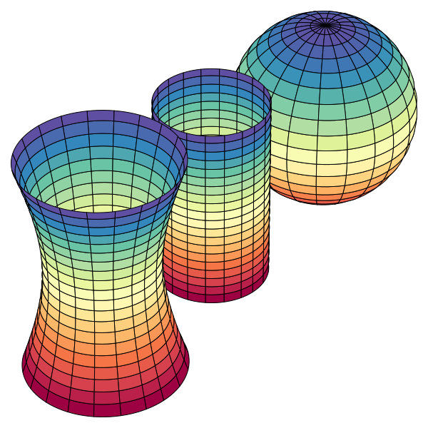
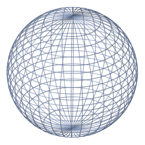
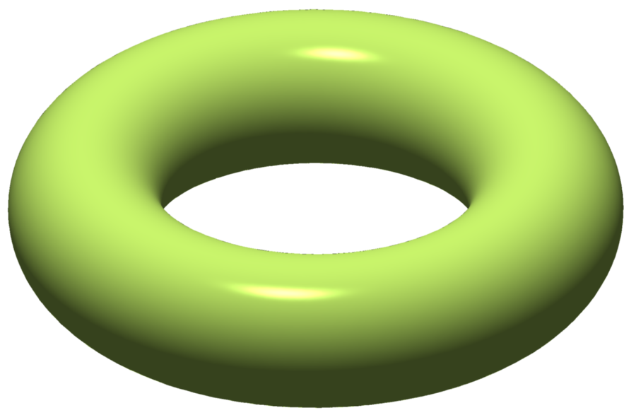
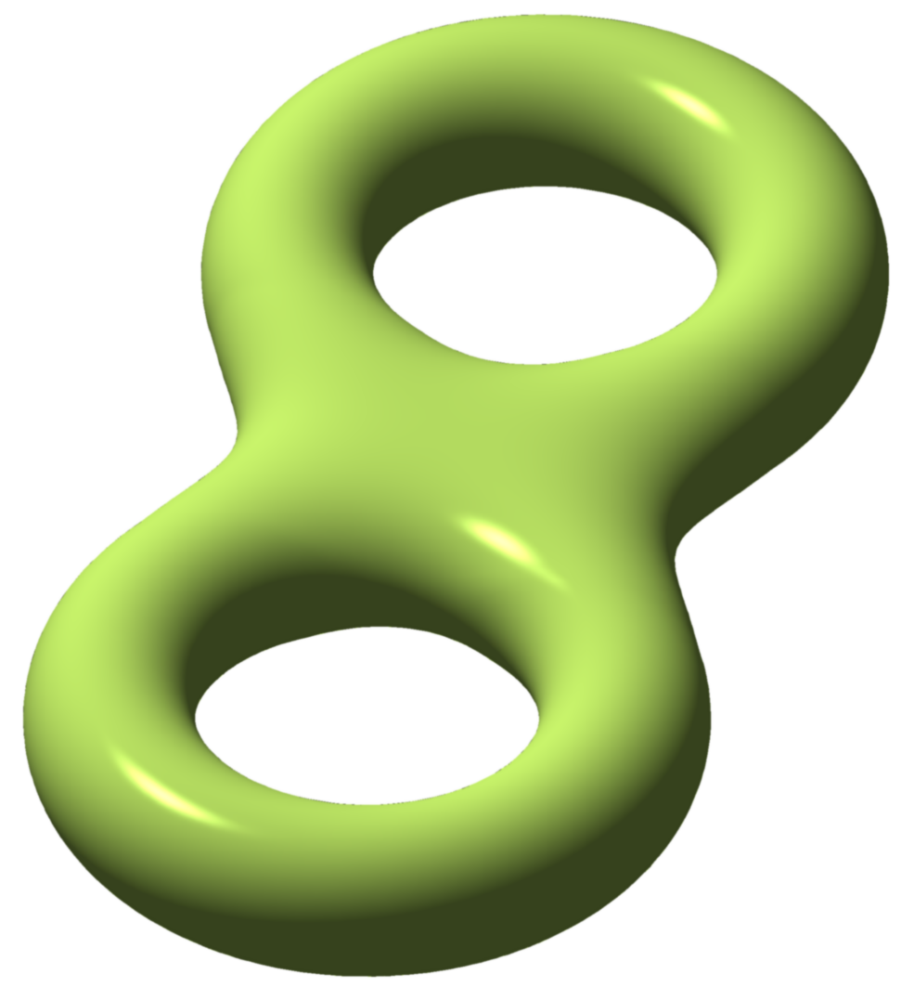
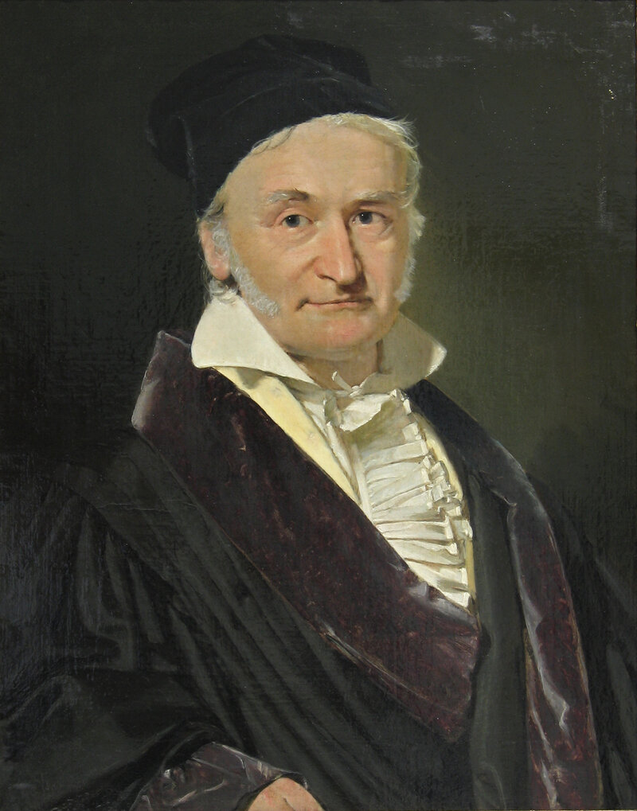

# 안에서만 보고도 휘어짐을 안다

## 출발 문제

종이 한 장을 테이블에 놓자. 완벽하게 평평하다. 이제 이 종이를 돌돌 말아서 원통 모양으로 만들어 보자. 우리 눈에는 종이가 분명히 "휘어졌다". 하지만 종이 위에 사는 아주 작은 개미의 관점에서 생각해 보자. 이 개미는 종이 위에서 직선을 긋고, 삼각형을 그리고, 원의 둘레와 넓이를 잴 수 있다. 놀랍게도, 개미가 측정하는 모든 기하학적 양은 종이를 말기 전과 **완전히 동일하다**. 삼각형의 내각의 합은 여전히 정확히 180°이고, 반지름 $r$인 원의 둘레는 여전히 $2\pi r$이다. 개미에게 종이는 말기 전이나 후나 "같은" 공간이다.

이제 구면 — 예를 들어 지구본 — 위에 사는 개미를 생각하자. 이 개미가 적도와 두 자오선으로 이루어진 삼각형을 그리면, 내각의 합이 180°를 **넘는다**. 북극에서 두 자오선이 이루는 각도가 $\alpha$라면, 이 삼각형의 내각의 합은 $180° + \alpha$이다. 반지름 $r$인 원을 그리면 둘레가 $2\pi r$보다 **짧다**(마치 누군가 원을 오그라뜨린 것처럼). 이 개미는 자기가 사는 공간이 평평하지 않다는 것을 **밖을 볼 필요 없이** 알 수 있다.

원통의 개미와 구면의 개미 — 둘 다 "휘어진" 곡면 위에 살지만, 한쪽은 그것을 감지할 수 없고 다른 쪽은 감지할 수 있다. 이 차이는 무엇인가? 같은 "휘어짐"이라는 단어를 쓰고 있지만, 사실 이것은 전혀 다른 두 종류의 휘어짐이다. 이 구분을 명확히 하는 것이 이 장의 핵심이다.

한 가지 실마리: 종이를 원통으로 말 때 종이는 **찢어지거나 늘어나지 않는다**. 점과 점 사이의 거리가 보존된다. 하지만 종이를 구면 위에 빈틈없이 붙이려면 반드시 찢거나 구기거나 늘여야 한다. 이 차이가 결정적이다.

## 패턴

"휘어짐"에는 두 종류가 있다. **외재적 휘어짐**(extrinsic curvature)은 곡면이 3차원 공간에 어떻게 묻혀 있는가에 대한 정보다 — 밖에서 보는 관찰자만 알 수 있다. **내재적 휘어짐**(intrinsic curvature)은 곡면 위에서의 측정만으로 결정되는 정보다 — 곡면 위에 사는 존재도 알 수 있다.

원통은 외재적으로 휘어져 있지만 내재적으로는 평평하다. 두 주곡률이 $\kappa_1 = 1/r$, $\kappa_2 = 0$이므로 가우스 곡률 $K = \kappa_1 \kappa_2 = 0$이다. 구면은 $\kappa_1 = \kappa_2 = 1/r$이므로 $K = 1/r^2 > 0$. 안장면은 $\kappa_1 > 0$, $\kappa_2 < 0$이므로 $K < 0$. 가우스 곡률 $K$의 부호가 내재적 기하학의 성격을 결정한다: $K > 0$이면 삼각형 내각의 합이 180°보다 크고, $K < 0$이면 작으며, $K = 0$이면 정확히 180°이다.

여기서 놀라운 패턴이 보인다. $K = \kappa_1 \kappa_2$는 두 주곡률의 **곱**이다. 주곡률 각각은 외재적 양이다 — 곡면을 밖에서 봐야 알 수 있다. 그런데 그 곱은 내재적이다 — 곡면 위에서의 측정만으로 결정된다! 이것은 마치 두 비밀번호를 곱한 결과가 공개 정보인 것과 같다. 외재적 양들의 특별한 조합이 내재적 양이 된다.

이 사실의 일상적 응용이 있다. **피자 접기**다. 얇은 피자 조각이 축 늘어진다면, 세로 방향으로 살짝 접으면 빳빳해진다. 왜? 접기 전 피자의 가우스 곡률은 $K = 0$(평면)이다. 세로로 접으면 그 방향의 곡률 $\kappa_1 > 0$이 된다. $K = 0$이 보존되어야 하므로(종이는 늘어나지 않으니까) $\kappa_2 = 0$이어야 한다 — 가로 방향으로 휘어질 수 없다. 결과적으로 피자가 아래로 처지지 않는다. 가우스의 Theorema Egregium이 피자 먹는 법을 설명하는 순간이다.

이것은 또한 모든 세계지도가 왜곡될 수밖에 없는 이유이기도 하다. 구면의 $K = 1/r^2 \neq 0$이고 평면의 $K = 0$이다. 가우스 곡률이 보존되는 변환(등거리 사상)으로는 구면을 평면으로 펼칠 수 없다. 메르카토르, 정거방위, 몰바이데 — 어떤 도법을 써도 면적이 틀리거나 각도가 틀리거나 거리가 틀린다. 이것은 기술적 한계가 아니라 **수학적 불가능성**이다.

## 정리 (Theorema Egregium)

가우스 곡률 $K = \kappa_1 \kappa_2$는 계량 텐서 $g_{ij}$와 그 1차, 2차 편미분만으로 계산된다. 곡면이 3차원 공간에 어떻게 묻혀 있는지(embedding)와 무관하다.

정리의 이름 Theorema Egregium은 "놀라운 정리"라는 뜻의 라틴어다. 가우스 자신이 이 이름을 붙였다 — 가우스처럼 절제된 사람이 "놀랍다"고 했다면 정말 놀라운 것이다.

이 정리가 정확히 왜 놀라운지 다시 짚어 보자. $\kappa_1$과 $\kappa_2$를 계산하려면 곡면의 법벡터, 즉 곡면이 3차원 공간에 어떻게 놓여 있는지를 알아야 한다. 이것은 명백히 외재적 정보다. 그런데 $K = \kappa_1 \kappa_2$를 계산할 때는, 이 외재적 정보가 기적적으로 상쇄되어 오직 $g_{ij}$만 남는다. 마치 $x$와 $y$를 각각은 모르지만 $xy$의 값은 알 수 있는 상황 — 방정식의 구조가 개별 변수를 숨기면서도 곱을 드러내는 것이다.

실제 계산에서, 2차원 곡면의 가우스 곡률은 $g_{11}$, $g_{12}$, $g_{22}$와 이들의 편미분으로 이루어진 (꽤 복잡한) 공식으로 주어진다. 중요한 것은 공식의 구체적 모양이 아니라, 그 공식에 법벡터나 임베딩 정보가 **전혀 등장하지 않는다**는 사실이다. 리만은 이 관찰을 $n$차원으로 확장하여, 리만 곡률 텐서 전체가 계량만으로 결정됨을 보였다.

가우스-보네 정리를 잠깐 맛보고 가자.

  
 닫힌 곡면의 가우스 곡률을 전체 표면에 걸쳐 적분하면: $\iint_M K\, dA = 2\pi\chi(M)$. 여기서 $\chi(M)$은 오일러 특성수라는 **위상 불변량**이다. 구면이면 $\chi = 2$, 토러스이면 $\chi = 0$이다. 곡면을 아무리 구기고 늘여도 $\chi$는 바뀌지 않는다. 국소적 기하(곡률)를 모두 합하면 전역적 위상(오일러 수)이 튀어나온다 — 미분기하학에서 가장 아름다운 다리 중 하나다.

## 정의

- **내재적 성질** (안에서 아는 것 / Measurable From Within) — 계량 텐서 $g_{ij}$만으로 결정되는 기하학적 양. 곡면 위에 사는 존재가 자와 각도기만으로 측정할 수 있는 모든 것: 거리, 각도, 면적, 가우스 곡률, 측지선 등.
- **외재적 성질** (밖에서 아는 것 / Visible From Outside) — 곡면이 주변 공간에 어떻게 묻혀 있는가에 의존하는 양. 법벡터, 주곡률, 평균곡률 등이 여기에 속한다. 같은 내재적 기하를 가진 곡면이 다른 외재적 모양을 가질 수 있다(원통과 평면처럼).
- **가우스 곡률** (두 주곡률의 곱 / Product of Principal Curvatures, $K = \kappa_1 \kappa_2$) — 곡면의 각 점에서의 내재적 휘어짐. 외재적으로 정의되지만 내재적으로 결정된다는 것이 Theorema Egregium의 핵심이다. $K > 0$이면 구면형, $K < 0$이면 안장형, $K = 0$이면 평면형(원통 포함).
- **주곡률** (최대·최소 휘어짐 / Maximum and Minimum Bending, $\kappa_1, \kappa_2$) — 한 점에서 모든 방향의 법곡률 중 최대값과 최소값. 각각은 외재적이지만, 그 곱(가우스 곡률)은 내재적이고 합(평균곡률)은 외재적이다. 가우스-보네 맛보기: 닫힌 곡면에서 $K$를 적분하면 위상 불변량 $2\pi\chi(M)$이 나온다.

## 핵심 인물과 일화

### 카를 프리드리히 가우스 — "놀라운 정리" (1827)

가우스는 자신의 정리에 직접 이름을 붙인 드문 수학자다. 1827년 논문 *Disquisitiones generales circa superficies curvas*에서 그는 이 결과를 **Theorema Egregium** — 라틴어로 "놀라운 정리" — 이라 불렀다. 가우스 같은 사람이 "놀랍다"고 한 것이니, 정말로 놀라운 결과였던 셈이다.

무엇이 그토록 놀라웠는가? 가우스 곡률 $K = \kappa_1 \kappa_2$는 두 주곡률의 곱이다. 주곡률 $\kappa_1$, $\kappa_2$ 각각은 곡면이 3차원 공간에 **어떻게 묻혀 있는가**(외재적 정보)에 의존한다. 원통의 주곡률은 $(1/r, 0)$이고, 이것을 알려면 원통을 밖에서 봐야 한다.

그런데 $K = \kappa_1 \kappa_2$는 오직 제1기본형식(계량 텐서 $g_{ij}$)과 그 도함수만으로 계산된다. 곡면을 밖에서 볼 필요가 없다. 곡면 위에 사는 2차원 존재가, 삼각형의 내각의 합이나 원의 둘레와 넓이의 비를 측정하는 것만으로 $K$를 알 수 있다.

이것이 왜 중요한가? 종이를 원통으로 말아도 $K$는 바뀌지 않는다 — 종이의 $K$는 원래 0이고, 원통의 $K = (1/r) \times 0 = 0$이기 때문이다. 그래서 종이는 찢어짐 없이 원통으로 말 수 있다. 하지만 구면의 $K = 1/r^2 > 0$이므로, 구면을 평면으로 펼칠 수 없다 — 모든 세계지도에 왜곡이 있는 근본적 이유다.

가우스의 측지 사업 경험이 이 발견에 영향을 미쳤을 가능성이 높다. 측량 과정에서 그는 지구 표면의 곡률을 *밖에서 보지 않고* — 오직 지표면 위에서의 측정만으로 — 결정할 수 있다는 사실을 체감했을 것이다. 실용적 경험이 순수한 통찰로 결정화된 아름다운 사례다.

## 시각화 아이디어

  <noscript>이 시각화를 보려면 JavaScript가 필요합니다.</noscript>

- 피자 정리: 피자 조각을 구부리면 늘어지지 않는다 — $K = \kappa_1 \kappa_2$이고 원래 $K = 0$
- 종이접기 vs 풍선: $K=0$인 곡면(원통, 원뿔)과 $K \neq 0$인 곡면(구, 안장)을 전개도로 펼치려 시도
- 토러스의 곡률 지도: 바깥쪽 $K>0$, 안쪽 $K<0$, 위아래 $K=0$. 적분이 정확히 0

## 연결되는 세계들

| 분야 | 연결 |
|------|------|
| 위상수학 | 가우스-보네 정리: $\iint K\, dA = 2\pi\chi(M)$ |
| 건축/공학 | 셸 구조물 설계: $K>0$ (돔), $K<0$ (안장 지붕), $K=0$ (판) |
| 생물학 | 세포막의 곡률이 단백질 배치를 결정한다 |
| 지도학 | 가우스 곡률이 0이 아닌 곡면은 등거리적으로 평면에 펼칠 수 없다 |
| 정보기하학 | 통계적 매니폴드의 곡률 → Fisher 정보의 "복잡도" |
