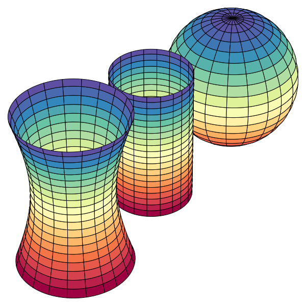
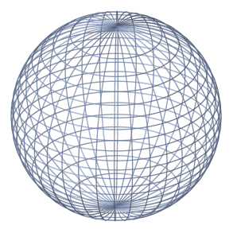
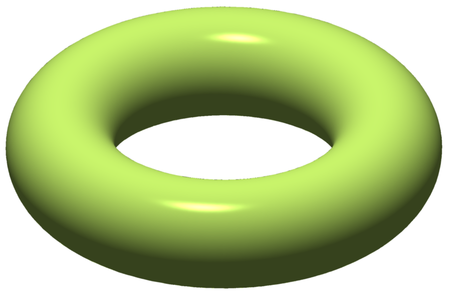
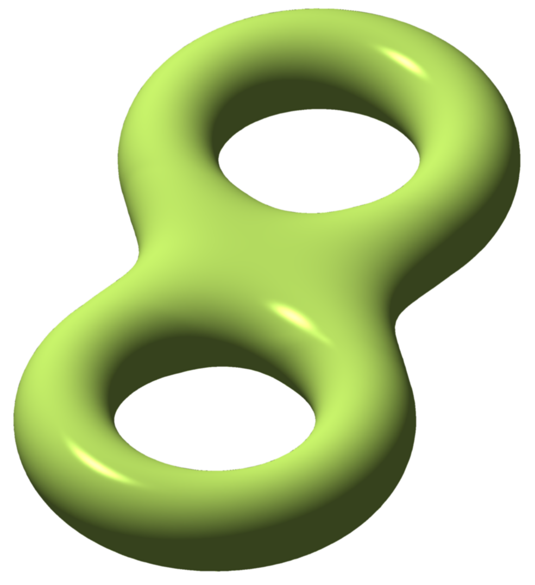

# 안에서만 보고도 휘어짐을 안다

## 출발 문제

종이 한 장을 테이블에 놓자. 완벽하게 평평하다. 이제 이 종이를 돌돌 말아서 원통 모양으로 만들어 보자. 우리 눈에는 종이가 분명히 "휘어졌다". 하지만 종이 위에 사는 아주 작은 개미의 관점에서 생각해 보자. 이 개미는 종이 위에서 직선을 긋고, 삼각형을 그리고, 원의 둘레와 넓이를 잴 수 있다. 놀랍게도, 개미가 측정하는 모든 기하학적 양은 종이를 말기 전과 **완전히 동일하다**. 삼각형의 내각의 합은 여전히 정확히 180°이고, 반지름 $r$인 원의 둘레는 여전히 $2\pi r$이다. 개미에게 종이는 말기 전이나 후나 "같은" 공간이다.

이제 구면 — 예를 들어 지구본 — 위에 사는 개미를 생각하자. 이 개미가 적도와 두 자오선으로 이루어진 삼각형을 그리면, 내각의 합이 180°를 **넘는다**. 북극에서 두 자오선이 이루는 각도가 $\alpha$라면, 이 삼각형의 내각의 합은 $180° + \alpha$이다. 반지름 $r$인 원을 그리면 둘레가 $2\pi r$보다 **짧다**(마치 누군가 원을 오그라뜨린 것처럼). 이 개미는 자기가 사는 공간이 평평하지 않다는 것을 **밖을 볼 필요 없이** 알 수 있다.

원통의 개미와 구면의 개미 — 둘 다 "휘어진" 곡면 위에 살지만, 한쪽은 그것을 감지할 수 없고 다른 쪽은 감지할 수 있다. 이 차이는 무엇인가? 같은 "휘어짐"이라는 단어를 쓰고 있지만, 사실 이것은 전혀 다른 두 종류의 휘어짐이다. 이 구분을 명확히 하는 것이 이 장의 핵심이다.

한 가지 실마리: 종이를 원통으로 말 때 종이는 **찢어지거나 늘어나지 않는다**. 점과 점 사이의 거리가 보존된다. 하지만 종이를 구면 위에 빈틈없이 붙이려면 반드시 찢거나 구기거나 늘여야 한다. 이 차이가 결정적이다.

## 패턴

"휘어짐"에는 두 종류가 있다. **외재적 휘어짐**(extrinsic curvature)은 곡면이 3차원 공간에 어떻게 묻혀 있는가에 대한 정보다 — 밖에서 보는 관찰자만 알 수 있다. **내재적 휘어짐**(intrinsic curvature)은 곡면 위에서의 측정만으로 결정되는 정보다 — 곡면 위에 사는 존재도 알 수 있다.

곡면 위 한 점에서 여러 방향으로 곡면을 잘라 보면, 방향마다 단면 곡선이 휘는 정도가 다르다. 그중 가장 많이 휘는 방향과 가장 적게 휘는 방향의 곡률을 **주곡률** $\kappa_1$, $\kappa_2$라 하고, 둘의 곱을 가우스 곡률이라 한다.

$$
\textcolor{#b8860b}{K} = \textcolor{#b8860b}{\kappa_1}\,\textcolor{#b8860b}{\kappa_2}
$$

$$
\begin{array}{ll}
\textcolor{#b8860b}{K} & \text{가우스 곡률} \\
\textcolor{#b8860b}{\kappa_1}, \textcolor{#b8860b}{\kappa_2} & \text{주곡률: 한 점에서 가장 많이·가장 적게 휘는 방향의 곡률 (볼록하면 양수, 오목하면 음수)}
\end{array}
$$

원통은 외재적으로 휘어져 있지만 내재적으로는 평평하다. 두 주곡률이 $\kappa_1 = 1/r$, $\kappa_2 = 0$이므로 가우스 곡률 $K = \kappa_1 \kappa_2 = 0$이다. 구면은 $\kappa_1 = \kappa_2 = 1/r$이므로 $K = 1/r^2 > 0$. 안장면은 $\kappa_1 > 0$, $\kappa_2 < 0$이므로 $K < 0$. 가우스 곡률 $K$의 부호가 내재적 기하학의 성격을 결정한다: $K > 0$이면 삼각형 내각의 합이 180°보다 크고, $K < 0$이면 작으며, $K = 0$이면 정확히 180°이다.

여기서 놀라운 패턴이 보인다. $K = \kappa_1 \kappa_2$는 두 주곡률의 **곱**이다. 주곡률 각각은 외재적 양이다 — 곡면을 밖에서 봐야 알 수 있다. 그런데 그 곱은 내재적이다 — 곡면 위에서의 측정만으로 결정된다! 외재적 양 두 개를 곱했더니 내재적 양이 되는 셈이다. 왜 합이 아니라 곱이어야 하는지는 원통이 알려 준다: 원통의 두 주곡률의 합 $1/r$은 종이를 얼마나 세게 말았는지에 따라 달라지지만, 곱은 언제나 0이다.

이 사실의 일상적 응용이 있다. **피자 접기**다. 얇은 피자 조각이 축 늘어질 때, 가로 방향으로 살짝 오므려 U자로 접으면 빳빳해진다. 접기 전 피자의 가우스 곡률은 $K = 0$(평면)이고, 가로로 오므리면 그 방향의 곡률 $\kappa_1$이 0이 아니게 된다. 도우는 거의 늘어나지 않으므로 $K = \kappa_1\kappa_2 = 0$이 유지되어야 하고, 따라서 $\kappa_2 = 0$이다. 곧 끝을 향하는 세로 방향으로는 휘어질 수 없으니, 피자 끝이 아래로 처지지 않는다. 가우스의 Theorema Egregium이 피자 먹는 법을 설명하는 순간이다.

이것은 또한 모든 세계지도가 왜곡될 수밖에 없는 이유이기도 하다. 구면의 $K = 1/r^2 \neq 0$이고 평면의 $K = 0$이다. 가우스 곡률이 보존되는 변환(등거리 사상)으로는 구면을 평면으로 펼칠 수 없다. 메르카토르, 정거방위, 몰바이데 — 각도를 지키는 도법(메르카토르)이나 면적을 지키는 도법(몰바이데)은 있지만, 어떤 도법을 써도 거리만큼은 어딘가에서 반드시 틀린다. 이것은 기술적 한계가 아니라 **수학적 불가능성**이다.

## 정리 (Theorema Egregium)

가우스 곡률 $K = \kappa_1 \kappa_2$는 계량 텐서 $g_{ij}$와 그 1차, 2차 편미분만으로 계산된다. 곡면이 3차원 공간에 어떻게 묻혀 있는지(embedding)와 무관하다.

정리의 이름 Theorema Egregium은 "놀라운 정리"라는 뜻의 라틴어로, 가우스 자신이 붙인 이름이다.

이 정리가 정확히 왜 놀라운지 다시 짚어 보자. $\kappa_1$과 $\kappa_2$를 계산하려면 곡면의 법벡터, 즉 곡면이 3차원 공간에 어떻게 놓여 있는지를 알아야 한다. 이것은 명백히 외재적 정보다. 그런데 $K = \kappa_1 \kappa_2$를 계산할 때는, 이 외재적 정보가 기적적으로 상쇄되어 오직 $g_{ij}$만 남는다. 마치 $x$와 $y$를 각각은 모르지만 $xy$의 값은 알 수 있는 상황 — 방정식의 구조가 개별 변수를 숨기면서도 곱을 드러내는 것이다.

일반적인 계량에서 가우스 곡률 공식은 $g_{11}$, $g_{12}$, $g_{22}$와 이들의 편미분으로 이루어진 꽤 복잡한 식(브리오스키 공식)이다. 좌표선이 서로 직교해서 $ds^2 = E\,du^2 + G\,dv^2$처럼 교차항이 없을 때는 훨씬 간단해진다.

$$
\textcolor{#b8860b}{K} = -\frac{1}{2\sqrt{\textcolor{#d62728}{E}\textcolor{#d62728}{G}}}\left[\frac{\partial}{\partial \textcolor{#1b9e77}{u}}\left(\frac{\partial_{\textcolor{#1b9e77}{u}} \textcolor{#d62728}{G}}{\sqrt{\textcolor{#d62728}{E}\textcolor{#d62728}{G}}}\right) + \frac{\partial}{\partial \textcolor{#1b9e77}{v}}\left(\frac{\partial_{\textcolor{#1b9e77}{v}} \textcolor{#d62728}{E}}{\sqrt{\textcolor{#d62728}{E}\textcolor{#d62728}{G}}}\right)\right]
$$

$$
\begin{array}{ll}
\textcolor{#b8860b}{K} & \text{가우스 곡률} \\
\textcolor{#1b9e77}{u}, \textcolor{#1b9e77}{v} & \text{서로 직교하는 좌표} \\
\textcolor{#d62728}{E}, \textcolor{#d62728}{G} & \text{계량 성분: } ds^2 = \textcolor{#d62728}{E}\,d\textcolor{#1b9e77}{u}^2 + \textcolor{#d62728}{G}\,d\textcolor{#1b9e77}{v}^2 \\
\partial_{\textcolor{#1b9e77}{u}}, \partial_{\textcolor{#1b9e77}{v}} & \text{편미분}
\end{array}
$$

공식의 구체적 모양보다 중요한 것은, 그 안에 계량 성분 $E$, $G$와 그 미분만 있고 법벡터나 임베딩 정보가 **전혀 등장하지 않는다**는 사실이다. 리만은 이 관찰을 $n$차원으로 확장하여, 리만 곡률 텐서 전체가 계량만으로 결정됨을 보였다.

### 따라 계산해 보기 1 — 구면에 공식 적용하기

반지름 $r$인 구면을 여위도 $u$, 경도 $v$로 쓰면 $ds^2 = r^2\,du^2 + r^2\sin^2 u\,dv^2$, 곧 $E = r^2$, $G = r^2\sin^2 u$이다. 차례로 계산하면 $\sqrt{EG} = r^2 \sin u$, $\partial_u G = 2r^2 \sin u\cos u$, $\partial_v E = 0$이다.

$$
\frac{\partial_{\textcolor{#1b9e77}{u}} \textcolor{#d62728}{G}}{\sqrt{\textcolor{#d62728}{E}\textcolor{#d62728}{G}}} = 2\cos \textcolor{#1b9e77}{u}, \qquad
\textcolor{#b8860b}{K} = -\frac{1}{2r^2\sin \textcolor{#1b9e77}{u}}\,\frac{\partial}{\partial \textcolor{#1b9e77}{u}}(2\cos \textcolor{#1b9e77}{u}) = -\frac{-2\sin \textcolor{#1b9e77}{u}}{2r^2\sin \textcolor{#1b9e77}{u}} = \frac{1}{r^2}
$$

$$
\begin{array}{ll}
\textcolor{#1b9e77}{u}, \textcolor{#1b9e77}{v} & \text{여위도, 경도} \\
\textcolor{#d62728}{E} = r^2,\ \textcolor{#d62728}{G} = r^2\sin^2\textcolor{#1b9e77}{u} & \text{구면의 계량 성분} \\
\textcolor{#b8860b}{K} & \text{가우스 곡률} \\
r & \text{구의 반지름}
\end{array}
$$

밖에서 본 주곡률로 구한 값 $\kappa_1\kappa_2 = (1/r)(1/r)$과 똑같다. 이번 계산에는 "구가 3차원 공간에 어떻게 놓여 있는가"가 한 번도 쓰이지 않았다. 계량 성분 두 개만으로 충분했다.

같은 공식을 극좌표로 쓴 평면 $ds^2 = dr^2 + r^2 d\theta^2$에 적용하면, $E = 1$, $G = r^2$이라 $\partial_r G/\sqrt{EG} = 2$가 상수가 되어 $K = 0$이 나온다. 계량 성분이 위치에 따라 변한다고 해서 휘어진 것은 아니다.

### 따라 계산해 보기 2 — 개미의 삼각형으로 곡률 재기

구면 위의 삼각형처럼 측지선(곡면 위의 "직선", 6장)으로 둘러싼 삼각형에서는 내각의 합이 180°에서 벗어난 만큼이 안쪽의 곡률을 모두 더한 값과 같다.

$$
\alpha + \beta + \gamma = \pi + \iint_{\triangle} \textcolor{#b8860b}{K}\, dA
$$

$$
\begin{array}{ll}
\alpha, \beta, \gamma & \text{측지 삼각형의 세 내각 (라디안)} \\
\textcolor{#b8860b}{K} & \text{가우스 곡률} \\
dA & \text{넓이 요소}
\end{array}
$$

반지름 $r$인 지구본에서 북극, 적도 위 경도 0°, 적도 위 경도 90°를 이은 삼각형을 그리면 세 내각이 모두 90°다. 내각의 합이 $3\pi/2$이므로 초과분은 $\pi/2$이고, 이 삼각형은 구면의 $1/8$이라 넓이가 $4\pi r^2/8 = \pi r^2/2$이다. $K$가 어디서나 같다면 $K \times \pi r^2/2 = \pi/2$, 곧 $K = 1/r^2$이다. 개미는 각도기와 줄자만으로 구의 곡률을 알아냈다.

이 식을 곡면 전체로 넓힌 것이 가우스-보네 정리다.

  

닫힌 곡면의 가우스 곡률을 전체 표면에 걸쳐 적분하면 다음과 같다.

$$
\iint_M \textcolor{#b8860b}{K}\, dA = 2\pi\chi(M)
$$

$$
\begin{array}{ll}
\textcolor{#b8860b}{K} & \text{가우스 곡률} \\
M & \text{닫힌 곡면 (경계가 없고 유한한 곡면)} \\
\chi(M) & \text{오일러 특성수 (꼭짓점} - \text{모서리} + \text{면)}
\end{array}
$$

여기서 $\chi(M)$은 오일러 특성수라는 **위상 불변량**이다. 구면이면 $\chi = 2$, 토러스이면 $\chi = 0$이다. 곡면을 아무리 구기고 늘여도 $\chi$는 바뀌지 않는다. 국소적 기하(곡률)를 모두 합하면 전역적 위상(오일러 수)이 튀어나온다 — 미분기하학에서 가장 아름다운 다리 중 하나다.

### 안에서 곡률을 재는 네 가지 방법

"휘어짐을 재려면 바깥에 곧은 무언가가 있어야 하지 않나?"라는 물음에, 놀라운 정리는 필요 없다고 답한다. 실제로 곡면 위의 개미가 바깥을 보지 않고 할 수 있는 실험이 적어도 넷 있다.

1. **평행이동의 어긋남.** 화살표를 방향을 유지한 채 닫힌 고리를 따라 옮기고 돌아오면, 휘어진 곳에서는 화살표가 돌아가 있다. 5장에서 본 대로 그 회전각은 고리가 감싼 곡률의 총량 $\Delta\theta = \iint K\,dA$다.
2. **삼각형 내각의 합.** 측지선 셋으로 삼각형을 그리면 내각의 합이 $\pi$에서 벗어나는 만큼이 그 안의 곡률이다. 위의 따라 계산해 보기 2가 이 방법이다.
3. **원 둘레와 넓이의 결손.** 한 점에서 측지 거리 $\rho$인 점들을 이은 원을 줄자로 잰다.
4. **측지선 편차.** 나란히 출발한 두 측지선이 벌어지거나 좁혀지는 정도를 잰다.

세 번째와 네 번째는 식으로 쓰면 다음과 같다.

$$
C(\rho) = 2\pi\rho\left(1 - \frac{\textcolor{#b8860b}{K}}{6}\rho^2 + \cdots\right), \qquad
A(\rho) = \pi\rho^2\left(1 - \frac{\textcolor{#b8860b}{K}}{12}\rho^2 + \cdots\right), \qquad
\frac{d^2\textcolor{#e8710a}{\xi}}{ds^2} = -\textcolor{#b8860b}{K}\,\textcolor{#e8710a}{\xi}
$$

$$
\begin{array}{ll}
C(\rho), A(\rho) & \text{측지 거리 } \rho \text{ 인 원의 둘레와 넓이} \\
\textcolor{#b8860b}{K} & \text{원의 중심 (또는 측지선 근처)의 가우스 곡률} \\
\textcolor{#e8710a}{\xi} & \text{나란히 가는 두 측지선 사이의 간격} \\
s & \text{측지선을 따라 잰 거리}
\end{array}
$$

평평하면 $K = 0$이라 둘레는 정확히 $2\pi\rho$이고, 두 측지선의 간격은 일정하게 벌어지거나 유지된다. 반지름 $r$인 구면이면 $K = 1/r^2$이라 적도에서 나란히 북쪽으로 출발한 두 경선의 간격은 $\xi(s) = \xi_0\cos(s/r)$로 줄어들어, $s = \pi r/2$인 북극에서 만난다. 물리학에서 이 네 번째 방법은 **조석력**이다. 자유낙하하는 입자 하나만 보면 중력은 좌표를 바꿔 지울 수 있지만(7장의 국소 관성계), 나란히 떨어지는 두 입자의 상대 가속도는 지울 수 없다. 달이 만드는 밀물과 썰물, 그리고 LIGO의 중력파 검출이 모두 이 항을 잰 것이다.

네 방법 어디에도 "바깥에서 내려다보기"는 없다. 그래서 일반상대성이론이 "시공간이 휘었다"고 말할 때의 휘어짐은 바로 이 내재적 휘어짐이고, 우주를 담는 더 큰 공간은 이론에 등장하지도 않고 필요하지도 않다.

## 정의

- **내재적 성질** (안에서 아는 것 / Measurable From Within) — 계량 텐서 $g_{ij}$만으로 결정되는 기하학적 양. 곡면 위에 사는 존재가 자와 각도기만으로 측정할 수 있는 모든 것: 거리, 각도, 면적, 가우스 곡률, 측지선 등.
- **외재적 성질** (밖에서 아는 것 / Visible From Outside) — 곡면이 주변 공간에 어떻게 묻혀 있는가에 의존하는 양. 법벡터, 주곡률, 평균곡률 등이 여기에 속한다. 같은 내재적 기하를 가진 곡면이 다른 외재적 모양을 가질 수 있다(원통과 평면처럼).
- **가우스 곡률** (두 주곡률의 곱 / Product of Principal Curvatures, $K = \kappa_1 \kappa_2$) — 곡면의 각 점에서의 내재적 휘어짐. 외재적으로 정의되지만 내재적으로 결정된다는 것이 Theorema Egregium의 핵심이다. $K > 0$이면 구면형, $K < 0$이면 안장형, $K = 0$이면 평면형(원통 포함).
- **주곡률** (최대·최소 휘어짐 / Maximum and Minimum Bending, $\kappa_1, \kappa_2$) — 한 점에서 모든 방향의 법곡률 중 최대값과 최소값. 각각은 외재적이지만, 그 곱(가우스 곡률)은 내재적이고 합(평균곡률)은 외재적이다.

## 핵심 인물과 일화

### 카를 프리드리히 가우스 — "놀라운 정리" (1827)

가우스는 자신의 정리에 직접 이름을 붙인 드문 수학자다. 1827년 논문 *Disquisitiones generales circa superficies curvas*에서 그는 이 결과를 **Theorema Egregium** — 라틴어로 "놀라운 정리" — 이라 불렀다. 가우스 같은 사람이 "놀랍다"고 한 것이니, 정말로 놀라운 결과였던 셈이다.

무엇이 그토록 놀라웠는가? 가우스 곡률 $K = \kappa_1 \kappa_2$는 두 주곡률의 곱이다. 주곡률 $\kappa_1$, $\kappa_2$ 각각은 곡면이 3차원 공간에 **어떻게 묻혀 있는가**(외재적 정보)에 의존한다. 원통의 주곡률은 $(1/r, 0)$이고, 이것을 알려면 원통을 밖에서 봐야 한다.

그런데 $K = \kappa_1 \kappa_2$는 오직 제1기본형식(계량 텐서 $g_{ij}$)과 그 도함수만으로 계산된다. 곡면을 밖에서 볼 필요가 없다. 곡면 위에 사는 2차원 존재가, 삼각형의 내각의 합이나 원의 둘레와 넓이의 비를 측정하는 것만으로 $K$를 알 수 있다.

이것이 왜 중요한가? 종이를 원통으로 말아도 $K$는 바뀌지 않는다 — 종이의 $K$는 원래 0이고, 원통의 $K = (1/r) \times 0 = 0$이기 때문이다. 그래서 종이는 찢어짐 없이 원통으로 말 수 있다. 하지만 구면의 $K = 1/r^2 > 0$이므로, 구면을 평면으로 펼칠 수 없다 — 모든 세계지도에 왜곡이 있는 근본적 이유다.

가우스의 측지 사업 경험이 이 발견에 영향을 미쳤을 가능성이 높다. 측량 과정에서 그는 지구 표면의 곡률을 *밖에서 보지 않고* — 오직 지표면 위에서의 측정만으로 — 결정할 수 있다는 사실을 체감했을 것이다. 실용적 경험이 순수한 통찰로 결정화된 아름다운 사례다.

## 직접 움직여 보기

한 점 근처의 곡면을 두 주곡률 $\kappa_1$, $\kappa_2$로 빚어 보는 위젯이다. 슬라이더로 두 방향의 휘어짐을 정하면 가우스 곡률 $K = \kappa_1\kappa_2$와, 그 곡면을 종이 한 장으로 만들 수 있는지가 바로 나온다. 「종이 모드」를 켜면 종이처럼 늘어나지 않는 재료가 되어 $K = 0$을 지켜야 하는데, 한 방향을 굽히는 순간 다른 방향이 어떻게 되는지 보자. 곡면은 끌어서 돌릴 수 있다.

  <noscript>이 시각화를 보려면 JavaScript가 필요합니다.</noscript>

## 연습문제와 같이 풀기

각 문제를 먼저 혼자 풀어 본 뒤, 바로 아래 세션에서 선생님과 두 학생이 어떻게 풀어 가는지 따라가 보자.

### 문제 1 — 종이 한 장으로 감쌀 수 있는 것

확인 종이 한 장을 찢거나 늘이지 않고(구기지도 않고) 빈틈없이 감쌀 수 있는 것을 모두 고르라. (가) 원기둥 옆면 (나) 원뿔 옆면(꼭짓점 제외) (다) 공 (라) 말안장. 공을 감쌀 수 없는 이유를 종이의 입장에서 설명하라.

#### 같이 풀기 세션 1

**김민준:** 가우스 곡률이 0인 건 평면뿐이잖아요. 원기둥은 딱 봐도 휘었으니까 $K \neq 0$이고, 그러면 (가)도 안 되는데… 어, 그런데 원기둥은 종이를 말아서 만들잖아요?

**이서연:** 그러니까 원기둥은 $K = 0$이야. 주곡률이 $1/r$하고 $0$이라 곱하면 0이지. 원뿔도 모선 방향으로는 곧으니까 $\kappa_2 = 0$이고 $K = 0$. 답은 (가), (나).

**선생님:** 민준 학생은 어디서 막혔을까요?

**김민준 〔M07〕:** "휘어 보인다"를 $K \neq 0$으로 읽었어요. 눈에 보이는 휘어짐은 주곡률 하나만 0이 아니어도 생기는데, $K$는 곱이라 하나만 0이어도 0이네요. 휘어 보이는 것과 $K$가 0이 아닌 건 다른 말이었어요.

**김민준:** 발표 자료를 조교님께 보냈더니 "그림은 화려한데 내용은 지난주랑 똑같네"라고 하셨던 게 생각나요. 겉모양이 바뀐 거랑 내용이 바뀐 건 다르다는 거죠.

**선생님:** 서연 학생, 그럼 공은 왜 안 될까요? "$K$가 달라서"라는 답 말고, 종이를 공에 대고 누르면 종이한테 무슨 일이 생기는지로요.

**이서연 〔S04〕:** 음… $K$가 보존되니까 $1/r^2$인 곡면에 $K = 0$인 종이를 붙일 수 없다, 말고는 잘 모르겠어요. 종이 입장이라는 게 뭔지.

**선생님:** 종이에 반지름 $\rho$인 원을 그리고, 그 원의 중심을 공의 꼭대기에 대고 감싼다고 해 봐요. 종이 위의 원 둘레는 $2\pi\rho$예요. 공 위에서 꼭대기로부터 거리가 $\rho$인 점들이 이루는 원의 둘레는요?

**이서연:** 단위구라면 여위도 $\rho$인 위도선이니까 $2\pi\sin\rho$예요. $\sin\rho < \rho$라서 종이의 원보다 짧아요.

**이서연 〔S07〕:** 아, 종이 가장자리가 공 위의 원보다 길어서 남는 거네요. 남는 종이가 갈 데가 없으니 겹치거나 주름이 져요. 반대로 말안장은 원 둘레가 $2\pi\rho$보다 길어서 종이가 모자라니까 찢어지고요.

**선생님 〔T13〕:** 그게 선물 포장할 때 공 모양 선물만 유독 주름투성이가 되는 이유예요. 원기둥은 둘레가 정확히 맞아서 깔끔하게 말리고요.

**이서연:** 해석학에서 $\sin\rho = \rho - \rho^3/6 + \cdots$를 외우기만 했는데, 그 $\rho^3/6$이 남는 종이의 양이었군요.

### 문제 2 — 성분이 변하는 계량은 휘었을까

계산 윗반평면 $\{(x, y) : y > 0\}$에 계량 $ds^2 = \dfrac{dx^2 + dy^2}{y^2}$을 준다(푸앵카레 반평면). 직교 좌표 공식으로 가우스 곡률을 구하라.

#### 같이 풀기 세션 2

**김민준:** 이건 금방이에요. $E = G = 1/y^2$라서 두 방향 눈금이 똑같으니까, 각도는 평면이랑 같잖아요. 각도가 평면이랑 같으면 삼각형 내각의 합도 180°니까 $K = 0$이요.

**이서연:** 각도가 같다고 해서 삼각형이 같다는 보장은 없잖아. 여기서 "직선", 곧 측지선은 평면의 직선이 아닐 수도 있고.

**선생님:** 서연 학생 말이 맞아요. 두 방향 눈금이 같으면 한 점에서 잰 각도는 평면과 같지만, 삼각형의 변 자체가 달라져요. 추측하지 말고 공식에 넣어 봅시다.

**김민준 〔M04〕:** 네… $\sqrt{EG} = 1/y^2$이고, $G$는 $x$에 의존하지 않으니까 첫 항은 0이에요. $\partial_y E = -2/y^3$이라서 $\partial_y E/\sqrt{EG} = -2/y$, 이걸 $y$로 한 번 더 미분하면 $2/y^2$요.

$$
\textcolor{#b8860b}{K} = -\frac{1}{2\sqrt{\textcolor{#d62728}{E}\textcolor{#d62728}{G}}}\left[0 + \frac{\partial}{\partial \textcolor{#1b9e77}{y}}\left(-\frac{2}{\textcolor{#1b9e77}{y}}\right)\right] = -\frac{\textcolor{#1b9e77}{y}^2}{2}\cdot\frac{2}{\textcolor{#1b9e77}{y}^2} = -1
$$

$$
\begin{array}{ll}
\textcolor{#1b9e77}{x}, \textcolor{#1b9e77}{y} & \text{반평면의 좌표} \\
\textcolor{#d62728}{E} = \textcolor{#d62728}{G} = 1/\textcolor{#1b9e77}{y}^2 & \text{계량 성분} \\
\textcolor{#b8860b}{K} & \text{가우스 곡률}
\end{array}
$$

**김민준 〔M05〕:** $-1$이에요. 어디서나 $-1$. 평평하기는커녕 말안장처럼 휘어 있네요.

**선생님:** 각도만 같게 그리는 지도를 등각 지도라고 해요. 메르카토르가 바로 등각 지도였죠. 지구가 둥근데도 메르카토르 지도에서 각도는 맞았어요. 각도가 맞는다고 평평한 건 아니라는 증거가 1장부터 있었던 셈이에요.

**김민준:** 조교님이 보고서 표지 양식만 맞췄다고 통과시켜 주진 않으셨죠. 각도라는 양식이 맞아도 길이라는 본문이 다르면 다른 보고서네요.

**이서연:** 앞에서 본 극좌표 평면도 $G = r^2$로 성분이 변했는데 $K = 0$이었잖아. 성분이 변하냐 마냐도, 각도가 맞냐 마냐도 곡률을 알려 주지 않아. 공식에 넣어 봐야 알아.

### 문제 3 — 줄자 하나로 지구의 곡률 재기

킬러 반지름 $R = 6400\,\text{km}$인 지구 위의 한 점에서, 지표면을 따라 $\rho = 100\,\text{km}$ 떨어진 점들이 이루는 원의 둘레를 잰다. (1) 이 둘레는 $2\pi\rho$보다 얼마나 짧은가? (2) 이 차이만으로 가우스 곡률을 알아내는 식을 세우라. (3) 이 방법은 곡률이 점마다 다른 곡면에서도 쓸 수 있는가?

#### 같이 풀기 세션 3

**김민준:** 파이썬으로 $2\pi R\sin(\rho/R)$을 계산했어요. $2\pi\rho = 628.3185\,\text{km}$에서 약 $0.0256\,\text{km}$, 그러니까 25미터쯤 짧아요. 둘레 628킬로미터에서 25미터면 오차 수준이니까 사실상 평면이고, $K \approx 0$이라고 봐도 되지 않을까요?

**선생님:** 25미터가 작은 건 맞아요. 그런데 $\rho$를 두 배로 늘리면 그 차이는 몇 배가 될까요?

**김민준 〔M05〕:** 돌려 볼게요… $\rho = 200\,\text{km}$면 약 $0.2045\,\text{km}$, 여덟 배예요. $\rho^3$으로 크네요. 그러면 작은 건 $\rho$가 작아서 그런 거지 곡률이 없어서가 아니네요.

**이서연:** 전개해 보면 알 수 있어. $2\pi R\sin(\rho/R) = 2\pi\rho - \dfrac{\pi\rho^3}{3R^2} + \cdots$이니까 차이의 첫 항이 $\pi\rho^3 K/3$이야. 그러면 $K$를 거꾸로 꺼낼 수 있지.

$$
\textcolor{#b8860b}{K} = \lim_{\rho \to 0}\ \frac{3\,\big(2\pi\rho - C(\rho)\big)}{\pi \rho^3}
$$

$$
\begin{array}{ll}
\textcolor{#b8860b}{K} & \text{원의 중심에서의 가우스 곡률} \\
C(\rho) & \text{곡면을 따라 거리 } \rho \text{ 인 점들이 이루는 원의 둘레} \\
\rho & \text{원의 반지름 (곡면 위에서 잰 거리)}
\end{array}
$$

**김민준 〔M07〕:** 제 숫자 $0.0256$을 넣으면 $3 \times 0.0256 / (\pi \times 10^6) \approx 2.44 \times 10^{-8}\,\text{km}^{-2}$, 그러니까 $1/6400^2$이 나와요! 25미터짜리 차이에 지구 반지름이 다 들어 있었네요.

**김민준:** 학습 곡선에서 loss가 조금밖에 안 줄어서 "안 배우네" 했다가, 조교님이 로그 스케일로 다시 그려 보라고 하셨던 거랑 같아요. 작은 차이를 무시하지 말고 어떤 속도로 크는지 봐야 하는 거죠.

**이서연:** 그런데 (3)번은 안 될 것 같아. 이건 구처럼 $K$가 어디서나 같을 때 둘레 공식을 알아서 되는 거잖아. $K$가 점마다 다르면 원이 지나는 곳마다 곡률이 달라서 이 식이 성립하지 않을 거야.

**선생님:** 식에 $\rho \to 0$ 극한이 붙어 있는 걸 보세요. 원을 한없이 줄이면 원이 지나는 곳은 어디가 되죠?

**이서연 〔S08〕:** 전부 중심 근처로 모여요. 곡률이 점마다 달라도 매끄럽게 변하니까, 원이 충분히 작으면 원 안의 곡률은 중심의 곡률과 거의 같아요. 그러면 극한값은 중심에서의 $K$가 되겠네요. 이 식은 구 전용이 아니라, 곡률을 "그 점에서" 재는 식이었어요.

**선생님 〔T14〕:** 그래요. 이 식은 19세기에 베르트랑, 디게, 퓌죄가 정리한 것으로, 가우스 곡률을 곡면 위의 줄자만으로 정의하는 방법이에요. 이 장의 제목 "안에서만 보고도 휘어짐을 안다"가 문자 그대로 계산이 된 거죠.

**이서연:** 미적분 시간에 미분계수를 "구간을 한없이 줄인 평균 변화율"로 배운 것과 같은 구조네요. 넓은 원의 둘레가 모자란 정도는 원 안 곡률의 평균 같은 거고, 극한을 취하면 그 점의 곡률이 되는 거예요.

## 연결되는 세계들

| 분야 | 연결 |
|------|------|
| 위상수학 | 가우스-보네 정리: $\iint K\, dA = 2\pi\chi(M)$ |
| 건축/공학 | 셸 구조물 설계: $K>0$ (돔), $K<0$ (안장 지붕), $K=0$ (판) |
| 생물학 | 세포막의 곡률이 단백질 배치를 결정한다 |
| 지도학 | 가우스 곡률이 0이 아닌 곡면은 등거리적으로 평면에 펼칠 수 없다 |
| 정보기하학 | 통계적 매니폴드의 곡률 → Fisher 정보의 "복잡도" |
