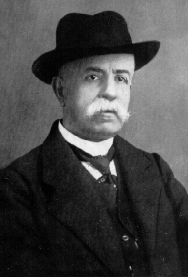

# 곡률을 요약하는 법

## 출발 문제

리만 곡률 텐서는 $n$차원에서 $n^2(n^2-1)/12$개의 독립 성분을 가진다. 2차원에서는 1개, 3차원에서는 6개, 그리고 4차원 — 우리가 사는 시공간의 차원 — 에서는 20개다. 이 20개의 숫자가 한 점에서의 곡률을 완전히 기술한다. 하지만 이 모든 정보를 항상 다 들고 다녀야 하는가?

물리학에서 비슷한 상황을 생각해 보자. 100명으로 이루어진 집단의 시험 성적을 기술하려면 100개의 숫자가 필요하다. 하지만 실제로 우리가 자주 쓰는 것은 평균, 분산, 중앙값 같은 **요약 통계량**이다. 정보는 잃지만, 핵심은 남긴다. 곡률 텐서에서도 같은 전략이 가능할까?

더 구체적으로, 아인슈타인이 일반상대성이론의 장방정식을 세울 때 직면한 문제가 바로 이것이었다. 물질의 에너지-운동량 텐서 $T_{ij}$는 대칭 2차 텐서로 독립 성분이 10개다. 이것을 4차 텐서인 리만 곡률(20개 성분)과 직접 등치시킬 수는 없다. 곡률의 적절한 "요약"이 필요했다. 20개를 10개로 압축하되, 물리적으로 의미 있는 방식으로.

## 패턴

텐서의 성분들을 체계적으로 합산하는 **축약(contraction)**이라는 연산이 있다. 위 첨자와 아래 첨자를 하나씩 짝지어 합산하면, 텐서의 "등급"이 2만큼 줄어든다. 행렬의 대각합(trace)이 가장 친숙한 예시다: $n \times n$ 행렬(2차 텐서)의 대각 성분을 합하면 하나의 수(0차 텐서)가 된다.

리만 곡률 텐서 $R^i{}_{jkl}$에 이 전략을 적용하자. 첫째와 셋째 첨자를 축약하면 — 즉 $R_{jl} = R^i{}_{jil}$로 합산하면 — 2차 텐서가 남는다. 이것이 **리치 텐서**다. 4차 텐서의 20개 성분이 대칭 2차 텐서의 10개 성분으로 압축된다. 하지만 정보가 사라진 것은 아닌가? 사라졌다. 리치 텐서가 포착하지 못하는 나머지 10개 성분의 정보는 **바일 텐서** $C_{ijkl}$에 담긴다.

리치 텐서를 한 번 더 축약하면 — $R = g^{ij}R_{ij}$ — 하나의 숫자가 나온다. **스칼라 곡률**이다. 10개의 정보를 1개로 압축한 것이니 더 많은 것을 잃지만, "이 점에서 공간이 전체적으로 얼마나 휘어 있는가"라는 가장 거친 요약을 제공한다. 마치 학급 전체의 성적을 평균 한 숫자로 요약하는 것과 같다.

이 축약의 계층 — 리만(4차) → 리치(2차) → 스칼라(0차) — 은 곡률 정보의 **자연스러운 압축 경로**다. 각 단계에서 정보를 잃지만, 남는 정보는 점점 더 본질적인 기하학적 의미를 갖는다.

## 정리

리치 곡률은 "부피가 어떻게 변하는가"를 측정한다. 한 점 $p$에서 모든 방향으로 거리 $\epsilon$만큼 떨어진 점들의 집합 — **측지 공(geodesic ball)** — 을 생각하자. 평평한 공간에서 이 공의 부피는 $\omega_n \epsilon^n$이다($\omega_n$은 $n$차원 단위공의 부피). 하지만 곡률이 있으면 부피가 달라진다:

$$\text{Vol}(B_\epsilon(p)) = \omega_n \epsilon^n \left(1 - \frac{R}{6(n+2)}\epsilon^2 + \cdots\right)$$

여기서 $R$은 스칼라 곡률이다. 양의 스칼라 곡률이면 측지 공의 부피가 유클리드 공간보다 **작다** — 공간이 "수축"하고 있다는 뜻이다. 구의 표면을 생각하면 직관적이다: 구 위의 작은 원은 평면 위의 같은 반지름의 원보다 면적이 작다. 반대로, 음의 곡률(쌍곡 공간)에서는 측지 공의 부피가 더 크다.

리치 텐서는 이 부피 변화를 **방향별로** 분해한다. $R_{ij}v^iv^j$는 방향 $v$를 따라 측지선 다발이 수렴하는 정도를 알려준다. 양의 리치 곡률이면 그 방향의 측지선들이 모이고, 음이면 흩어진다. 이것이 왜 중요한가? 중력이 바로 이 효과이기 때문이다. 지구 주변에서 자유낙하하는 입자들의 다발은 시간이 갈수록 모인다 — 양의 리치 곡률이다.

아인슈타인 텐서 $G_{ij} = R_{ij} - \frac{1}{2}Rg_{ij}$는 리치 텐서와 스칼라 곡률의 특별한 조합이다. 이 텐서의 핵심 성질은 **발산이 정확히 0**이라는 것이다: $\nabla^i G_{ij} = 0$. 이것은 순전히 기하학적 항등식(비안키 항등식의 귀결)이지만, 물리적으로는 에너지-운동량의 보존법칙 $\nabla^i T_{ij} = 0$과 정확히 대응한다. 아인슈타인 방정식 $G_{ij} = 8\pi G \cdot T_{ij}$가 성립하는 이유는, 양변 모두 발산이 0이어야 하기 때문이다. 기하학의 항등식이 물리학의 보존법칙을 보장하는 것이다.

## 정의

- **리치 텐서** (부피 변화율 / Volume Growth Rate, $R_{ij}$) — 곡률 텐서 $R^k{}_{ikj}$를 첫째와 셋째 첨자에 대해 축약한 대칭 2차 텐서. 한 점에서 각 방향으로 측지선 다발의 부피가 얼마나 빠르게 변하는지를 알려준다. 리치 텐서가 0이면 — 리치 평탄(Ricci-flat) — 부피는 유클리드 공간에서처럼 변한다. 진공에서의 아인슈타인 방정식은 정확히 $R_{ij} = 0$이다.

- **스칼라 곡률** (전체 휘어짐의 한 숫자 요약 / One-Number Curvature Summary, $R = g^{ij}R_{ij}$) — 리치 텐서를 계량으로 한 번 더 축약한 것. 한 점에서의 곡률을 하나의 숫자로 요약한다. "평균 곡률"이라고 생각할 수 있다. 2차원에서는 스칼라 곡률이 가우스 곡률의 2배와 같으므로, 스칼라 곡률 하나로 곡률의 모든 정보가 담긴다. 하지만 3차원 이상에서는 정보 손실이 불가피하다.

- **아인슈타인 텐서** (중력이 보는 곡률 / The Part Gravity Cares About, $G_{ij} = R_{ij} - \frac{1}{2}Rg_{ij}$) — 리치 텐서에서 스칼라 곡률의 "추적(trace)" 부분을 빼서 발산이 정확히 0이 되도록 만든 텐서. 발산이 0이라는 성질 덕분에 에너지-운동량 보존을 자동으로 만족하는 장방정식을 쓸 수 있다. 일반상대성이론의 핵심 등식 $G_{ij} = 8\pi G \cdot T_{ij}$의 좌변이 바로 이것이다.

- **바일 텐서** (조석력 / Tidal Force Tensor, $C_{ijkl}$) — 리만 곡률 텐서에서 리치 텐서로 결정되는 부분을 빼고 남은 나머지. "추적 없는(traceless)" 곡률이라고도 한다. 바일 텐서는 부피를 바꾸지 않고 **모양만 변형**하는 곡률, 즉 조석력(tidal force)에 대응한다. 지구 주변의 중력이 물체를 한 방향으로 늘이고 다른 방향으로 줄이는 것이 바일 곡률의 효과다. 3차원 이하에서는 바일 텐서가 항상 0이다 — 리치 텐서만으로 곡률 전체가 결정되기 때문이다.

## 핵심 인물과 일화

### 그레고리오 리치-쿠르바스트로 (Gregorio Ricci-Curbastro, 1853–1925)

리만 곡률 텐서가 존재한다는 것을 리만이 보였지만, 이것을 체계적으로 다루는 계산 언어를 만든 사람은 리치-쿠르바스트로다. 파도바 대학 교수였던 리치는 1880년대부터 "절대 미분학(calcolo differenziale assoluto)"을 개발한다 — 좌표에 의존하지 않는 텐서 연산의 체계.

리치의 핵심 아이디어 중 하나가 **축약(contraction)**이다. 4개의 첨자를 가진 리만 곡률 텐서 $R^i{}_{jkl}$에서, 첫째와 셋째 첨자를 합산하면 2개의 첨자를 가진 텐서가 남는다: $R_{jl} = R^i{}_{jil}$. 이것이 리치 텐서다. 곡률의 완전한 정보를 담고 있지는 않지만, "측지선 다발의 부피가 어떻게 변하는가"라는 직관적 의미를 갖는다.

리치 자신은 이 텐서에 특별한 물리적 의미를 부여하지 않았다. 그것은 20년 뒤 아인슈타인의 일반상대성이론에서 이루어진다.

### 리처드 해밀턴 (Richard S. Hamilton, 1943–2024)

리치 텐서에 완전히 새로운 생명을 불어넣은 사람은 리처드 해밀턴이다. 1982년, 해밀턴은 획기적인 아이디어를 제시한다: 계량 텐서를 리치 곡률에 따라 **흘려보내면** 어떨까?

$$\frac{\partial g_{ij}}{\partial t} = -2R_{ij}$$

이것이 **리치 흐름(Ricci flow)**이다. 곡률이 양인 곳에서는 공간이 수축하고, 음인 곳에서는 팽창한다. 마치 고르지 않은 금속판에 열을 가하면 온도가 균일해지듯, 리치 흐름은 매니폴드의 기하학을 "균일하게" 만든다.

해밀턴은 이 흐름을 사용하여 양의 리치 곡률을 가진 3차원 매니폴드가 구와 같다는 것을 증명했다. 하지만 일반적인 3차원 매니폴드에 대해서는 특이점(singularity) 문제에 가로막혔다.

### 그리고리 페렐만 (Grigori Perelman, 1966–)

2002년 11월, 러시아 수학자 그리고리 페렐만은 arXiv에 짧은 프리프린트를 올린다. 제목: "리치 흐름의 엔트로피 공식과 그 기하학적 응용." 후속 논문 두 편이 2003년에 이어진다.

페렐만은 해밀턴의 리치 흐름이 특이점에 도달할 때 어떤 일이 벌어지는지를 완전히 분석했다. 특이점이 생기면 매니폴드를 "수술(surgery)"로 절단하고, 각 조각에서 리치 흐름을 다시 시작한다. 이 과정을 반복하면 3차원 매니폴드가 표준적인 조각들로 분해된다는 것을 보인 것이다.

이 결과의 직접적 귀결이 **푸앵카레 추측**의 증명이다: 단일연결(simply connected)인 닫힌 3차원 매니폴드는 3차원 구와 같다. 1904년에 제기되어 100년간 미해결이었던 문제가 곡률 텐서의 축약이라는 리치의 대수적 조작과 해밀턴의 기하학적 흐름, 페렐만의 해석학적 통찰의 결합으로 풀린 것이다.

페렐만은 이 업적으로 필즈상(2006)과 밀레니엄 상금(2010, 100만 달러)을 수상했으나 모두 거절했다. "증명이 올바르다면 다른 인정은 필요 없다"는 이유였다.

## 시각화 아이디어

  <noscript>이 시각화를 보려면 JavaScript가 필요합니다.</noscript>

- 측지 공의 부피: 양의 곡률 → 부피가 더 작다, 음의 곡률 → 부피가 더 크다
- 리치 흐름 시뮬레이션: 울퉁불퉁한 곡면이 리치 흐름에 의해 점차 균일해지는 애니메이션
- 곡률 텐서 → 리치 → 스칼라 축약 다이어그램: 20개 → 10개 → 1개로 정보 압축

## 연결되는 세계들

| 분야 | 연결 |
|------|------|
| 일반상대론 | 아인슈타인 방정식, 블랙홀의 특이점, 우주론 |
| 위상수학 | 리치 흐름과 푸앵카레 추측 (페렐만, 2003) |
| 기계학습 | 손실 풍경의 리치 곡률 → 학습이 어려운 영역 |
| 최적수송 | 리치 곡률의 하한과 최적수송의 수축 성질 |
| 정보기하학 | 통계적 매니폴드의 스칼라 곡률 → 추정의 효율성 |
