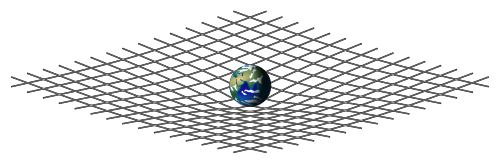
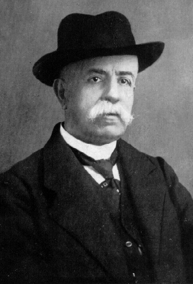
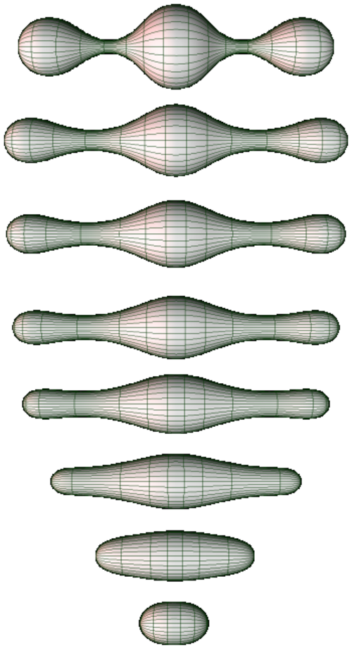

# 곡률을 요약하는 법

## 출발 문제

리만 곡률 텐서는 $n$차원에서 $n^2(n^2-1)/12$개의 독립 성분을 가진다. 2차원에서는 1개, 3차원에서는 6개, 그리고 4차원 — 우리가 사는 시공간의 차원 — 에서는 20개다. 이 20개의 숫자가 한 점에서의 곡률을 완전히 기술한다. 하지만 이 모든 정보를 항상 다 들고 다녀야 하는가?

일상에서 비슷한 상황을 떠올려 보자. 100명으로 이루어진 집단의 시험 성적을 기술하려면 100개의 숫자가 필요하다. 하지만 실제로 우리가 자주 쓰는 것은 평균, 분산, 중앙값 같은 **요약 통계량**이다. 정보는 잃지만, 핵심은 남긴다. 곡률 텐서에서도 같은 전략이 가능할까?

더 구체적으로, 아인슈타인이 일반상대성이론의 장방정식을 세울 때 직면한 문제가 바로 이것이었다. 물질의 에너지-운동량 텐서 $T_{ij}$는 대칭 2차 텐서로 독립 성분이 10개다. 이것을 4차 텐서인 리만 곡률(20개 성분)과 직접 등치시킬 수는 없다. 곡률의 적절한 "요약"이 필요했다. 20개를 10개로 압축하되, 물리적으로 의미 있는 방식으로.

## 패턴

텐서의 성분들을 체계적으로 합산하는 **축약(contraction)**이라는 연산이 있다. 위 첨자와 아래 첨자를 하나씩 짝지어 합산하면, 텐서의 "등급"이 2만큼 줄어든다. 행렬의 대각합(trace)이 가장 친숙한 예시다: $n \times n$ 행렬(2차 텐서)의 대각 성분을 합하면 하나의 수(0차 텐서)가 된다.

리만 곡률 텐서 $R^i{}_{jkl}$에 이 전략을 적용하자. 첫째 첨자와 셋째 첨자를 짝지어 합산하면 2차 텐서가 남는데, 이것이 **리치 텐서**다.

$$
\textcolor{#5c5ab0}{R}_{jl} = \sum_{i} \textcolor{#c2185b}{R}^i{}_{jil}
$$

$$
\begin{array}{ll}
\textcolor{#c2185b}{R}^i{}_{jkl} & \text{리만 곡률 텐서 (첨자 4개)} \\
\textcolor{#5c5ab0}{R}_{jl} & \text{리치 텐서 (첨자 2개, 대칭)} \\
i, j, l & \text{좌표 방향 첨자. 같은 } i \text{ 가 위아래에 오면 합산}
\end{array}
$$

4차원에서는 4차 텐서의 20개 성분이 대칭 2차 텐서의 10개 성분으로 압축된다. 그렇다면 정보가 사라진 것일까? 사라졌다. 리치 텐서가 포착하지 못하는 나머지 10개 성분의 정보는 **바일 텐서** $C_{ijkl}$에 담긴다.

리치 텐서를 계량으로 한 번 더 축약하면 숫자 하나가 나온다. 이것이 **스칼라 곡률**이다.

$$
\textcolor{#4d8a12}{R} = \sum_{j,l} \textcolor{#d62728}{g}^{jl}\, \textcolor{#5c5ab0}{R}_{jl}
$$

$$
\begin{array}{ll}
\textcolor{#4d8a12}{R} & \text{스칼라 곡률 (첨자 없음, 한 점에 숫자 하나)} \\
\textcolor{#d62728}{g}^{jl} & \text{계량의 역행렬 성분} \\
\textcolor{#5c5ab0}{R}_{jl} & \text{리치 텐서}
\end{array}
$$

10개의 정보를 1개로 압축했으니 더 많은 것을 잃지만, 대신 "이 점에서 공간이 전체적으로 얼마나 휘어 있는가"라는 가장 거친 요약을 얻는다. 학급 전체의 성적을 평균 한 숫자로 요약하는 것과 같다. 같은 글자 $R$이 첨자 개수에 따라 세 가지 다른 대상을 가리킨다는 점에 주의하자. 이 장의 수식에서는 셋을 서로 다른 색으로 구분한다.

이 축약의 계층 — 리만(4차) → 리치(2차) → 스칼라(0차) — 은 곡률 정보의 **자연스러운 압축 경로**다. 각 단계에서 정보를 잃지만, 남는 정보는 점점 더 본질적인 기하학적 의미를 갖는다.

## 정리

리치 곡률은 "부피가 어떻게 변하는가"를 측정한다. 한 점 $p$에서 모든 방향으로 거리 $\epsilon$만큼 떨어진 점들의 집합 — **측지 공(geodesic ball)** — 을 생각하자. 평평한 공간에서 이 공의 부피는 $\omega_n \epsilon^n$이다($\omega_n$은 $n$차원 단위공의 부피). 하지만 곡률이 있으면 부피가 달라진다:

$$
\text{Vol}\big(B_\epsilon(p)\big) = \omega_n\, \epsilon^n \left(1 - \frac{\textcolor{#4d8a12}{R}}{6(n+2)}\,\epsilon^2 + \cdots\right)
$$

$$
\begin{array}{ll}
\textcolor{#4d8a12}{R} & \text{점 } p \text{ 에서의 스칼라 곡률} \\
\epsilon & \text{측지 공의 반지름 (작은 수)} \\
n & \text{공간의 차원} \\
\omega_n & n \text{차원 단위공의 부피 (} \omega_2 = \pi,\ \omega_3 = 4\pi/3 \text{)}
\end{array}
$$

스칼라 곡률이 양수이면 측지 공의 부피가 유클리드 공간에서보다 **작다**. 공간이 무언가 움직인다는 뜻이 아니라, 같은 반지름 안에 들어가는 부피가 모자란다는 뜻이다. 구의 표면을 생각하면 직관적이다. 구 위에 그린 작은 원은 평면 위의 같은 반지름의 원보다 면적이 작다. 반대로 음의 곡률(쌍곡 공간)에서는 측지 공의 부피가 더 크다.

리치 텐서는 이 부피 변화를 **방향별로** 분해한다. $R_{ij}v^iv^j$는 방향 $v$로 나란히 출발한 측지선 다발이 얼마나 빨리 모이는지를 알려준다. 양수이면 그 방향의 측지선들이 모이고, 음수이면 흩어진다. 이것이 왜 중요할까? 물질이 중력으로 끌어당기는 효과가 바로 이것이기 때문이다. 먼지 구름 속에서 자유낙하하는 입자들의 다발은 시간이 갈수록 모여 부피가 줄어드는데, 이것이 양의 리치 곡률이다. 반면 지구 바깥의 텅 빈 공간에서는 리치 곡률이 0이다. 거기서 자유낙하하는 물방울은 부피를 유지한 채 지구 쪽으로 길쭉해지고 옆으로는 가늘어질 뿐인데, 이 모양 변화는 뒤에 나오는 바일 텐서의 몫이다.

아인슈타인 텐서는 리치 텐서와 스칼라 곡률의 특별한 조합이다.

$$
G_{ij} = \textcolor{#5c5ab0}{R}_{ij} - \frac{1}{2}\,\textcolor{#4d8a12}{R}\,\textcolor{#d62728}{g}_{ij}, \qquad \textcolor{#9467bd}{\nabla}^i G_{ij} = 0
$$

$$
\begin{array}{ll}
G_{ij} & \text{아인슈타인 텐서} \\
\textcolor{#5c5ab0}{R}_{ij},\ \textcolor{#4d8a12}{R} & \text{리치 텐서, 스칼라 곡률} \\
\textcolor{#d62728}{g}_{ij} & \text{계량} \\
\textcolor{#9467bd}{\nabla}^i & \text{레비-치비타 접속으로 잰 발산}
\end{array}
$$

이 텐서의 핵심 성질은 두 번째 식처럼 **발산이 정확히 0**이라는 것이다. 이것은 순전히 기하학적 항등식(비안키 항등식의 귀결)이지만, 물리적으로는 에너지-운동량의 보존법칙 $\nabla^i T_{ij} = 0$과 정확히 대응한다. 아인슈타인 방정식 $G_{ij} = 8\pi G\, T_{ij}$($G$는 중력상수)의 양변을 같게 놓을 수 있는 것도 양변의 발산이 모두 0이기 때문이다. 기하학의 항등식이 물리학의 보존법칙을 보장하는 것이다.

### 따라 계산해 보기 — 구의 리치 곡률과 스칼라 곡률

반지름 $r$인 구면 $S^2$를 구면좌표 $(\textcolor{#1b9e77}{\theta}, \textcolor{#1b9e77}{\phi})$로 쓰면 계량은 $ds^2 = r^2(d\theta^2 + \sin^2\theta\, d\phi^2)$, 즉 $g_{\theta\theta} = r^2$, $g_{\phi\phi} = r^2\sin^2\theta$이다. 정의대로 리만 텐서를 계산하면 독립 성분은 하나뿐이고, $R^\theta{}_{\phi\theta\phi} = \sin^2\theta$이다. 대칭성으로 $R^\phi{}_{\theta\phi\theta} = 1$도 따라 나온다. 이제 첫째·셋째 첨자를 축약한다.

$$
\textcolor{#5c5ab0}{R}_{\theta\theta} = \textcolor{#c2185b}{R}^\phi{}_{\theta\phi\theta} = 1, \qquad
\textcolor{#5c5ab0}{R}_{\phi\phi} = \textcolor{#c2185b}{R}^\theta{}_{\phi\theta\phi} = \sin^2\textcolor{#1b9e77}{\theta}, \qquad
\textcolor{#5c5ab0}{R}_{\theta\phi} = 0
$$

$$
\begin{array}{ll}
\textcolor{#5c5ab0}{R}_{\theta\theta}, \textcolor{#5c5ab0}{R}_{\phi\phi} & \text{리치 텐서 성분} \\
\textcolor{#c2185b}{R}^\phi{}_{\theta\phi\theta} & \text{리만 텐서 성분} \\
\textcolor{#1b9e77}{\theta}, \textcolor{#1b9e77}{\phi} & \text{구면좌표 (여위도, 경도)}
\end{array}
$$

리치 텐서의 성분이 계량 성분을 정확히 $r^2$로 나눈 값이라는 점이 눈에 띈다. 곧 $R_{ij} = g_{ij}/r^2$이다. 스칼라 곡률은 역계량 $g^{\theta\theta} = 1/r^2$, $g^{\phi\phi} = 1/(r^2\sin^2\theta)$으로 한 번 더 축약하면 나온다.

$$
\textcolor{#4d8a12}{R} = \textcolor{#d62728}{g}^{\theta\theta}\textcolor{#5c5ab0}{R}_{\theta\theta} + \textcolor{#d62728}{g}^{\phi\phi}\textcolor{#5c5ab0}{R}_{\phi\phi} = \frac{1}{r^2} + \frac{\sin^2\theta}{r^2\sin^2\theta} = \frac{2}{r^2}
$$

$$
\begin{array}{ll}
\textcolor{#4d8a12}{R} & \text{스칼라 곡률} \\
\textcolor{#d62728}{g}^{\theta\theta}, \textcolor{#d62728}{g}^{\phi\phi} & \text{역계량 성분} \\
r & \text{구의 반지름 (보조 기호)}
\end{array}
$$

가우스 곡률이 $K = 1/r^2$이므로 "2차원에서는 스칼라 곡률이 가우스 곡률의 2배"라는 말이 그대로 확인된다. 부피 공식으로도 검산할 수 있다. 구 위에서 반지름 $\epsilon$인 측지 원판의 넓이는 정확히 $2\pi r^2(1 - \cos(\epsilon/r))$이고, 이것을 전개하면 $\pi\epsilon^2(1 - \epsilon^2/(12r^2) + \cdots)$이다. 부피 공식에 $n = 2$, $R = 2/r^2$를 넣으면 $\pi\epsilon^2(1 - \frac{2/r^2}{6\cdot 4}\epsilon^2) = \pi\epsilon^2(1 - \epsilon^2/(12r^2))$로 똑같다.

## 정의

- **리치 텐서** (부피 변화율 / Volume Growth Rate, $R_{ij}$) — 곡률 텐서 $R^k{}_{ikj}$를 첫째와 셋째 첨자에 대해 축약한 대칭 2차 텐서. 한 점에서 각 방향으로 측지선 다발의 부피가 얼마나 빠르게 변하는지를 알려준다. 리치 텐서가 0이면 — 리치 평탄(Ricci-flat) — 부피는 유클리드 공간에서처럼 변한다. 진공에서의 아인슈타인 방정식은 정확히 $R_{ij} = 0$이다.

- **스칼라 곡률** (전체 휘어짐의 한 숫자 요약 / One-Number Curvature Summary, $R = g^{ij}R_{ij}$) — 리치 텐서를 계량으로 한 번 더 축약한 것. 한 점에서의 곡률을 하나의 숫자로 요약한다. "평균 곡률"이라고 생각할 수 있다. 2차원에서는 스칼라 곡률이 가우스 곡률의 2배와 같으므로, 스칼라 곡률 하나로 곡률의 모든 정보가 담긴다. 하지만 3차원 이상에서는 정보 손실이 불가피하다.

- **아인슈타인 텐서** (중력이 보는 곡률 / The Part Gravity Cares About, $G_{ij} = R_{ij} - \frac{1}{2}Rg_{ij}$) — 리치 텐서에서 스칼라 곡률의 "추적(trace)" 부분을 빼서 발산이 정확히 0이 되도록 만든 텐서. 발산이 0이라는 성질 덕분에 에너지-운동량 보존을 자동으로 만족하는 장방정식을 쓸 수 있다. 일반상대성이론의 핵심 등식 $G_{ij} = 8\pi G \cdot T_{ij}$의 좌변이 바로 이것이다.

- **바일 텐서** (조석력 / Tidal Force Tensor, $C_{ijkl}$) — 리만 곡률 텐서에서 리치 텐서로 결정되는 부분을 빼고 남은 나머지. "추적 없는(traceless)" 곡률이라고도 한다. 바일 텐서는 부피를 바꾸지 않고 **모양만 변형**하는 곡률, 즉 조석력(tidal force)에 대응한다. 지구 바깥의 진공에서 중력이 물체를 한 방향으로 늘이고 다른 방향으로 줄이는 것, 곧 밀물과 썰물을 만드는 조석력이 바일 곡률의 효과다. 3차원 이하에서는 바일 텐서가 항상 0이다 — 리치 텐서만으로 곡률 전체가 결정되기 때문이다.

## 핵심 인물과 일화

### 그레고리오 리치-쿠르바스트로 (Gregorio Ricci-Curbastro, 1853–1925)

리만 곡률 텐서가 존재한다는 것을 리만이 보였지만, 이것을 체계적으로 다루는 계산 언어를 만든 사람은 리치-쿠르바스트로다. 파도바 대학 교수였던 리치는 1880년대부터 "절대 미분학(calcolo differenziale assoluto)"을 개발한다 — 좌표에 의존하지 않는 텐서 연산의 체계.

리치의 핵심 아이디어 중 하나가 **축약(contraction)**이다. 4개의 첨자를 가진 리만 곡률 텐서 $R^i{}_{jkl}$에서, 첫째와 셋째 첨자를 합산하면 2개의 첨자를 가진 텐서가 남는다: $R_{jl} = R^i{}_{jil}$. 이것이 리치 텐서다. 곡률의 완전한 정보를 담고 있지는 않지만, "측지선 다발의 부피가 어떻게 변하는가"라는 직관적 의미를 갖는다.

리치 자신은 이 텐서에 특별한 물리적 의미를 부여하지 않았다. 그것은 20년 뒤 아인슈타인의 일반상대성이론에서 이루어진다.

### 리처드 해밀턴 (Richard S. Hamilton, 1943–2024)

리치 텐서에 완전히 새로운 생명을 불어넣은 사람은 리처드 해밀턴이다. 1982년, 해밀턴은 획기적인 아이디어를 제시한다: 계량 텐서를 리치 곡률에 따라 **흘려보내면** 어떨까?

$$
\frac{\partial \textcolor{#d62728}{g}_{ij}}{\partial t} = -2\,\textcolor{#5c5ab0}{R}_{ij}
$$

$$
\begin{array}{ll}
\textcolor{#d62728}{g}_{ij} & \text{시간에 따라 변하는 계량} \\
\textcolor{#5c5ab0}{R}_{ij} & \text{그 순간 계량의 리치 텐서} \\
t & \text{흐름의 시간 (보조 기호)}
\end{array}
$$

이것이 **리치 흐름(Ricci flow)**이다. 리치 곡률이 양인 방향에서는 계량이 줄어들어 공간이 수축하고, 음인 방향에서는 팽창한다. 반지름 $r_0$인 구면 $S^2$에서는 위의 예제처럼 $R_{ij} = g_{ij}/r^2$이므로 식이 $\frac{d(r^2)}{dt} = -2$가 되고, 반지름은 $r(t)^2 = r_0^2 - 2t$를 따라 줄어들다가 $t = r_0^2/2$에 한 점으로 사라진다. 둥근 모양은 끝까지 유지된 채 크기만 줄어든다. 마치 고르지 않은 금속판에 열을 가하면 온도가 균일해지듯, 리치 흐름은 매니폴드의 기하학을 "균일하게" 만든다.

해밀턴은 이 흐름을 사용하여, 닫힌 3차원 매니폴드가 모든 곳에서 양의 리치 곡률을 가지면 흐름이 그것을 둥근 구(또는 구를 대칭으로 접어 만든 공간)로 데려간다는 것을 증명했다. 하지만 일반적인 3차원 매니폴드에 대해서는 특이점(singularity) 문제에 가로막혔다.

### 그리고리 페렐만 (Grigori Perelman, 1966–)

2002년 11월, 러시아 수학자 그리고리 페렐만은 arXiv에 짧은 프리프린트를 올린다. 제목: "리치 흐름의 엔트로피 공식과 그 기하학적 응용." 후속 논문 두 편이 2003년에 이어진다.

페렐만은 해밀턴의 리치 흐름이 특이점에 도달할 때 어떤 일이 벌어지는지를 완전히 분석했다. 특이점이 생기면, 해밀턴이 구상했던 대로 매니폴드를 "수술(surgery)"로 절단하고, 각 조각에서 리치 흐름을 다시 시작한다. 이 과정을 반복하면 3차원 매니폴드가 표준적인 조각들로 분해된다는 것을 보인 것이다.

이 결과의 직접적 귀결이 **푸앵카레 추측**의 증명이다: 단일연결(simply connected)인 닫힌 3차원 매니폴드는 3차원 구와 같다. 1904년에 제기되어 100년간 미해결이었던 문제가 곡률 텐서의 축약이라는 리치의 대수적 조작과 해밀턴의 기하학적 흐름, 페렐만의 해석학적 통찰의 결합으로 풀린 것이다.

페렐만은 이 업적으로 필즈상(2006)과 밀레니엄 상금(2010, 100만 달러)을 수상했으나 모두 거절했다. "증명이 올바르다면 다른 인정은 필요 없다"는 이유였다.

## 직접 움직여 보기

첫 번째 그림은 곡률 $K$인 곡면 위에 반지름이 같은 측지 원판을 그리고, 평면의 원판과 넓이를 비교한다. 곡률을 양수 쪽으로 밀면 원판이 모자라고, 음수 쪽으로 밀면 넘친다. 부피 공식의 보정 항 $-\frac{R}{24}\epsilon^2$이 실제 넓이와 얼마나 잘 맞는지도 함께 보자.

  <noscript>이 시각화를 보려면 JavaScript가 필요합니다.</noscript>

두 번째 그림은 둥근 구에 리치 흐름을 걸었을 때다. 시간을 흘려 보내면 반지름의 제곱이 일정한 속도로 줄어들고, 그동안 스칼라 곡률은 점점 커지다가 소멸 시각에 무한대로 발산한다. 차원을 바꾸면 소멸 속도가 어떻게 달라지는지도 확인할 수 있다.

  <noscript>이 시각화를 보려면 JavaScript가 필요합니다.</noscript>

## 연습문제와 같이 풀기

각 문제를 먼저 혼자 풀어 본 뒤, 바로 아래 세션에서 선생님과 두 학생이 어떻게 풀어 가는지 따라가 보자.

### 문제 1 — 요약이 원본보다 크다?

확인 2차원 곡면에서 리만 곡률 텐서의 독립 성분은 1개뿐인데, 리치 텐서는 대칭 $2\times 2$ 행렬이라 성분이 3개다. 요약이 원본보다 정보가 많아 보이는데, 어디가 잘못된 생각인가?

#### 같이 풀기 세션 1

**김민준:** 이건 진짜 이상해요. 구면 좌표로 numpy에서 리치 텐서를 뽑으면 $R_{\theta\theta}$, $R_{\theta\phi}$, $R_{\phi\phi}$ 세 개가 나오거든요. 리만은 하나라면서요. 그럼 리치가 정보가 더 많은 거 아니에요?

**선생님:** 그 세 숫자를 저한테 불러 줘 볼래요? 반지름 $r$인 구에서요.

**김민준:** $1$, $0$, $\sin^2\theta$요.

**이서연:** 그거 계량이랑 똑같은 모양이잖아. $g_{\theta\theta} = r^2$, $g_{\phi\phi} = r^2\sin^2\theta$니까 리치는 계량을 $r^2$로 나눈 거야.

**선생님:** 그럼 질문을 바꿔 볼게요. 계량을 이미 알고 있다면, 그 세 숫자를 알려 주려면 숫자를 몇 개 더 알려 주면 되죠?

**김민준 〔M07〕:** 하나요. 나누는 수 $1/r^2$만 알면 나머지는 계량에서 다 나오네요. 세 개가 아니라 사실상 하나였어요.

**선생님:** 맞아요. 2차원에서는 언제나 $R_{ij} = K g_{ij}$예요. 곡률 쪽 정보는 가우스 곡률 $K$ 하나뿐이고, 성분이 셋처럼 보이는 건 계량이 곱해져 있어서예요. 성분의 개수와 독립적인 정보의 개수는 다를 수 있어요.

**김민준:** 조교님이 보고서 분량 채우려고 같은 표를 단위만 바꿔서 세 번 붙이면 한 번으로 친다고 했던 거랑 같네요. 칸 수가 늘었다고 내용이 늘어난 게 아니었어요.

### 문제 2 — 3차원 구면의 스칼라 곡률

계산 반지름 $r$인 3차원 구면 $S^3$에서 리치 텐서는 $R_{ij} = \frac{2}{r^2}\, g_{ij}$이다. 스칼라 곡률 $R$을 구하고, 측지 공의 정확한 부피 $V(\epsilon) = \pi r^3\left(\frac{2\epsilon}{r} - \sin\frac{2\epsilon}{r}\right)$를 $\epsilon$에 대해 전개해 부피 공식과 맞는지 확인하라.

#### 같이 풀기 세션 2

**김민준:** 스칼라 곡률은 대각합이니까 리치 텐서 대각 성분을 더하면 되죠? 좌표를 $(\chi, \theta, \phi)$로 잡으면 $g = r^2\,\mathrm{diag}(1,\ \sin^2\chi,\ \sin^2\chi\sin^2\theta)$라서 $R = 2(1 + \sin^2\chi + \sin^2\chi\sin^2\theta)$가 나와요.

**이서연:** 잠깐, 그러면 $R$이 위치마다 달라지잖아. 구면은 어느 점이나 똑같이 생겼는데.

**선생님:** 좋은 경보예요. 민준 학생, 행렬의 대각합은 어떤 행렬에 대해서 정의되는 거죠? 성분을 그냥 더해도 되는 건 언제예요?

**김민준 〔M04〕:** 선형대수에서는… 같은 공간에서 같은 공간으로 가는 선형사상의 대각합이요. $R_{ij}$는 첨자가 둘 다 아래에 있으니까 그대로는 그런 행렬이 아니네요. 먼저 $g^{ij}$를 곱해서 첨자 하나를 올려야 하고요.

**김민준:** 그러면 $R = g^{ij}R_{ij} = \frac{2}{r^2}\, g^{ij}g_{ij} = \frac{2}{r^2}\times 3 = \frac{6}{r^2}$이에요. 위치에 상관없는 숫자가 나왔어요.

**김민준:** 과제에서 단위가 다른 열을 그냥 더했다가 조교님이 "센티미터랑 인치를 더하셨네요"라고 적어 준 것과 같은 실수였어요. $g^{ij}$가 단위를 맞춰 주는 환산표였던 거죠.

**이서연:** 부피는 내가 해 볼게. $\sin x = x - x^3/6 + x^5/120 - \cdots$에 $x = 2\epsilon/r$를 넣으면 $2x$가… 아니, $\frac{2\epsilon}{r} - \sin\frac{2\epsilon}{r} = \frac{1}{6}\left(\frac{2\epsilon}{r}\right)^3 - \frac{1}{120}\left(\frac{2\epsilon}{r}\right)^5 + \cdots$이니까 $V = \frac{4}{3}\pi\epsilon^3 - \frac{4\pi\epsilon^5}{15 r^2} + \cdots$야.

**선생님:** 부피 공식 쪽은요?

**이서연 〔S07〕:** $n = 3$, $\omega_3 = 4\pi/3$, $R = 6/r^2$을 넣으면 $\frac{4}{3}\pi\epsilon^3\left(1 - \frac{6/r^2}{6\cdot 5}\epsilon^2\right) = \frac{4}{3}\pi\epsilon^3 - \frac{4\pi\epsilon^5}{15r^2}$. 둘째 항까지 정확히 같아. 차원이 $n$이면 $R = n(n-1)/r^2$가 되겠네.

### 문제 3 — 텅 빈 우주는 평평한가

킬러 지구 바깥의 진공에서 아인슈타인 방정식은 $R_{ij} = 0$이 된다. 그렇다면 지구 바깥의 시공간은 휘어 있지 않은가? 달이 바닷물을 끌어당겨 밀물과 썰물이 생기는 현상과 어떻게 맞춰 볼 수 있을까?

#### 같이 풀기 세션 3

**김민준:** 리치가 0이면 스칼라 곡률도 0이잖아요. 요약이 전부 0이니까 곡률이 없는 거고, 그럼 평평하죠. 밀물 썰물은 그냥 뉴턴 중력으로 설명하면 되고요.

**이서연:** 나도 평평하다에 한 표. 바일 텐서는 3차원 이하에서 항상 0이라고 했잖아. 그러면 곡률 전체가 리치로 정해지니까, 리치가 0이면 리만도 0이야.

**선생님:** 두 사람이 다른 길로 같은 결론에 왔네요. 서연 학생, 아인슈타인 방정식은 몇 차원 공간에 대한 식이죠?

**이서연 〔S06〕:** 시공간이니까… 4차원이요. 아, 3차원이라는 조건을 잘못 가져왔네요. 4차원에서는 리만 20개 중에 리치가 10개를 가져가고 바일이 나머지 10개를 가져가니까, 리치가 0이어도 바일은 남을 수 있어요.

**선생님:** 그래요. 민준 학생은 "뉴턴 중력으로 설명하면 된다"고 했죠. 그럼 뉴턴 중력으로 해 볼까요? 지구의 퍼텐셜 $\Phi = -GM/\rho$의 이계도함수 행렬을 지구에서 거리 $\rho$인 점에서 계산해 보세요. 이 행렬이 근처 물방울들이 서로 얼마나 벌어지는지를 알려 줘요.

**김민준:** numpy로 해 볼게요. 지구 방향을 $x$축으로 잡으면 $\frac{GM}{\rho^3}\,\mathrm{diag}(-2,\ 1,\ 1)$이 나와요. 물방울 사이의 상대 가속도는 이 행렬에 마이너스를 붙여서 곱하니까, 지구 방향으로는 벌어지고 옆 방향으로는 좁혀지네요. 그리고 대각합이 $-2 + 1 + 1 = 0$이에요.

**김민준 〔M08〕:** 아, 대각합이 0이니까 부피는 그대로인데 모양은 바뀌는 거네요! 이게 리치 0, 바일은 0이 아닌 상황이구나. 요약이 0이라고 원본이 0인 건 아니었어요.

**선생님:** 정확해요. 뉴턴 이론에서도 진공에서는 $\nabla^2\Phi = 0$, 곧 이 행렬의 대각합이 0이죠. 그 대각합이 리치 곡률에 해당하고, 대각합을 뺀 나머지가 바일 곡률에 해당해요. 밀물과 썰물은 바닷물이 달 쪽과 반대쪽으로 길쭉해지는 모양 변화라서, 바일 곡률이 만드는 현상이에요.

**이서연:** 선형대수 시간에 대각합이 0인 행렬도 영행렬은 아니라고 배웠는데, 그걸 곡률에서 다시 만난 느낌이야. 대각합은 행렬의 요약일 뿐이지.

**김민준:** 반 평균이 작년이랑 같다고 조교님이 "이번 시험은 달라진 게 없다"고 했다가, 점수 분포를 보니 완전히 양극화돼 있었던 거랑 비슷하네요. 평균만 보면 모양 변화는 안 보여요.

**선생님 〔T13〕:** 그게 이 장의 교훈이에요. 요약은 편리하지만, 요약에서 버린 정보가 때로는 바다를 움직여요.

## 연결되는 세계들

| 분야 | 연결 |
|------|------|
| 일반상대론 | 아인슈타인 방정식, 블랙홀의 특이점, 우주론 |
| 위상수학 | 리치 흐름과 푸앵카레 추측 (페렐만, 2003) |
| 기계학습 | 손실 풍경의 리치 곡률 → 학습이 어려운 영역 |
| 최적수송 | 리치 곡률의 하한과 최적수송의 수축 성질 |
| 정보기하학 | 통계적 매니폴드의 스칼라 곡률 → 추정의 효율성 |
