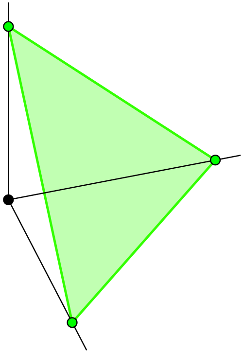

# 같은 공간에 접속이 두 개?

## 출발 문제

앞 장들에서 우리는 레비-치비타 접속을 만났다. 계량이 주어지면 접속은 유일하게 결정된다 — 이것이 리만 기하학의 기본 정리였다. 그런데 정보기하학에 발을 들이면 이상한 일이 벌어진다. 같은 공간(확률분포의 매니폴드) 위에 "합의 길"(m-접속)과 "곱의 길"(e-접속)이라는 두 가지 서로 다른 접속이 등장하는 것이다.

잠깐, 이것이 가능한가? 레비-치비타 접속이 유일하다고 했는데, 같은 매니폴드 위에 다른 접속이 존재한다니. 모순이 아닌가? 이 질문을 풀기 위해서는 레비-치비타의 유일성 정리를 다시 들여다봐야 한다. 유일성은 **두 가지 조건**을 동시에 요구할 때 성립한다: (1) 계량 호환성(metric compatibility)과 (2) 비틀림 없음(torsion-free). 이 중 하나라도 포기하면 유일성은 깨진다.

그렇다면 m-접속과 e-접속은 이 두 조건 중 어떤 것을 포기한 것인가? 놀랍게도, 비틀림은 여전히 없다. 포기한 것은 계량 호환성이다. 하지만 완전히 포기한 것은 아니다 — 계량 호환성을 **쌍으로** 나누어 가진다. 한 접속이 잃은 것을 다른 접속이 보상하는 식이다. 이것이 쌍대 접속(dual connection)의 핵심 아이디어다.

## 패턴

레비-치비타 접속의 계량 호환성은 $X \cdot g(Y, Z) = g(\nabla_X Y, Z) + g(Y, \nabla_X Z)$로 표현된다. 내적의 미분을 양쪽에 고르게 분배하는 것이다. 이제 이 "고른 분배"를 포기하고, 왼쪽과 오른쪽에 **다른** 접속을 허용하면 어떻게 될까?

$$X \cdot g(Y, Z) = g(\nabla_X Y, Z) + g(Y, \nabla^*_X Z)$$

여기서 $\nabla$와 $\nabla^*$는 서로 다른 접속이다. 이 등식을 만족하는 $\nabla^*$를 $\nabla$의 **쌍대 접속**이라 부른다. 직관적으로, $\nabla$가 내적의 한쪽을 "비틀어서" 보존하지 못하는 만큼을 $\nabla^*$가 반대쪽에서 정확히 보상한다. 마치 거울처럼, 한쪽의 비대칭을 다른 쪽이 반영한다.

$\nabla = \nabla^*$인 특수한 경우가 바로 레비-치비타 접속이다. 즉 레비-치비타는 "자기 자신이 쌍대인" 유일한 접속이다. 쌍대 접속 이론에서 레비-치비타는 사라지는 것이 아니라, 스펙트럼의 중심에 놓인다.

확률분포의 공간에서 이 구조가 자연스럽게 나타나는 이유는 확률분포를 결합하는 두 가지 근본적 방식 때문이다. 분포를 **더하는** 것(혼합, mixture)과 **곱하는** 것(지수적 결합, exponential). 덧셈이 자연스러운 좌표계에서의 직선이 m-측지선이고, 곱셈이 자연스러운 좌표계에서의 직선이 e-측지선이다. 이 두 "직선의 개념"이 정확히 쌍대 접속 쌍을 형성한다.

## 정리 (아마리-나가오카)

통계적 매니폴드 위에서, 피셔 계량 $g$와 더불어 3차 대칭 텐서 $C$(큐빅 텐서)가 자연스럽게 정의된다. 이 큐빅 텐서는 확률분포족의 "3차 비대칭"을 포착하며, 로그가능도의 3차 미분과 관련된다. 아마리와 나가오카는 이로부터 접속의 1-매개변수족을 구성했다:

$$\nabla^{(\alpha)} = \nabla^{(0)} + \frac{\alpha}{2}C$$

여기서 $\nabla^{(0)}$은 레비-치비타 접속이고 $\alpha$는 실수 매개변수다. $\alpha = 0$이면 레비-치비타, $\alpha = 1$이면 e-접속, $\alpha = -1$이면 m-접속이다. 핵심 정리는 이것이다: **$\nabla^{(\alpha)}$와 $\nabla^{(-\alpha)}$는 항상 피셔 계량에 대해 쌍대이다.**

이것은 놀라운 통합이다. 무한히 많은 접속이 하나의 매개변수 $\alpha$로 연결되고, $\alpha = 0$(레비-치비타)을 중심으로 양쪽이 거울처럼 대응한다. 물리학에서 입자와 반입자가 쌍을 이루듯, 접속도 쌍을 이룬다.

더 나아가, 지수족(exponential family) 위에서 $\nabla^{(1)}$과 $\nabla^{(-1)}$은 모두 **평탄**(곡률이 0)이다. 즉 두 접속 모두에 대해 매니폴드가 "곧다". 하지만 두 접속이 정의하는 "곧음"이 서로 다르다. 이 상태를 **쌍대 평탄(dually flat)**이라 부르며, 이것이 정보기하학의 가장 풍부한 구조를 낳는 토양이다.

## 정의

- **쌍대 접속** (거울 접속 / Mirror Connection, $\nabla$ and $\nabla^*$) — $g(\nabla_X Y, Z) + g(Y, \nabla^*_X Z) = X \cdot g(Y,Z)$를 만족하는 접속 쌍. 레비-치비타 접속이 내적을 "혼자서" 보존한다면, 쌍대 접속은 "둘이서 함께" 보존한다. 한 접속이 비틀어 놓은 것을 쌍대 접속이 정확히 되돌린다. 모든 접속에는 유일한 쌍대가 존재하며, 레비-치비타는 자기 자신이 쌍대인 유일한 접속이다.

- **$\alpha$-접속** ($\alpha$-기울기 비교기 / $\alpha$-Tilted Comparator) — 레비-치비타 접속에 큐빅 텐서의 $\alpha/2$배를 더한 접속. $\alpha = 0$이면 레비-치비타, $\alpha = 1$이면 e-접속(지수족의 자연 매개변수에서의 직선), $\alpha = -1$이면 m-접속(혼합 매개변수에서의 직선)이다. $\alpha$를 연속적으로 움직이면 접속이 부드럽게 변하며, 측지선의 모양도 e-측지선에서 레비-치비타 측지선을 거쳐 m-측지선으로 변형된다.

- **큐빅 텐서** (3차 비대칭 / Third-Order Asymmetry, $C$) — $\nabla^{(\alpha)} = \nabla^{(0)} + \frac{\alpha}{2}C$에서 접속족 전체를 결정하는 3차 대칭 텐서. 확률분포 공간에서는 로그가능도의 3차 모멘트에 해당한다. 큐빅 텐서가 0이면 모든 $\alpha$-접속이 레비-치비타와 일치하며, 쌍대 구조는 퇴화한다. 큐빅 텐서의 크기는 "레비-치비타로부터 얼마나 벗어나 있는가"를 측정한다.

- **쌍대 평탄** (양쪽 다 곧은 / Dually Flat) — $\nabla$와 $\nabla^*$가 모두 곡률 0인 경우. 각 접속에 대해 전역적 아핀 좌표계가 존재하며, 이 두 좌표계는 르장드르 변환으로 연결된다. 지수족이 대표적 예시다: 자연 매개변수 $\theta$는 e-접속에 대한 아핀 좌표이고, 기대 매개변수 $\eta$는 m-접속에 대한 아핀 좌표이며, 이 둘은 로그 분배함수의 르장드르 변환으로 연결된다. 열역학에서 에너지와 엔트로피가 르장드르 쌍인 것과 정확히 같은 구조다.

## 핵심 인물과 일화

### 아마리 순이치 (甘利俊一, Shun-ichi Amari, 1936–)

아마리 순이치의 이력은 특이하다. 그는 원래 **신경과학자**였다. 1960년대 도쿄대학에서 신경회로의 수학적 모델을 연구하던 그는, 신경망의 학습 과정을 기술하려면 매개변수 공간의 기하학적 구조를 이해해야 한다는 것을 깨닫는다.

1968년, 아마리는 확률분포의 공간에 리만 기하학을 적용하는 첫 논문을 발표한다. 피셔 정보행렬이 이 공간의 자연스러운 리만 계량이라는 사실은 이미 C. R. 라오(Rao)가 1945년에 지적했지만, 아마리는 더 나아갔다: 이 공간에는 레비-치비타 접속 외에도 자연스러운 접속이 있다.

핵심 발견은 1982년과 1985년의 논문들에서 나온다. 아마리는 지수족(exponential family)에서 두 종류의 "직선"이 자연스럽게 나타남을 관찰한다:

- **m-측지선**: 확률분포의 합(혼합, mixture)으로 정의되는 직선
- **e-측지선**: 확률분포의 곱(지수적 결합)으로 정의되는 직선

이 두 종류의 직선은 서로 다른 접속 — m-접속과 e-접속 — 에 대한 측지선이다. 레비-치비타 접속은 이 둘의 정확한 중간에 위치한다 ($\alpha = 0$). 더 놀라운 것은, m-접속과 e-접속이 피셔 계량에 대해 **쌍대**라는 것이다.

### 나가오카 히로시 (長岡浩司, Hiroshi Nagaoka)

아마리의 제자 나가오카 히로시는 이 쌍대 구조를 엄밀하게 공리화하는 데 결정적 기여를 했다. 1993년 아마리와 나가오카가 공저한 교과서 *정보기하학의 방법(情報幾何の方法)*은 이 분야의 표준 참고서가 되었다 (2000년 영문판 *Methods of Information Geometry* 출간).

아마리-나가오카의 정리는 이렇게 요약된다: 리만 계량 $g$와 3차 대칭 텐서 $C$가 주어지면, 매개변수 $\alpha$로 연결되는 접속족 $\nabla^{(\alpha)}$가 정의되며, $\nabla^{(\alpha)}$와 $\nabla^{(-\alpha)}$는 항상 쌍대이다. 이 구조는 확률분포의 공간에 특유한 것이 아니라, 쌍대 평탄 구조를 가진 모든 매니폴드에 적용된다.

신경과학에서 출발하여 통계학을 거쳐 미분기하학에 도달한 이 여정은, 수학이 어떻게 분야의 경계를 넘어 성장하는지를 보여주는 전형적인 사례다.

## 시각화 아이디어

  <noscript>이 시각화를 보려면 JavaScript가 필요합니다.</noscript>

- 두 종류의 직선: 확률 심플렉스 위에서 m-측지선과 e-측지선을 같은 그림에
- 빛의 혼합 vs 물감의 혼합: RGB 혼합(합의 길)과 필터 중첩(곱의 길)

- $\alpha$-슬라이더: $\alpha$를 -1에서 +1까지 움직이면 측지선이 변하는 애니메이션

## 연결되는 세계들

| 분야 | 연결 |
|------|------|
| 정보기하학 | 쌍대 평탄 구조, 자연 매개변수 vs 기대 매개변수 |
| 통계학 | 지수족의 기하학, 충분통계량, 최대가능도 추정 |
| 열역학 | 르장드르 변환: 에너지 ↔ 엔트로피 |
| 기계학습 | DPO/RLHF에서의 KL 발산 방향성 |
| 양자정보 | Petz 분류: 양자 상태 공간에서의 단조 계량 |
