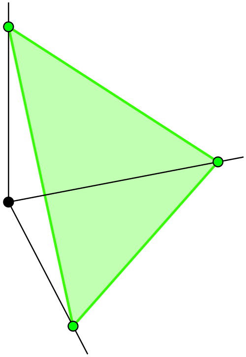

# 같은 공간에 접속이 두 개?

## 출발 문제

앞 장들에서 우리는 레비-치비타 접속을 만났다. 계량이 주어지면 접속은 유일하게 결정된다 — 이것이 리만 기하학의 기본 정리였다. 그런데 정보기하학에 발을 들이면 이상한 일이 벌어진다. 같은 공간(확률분포의 매니폴드) 위에 "합의 길"(m-접속)과 "곱의 길"(e-접속)이라는 두 가지 서로 다른 접속이 등장하는 것이다.

잠깐, 이것이 가능한가? 레비-치비타 접속이 유일하다고 했는데, 같은 매니폴드 위에 다른 접속이 존재한다니. 모순이 아닌가? 이 질문을 풀기 위해서는 레비-치비타의 유일성 정리를 다시 들여다봐야 한다. 유일성은 **두 가지 조건**을 동시에 요구할 때 성립한다: (1) 계량 호환성(metric compatibility)과 (2) 비틀림 없음(torsion-free). 이 중 하나라도 포기하면 유일성은 깨진다.

그렇다면 m-접속과 e-접속은 이 두 조건 중 어떤 것을 포기한 것인가? 놀랍게도, 비틀림은 여전히 없다. 포기한 것은 계량 호환성이다. 하지만 완전히 포기한 것은 아니다 — 계량 호환성을 **쌍으로** 나누어 가진다. 한 접속이 잃은 것을 다른 접속이 보상하는 식이다. 이것이 쌍대 접속(dual connection)의 핵심 아이디어다.

## 패턴

레비-치비타 접속의 계량 호환성은 다음 식으로 표현된다. 두 벡터장의 내적을 방향 $X$로 미분한 값이, 한쪽씩 미분해서 내적한 두 항의 합과 같다는 것이다.

$$
\textcolor{#1f77b4}{X}\, \textcolor{#d62728}{g}(\textcolor{#e8710a}{Y}, \textcolor{#e8710a}{Z}) = \textcolor{#d62728}{g}(\textcolor{#9467bd}{\nabla}_{\textcolor{#1f77b4}{X}} \textcolor{#e8710a}{Y}, \textcolor{#e8710a}{Z}) + \textcolor{#d62728}{g}(\textcolor{#e8710a}{Y}, \textcolor{#9467bd}{\nabla}_{\textcolor{#1f77b4}{X}} \textcolor{#e8710a}{Z})
$$

$$
\begin{array}{ll}
\textcolor{#1f77b4}{X} & \text{미분하는 방향} \\
\textcolor{#e8710a}{Y}, \textcolor{#e8710a}{Z} & \text{내적을 재는 두 벡터장} \\
\textcolor{#d62728}{g} & \text{계량 (내적)} \\
\textcolor{#9467bd}{\nabla} & \text{접속 (여기서는 레비-치비타)}
\end{array}
$$

내적의 미분을 양쪽에 같은 접속으로 고르게 나눠 주는 셈이다. 이제 이 "고른 분배"를 포기하고, 왼쪽과 오른쪽에 **다른** 접속을 허용하면 어떻게 될까?

$$
\textcolor{#1f77b4}{X}\, \textcolor{#d62728}{g}(\textcolor{#e8710a}{Y}, \textcolor{#e8710a}{Z}) = \textcolor{#d62728}{g}(\textcolor{#9467bd}{\nabla}_{\textcolor{#1f77b4}{X}} \textcolor{#e8710a}{Y}, \textcolor{#e8710a}{Z}) + \textcolor{#d62728}{g}(\textcolor{#e8710a}{Y}, \textcolor{#d4449f}{\nabla^*}_{\textcolor{#1f77b4}{X}} \textcolor{#e8710a}{Z})
$$

$$
\begin{array}{ll}
\textcolor{#9467bd}{\nabla} & \text{접속 (왼쪽 벡터를 맡음)} \\
\textcolor{#d4449f}{\nabla^*} & \text{쌍대 접속 (오른쪽 벡터를 맡음)} \\
\textcolor{#1f77b4}{X},\ \textcolor{#e8710a}{Y}, \textcolor{#e8710a}{Z},\ \textcolor{#d62728}{g} & \text{위 식과 같음}
\end{array}
$$

이 등식을 만족하는 $\nabla^*$를 $\nabla$의 **쌍대 접속**이라 부른다. 직관적으로, $\nabla$가 내적의 한쪽을 비틀어서 보존하지 못하는 만큼을 $\nabla^*$가 반대쪽에서 정확히 보상한다. 한쪽의 비대칭을 다른 쪽이 거울처럼 되비추는 것이다. 특히 $Y$를 $\nabla$로, $Z$를 $\nabla^*$로 평행이동하면 양변의 두 항이 모두 0이 되어 내적 $g(Y, Z)$가 보존된다. 한 접속만으로는 길이도 각도도 지키지 못하지만, 두 접속이 짝을 지으면 내적을 지킨다.

$\nabla = \nabla^*$인 특수한 경우가 바로 레비-치비타 접속이다. 비틀림 없는 접속 가운데 "자기 자신이 쌍대인" 것은 레비-치비타 하나뿐이다. 쌍대 접속 이론에서 레비-치비타는 사라지는 것이 아니라, 스펙트럼의 중심에 놓인다.

확률분포의 공간에서 이 구조가 자연스럽게 나타나는 이유는 확률분포를 결합하는 두 가지 근본적 방식 때문이다. 분포를 **더하는** 것(혼합, mixture)과 **곱하는** 것(지수적 결합, exponential). 덧셈이 자연스러운 좌표계에서의 직선이 m-측지선이고, 곱셈이 자연스러운 좌표계에서의 직선이 e-측지선이다. 이 두 "직선의 개념"이 정확히 쌍대 접속 쌍을 이룬다. 이 장에서는 e-접속을 $\nabla$, 그 쌍대인 m-접속을 $\nabla^*$로 부른다.

빛과 물감의 혼합이 좋은 비유가 된다. 빨강과 초록 빛을 섞으면 두 빛의 세기가 더해져 노랑이 되는데, 이것이 분포를 더하는 m-측지선에 해당한다. 반면 노랑 필터와 청록 필터를 겹치면 두 필터를 모두 통과하는 빛만 남아 초록이 된다. 투과율이 곱해지는 이 방식이 분포를 곱하는 e-측지선에 해당한다.

## 정리 (아마리-나가오카)

통계적 매니폴드 위에서는 피셔 계량 $g$와 더불어 3차 대칭 텐서 $C$(큐빅 텐서)가 자연스럽게 정의된다. 로그가능도 $\ell = \log p(x;\theta)$의 기울기, 곧 스코어의 3차 모멘트다. 분포족이 평균 둘레에서 얼마나 한쪽으로 치우쳐 있는지, 즉 "3차 비대칭"을 재는 양이다. 아마리와 나가오카는 이로부터 접속의 1-매개변수족을 구성했다. 성분으로 쓰면 다음과 같다.

$$
\textcolor{#9467bd}{\Gamma}^{(\textcolor{#8c564b}{\alpha})}_{ijk} = \textcolor{#9467bd}{\Gamma}^{(0)}_{ijk} - \frac{\textcolor{#8c564b}{\alpha}}{2}\, \textcolor{#8f8f00}{C}_{ijk}, \qquad
\textcolor{#8f8f00}{C}_{ijk} = \mathbb{E}\big[\partial_i \ell\ \partial_j \ell\ \partial_k \ell\big]
$$

$$
\begin{array}{ll}
\textcolor{#9467bd}{\Gamma}^{(\textcolor{#8c564b}{\alpha})}_{ijk} & \alpha\text{-접속의 크리스토펠 기호 (마지막 첨자를 계량으로 내린 것)} \\
\textcolor{#9467bd}{\Gamma}^{(0)}_{ijk} & \text{레비-치비타 접속의 크리스토펠 기호} \\
\textcolor{#8c564b}{\alpha} & \text{접속 족을 고르는 실수 매개변수} \\
\textcolor{#8f8f00}{C}_{ijk} & \text{큐빅 텐서 (스코어의 3차 모멘트)} \\
\ell,\ \partial_i & \text{로그가능도와 매개변수 } \theta^i \text{ 방향 편미분}
\end{array}
$$

여기서 $\alpha = 0$은 레비-치비타 접속이다. 부호는 $C$를 위처럼 정의했을 때의 것이고, 책에 따라 $C$의 부호를 반대로 잡아 $+\frac{\alpha}{2}C$로 쓰기도 한다. $\alpha = 0$이면 레비-치비타, $\alpha = 1$이면 e-접속, $\alpha = -1$이면 m-접속이다. 핵심 정리는 이것이다. **$\nabla^{(\alpha)}$와 $\nabla^{(-\alpha)}$는 항상 피셔 계량에 대해 쌍대이다.** 성분으로 확인하면 간단하다. 쌍대 조건은 $\partial_i g_{jk} = \Gamma_{ijk} + \Gamma^*_{ikj}$인데, 위 식에서 $\Gamma^{(\alpha)}_{ijk} + \Gamma^{(-\alpha)}_{ikj}$를 계산하면 $C$가 대칭이라 $\mp\frac{\alpha}{2}C$ 항이 서로 지워지고 레비-치비타 두 개의 합만 남는데, 그것이 바로 $\partial_i g_{jk}$다.

이것은 놀라운 통합이다. 무한히 많은 접속이 하나의 매개변수 $\alpha$로 연결되고, $\alpha = 0$(레비-치비타)을 중심으로 양쪽이 거울처럼 대응한다. $+\alpha$와 $-\alpha$가 언제나 짝을 이룬다.

더 나아가, 지수족(exponential family) 위에서 $\nabla^{(1)}$과 $\nabla^{(-1)}$은 모두 **평탄**(곡률이 0)이다. 즉 두 접속 모두에 대해 매니폴드가 "곧다". 하지만 두 접속이 정의하는 "곧음"이 서로 다르다. 이 상태를 **쌍대 평탄(dually flat)**이라 부르며, 이것이 정보기하학의 가장 풍부한 구조를 낳는 토양이다. 지수족 $p(x;\theta) = \exp(\theta^i x_i - \psi(\theta))$에서는 두 개의 "곧은 좌표"가 하나의 볼록 함수에서 나온다.

$$
\textcolor{#bf360c}{\eta}_i = \frac{\partial \textcolor{#455a64}{\psi}}{\partial \textcolor{#1b9e77}{\theta}^i}, \qquad
\textcolor{#d62728}{g}_{ij} = \frac{\partial^2 \textcolor{#455a64}{\psi}}{\partial \textcolor{#1b9e77}{\theta}^i\, \partial \textcolor{#1b9e77}{\theta}^j}, \qquad
\textcolor{#455a64}{\varphi}(\textcolor{#bf360c}{\eta}) = \textcolor{#1b9e77}{\theta}^i \textcolor{#bf360c}{\eta}_i - \textcolor{#455a64}{\psi}(\textcolor{#1b9e77}{\theta})
$$

$$
\begin{array}{ll}
\textcolor{#1b9e77}{\theta}^i & \text{자연 매개변수 (e-좌표): e-측지선이 직선} \\
\textcolor{#bf360c}{\eta}_i & \text{기대 매개변수 (m-좌표) } = \mathbb{E}[x_i]\text{: m-측지선이 직선} \\
\textcolor{#455a64}{\psi} & \text{로그 분배함수 (볼록 퍼텐셜)} \\
\textcolor{#455a64}{\varphi} & \psi \text{의 르장드르 쌍대 } = \text{음의 엔트로피} \\
\textcolor{#d62728}{g}_{ij} & \text{피셔 계량 } = \psi \text{의 헤세 행렬}
\end{array}
$$

피셔 계량이 퍼텐셜의 이계도함수로 주어진다는 것, 그리고 두 좌표가 르장드르 변환으로 오간다는 것이 쌍대 평탄 구조의 전부다.

### 따라 계산해 보기 — 정규분포의 두 좌표와 두 중간점

정규분포 $N(\mu, \sigma^2)$의 밀도는 $\exp\!\big(\frac{\mu}{\sigma^2}x - \frac{1}{2\sigma^2}x^2 - \psi\big)$ 꼴이므로 충분통계량은 $(x, x^2)$이고, 두 좌표는 다음과 같다.

$$
\textcolor{#1b9e77}{\theta} = \left(\frac{\mu}{\sigma^2},\ -\frac{1}{2\sigma^2}\right), \qquad
\textcolor{#bf360c}{\eta} = \big(\mathbb{E}[x],\ \mathbb{E}[x^2]\big) = \left(\mu,\ \mu^2 + \sigma^2\right)
$$

$$
\begin{array}{ll}
\textcolor{#1b9e77}{\theta} & \text{e-좌표 (자연 매개변수)} \\
\textcolor{#bf360c}{\eta} & \text{m-좌표 (기대 매개변수)} \\
\mu, \sigma^2 & \text{평균과 분산 (보조 기호)}
\end{array}
$$

예를 들어 $N(1, 4)$는 $\theta = (1/4,\ -1/8)$, $\eta = (1,\ 5)$이다. 로그 분배함수 $\psi(\theta) = -\frac{(\theta^1)^2}{4\theta^2} - \frac{1}{2}\log(-2\theta^2) + \frac{1}{2}\log 2\pi$를 미분하면 $\partial\psi/\partial\theta^1 = \mu$, $\partial\psi/\partial\theta^2 = \mu^2 + \sigma^2$로 정말 $\eta$가 나온다.

이제 $P = N(-2, 1)$과 $Q = N(2, 1)$ 사이의 두 측지선에서 한가운데 점을 찾아보자. e-측지선은 $\theta$에서 직선이므로 $\theta$를 평균 내면 된다. $\theta_P = (-2, -1/2)$, $\theta_Q = (2, -1/2)$의 평균은 $(0, -1/2)$이고, 이것은 $N(0, 1)$이다. m-측지선은 $\eta$에서 직선이다. $\eta_P = (-2, 5)$, $\eta_Q = (2, 5)$의 평균은 $(0, 5)$이고, 평균 $0$에 $\mathbb{E}[x^2] = 5$이므로 $N(0, 5)$이다.

같은 두 분포 사이의 "한가운데"가 접속에 따라 전혀 다르다. e-중간점 $N(0,1)$은 두 분포를 곱해 겹치는 부분만 남긴 좁은 분포이고, m-중간점 $N(0,5)$는 두 분포를 반반 섞은 혼합분포와 평균·분산이 같은 넓은 분포다.

## 정의

- **쌍대 접속** (거울 접속 / Mirror Connection, $\nabla$ and $\nabla^*$) — $g(\nabla_X Y, Z) + g(Y, \nabla^*_X Z) = X \cdot g(Y,Z)$를 만족하는 접속 쌍. 레비-치비타 접속이 내적을 "혼자서" 보존한다면, 쌍대 접속은 "둘이서 함께" 보존한다. 한 접속이 비틀어 놓은 것을 쌍대 접속이 정확히 되돌린다. 계량이 정해지면 모든 접속에는 쌍대가 하나씩 있고, 비틀림 없는 접속 가운데 자기 자신이 쌍대인 것은 레비-치비타뿐이다.

- **$\alpha$-접속** ($\alpha$-기울기 비교기 / $\alpha$-Tilted Comparator) — 레비-치비타 접속을 큐빅 텐서의 $\alpha/2$배만큼 기울인 접속. $\alpha = 0$이면 레비-치비타, $\alpha = 1$이면 e-접속(지수족의 자연 매개변수에서의 직선), $\alpha = -1$이면 m-접속(혼합 매개변수에서의 직선)이다. $\alpha$를 연속적으로 움직이면 접속이 부드럽게 변하며, 측지선의 모양도 e-측지선에서 레비-치비타 측지선을 거쳐 m-측지선으로 변형된다.

- **큐빅 텐서** (3차 비대칭 / Third-Order Asymmetry, $C$) — $\nabla^{(\alpha)} = \nabla^{(0)} + \frac{\alpha}{2}C$에서 접속족 전체를 결정하는 3차 대칭 텐서. 확률분포 공간에서는 스코어(로그가능도의 기울기)의 3차 모멘트이고, 지수족에서는 로그 분배함수의 3계 도함수 $\partial_i\partial_j\partial_k\psi$와 같다. 큐빅 텐서가 0이면 모든 $\alpha$-접속이 레비-치비타와 일치하며, 쌍대 구조는 퇴화한다. 큐빅 텐서의 크기는 "레비-치비타로부터 얼마나 벗어나 있는가"를 측정한다.

- **쌍대 평탄** (양쪽 다 곧은 / Dually Flat) — $\nabla$와 $\nabla^*$가 모두 곡률 0인 경우. 각 접속에 대해 전역적 아핀 좌표계가 존재하며, 이 두 좌표계는 르장드르 변환으로 연결된다. 지수족이 대표적 예시다: 자연 매개변수 $\theta$는 e-접속에 대한 아핀 좌표이고, 기대 매개변수 $\eta$는 m-접속에 대한 아핀 좌표이며, 이 둘은 로그 분배함수의 르장드르 변환으로 연결된다. 열역학에서 자유 에너지와 엔트로피가 르장드르 변환으로 오가는 것과 같은 구조다.

## 핵심 인물과 일화

### 아마리 순이치 (甘利俊一, Shun-ichi Amari, 1936–)

아마리 순이치의 이력은 특이하다. 도쿄대학에서 수리공학을 공부한 그는 통계학자가 아니라 **신경회로망 이론가**로 이름을 알렸다. 1960년대부터 신경회로의 수학적 모델을 연구하던 그는, 신경망의 학습 과정을 기술하려면 매개변수 공간의 기하학적 구조를 이해해야 한다는 것을 깨닫는다.

1968년, 아마리는 확률분포의 공간에 리만 기하학을 적용하는 첫 논문을 발표한다. 피셔 정보행렬이 이 공간의 자연스러운 리만 계량이라는 사실은 이미 C. R. 라오(Rao)가 1945년에 지적했지만, 아마리는 더 나아갔다: 이 공간에는 레비-치비타 접속 외에도 자연스러운 접속이 있다.

핵심 발견은 1982년과 1985년의 논문들에서 나온다. 아마리는 지수족(exponential family)에서 두 종류의 "직선"이 자연스럽게 나타남을 관찰한다:

- **m-측지선**: 확률분포의 합(혼합, mixture)으로 정의되는 직선
- **e-측지선**: 확률분포의 곱(지수적 결합)으로 정의되는 직선

이 두 종류의 직선은 서로 다른 접속 — m-접속과 e-접속 — 에 대한 측지선이다. 레비-치비타 접속은 이 둘의 정확한 중간에 위치한다 ($\alpha = 0$). 더 놀라운 것은, m-접속과 e-접속이 피셔 계량에 대해 **쌍대**라는 것이다.

### 나가오카 히로시 (長岡浩司, Hiroshi Nagaoka)

아마리와 함께 연구한 나가오카 히로시는 이 쌍대 구조를 엄밀하게 공리화하는 데 결정적 기여를 했다. 1993년 아마리와 나가오카가 공저한 교과서 *정보기하학의 방법(情報幾何の方法)*은 이 분야의 표준 참고서가 되었다 (2000년 영문판 *Methods of Information Geometry* 출간).

아마리-나가오카의 정리는 이렇게 요약된다: 리만 계량 $g$와 3차 대칭 텐서 $C$가 주어지면, 매개변수 $\alpha$로 연결되는 접속족 $\nabla^{(\alpha)}$가 정의되며, $\nabla^{(\alpha)}$와 $\nabla^{(-\alpha)}$는 항상 쌍대이다. 이 구성은 확률분포의 공간에만 쓰이는 것이 아니라, 계량과 대칭 3차 텐서가 주어진 어떤 매니폴드에도 그대로 적용된다.

신경과학에서 출발하여 통계학을 거쳐 미분기하학에 도달한 이 여정은, 수학이 어떻게 분야의 경계를 넘어 성장하는지를 보여주는 전형적인 사례다.

## 직접 움직여 보기

첫 번째 그림은 세 가지 결과에 대한 확률분포의 삼각형(확률 심플렉스)이다. 두 분포 $P$, $Q$를 끌어서 옮길 수 있고, 둘을 잇는 m-측지선과 e-측지선이 함께 그려진다. $\alpha$ 슬라이더를 움직이면 두 극단 사이의 $\alpha$-측지선이 어떻게 휘는지 볼 수 있다.

  <noscript>이 시각화를 보려면 JavaScript가 필요합니다.</noscript>

두 번째 그림은 정규분포족을 평균 $\mu$와 표준편차 $\sigma$의 평면으로 펼친 것이다. 따라 계산해 보기의 두 분포를 잇는 e-측지선과 m-측지선, 그리고 피셔 계량의 레비-치비타 측지선을 함께 그린다. 비율 $t$를 움직이면 세 측지선 위의 점이 나타내는 분포의 모양이 아래 그래프에 그려진다.

  <noscript>이 시각화를 보려면 JavaScript가 필요합니다.</noscript>

## 연습문제와 같이 풀기

각 문제를 먼저 혼자 풀어 본 뒤, 바로 아래 세션에서 선생님과 두 학생이 어떻게 풀어 가는지 따라가 보자.

### 문제 1 — 따로 옮기면 무엇이 남는가

확인 쌍대 접속 $\nabla$, $\nabla^*$가 있다. 곡선을 따라 벡터 $Y$는 $\nabla$로, 벡터 $Z$는 $\nabla^*$로 평행이동하면 내적 $g(Y, Z)$는 어떻게 되는가? $Y$와 $Z$를 둘 다 $\nabla$로 옮기면 어떤가?

#### 같이 풀기 세션 1

**김민준:** 둘 다 보존 안 되는 거 아니에요? $\nabla$가 계량 호환이 아니라고 했잖아요. 계량 호환이 아니면 평행이동할 때 내적이 깨지는 거고요.

**이서연:** 쌍대 식에 넣어 보자. $X$를 곡선의 속도로 두면 $Y$를 $\nabla$로 옮겼으니까 $\nabla_X Y = 0$이고, $Z$를 $\nabla^*$로 옮겼으니까 $\nabla^*_X Z = 0$이야. 오른쪽이 $0 + 0$이니까 $X\, g(Y, Z) = 0$, 곧 곡선을 따라 내적이 변하지 않아.

**선생님:** 민준 학생 말도 절반은 맞아요. 두 번째 경우, 둘 다 $\nabla$로 옮기면 어떻게 되죠?

**김민준 〔M07〕:** 그때는 $Z$ 쪽 항이 $g(Y, \nabla^*_X Z)$인데, $Z$를 $\nabla$로 옮겼으니 $\nabla^*_X Z$가 0이라는 보장이 없네요. 그래서 그때는 깨질 수 있고요. 제가 두 경우를 한데 뭉뚱그렸어요.

**선생님:** 맞아요. 한 접속으로는 내적을 못 지키지만, 짝을 맞춰 한쪽씩 맡기면 지켜요. 쌍대라는 말이 바로 이 짝맞춤이에요.

**김민준:** 팀 과제에서 발표자료랑 코드를 한 사람이 다 맡으면 어딘가 어긋나는데, 두 사람이 한쪽씩 맡고 서로 맞춰 보면 안 어긋나는 거랑 비슷하네요.

### 문제 2 — 분산이 다른 두 분포의 중간

계산 $P = N(0, 1)$과 $Q = N(0, 9)$를 잇는 e-측지선과 m-측지선의 한가운데 점은 각각 어떤 정규분포인가? 두 분포를 반반 섞은 혼합분포 $\frac{1}{2}P + \frac{1}{2}Q$와는 어떤 관계인가?

#### 같이 풀기 세션 2

**김민준:** 표준편차가 1이랑 3이니까 가운데는 2죠. $N(0, 4)$요. 둘 다 그거 아니에요?

**선생님:** 표준편차 $\sigma$를 평균 낸 건 어느 좌표에서의 직선이죠?

**김민준 〔M04〕:** 아… $\theta$도 $\eta$도 아니고 그냥 $(\mu, \sigma)$ 좌표네요. 그건 이 장에서 나온 어느 접속의 직선도 아니고요. 다시 할게요. e-좌표는 $\theta^2 = -1/(2\sigma^2)$이니까 $-1/2$와 $-1/18$의 평균이 $-5/18$, 그러면 $\sigma^2 = 9/5 = 1.8$이에요.

**김민준:** 과제에서 편한 단위로 평균을 냈다가 "그 평균은 어떤 모델에서 나온 거죠?"라는 조교 코멘트를 받은 기억이 나요. 평균도 어느 좌표에서 내느냐가 먼저였어요.

**이서연:** m 쪽은 혼합분포부터 생각했어. $\frac{1}{2}P + \frac{1}{2}Q$는 가운데가 뾰족하고 꼬리가 두꺼워서 정규분포가 아니잖아. 그러면 m-측지선의 중간점이 정규분포족 밖으로 나가 버리는 거 아냐?

**선생님:** 좋은 관찰이에요. 그 혼합분포의 평균과 $\mathbb{E}[x^2]$는 얼마예요?

**이서연 〔S07〕:** 평균은 0이고 $\mathbb{E}[x^2] = \frac{1}{2}(1) + \frac{1}{2}(9) = 5$야. 그런데 $\eta$ 좌표로 $P$와 $Q$를 평균 내도 $(0, 5)$가 나오니까, 족 안의 m-중간점은 $N(0, 5)$이고 혼합분포와 평균·분산이 똑같네. 족 밖으로 나간 혼합분포를, 모멘트를 맞춰서 족 안으로 데려온 점이 m-중간점이야.

**선생님:** 그 "모멘트를 맞춰 데려오기"가 다음 장에서 m-사영이라는 이름으로 다시 나와요. 정리하면 e-중간점은 분산의 조화평균 $1.8$, m-중간점은 산술평균 $5$예요.

**이서연:** 통계 수업에서 가우시안 혼합을 정규분포 하나로 근사할 때 평균과 분산을 맞추라고만 배웠는데, 그게 m-좌표에서 직선을 긋는 일이었구나.

### 문제 3 — 평탄한 두 접속의 평균은 평탄한가

킬러 정규분포족에서 e-접속과 m-접속은 둘 다 평탄하다(곡률 0). 레비-치비타 접속은 두 접속의 크리스토펠 기호를 반씩 더한 것이다. 그렇다면 피셔 계량 $ds^2 = \frac{d\mu^2 + 2\,d\sigma^2}{\sigma^2}$의 가우스 곡률은 0이어야 하는가?

#### 같이 풀기 세션 3

**김민준:** 당연히 0이죠. 곡률 0짜리 두 개를 평균 냈으니까 평균도 0이에요. 선형 결합이니까요.

**이서연:** 나는 직접 계산해 봤는데 이상한 게 나왔어. 직교 계량 $E = 1/\sigma^2$, $G = 2/\sigma^2$에 가우스 곡률 공식을 넣으면 $K = -1/2$야. 어디서 틀렸는지 모르겠어.

**선생님:** 서연 학생 계산은 틀리지 않았어요. $\mu = \sqrt{2}\,u$로 바꿔 보면 계량이 $2\,\frac{du^2 + d\sigma^2}{\sigma^2}$가 되는데, 이게 어떤 공간이죠?

**이서연 〔S08〕:** 푸앵카레 상반평면의 계량을 2배 한 거예요. 상반평면은 곡률이 $-1$이니까, 2배 늘리면 $-1/2$. 맞았네요. 정규분포족은 피셔 계량으로 보면 쌍곡 평면이에요.

**선생님:** 그럼 민준 학생 논리의 어디가 새는지 찾아볼까요? 곡률 텐서를 크리스토펠 기호로 쓰면 어떤 항들이 들어 있죠?

**김민준 〔M07〕:** $\partial\Gamma$ 항이랑… $\Gamma\Gamma$ 항이요. 아, $\Gamma$끼리 곱하는 항이 있으니까 곡률은 $\Gamma$에 대해 선형이 아니네요. 평균의 제곱은 제곱의 평균이 아니니까요.

**김민준 〔M08〕:** 그러면 $\Gamma^{(0)} = \frac{1}{2}(\Gamma^{(1)} + \Gamma^{(-1)})$를 넣었을 때 $\Gamma\Gamma$ 항에서 서로 섞인 교차항이 살아남고, 그게 $-1/2$를 만드는 거군요.

**선생님:** 정확해요. 두 접속이 각자 곧아도 평균은 휘어 있을 수 있어요. 그래서 정보기하학에서는 레비-치비타 하나가 아니라 쌍대 쌍을 기본 도구로 써요. 곧은 좌표 두 벌을 쓸 수 있으니까요.

**김민준:** 두 명이 각자 짠 코드는 테스트를 다 통과하는데, 합쳐서 돌리면 서로 건드리는 부분에서 버그가 나는 거랑 같네요. 조교님이 늘 "통합 테스트는 따로 돌리세요"라고 했던 게 이거였어요.

**이서연:** 해석학 시간에 배운 젠센 부등식이 떠올라. 볼록 함수 $f$에서는 $f(\text{평균})$과 $f$ 값들의 평균이 다르잖아. 비선형인 연산 앞에서는 평균을 먼저 내느냐 나중에 내느냐가 결과를 바꿔.

## 연결되는 세계들

| 분야 | 연결 |
|------|------|
| 정보기하학 | 쌍대 평탄 구조, 자연 매개변수 vs 기대 매개변수 |
| 통계학 | 지수족의 기하학, 충분통계량, 최대가능도 추정 |
| 열역학 | 르장드르 변환: 에너지 ↔ 엔트로피 |
| 기계학습 | DPO/RLHF에서의 KL 발산 방향성 |
| 양자정보 | Petz 분류: 양자 상태 공간에서의 단조 계량 |
