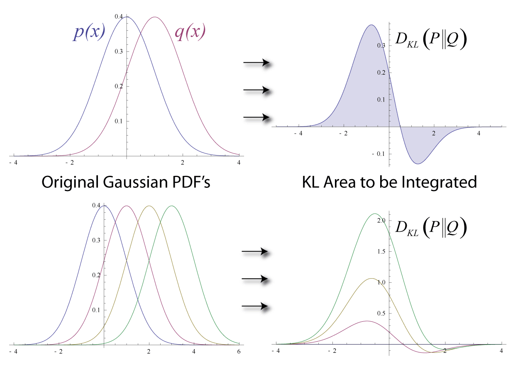
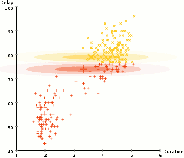

# 거리 아닌 거리, 직선 아닌 직선

## 출발 문제

$D_\text{KL}(p \| q) \neq D_\text{KL}(q \| p)$. 거리라고 부르고 싶은데 비대칭이고, 게다가 삼각부등식도 만족하지 않는다. 위상수학(topology — 무엇이 무엇 가까이 이어져 있는지를 다루는 수학)에서 배운 거리 공간의 세 공리(양수성, 대칭성, 삼각부등식) 가운데 두 개를 어기는 셈이다. 그렇다면 KL 발산(두 분포가 얼마나 다른지 한 방향으로 재는 양)을 "거리"라고 부를 수 있는가?

그런데 이상한 일이 있다. KL 발산은 거리의 자격이 없는데도 실제로는 거리보다 **더 많이 쓰인다**. 기계학습의 손실 함수로, 변분추론의 최적화 목표로, 강화학습에서 정책 사이의 차이를 재는 잣대로, 정보이론의 채널 용량 계산에 — KL 발산은 어디에나 있다. 거리의 공리를 만족하지 못하는 것이 "결함"이 아니라 오히려 "특징"이라면?

더 근본적인 질문을 해 보자. 비대칭이 실제로 의미를 갖는 상황이 있는가? 있다. "$p$가 참인데 $q$로 근사하는 것"과 "$q$가 참인데 $p$로 근사하는 것"은 질적으로 다른 행위다. 봉우리가 둘인 분포 $p$를 봉우리 하나짜리 정규분포 $q$로 근사한다고 하자. $D(p \| q)$를 줄이면 $q$는 $p$가 있는 곳을 하나도 놓치지 않으려고 두 봉우리를 모두 덮을 만큼 넓게 퍼지고, 그 대가로 아무것도 없는 골짜기에 확률을 쏟는다. 반대로 $D(q \| p)$를 줄이면 $q$는 $p$가 거의 없는 곳에 확률을 두기를 극도로 꺼려서 한쪽 봉우리에만 딱 달라붙는다. 두 오류는 본질적으로 다르며, 비대칭인 발산만이 이 차이를 구별해 낸다.

## KL 발산: 방향이 있는 떨어짐

거리의 자격이 없는 양이 왜 이렇게 널리 쓰일까? 그 답을 찾으려면 먼저 이 양이 애초에 무엇을 재려고 만들어졌는지부터 알아야 한다.

### 역사: 솔로몬 쿨백 (Solomon Kullback, 1907–1994) & 리처드 라이블러 (Richard Leibler, 1914–2003)

KL 발산의 탄생 배경은 순수 수학이 아니라 **암호분석**이다. 두 사람은 모두 미국 국가안보국(NSA)과 그 전신 기관에서 암호 업무에 몸담았다. 쿨백은 1930년대부터 육군 신호정보국(SIS)의 초창기 암호분석가였고, 제2차 세계대전 동안 일본 암호 해독 작업에 참여했다.

1951년, 두 사람은 *Annals of Mathematical Statistics*에 "정보와 충분성에 관하여(On Information and Sufficiency)"라는 논문을 발표한다. 핵심 질문은 이것이었다: 두 확률분포 $p$와 $q$가 주어졌을 때, 관측 데이터로 이 둘을 **얼마나 잘 구별할 수 있는가?**

그 답으로 제시된 것이 $D_\text{KL}(p \| q) = \sum_x p(x) \log \frac{p(x)}{q(x)}$이다. 이 양은 "$p$가 참일 때 관측 하나가 $q$가 아닌 $p$를 지지하는 증거(로그 가능도비)의 평균"이며, "$p$가 참인데 $q$라고 잘못 가정하면 평균적으로 얼마나 많은 정보를 잃는가"로 읽을 수도 있다.

쿨백과 라이블러 자신도 이것이 비대칭이라는 것을 알고 있었다. 이 비대칭은 우연이 아니다. "$p$가 참인데 $q$라고 착각하는 것"과 "$q$가 참인데 $p$라고 착각하는 것"은 질적으로 다른 실수이기 때문이다. 이 비대칭이야말로 KL 발산이 "거리"가 아닌 "발산"인 이유이며, 동시에 정보기하학에서 쌍대 구조가 나타나는 근본적 원인이다.

### 식으로 적은 KL 발산

KL 발산을 식으로 다시 적어 두자. 이산 분포라면 다음과 같고, 연속 분포라면 합이 적분으로 바뀐다.

$$
\textcolor{#7a5c1e}{D}_\text{KL}(\textcolor{#2e8b3a}{p} \,\|\, \textcolor{#2e8b3a}{q}) = \sum_{\textcolor{#007a72}{x}} \textcolor{#2e8b3a}{p}(\textcolor{#007a72}{x}) \log \frac{\textcolor{#2e8b3a}{p}(\textcolor{#007a72}{x})}{\textcolor{#2e8b3a}{q}(\textcolor{#007a72}{x})}
$$

$$
\begin{array}{ll}
\textcolor{#7a5c1e}{D}_\text{KL} & \text{KL 발산 (방향이 있는 떨어짐)} \\
\textcolor{#2e8b3a}{p}, \textcolor{#2e8b3a}{q} & \text{두 확률분포 (통계적 매니폴드, 곧 점 하나가 분포 하나인 휘어진 공간의 두 점)} \\
\textcolor{#007a72}{x} & \text{관측값}
\end{array}
$$

이 양을 **KL 발산** (방향 있는 떨어짐 / Kullback–Leibler Divergence)이라 부른다. 합의 모든 항이 $\textcolor{#2e8b3a}{p}$로 가중되어 있다는 점이 비대칭의 뿌리다. $\textcolor{#2e8b3a}{p}$가 큰 곳에서 $\textcolor{#2e8b3a}{q}$가 작으면 큰 벌점이 붙지만, $\textcolor{#2e8b3a}{q}$가 큰 곳에서 $\textcolor{#2e8b3a}{p}$가 작으면 그 칸은 합에 거의 들어가지 않는다. 위 그림에서 두 방향의 값이 다른 것도 이 때문이다.

### ML에서: 손실 함수 속의 KL

분류 모델을 학습시킬 때 쓰는 교차 엔트로피 손실 $-\mathbb{E}_{\textcolor{#2e8b3a}{p}}[\log \textcolor{#2e8b3a}{q}]$는 데이터 분포 $\textcolor{#2e8b3a}{p}$의 엔트로피 $H(\textcolor{#2e8b3a}{p})$와 $\textcolor{#7a5c1e}{D}_\text{KL}(\textcolor{#2e8b3a}{p} \| \textcolor{#2e8b3a}{q})$의 합이다. $H(\textcolor{#2e8b3a}{p})$는 모델과 상관없으므로, 교차 엔트로피를 줄이는 것은 곧 데이터 분포에서 모델 분포 $\textcolor{#2e8b3a}{q}$로 가는 KL 발산을 줄이는 일이다. 여기서 움직이는 것은 모델 매개변수가 정하는 분포 $\textcolor{#2e8b3a}{q}$다.

방향을 거꾸로 쓰는 곳도 있다. InstructGPT(Ouyang 등, 2022)처럼 사람의 선호로 언어 모델을 미세조정하는 RLHF에서는, 학습 중인 정책이 처음 모델에서 너무 멀어지지 않도록 학습 중인 정책에서 뽑은 문장으로 잰 KL 발산을 보상에서 뺀다. 어느 쪽을 앞에 두느냐에 따라 모델이 받는 압력이 달라진다.

### 문제 1 — 동전 두 개의 KL

각 문제를 먼저 혼자 풀어 본 뒤, 바로 아래 세션에서 선생님과 두 학생이 어떻게 풀어 가는지 따라가 보자.

확인 앞면 확률이 0.5인 동전 $\textcolor{#2e8b3a}{p} = \text{Bern}(0.5)$와 0.9인 동전 $\textcolor{#2e8b3a}{q} = \text{Bern}(0.9)$에 대해 $\textcolor{#7a5c1e}{D}(\textcolor{#2e8b3a}{p} \| \textcolor{#2e8b3a}{q})$와 $\textcolor{#7a5c1e}{D}(\textcolor{#2e8b3a}{q} \| \textcolor{#2e8b3a}{p})$를 자연로그로 계산하라. 계산 도중 음수인 항이 나오면 그것이 무엇을 뜻하는지도 설명하라.

#### 같이 풀기 세션 1

**김민준:** numpy로 바로 했어요. $\textcolor{#7a5c1e}{D}(\textcolor{#2e8b3a}{p} \| \textcolor{#2e8b3a}{q}) = 0.5\log\frac{0.5}{0.9} + 0.5\log\frac{0.5}{0.1} \approx 0.511$이고, $\textcolor{#7a5c1e}{D}(\textcolor{#2e8b3a}{q} \| \textcolor{#2e8b3a}{p}) = 0.9\log 1.8 + 0.1\log 0.2 \approx 0.368$이에요. 역시 비대칭이네요.

**이서연:** 잠깐, 두 번째 항 $0.1\log 0.2$가 $-0.161$이야. 첫 번째 식에서도 $0.5\log\frac{0.5}{0.9}$가 음수고. 발산은 0 이상이어야 하잖아. 음수가 섞이면 어디가 틀린 거 아닐까?

**선생님:** 좋은 의심이에요. 발산이 0 이상이라는 건 어디에 대한 약속이죠? 항 하나하나예요, 합 전체예요?

**이서연 〔S07〕:** 합 전체요. 아, $\log\frac{\textcolor{#2e8b3a}{p}}{\textcolor{#2e8b3a}{q}}$는 $\textcolor{#2e8b3a}{p} < \textcolor{#2e8b3a}{q}$인 칸에서 당연히 음수가 되는구나. 확률의 합이 둘 다 1이니까 어떤 칸에서 $\textcolor{#2e8b3a}{p}$가 더 크면 다른 칸에선 반드시 $\textcolor{#2e8b3a}{q}$가 더 커야 하고, 그러니 음수 항은 피할 수가 없네.

**선생님:** 그래도 합이 0 이상인 이유는 $\log$가 오목함수라서예요. 젠센 부등식으로 $-\textcolor{#7a5c1e}{D}(\textcolor{#2e8b3a}{p} \| \textcolor{#2e8b3a}{q}) = \sum \textcolor{#2e8b3a}{p} \log\frac{\textcolor{#2e8b3a}{q}}{\textcolor{#2e8b3a}{p}} \leq \log\sum \textcolor{#2e8b3a}{p}\,\frac{\textcolor{#2e8b3a}{q}}{\textcolor{#2e8b3a}{p}} = \log 1 = 0$이 되죠.

**이서연:** 해석학 시간에 적분값이 양수라고 적분하는 함수까지 어디서나 양수인 건 아니라고 몇 번이나 들었는데, 합으로 바뀌니까 또 헷갈렸어요.

## 발산: 가까이서 보면 계량이 된다

KL 발산은 멀리 떨어진 두 분포 사이에서 방향에 따라 값이 크게 다르다. 그렇다면 두 분포가 아주 가까워지면 어떻게 될까? 비대칭은 끝까지 남을까?

답은 비대칭이 **가까이에서는 사라진다**는 것이다. $D(p \| q)$를 $q = p$ 근방에서 테일러 전개하면 다음을 얻는다.

$$
\textcolor{#7a5c1e}{D}(\textcolor{#2e8b3a}{p} \,\|\, \textcolor{#2e8b3a}{p} + \textcolor{#964079}{\delta}) = \frac{1}{2}\,\textcolor{#d62728}{g}_{ij}\,\textcolor{#964079}{\delta}^i\textcolor{#964079}{\delta}^j + O(\textcolor{#964079}{\delta}^3)
$$

$$
\begin{array}{ll}
\textcolor{#7a5c1e}{D} & \text{발산} \\
\textcolor{#2e8b3a}{p} & \text{기준 분포} \\
\textcolor{#964079}{\delta}^i & \text{좌표 } \textcolor{#1b9e77}{\theta}^i \text{ 로 잰 작은 변위} \\
\textcolor{#d62728}{g}_{ij} & \text{발산이 만들어 내는 리만 계량 (KL 이면 피셔 정보행렬)}
\end{array}
$$

1차 항이 없는 것은 $\textcolor{#2e8b3a}{q} = \textcolor{#2e8b3a}{p}$에서 발산이 최솟값 0을 갖기 때문이다. 2차 항은 $\textcolor{#964079}{\delta}$를 $-\textcolor{#964079}{\delta}$로 바꿔도 그대로이므로, 두 점이 충분히 가까우면 $\textcolor{#7a5c1e}{D}(\textcolor{#2e8b3a}{p} \| \textcolor{#2e8b3a}{q}) \approx \textcolor{#7a5c1e}{D}(\textcolor{#2e8b3a}{q} \| \textcolor{#2e8b3a}{p})$가 된다. 이 2차 항의 계수 $\textcolor{#d62728}{g}_{ij}$가 바로 리만 계량(점마다 거리와 각도를 재는 눈금)이고, KL 발산의 경우 이 계량은 피셔 정보행렬(매개변수를 조금 바꿀 때 분포가 얼마나 달라지는지를 재는 행렬)과 일치한다.

발산이 리만 계량을 "만들어 낸다"는 이 사실은 깊은 의미를 갖는다. 비대칭적이고 전역적인(global, 먼 곳까지 보는) 발산이 국소적(local, 한 점 바로 근처)으로는 대칭적인 리만 기하학을 낳는다. 지구 표면이 전체적으로는 곡면이지만 충분히 작은 영역에서는 평면처럼 보이는 것과 같다. 발산은 "먼 곳의 기하학"이고, 리만 계량은 "가까운 곳의 기하학"이다.

발산의 비대칭은 3차 항에서 처음 모습을 드러내며, 이것이 바로 서로 짝을 이루는 두 접속(쌍대 접속) $\textcolor{#9467bd}{\nabla}$와 $\textcolor{#d4449f}{\nabla^*}$의 차이를 재는 첨자 세 개짜리 텐서(3차 텐서), 곧 큐빅 텐서 $\textcolor{#8f8f00}{C}$와 이어진다. 접속은 이웃한 점의 벡터를 비교하는 규칙이고, 텐서는 좌표를 바꿀 때 성분이 정해진 규칙대로만 바뀌는 양이다(PyTorch의 tensor와는 이름만 같다). 발산이 얼마나 비대칭인지가 $\textcolor{#9467bd}{\nabla}$와 $\textcolor{#d4449f}{\nabla^*}$가 얼마나 벌어지는지를 결정하는 것이다. 대칭인 발산(예: 유클리드 거리의 제곱)에서는 큐빅 텐서가 0이고, 두 접속이 계량이 정해 주는 표준 접속, 곧 레비-치비타 접속 하나로 합쳐진다.

KL 발산에서 쓴 성질만 추려 내면 "발산"이라는 이름에 필요한 조건이 된다.

- **발산** (비대칭 거리 / Asymmetric Distance, $\textcolor{#7a5c1e}{D}(\textcolor{#2e8b3a}{p} \| \textcolor{#2e8b3a}{q})$) — 두 점 사이의 "방향 있는 떨어짐". 세 가지 조건을 만족한다: (1) $\textcolor{#7a5c1e}{D}(\textcolor{#2e8b3a}{p} \| \textcolor{#2e8b3a}{q}) \geq 0$, (2) $\textcolor{#7a5c1e}{D}(\textcolor{#2e8b3a}{p} \| \textcolor{#2e8b3a}{q}) = 0 \iff \textcolor{#2e8b3a}{p} = \textcolor{#2e8b3a}{q}$, (3) $\textcolor{#2e8b3a}{q} = \textcolor{#2e8b3a}{p}$ 근방에서 $\textcolor{#7a5c1e}{D}(\textcolor{#2e8b3a}{p} \| \textcolor{#2e8b3a}{p} + \textcolor{#964079}{\delta}) = \frac{1}{2}\textcolor{#d62728}{g}_{ij}\textcolor{#964079}{\delta}^i\textcolor{#964079}{\delta}^j + O(\textcolor{#964079}{\delta}^3)$으로, 0이 아닌 $\textcolor{#964079}{\delta}$에서 늘 양수인 이차식(양의 정부호 이차형식)을 만든다. 대칭성과 삼각부등식은 요구하지 않는다. 거리보다 약한 조건이지만, 리만 계량을 만들어 내기에는 충분하다.

### 따라 계산해 보기 1 — 두 정규분포 사이의 KL과 피셔 계량

정규분포 $N(\textcolor{#1b9e77}{\mu}, \textcolor{#1b9e77}{\sigma}^2)$ 전체는 좌표 $(\textcolor{#1b9e77}{\mu}, \textcolor{#1b9e77}{\sigma})$를 갖는 2차원 매니폴드다. 두 정규분포 사이의 KL 발산은 적분을 직접 계산하면 닫힌 식으로 나온다.

$$
\textcolor{#7a5c1e}{D}\big(N(\textcolor{#1b9e77}{\mu_1}, \textcolor{#1b9e77}{\sigma_1}^2) \,\|\, N(\textcolor{#1b9e77}{\mu_2}, \textcolor{#1b9e77}{\sigma_2}^2)\big) = \log\frac{\textcolor{#1b9e77}{\sigma_2}}{\textcolor{#1b9e77}{\sigma_1}} + \frac{\textcolor{#1b9e77}{\sigma_1}^2 + (\textcolor{#1b9e77}{\mu_1} - \textcolor{#1b9e77}{\mu_2})^2}{2\textcolor{#1b9e77}{\sigma_2}^2} - \frac{1}{2}
$$

$$
\begin{array}{ll}
\textcolor{#7a5c1e}{D} & \text{KL 발산} \\
\textcolor{#1b9e77}{\mu}, \textcolor{#1b9e77}{\sigma} & \text{정규분포 매니폴드의 좌표 (평균, 표준편차)}
\end{array}
$$

**멀리 떨어진 두 점.** $\textcolor{#2e8b3a}{p} = N(0, 1)$, $\textcolor{#2e8b3a}{q} = N(1, 2^2)$을 넣으면 $\textcolor{#7a5c1e}{D}(\textcolor{#2e8b3a}{p} \| \textcolor{#2e8b3a}{q}) = \log 2 + \frac{1 + 1}{8} - \frac12 \approx 0.443$이고, 순서를 바꾸면 $\textcolor{#7a5c1e}{D}(\textcolor{#2e8b3a}{q} \| \textcolor{#2e8b3a}{p}) = \log\frac12 + \frac{4 + 1}{2} - \frac12 \approx 1.307$이다. 세 배 가까이 차이 난다.

**가까운 두 점.** 이번에는 $\textcolor{#2e8b3a}{q} = N(0.1,\ 1.05^2)$로 $\textcolor{#2e8b3a}{p}$에 바짝 붙인다. 변위는 $\delta\textcolor{#1b9e77}{\mu} = 0.1$, $\delta\textcolor{#1b9e77}{\sigma} = 0.05$다. 정확한 값은 $\textcolor{#7a5c1e}{D}(\textcolor{#2e8b3a}{p} \| \textcolor{#2e8b3a}{q}) \approx 0.00684$, $\textcolor{#7a5c1e}{D}(\textcolor{#2e8b3a}{q} \| \textcolor{#2e8b3a}{p}) \approx 0.00746$으로 거의 같아졌다.

2차 근사도 계산해 보자. 위 식을 $\delta\textcolor{#1b9e77}{\mu}, \delta\textcolor{#1b9e77}{\sigma}$에 대해 2차까지 전개하면

$$
\textcolor{#7a5c1e}{D} \approx \frac{1}{2}\left(\frac{(\delta\textcolor{#1b9e77}{\mu})^2}{\textcolor{#1b9e77}{\sigma}^2} + \frac{2\,(\delta\textcolor{#1b9e77}{\sigma})^2}{\textcolor{#1b9e77}{\sigma}^2}\right),
\qquad
\textcolor{#d62728}{g} = \begin{pmatrix} 1/\textcolor{#1b9e77}{\sigma}^2 & 0 \\ 0 & 2/\textcolor{#1b9e77}{\sigma}^2 \end{pmatrix}
$$

$$
\begin{array}{ll}
\textcolor{#d62728}{g} & (\textcolor{#1b9e77}{\mu}, \textcolor{#1b9e77}{\sigma}) \text{ 좌표에서의 피셔 계량} \\
\delta\textcolor{#1b9e77}{\mu}, \delta\textcolor{#1b9e77}{\sigma} & \text{두 분포의 좌표 차이}
\end{array}
$$

이 되어, $\textcolor{#1b9e77}{\sigma} = 1$에서 $\frac12(0.01 + 2 \times 0.0025) = 0.0075$를 준다. 두 방향의 정확한 값 0.00684와 0.00746이 모두 이 값 가까이에 있고, 둘의 차이 0.0006은 $\textcolor{#964079}{\delta}$의 세제곱 크기다. 이것이 "비대칭은 3차 항에서 나타난다"는 말의 실제 모습이다.

위의 계산을 이번에는 세 가지 결과를 갖는 분포들의 공간(확률 삼각형) 위에 두 분포 $\textcolor{#2e8b3a}{p}$와 $\textcolor{#2e8b3a}{q}$를 놓았다. 두 점을 끌어 보면서 $\textcolor{#7a5c1e}{D}(\textcolor{#2e8b3a}{p} \| \textcolor{#2e8b3a}{q})$와 $\textcolor{#7a5c1e}{D}(\textcolor{#2e8b3a}{q} \| \textcolor{#2e8b3a}{p})$가 얼마나 다른지, $\textcolor{#2e8b3a}{q}$를 $\textcolor{#2e8b3a}{p}$에 가까이 가져가면 둘이 피셔 계량의 이차식 $\frac12 \textcolor{#d62728}{g}_{ij}\textcolor{#964079}{\delta}^i\textcolor{#964079}{\delta}^j$로 함께 수렴하는지 확인해 보자. $\textcolor{#2e8b3a}{p}$ 둘레의 세 곡선은 "발산이 같은 값인 점들"이다. 그 발산 값을 키우면 세 곡선이 어떻게 갈라지는지도 보자.

  <noscript>이 시각화를 보려면 JavaScript가 필요합니다.</noscript>

### ML에서: 신뢰 영역을 KL로 잰다

강화학습의 신뢰 영역 정책 최적화(TRPO, Schulman 등, 2015)는 정책을 한 번에 너무 많이 바꾸지 않도록, 곧 한 번에 움직여도 믿을 수 있는 범위(신뢰 영역) 안에 머물도록, 새 정책과 옛 정책 사이의 평균 KL 발산이 작은 값을 넘지 않게 제약한다. 실제로 이 제약을 풀 때는 KL 발산을 위의 2차 근사 $\frac12 \textcolor{#d62728}{g}_{ij}\textcolor{#964079}{\delta}^i\textcolor{#964079}{\delta}^j$로 바꾸어 피셔 정보행렬로 계산한다. 여기서 움직이는 것은 정책 신경망의 매개변수이고, 가까운 곳에서는 발산이 곧 계량이라는 사실이 알고리즘에 그대로 쓰인다.

### 문제 2 — 가까운 두 정규분포와 피셔 계량

계산 $\textcolor{#2e8b3a}{p} = N(0, 1)$, $\textcolor{#2e8b3a}{q} = N(0.1,\ 1.05^2)$에 대해 정확한 $\textcolor{#7a5c1e}{D}(\textcolor{#2e8b3a}{p} \| \textcolor{#2e8b3a}{q})$를 구하고, 2차 근사 $\frac12 \textcolor{#d62728}{g}_{ij}\textcolor{#964079}{\delta}^i\textcolor{#964079}{\delta}^j$와 비교하라. 좌표를 $(\textcolor{#1b9e77}{\mu}, \textcolor{#1b9e77}{\sigma})$ 대신 $(\textcolor{#1b9e77}{\mu}, \textcolor{#1b9e77}{v} = \textcolor{#1b9e77}{\sigma}^2)$로 잡아도 같은 근삿값이 나오는지 확인하라.

#### 같이 풀기 세션 2

**김민준:** 정확한 값은 따라 계산해 보기 식에 넣으면 0.00684예요. 근사는 $\delta\textcolor{#1b9e77}{\mu} = 0.1$, $\delta\textcolor{#1b9e77}{\sigma} = 0.05$니까 $\frac12(0.1^2 + 0.05^2) = 0.00625$요. 좀 어긋나네요.

**이서연:** 너 계량을 단위행렬로 놨네. $\textcolor{#1b9e77}{\mu}$랑 $\textcolor{#1b9e77}{\sigma}$는 그냥 좌표 이름표일 뿐이고, 눈금은 피셔 계량이 정해. $\textcolor{#d62728}{g} = \text{diag}(1/\textcolor{#1b9e77}{\sigma}^2,\ 2/\textcolor{#1b9e77}{\sigma}^2)$라서 $\textcolor{#1b9e77}{\sigma}$ 방향에 2가 붙어. 그러면 $\frac12(0.01 + 2 \times 0.0025) = 0.0075$야.

**김민준 〔M04〕:** 아, 좌표 격자 간격이 곧 거리는 아니라고 그렇게 들었는데… 좌표만 보고 유클리드로 계산해 버렸네요.

**선생님:** 민준 학생은 과제에서 이런 실수 해 본 적 없어요?

**김민준:** 있어요. 입력 특성 두 개를 표준화 안 하고 거리를 쟀다가 단위가 큰 특성이 결과를 다 먹어 버려서, 조교가 "특성마다 눈금이 다르잖아요" 하고 코멘트를 달았어요.

**이서연:** 그럼 분산 좌표도 해 볼게. $\textcolor{#964079}{\delta} \textcolor{#1b9e77}{v} = 1.05^2 - 1 = 0.1025$니까, 같은 계량에 넣으면 $\frac12(0.01 + 2 \times 0.1025^2) \approx 0.0155$. 어, 두 배가 넘게 나오네?

**선생님:** 계량을 $(\textcolor{#1b9e77}{\mu}, \textcolor{#1b9e77}{\sigma})$ 좌표에서 구해 놓고 $(\textcolor{#1b9e77}{\mu}, \textcolor{#1b9e77}{v})$ 좌표의 변위를 넣었죠. 좌표를 바꾸면 계량 성분도 같이 바뀌어요.

**이서연 〔S07〕:** $\textcolor{#1b9e77}{v} = \textcolor{#1b9e77}{\sigma}^2$이면 $d\textcolor{#1b9e77}{v} = 2\textcolor{#1b9e77}{\sigma}\,d\textcolor{#1b9e77}{\sigma}$니까, $\frac{2}{\textcolor{#1b9e77}{\sigma}^2}d\textcolor{#1b9e77}{\sigma}^2 = \frac{2}{\textcolor{#1b9e77}{\sigma}^2}\cdot\frac{d\textcolor{#1b9e77}{v}^2}{4\textcolor{#1b9e77}{\sigma}^2} = \frac{d\textcolor{#1b9e77}{v}^2}{2\textcolor{#1b9e77}{v}^2}$. 그러면 $\textcolor{#d62728}{g}_{vv} = \frac{1}{2\textcolor{#1b9e77}{v}^2}$이고, $\frac12(0.01 + 0.1025^2/2) \approx 0.0076$. 이제 0.0075랑 거의 같아요. 남은 차이는 3차 항이고요.

**선생님 〔T13〕:** 그래요. 근삿값이 좌표에 따라 흔들리면 안 된다는 것, 그게 계량이 텐서여야 하는 이유예요.

## 사영: 발산으로 재는 가장 가까운 점

복잡한 분포 $p$를 다루기 쉬운 분포들의 모임 $M$ 안의 한 점으로 근사하고 싶다. 자연스러운 답은 "$M$ 안에서 $p$에 가장 가까운 점"이다. 그런데 가깝다는 것을 발산으로 재면, 발산에는 방향이 있다. 어느 방향으로 잰 가장 가까운 점일까?

### 두 방향의 가장 가까운 점

가까운 점을 찾을 때는 두 종류의 "직선", 곧 측지선(그 공간에서 가장 곧은 길)이 쓰인다. m-측지선은 두 분포를 섞은 $(1-t)p + tq$들이 이루는 길이고, e-측지선은 로그를 섞은 $\log r_t = (1-t)\log p + t\log q + \text{상수}$가 이루는 길이다. 모임 $M$ 안의 두 점을 잇는 e-측지선이 늘 $M$ 안에 머물면 $M$이 e-평탄하다고 하고, m-측지선이 그러면 m-평탄하다고 한다. $\exp(\theta\cdot x - \psi)$ 꼴로 쓰이는 분포들의 모임(지수족)은 e-평탄한 모임의 대표적인 예다.

- **사영** (가장 가까운 점 찾기 / Nearest Point Finder, $\Pi$) — 매니폴드 안에 든 더 작은 매니폴드(부분매니폴드 — 예: 분산이 1인 정규분포들) $M$ 위에서 주어진 점 $p$로부터 발산을 최소화하는 점 $q^* = \arg\min_{q \in M} D(p \| q)$. 발산이 비대칭이므로 $\arg\min D(p \| \cdot)$와 $\arg\min D(\cdot \| p)$는 일반적으로 다른 점을 준다. 이 구별이 m-사영과 e-사영의 기원이다.

- **m-사영 / e-사영** (합의 사영 / 곱의 사영) — m-사영은 $\arg\min_{q \in M} D(p \| q)$로, 사영점과 원래 점을 잇는 **m-측지선**이 $M$에 직교한다. $M$이 e-평탄하면(지수족이면) 이 점은 하나뿐이고, 평균 같은 기댓값을 $p$와 맞추는 점이 된다. e-사영은 $\arg\min_{q \in M} D(q \| p)$로, **e-측지선**이 $M$에 직교하며 $M$이 m-평탄할 때 하나로 정해진다.

출발 문제의 두 봉우리 분포로 돌아가면, 넓게 퍼져 두 봉우리를 덮는 쪽이 m-사영, 한쪽 봉우리에 달라붙는 쪽이 e-사영이다. 아래 문제 3에서 이것을 직접 계산한다.

### ML에서: 변분추론은 e-사영

변분추론(variational inference)은 이 틀로 이해된다. 다루기 쉬운 분포족 $Q$ 위에서 참 사후분포 $p$에 가장 가까운 점을 $D(q \| p)$로 재어 찾는 것이 e-사영(reverse KL 최소화)이다. 변분추론에서 증거 하한(ELBO)을 최대화하는 것이 바로 이 e-사영이다. 여기서 움직이는 것은 근사 분포 $q$의 매개변수다.

### 문제 3 — 봉우리가 둘인 분포를 정규분포 하나로

킬러 $p = \frac12 N(-3, 1) + \frac12 N(3, 1)$을 정규분포 $q = N(\mu, \sigma^2)$로 근사한다. (가) $D(p \| q)$를 최소화하는 $q$와 (나) $D(q \| p)$를 최소화하는 $q$를 구하고, 각각을 m-사영과 e-사영의 언어로 설명하라.

#### 같이 풀기 세션 3

**선생님:** 이번 건 천천히 가 봅시다. 먼저 (가)부터요.

**김민준:** $D(p \| q)$ 최소화는 최대가능도랑 같잖아요. $p$에서 뽑은 데이터로 정규분포를 맞추는 거니까, 제일 그럴듯한 봉우리 하나에 딱 맞출 것 같아요. $\mu = 3$, $\sigma = 1$쯤이요.

**이서연:** 난 다르게 나왔어. $D(p \| q) = -H(p) - \mathbb{E}_p[\log q]$이고 앞 항은 $q$와 상관없으니까, $\mathbb{E}_p[\log q]$만 키우면 돼. 정규분포면 이건 평균과 분산을 $p$와 맞추는 거라, $\mu = 0$, $\sigma^2 = 1 + 9 = 10$.

**선생님:** 민준 학생, 서연 학생의 $q = N(0, 10)$과 민준 학생의 $q = N(3, 1)$ 중에 어느 쪽이 $D(p \| q)$가 작을지, 한 번 돌려 볼래요?

**김민준 〔M05〕:** 수치적분 해 보니까… $N(0, 10)$은 0.46인데, $N(3, 1)$은 8.3이 나와요. 왼쪽 봉우리 근처에서 $q$가 거의 0이라 $\log\frac{p}{q}$가 폭발하네요.

**선생님:** 그게 $D(p \| q)$의 성격이에요. $p$가 있는 곳에서 $q$가 0에 가까우면 벌점이 무한히 커지니까, $q$는 $p$가 있는 곳을 전부 덮으려고 넓게 퍼져요. 최대가능도가 봉우리 하나를 고른다는 건 오해예요. 데이터 전체의 가능도를 보거든요.

**김민준:** 그러니까 이건 평균이랑 분산을 맞추는 사영이고… 앞에서 본 m-사영이네요. 정규분포족이 지수족이라 답이 하나로 정해지고요.

**이서연:** (나)는 쉬워 보여. 문제가 좌우대칭이니까 답도 좌우대칭이어야지. $\mu = 0$으로 두고 $\sigma$만 최적화하면 $\sigma \approx 2.74$, 발산은 0.84.

**선생님:** 대칭인 문제의 답은 반드시 대칭이어야 할까요? 서연 학생 식으로 $\mu$를 조금 옮겨서 $\mu = 3$, $\sigma = 1$을 넣어 보면요?

**이서연 〔S06〕:** $D(q \| p)$가… 0.69? 내 답 0.84보다 작아. 대칭인 점보다 한쪽으로 치우친 점이 더 좋다니, 이상한데.

**이서연 〔S08〕:** 아, 대칭인 건 답 하나가 아니라 답들의 **모임**이구나. $\mu \approx 2.98$이 최소라면, 거울에 비친 $\mu \approx -2.98$도 최소야. 최소점 두 개가 서로를 비추고 있으니까 모임은 대칭이지만, 점 하나하나는 대칭일 필요가 없어.

**선생님:** 그래서 $D(q \| p)$는 $q$가 $p$가 없는 곳에 확률을 두는 걸 싫어해요. 골짜기에 확률을 쏟느니 봉우리 하나를 확실히 잡는 거죠. 이게 e-사영이고, 변분추론이 사후분포의 봉우리 하나만 잡는 경향이 있는 이유예요. 정규분포족은 m-평탄하지 않아서 e-사영이 하나로 안 정해지는 것도 여기서 보이고요.

**김민준 〔M07〕:** 그럼 (가)는 봉우리를 다 덮는 넓은 분포, (나)는 봉우리 하나에 붙는 좁은 분포. 출발 문제에서 말한 게 이거였네요.

**이서연:** 미적분 시간에 $f(x) = x^4 - 2x^2$의 최솟값을 구할 때도 그랬어요. 좌우대칭인 함수인데 최솟값은 $x = \pm 1$ 두 곳이고, 대칭인 자리 $x = 0$은 오히려 극대였죠. 알면서도 똑같은 함정에 빠졌네요.

**선생님 〔T13〕:** 대칭은 답을 하나로 정해 주는 게 아니라 답들을 짝지어 줄 뿐이에요. 둘 다 잘 찾아냈어요.

## 일반화된 피타고라스 정리: 발산으로 그린 직각삼각형

유클리드 공간에서는 점 $p$에서 직선이나 평면으로 가장 가까운 점을 찾을 때 수선의 발을 내리고, 피타고라스 정리가 그 점이 가장 가깝다는 것을 보장한다. 발산으로 잰 사영에도 수선의 발과 피타고라스 정리가 있을까? 피타고라스 정리는 유클리드 거리의 **제곱**에 대한 정리이므로, 먼저 KL 발산과 유클리드 거리의 제곱을 한 가지 방법으로 만들어 내는 틀부터 세워 보자.

### 역사: 레프 브레그만 (Lev M. Bregman, 1941–, 사망 연도 불명)

KL 발산은 확률분포에 특화된 양이다. 이것을 더 일반적인 틀로 확장한 사람이 소련의 수학자 레프 브레그만이다.

1967년, 브레그만은 볼록 최적화 문제를 연구하다가 임의의 볼록함수 $\phi$에 대해 함수값과 접선의 차이, 곧 $D_\phi(p \| q) = \phi(p) - \phi(q) - \langle \nabla\phi(q),\, p - q \rangle$로 발산을 정의할 수 있음을 관찰한다. $\phi(x) = \sum x_i \log x_i$로 잡으면 KL 발산이 나오고, $\phi(x) = \|x\|^2$으로 잡으면 보통의 유클리드 거리의 제곱이 나온다.

브레그만 발산은 정보기하학의 핵심 도구가 되었다. 짝을 이루는 두 접속 모두로 보아 휘지 않은 공간(쌍대 평탄 공간)의 표준 발산은 항상 브레그만 발산이며, 이것이 자연스러운 피타고라스 정리를 만족한다는 것이 아마리의 이론으로 밝혀진다.

### 접선 아래로 벌어진 틈

볼록함수 $\phi$ 하나를 골라 **브레그만 발산** (볼록함수가 만드는 비대칭 거리 / Convex Gap Distance)을 다음과 같이 정의한다.

$$
\textcolor{#7a5c1e}{D}_{\textcolor{#455a64}{\phi}}(\textcolor{#2e8b3a}{p} \,\|\, \textcolor{#2e8b3a}{q}) = \textcolor{#455a64}{\phi}(\textcolor{#2e8b3a}{p}) - \textcolor{#455a64}{\phi}(\textcolor{#2e8b3a}{q}) - \langle \nabla\textcolor{#455a64}{\phi}(\textcolor{#2e8b3a}{q}),\, \textcolor{#2e8b3a}{p} - \textcolor{#2e8b3a}{q} \rangle
$$

$$
\begin{array}{ll}
\textcolor{#7a5c1e}{D}_{\textcolor{#455a64}{\phi}} & \textcolor{#455a64}{\phi} \text{ 가 만드는 브레그만 발산} \\
\textcolor{#455a64}{\phi} & \text{볼록 퍼텐셜 (볼록함수)} \\
\textcolor{#2e8b3a}{p}, \textcolor{#2e8b3a}{q} & \text{두 점 (확률벡터일 때는 두 분포)} \\
\nabla\textcolor{#455a64}{\phi} & \textcolor{#455a64}{\phi} \text{ 의 그래디언트 (접속 아님, 기본색)}
\end{array}
$$

기하학적으로는 $\textcolor{#2e8b3a}{q}$에서 그은 접선(여러 차원이면 접하는 평면)이 $\textcolor{#2e8b3a}{p}$ 위치에서 함수 그래프보다 얼마나 아래에 있는지다. 볼록함수의 그래프는 항상 접선 위에 있으므로 $\textcolor{#7a5c1e}{D}_{\textcolor{#455a64}{\phi}} \geq 0$이다. 확률벡터에서 $\textcolor{#455a64}{\phi}(x) = \sum x_i \log x_i$로 잡으면 KL 발산이, $\textcolor{#455a64}{\phi}(x) = \|x\|^2$으로 잡으면 유클리드 거리의 제곱이 나온다. 쌍대 평탄 공간의 표준 발산(canonical divergence)은 언제나 이런 브레그만 발산이다.

### 쌍대 직교와 세 변의 발산

쌍대 평탄 공간, 곧 두 접속 $\textcolor{#9467bd}{\nabla}$, $\textcolor{#d4449f}{\nabla^*}$ 모두에 대해 휘지 않은 공간에서 놀라운 정리가 성립한다. $\textcolor{#9467bd}{\nabla}$를 e-접속, $\textcolor{#d4449f}{\nabla^*}$를 m-접속, $\textcolor{#7a5c1e}{D}$를 KL 발산으로 두자. $\textcolor{#0098c7}{M}$이 $\textcolor{#9467bd}{\nabla}$에 대해 곧은(e-평탄한) 부분매니폴드이고, $\textcolor{#2e8b3a}{q}$가 $\textcolor{#2e8b3a}{p}$에서 $\textcolor{#0098c7}{M}$으로 내린 $\textcolor{#d4449f}{\nabla^*}$-사영(m-사영), 곧 $\textcolor{#2e8b3a}{p}$와 $\textcolor{#2e8b3a}{q}$를 잇는 $\textcolor{#d4449f}{\nabla^*}$-측지선이 $\textcolor{#0098c7}{M}$과 직교하는 점이라 하자. 그러면 $\textcolor{#0098c7}{M}$ 위의 모든 점 $\textcolor{#2e8b3a}{r}$에 대해 다음이 성립한다.

$$
\textcolor{#7a5c1e}{D}(\textcolor{#2e8b3a}{p} \,\|\, \textcolor{#2e8b3a}{r}) = \textcolor{#7a5c1e}{D}(\textcolor{#2e8b3a}{p} \,\|\, \textcolor{#2e8b3a}{q}) + \textcolor{#7a5c1e}{D}(\textcolor{#2e8b3a}{q} \,\|\, \textcolor{#2e8b3a}{r}), \quad \forall\, \textcolor{#2e8b3a}{r} \in \textcolor{#0098c7}{M}
$$

$$
\begin{array}{ll}
\textcolor{#7a5c1e}{D} & \text{KL 발산} \\
\textcolor{#2e8b3a}{p} & \textcolor{#0098c7}{M} \text{ 밖의 분포} \\
\textcolor{#2e8b3a}{q} & \textcolor{#2e8b3a}{p} \text{ 의 m-사영 (}\textcolor{#0098c7}{M}\text{ 위에서 } \textcolor{#7a5c1e}{D}(\textcolor{#2e8b3a}{p}\|\cdot) \text{ 을 최소화하는 점)} \\
\textcolor{#2e8b3a}{r} & \textcolor{#0098c7}{M} \text{ 위의 임의의 분포} \\
\textcolor{#0098c7}{M} & \text{e-평탄한 부분매니폴드 (예: 지수족)}
\end{array}
$$

이것이 **일반화된 피타고라스 정리** (발산의 직각삼각형 / Generalized Pythagorean Theorem)로, 유클리드 기하의 피타고라스 정리 $|\textcolor{#2e8b3a}{p}\textcolor{#2e8b3a}{r}|^2 = |\textcolor{#2e8b3a}{p}\textcolor{#2e8b3a}{q}|^2 + |\textcolor{#2e8b3a}{q}\textcolor{#2e8b3a}{r}|^2$의 정보기하학적 일반화다. "거리의 제곱"이 "발산"으로, "직교"가 "$\textcolor{#2e8b3a}{p}$에서 내려오는 m-측지선과 $\textcolor{#0098c7}{M}$ 안의 e-측지선의 직교"로 바뀌었다. 보통의 피타고라스 정리가 직각삼각형에서만 성립하듯, 이 정리도 서로 다른 두 종류의 측지선이 직교하는 "쌍대 직교" 조건이 있어야 성립한다. 이 등식에서 곧바로 $\textcolor{#7a5c1e}{D}(\textcolor{#2e8b3a}{p} \| \textcolor{#2e8b3a}{r}) \geq \textcolor{#7a5c1e}{D}(\textcolor{#2e8b3a}{p} \| \textcolor{#2e8b3a}{q})$가 나오므로, $\textcolor{#2e8b3a}{q}$가 $\textcolor{#0098c7}{M}$ 위에서 $\textcolor{#2e8b3a}{p}$에 가장 가까운 점이라는 것도 함께 따라온다.

### 따라 계산해 보기 2 — 피타고라스 등식을 숫자로 확인하기

분산이 1로 고정된 정규분포 $\textcolor{#0098c7}{M} = \{N(\textcolor{#1b9e77}{\mu}, 1)\}$은 지수족이라 e-평탄하다. $\textcolor{#0098c7}{M}$ 밖의 점 $\textcolor{#2e8b3a}{p} = N(0, 2^2)$을 $\textcolor{#0098c7}{M}$으로 m-사영하면, 평균만 맞춘 $\textcolor{#2e8b3a}{q} = N(0, 1)$이 나온다(m-사영은 평균 같은 기댓값을 맞추는 사영이다). $\textcolor{#0098c7}{M}$ 위의 다른 점 $\textcolor{#2e8b3a}{r} = N(1, 1)$을 골라 앞에서 본 두 정규분포 사이의 KL 식으로 세 변을 계산하면

- $\textcolor{#7a5c1e}{D}(\textcolor{#2e8b3a}{p} \| \textcolor{#2e8b3a}{r}) = \log\frac12 + \frac{4 + 1}{2} - \frac12 \approx 1.3069$
- $\textcolor{#7a5c1e}{D}(\textcolor{#2e8b3a}{p} \| \textcolor{#2e8b3a}{q}) = \log\frac12 + \frac{4}{2} - \frac12 \approx 0.8069$
- $\textcolor{#7a5c1e}{D}(\textcolor{#2e8b3a}{q} \| \textcolor{#2e8b3a}{r}) = 0 + \frac{1 + 1}{2} - \frac12 = 0.5$

이고, 실제로 $0.8069 + 0.5 = 1.3069$가 된다. $\textcolor{#2e8b3a}{r}$을 $\textcolor{#0098c7}{M}$ 위의 어느 점으로 바꿔도 등식은 유지된다.

### ML에서: EM 알고리즘과 미러 디센트

이 정리의 가장 아름다운 응용은 EM 알고리즘의 기하학적 해석이다. 관측 데이터와 맞는 분포들의 모임(데이터 매니폴드)과 모델 분포들의 모임(모델 매니폴드)을 생각하면, EM 알고리즘의 E-단계는 현재 모델을 데이터 매니폴드로 내리는 e-사영이고, M-단계는 그 결과를 모델 매니폴드로 내리는 m-사영이다. 각 단계에서 피타고라스 정리가 적용되므로 두 매니폴드 사이의 발산은 매 단계 결코 늘어나지 않는다. EM 알고리즘이 한 번도 뒷걸음질하지 않는 것은 이 기하학의 필연이다. 다만 도착하는 곳은 가장 가까운 점이 아니라 국소적으로 가장 가까운 점일 수 있다.

통신 채널이 보낼 수 있는 정보량을 구하는 블라후트-아리모토 알고리즘 등 정보이론과 최적화의 핵심 알고리즘들도 이 교대 사영의 틀로 한데 묶인다.

브레그만 발산 자체도 최적화 알고리즘에 쓰인다. 경사 하강의 한 걸음은 "손실의 1차 근사 + 이동 거리의 제곱"을 최소화하는 점으로 가는 것이라고 볼 수 있다. 미러 디센트는 이 이동 거리의 제곱 자리에 브레그만 발산을 넣는다. $\textcolor{#455a64}{\phi}(x) = \|x\|^2$이면 보통의 경사 하강으로 돌아가고, 확률벡터 위에서 $\textcolor{#455a64}{\phi}(x) = \sum x_i \log x_i$를 쓰면 각 성분에 $\exp(-\text{학습률} \times \text{그래디언트 성분})$을 곱한 뒤 합이 1이 되게 다시 나누는 갱신이 나온다. 매개변수가 확률벡터처럼 모양이 정해진 공간 위를 움직일 때, 그 모양에 맞는 발산으로 걸음을 재는 셈이다.

## 자주 하는 실수와 요약

### 자주 하는 실수

| 실수 | 나온 문제 | 바로잡는 법 |
| --- | --- | --- |
| KL 발산 계산 중 음수 항이 나오면 틀렸다고 봄 | 1 | 0 이상이라는 약속은 합 전체에 대한 것. $p < q$인 칸의 항은 음수가 될 수밖에 없다 |
| 좌표 $(\mu, \sigma)$를 유클리드 눈금으로 보고 계량을 단위행렬로 둠 | 2 | 눈금은 피셔 계량이 정한다. $g = \text{diag}(1/\sigma^2,\ 2/\sigma^2)$ |
| 한 좌표에서 구한 계량 성분에 다른 좌표의 변위를 넣음 | 2 | 좌표를 바꾸면 계량 성분도 바뀐다. $v = \sigma^2$이면 $g_{vv} = 1/(2v^2)$ |
| $D(p \| q)$ 최소화(최대가능도)가 봉우리 하나에 맞춘다고 봄 | 3 | $p$가 있는 곳에서 $q$가 0에 가까우면 벌점이 폭발한다. 평균·분산을 맞추는 m-사영이 답 |
| 좌우대칭인 문제의 답은 대칭인 점 하나라고 봄 | 3 | 대칭인 것은 답들의 모임. $D(q \| p)$의 최소점은 $\mu \approx \pm 2.98$ 두 곳 |

### 요약

KL 발산은 두 분포를 관측으로 얼마나 잘 구별할 수 있는지를 재는 양으로, 대칭성과 삼각부등식이 없어 거리는 아니다. 그러나 가까운 두 점 사이에서는 2차 항만 남아 비대칭이 사라지고, 그 계수가 리만 계량(KL이면 피셔 계량)이 된다. 비대칭은 3차 항에서 나타난다. 볼록함수와 그 접선 사이의 틈으로 정의하는 브레그만 발산은 KL 발산과 유클리드 거리의 제곱을 함께 만들어 낸다. 발산이 비대칭이므로 부분매니폴드로의 사영도 두 가지(m-사영, e-사영)이고, 두 봉우리 분포를 정규분포로 근사하면 하나는 넓게 덮고 하나는 한쪽 봉우리에 붙는다. 쌍대 평탄 공간에서는 사영에 대해 일반화된 피타고라스 정리가 성립하며, EM 알고리즘이 뒷걸음질하지 않는 이유가 여기서 나온다.

### 연결되는 세계들

| 분야 | 연결 |
|------|------|
| 기계학습 | EM 알고리즘 = e-사영과 m-사영의 교대 반복 |
| 강화학습 | RLHF의 KL 페널티: forward KL vs reverse KL |
| 변분추론 | 변분 추론 = reverse KL 최소화 = e-사영 |
| 최적화 | 미러 디센트 = 브레그만 사영의 반복 |
| 정보이론 | 블라후트-아리모토 알고리즘 = 교대 사영 |

### 막힌 곳

정규분포족은 m-평탄하지 않아서, 두 봉우리 분포의 e-사영은 하나로 정해지지 않고 $\mu \approx \pm 2.98$ 두 곳으로 갈라졌다. 변분추론이 실제로 어느 봉우리에 닿을지는 무엇이 정하는가? EM 알고리즘도 뒷걸음질은 하지 않지만 국소적으로 가장 가까운 점에서 멈출 수 있었다. 발산의 기하학은 "한 걸음이 나빠지지 않는다"는 것까지는 보장하지만, 어디서 출발해야 가장 가까운 점에 닿는지는 아직 말해 주지 않는다.
