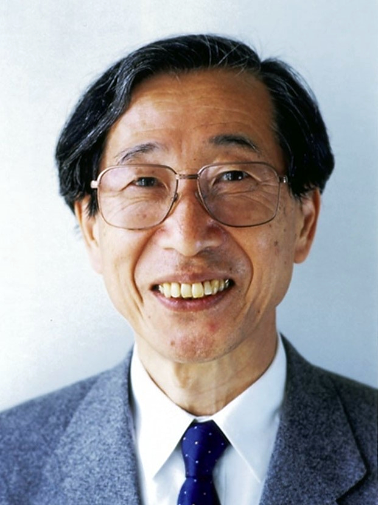

# 매개변수 공간의 풍경을 걷다

## 출발 문제

신경망을 학습시키는 것은 수백만, 수억 개의 매개변수로 이루어진 공간에서 손실 함수의 최솟값을 찾아 걸어가는 것이다. 가장 기본적인 전략인 경사하강법은 $\theta \to \theta - \eta \frac{\partial L}{\partial \theta}$로 매개변수를 갱신한다. 그래디언트가 가리키는 방향이 "가장 가파르게 내려가는 방향"이니, 그 방향으로 걸으면 된다. 간단해 보인다.

하지만 여기에 근본적인 문제가 숨어 있다. 같은 확률 모델을 $\theta$ 대신 $\varphi = f(\theta)$로 재매개변수화(reparameterize)하면, 경사하강법의 궤적이 완전히 달라진다. 실제로는 같은 모델이고 같은 손실 함수인데, 매개변수의 이름표를 바꾸기만 했을 뿐인데 학습 경로가 바뀐다. 어떤 매개변수화에서는 빠르게 수렴하고, 다른 매개변수화에서는 진동하거나 느리게 수렴한다.

이것은 심각한 문제다. 물리 법칙이 좌표계에 의존하면 안 되듯이, 학습 알고리즘이 매개변수의 이름에 의존해서는 안 된다. 좌표에 의존하지 않는 "진짜 최급강하 방향"이 존재하는가? 존재한다면 어떻게 계산하는가?

이 질문의 답은 이 책 전체를 관통하는 주제 — 매개변수 공간을 매니폴드로 보는 관점 — 에서 자연스럽게 나온다.

## 패턴

보통의 경사하강법에서 "가장 가파른 방향"은 유클리드 내적으로 정의된다. $\|\delta\theta\|^2 = \sum_i (\delta\theta_i)^2 \leq \epsilon^2$ 제약 아래 $L(\theta + \delta\theta)$를 가장 많이 줄이는 $\delta\theta$의 방향이 그래디언트다. 하지만 이 유클리드 내적은 매개변수 공간이 **평평하고 등방적**이라고 가정한 것이다.

매개변수 공간이 평평하지 않다면 — 즉 리만 매니폴드라면 — "가장 가파른 방향"은 계량에 의존한다. $g_{ij}\delta\theta^i\delta\theta^j \leq \epsilon^2$ 제약 아래 최적화하면, 최급강하 방향은 $g^{ij}\frac{\partial L}{\partial \theta^j}$가 된다. 계량의 역행렬을 그래디언트에 곱해야 하는 것이다.

확률 모델의 매개변수 공간에서 자연스러운 계량은 **피셔 정보행렬** $F_{ij}$다. 이것은 로그가능도의 기울기의 공분산이며, "매개변수의 작은 변화가 확률분포를 얼마나 바꾸는가"를 측정한다. 피셔 계량은 좌표 독립적인 양이므로 — 정확히 말하면, 재매개변수화에 대해 공변적으로 변환하므로 — 이 계량으로 보정한 그래디언트도 좌표 독립적이다.

직관적인 비유를 하자면, 유클리드 그래디언트는 "지도 위에서의 가장 가파른 방향"이고, 자연 경사는 "실제 지형 위에서의 가장 가파른 방향"이다. 메르카토르 도법으로 그린 지도에서는 극지방이 과도하게 크게 보이므로, 지도 위에서의 직선이 실제 지형 위에서의 최단 경로가 아니다. 피셔 계량은 이 "지도의 왜곡"을 보정한다.

## 정리 (아마리, 1998)

자연 경사(natural gradient)는 다음과 같이 정의된다:

$$\tilde{\nabla}L = F^{-1} \nabla L$$

여기서 $F$는 피셔 정보행렬이고 $\nabla L$은 보통의 유클리드 그래디언트다. 아마리의 핵심 정리는 이것이다: **자연 경사는 재매개변수화에 대해 불변이다.** 즉, 매개변수를 $\theta$에서 $\varphi = f(\theta)$로 바꾸면, 새 좌표에서 계산한 자연 경사 $\tilde{F}^{-1}\tilde{\nabla}L$은 원래 좌표의 자연 경사를 $f$로 변환한 것과 정확히 일치한다.

이것이 성립하는 이유는 피셔 행렬의 변환 법칙 때문이다. 재매개변수화 $\varphi = f(\theta)$에 대해 피셔 행렬은 $\tilde{F} = J^T F J$로 변환된다($J$는 야코비안). 이것은 계량 텐서의 변환 법칙과 정확히 같다. 그래디언트는 $\tilde{\nabla}L = J^{-T}\nabla L$로 변환되므로, $\tilde{F}^{-1}\tilde{\nabla}L = J^{-1}F^{-1}\nabla L$ — 벡터의 공변 변환이다.

실용적인 관점에서, 자연 경사의 가장 큰 장벽은 계산 비용이다. $n$개의 매개변수에 대해 $n \times n$ 행렬의 역행렬을 매 단계마다 구해야 한다. 현대 신경망에서 $n$은 수억에 달하므로 이것은 직접적으로는 불가능하다. 하지만 자연 경사의 **정신**은 여러 실용적 알고리즘에 살아 있다. Adam 최적화기는 피셔 행렬의 대각 근사로 해석할 수 있고, K-FAC은 크로네커 곱 근사를 사용한다. 강화학습의 TRPO(Trust Region Policy Optimization)는 정책 공간에서의 자연 경사를 KL 발산 제약(신뢰 영역)과 결합한 것이며, PPO는 TRPO의 실용적 근사다. 이들 모두 "매개변수 공간의 기하학을 존중하라"는 아마리의 통찰에서 뻗어 나온 가지들이다.

## 정의

- **자연 경사** (좌표 독립 경사 / Coordinate-Free Gradient, $\tilde{\nabla}L = F^{-1}\nabla L$) — 매개변수 공간을 피셔 계량을 가진 리만 매니폴드로 보았을 때의 "진정한" 최급강하 방향. 유클리드 그래디언트에 피셔 행렬의 역행렬을 곱한 것이다. 유클리드 공간에서는 $F = I$이므로 보통 그래디언트와 같지만, 매개변수 공간이 휘어져 있으면 방향이 크게 달라질 수 있다. 자연 경사의 핵심 성질은 재매개변수화 불변성이며, 이는 매니폴드 위의 벡터가 좌표에 의존하지 않는 것과 같은 원리다.

- **피셔 정보행렬** (확률적 눈금 / Probabilistic Ruler, $F_{ij} = \mathbb{E}\left[\frac{\partial \log p}{\partial \theta^i}\frac{\partial \log p}{\partial \theta^j}\right]$) — 로그가능도의 기울기의 공분산 행렬. 매개변수 $\theta$의 작은 변화가 확률분포를 얼마나 바꾸는지를 측정한다. 피셔 행렬은 KL 발산의 헤시안과 같으며 — $F_{ij} = \frac{\partial^2}{\partial \theta^i \partial \theta^j}D_\text{KL}(p_\theta \| p_{\theta_0})\big|_{\theta=\theta_0}$ — 이 사실이 피셔 행렬을 통계적 매니폴드의 리만 계량으로 만드는 근거다.

- **미분동형사상** (모양을 보존하는 변환 / Shape-Preserving Map) — 매니폴드 $M$에서 매니폴드 $N$으로의 부드러운 전단사 함수 $f: M \to N$으로, 역함수 $f^{-1}$도 부드러운 것. 미분동형사상은 매니폴드의 "기하학적 구조를 보존하는 변환"이다. 재매개변수화 $\varphi = f(\theta)$는 매개변수 공간에서의 미분동형사상이며, 자연 경사가 불변인 것은 이 변환 아래 기하학적 양이 보존됨을 뜻한다.

- **푸시포워드** (밀어내기 / Push-Forward, $f_*$) — 미분동형사상 $f: M \to N$이 접선벡터를 $M$의 접선공간에서 $N$의 접선공간으로 "밀어내는" 연산. 점 $p$에서의 속도벡터 $v$는 $f(p)$에서의 속도벡터 $f_*v$로 변환된다. 구체적으로는 야코비안 행렬을 곱하는 것이다. 텐서를 한 좌표계에서 다른 좌표계로 옮기는 것도, Normalizing Flow에서 단순한 분포를 복잡한 분포로 변환하는 것도 모두 푸시포워드의 사례다.

## 핵심 인물과 일화

### 아마리 순이치 — 자연 경사의 발견 (1998)

1990년대 후반, 신경망 연구는 침체기에 있었다. 딥러닝 혁명은 아직 15년이나 남아 있었고, 대부분의 연구자는 SVM이나 커널 방법에 주목하고 있었다. 이 시기에 아마리 순이치는 신경망 학습의 근본적인 문제에 도전한다.

문제는 이것이었다: 보통의 경사하강법(gradient descent)에서 $\theta \to \theta - \eta \nabla L(\theta)$로 매개변수를 갱신한다. 하지만 이 갱신 방향은 **좌표계에 의존한다**. 같은 확률 모델을 $\theta$ 대신 $\varphi = f(\theta)$로 재매개변수화하면, 경사하강법은 완전히 다른 경로를 따른다. 어떤 매개변수화가 "올바른" 것인가?

아마리의 답은 명쾌했다: **올바른 매개변수화는 없다. 매개변수화에 의존하지 않는 갱신 규칙을 써야 한다.** 1998년 논문 "Natural Gradient Works Efficiently in Learning"에서 그는 자연 경사를 제시한다:

$$\tilde{\nabla}L = F^{-1} \nabla L$$

여기서 $F$는 피셔 정보행렬이다. 이것은 단순히 그래디언트에 행렬을 곱한 것이 아니다 — 매개변수 공간을 리만 매니폴드로 보고, 피셔 계량에 대한 "진정한 최급강하 방향"을 구한 것이다.

유클리드 공간에서는 $F = I$(단위행렬)이므로 자연 경사 = 보통 경사이다. 하지만 매개변수 공간이 휘어져 있으면 — 예를 들어 확률 모델의 매개변수 공간 — 두 방향은 크게 다를 수 있다. 자연 경사는 좌표에 속지 않고, 확률분포 공간의 진정한 기하학을 따라 내려간다.

이 아이디어는 당시에는 계산 비용 때문에 실용적이지 못했다 — $n$개의 매개변수에 대해 $n \times n$ 행렬의 역행렬을 매 스텝마다 구해야 했으니. 하지만 아마리의 통찰은 이후의 실용적 최적화 알고리즘에 깊은 영향을 미쳤다. Adam 최적화기는 피셔 행렬의 대각 근사로 해석할 수 있고, K-FAC은 블록 대각 근사이며, 강화학습의 TRPO/PPO는 정책 공간에서의 자연 경사를 신뢰 영역(trust region)과 결합한 것이다.

신경과학자로 출발하여, 확률분포의 기하학을 거쳐, 신경망 학습의 최적화에 도달한 아마리의 여정은 이 책 전체의 주제 — 미분기하학의 언어가 어떻게 다른 세계와 연결되는가 — 를 한 사람의 경력 안에서 체현하고 있다.

## 시각화 아이디어

  <noscript>이 시각화를 보려면 JavaScript가 필요합니다.</noscript>

- 풍경 걷기 비교: 같은 손실 함수 위에서 보통 경사와 자연 경사의 궤적 비교
- 재매개변수화 불변성: $\theta \to \varphi(\theta)$로 바꿔도 자연 경사의 방향은 같다
- Normalizing Flow: 단순한 분포가 복잡한 분포로 변환되는 과정을 밀도의 변형으로 시각화

## 연결되는 세계들

| 분야 | 연결 |
|------|------|
| 심층학습 최적화 | Adam $\approx$ 대각 자연 경사, K-FAC $\approx$ 블록 자연 경사 |
| 강화학습 | TRPO/PPO: 정책 공간에서의 자연 경사 + 신뢰 영역 |
| 생성 모델 | Normalizing flow, 확산 모델에서의 스코어 함수 $= \nabla \log p$ |
| 미분방정식 | Neural ODE: 흐름으로서의 신경망 |
| 정보기하학 | 기하학적 언어가 학습 알고리즘의 설계를 인도한다 |
