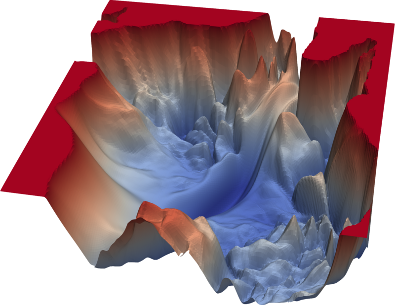
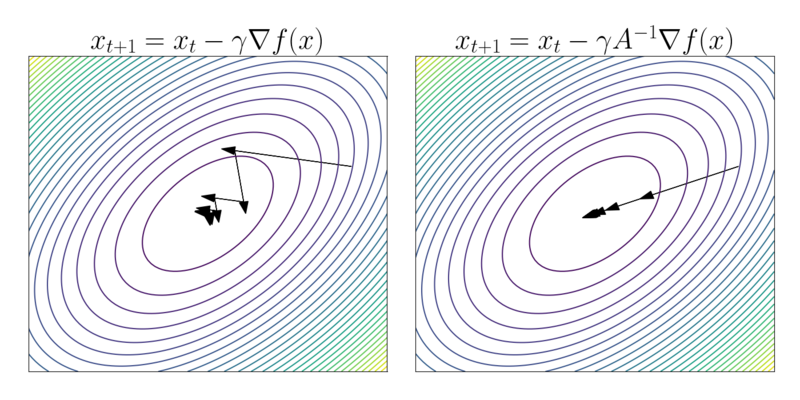
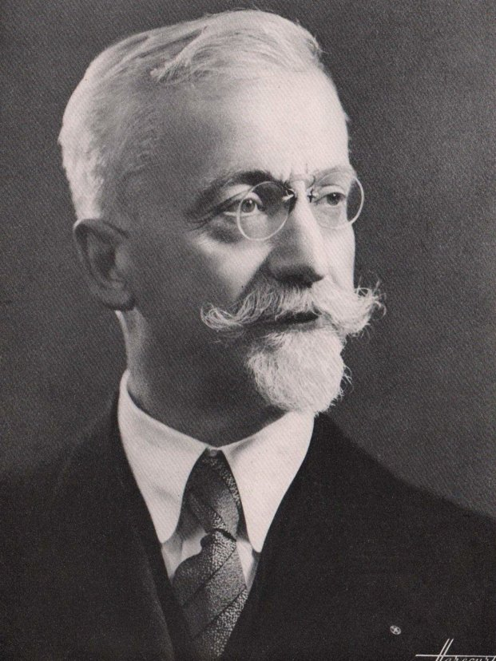

# 매개변수 공간의 풍경을 걷다

## 출발 문제

신경망을 학습시키는 것은 수백만, 수억 개의 매개변수로 이루어진 공간에서 손실 함수의 최솟값을 찾아 걸어가는 일이다. 가장 기본적인 전략인 경사하강법은 매개변수를 다음과 같이 갱신한다.

$$
\textcolor{#1b9e77}{\theta} \;\leftarrow\; \textcolor{#1b9e77}{\theta} - \textcolor{#6b672e}{\eta}\,\frac{\partial \textcolor{#6b6b6b}{L}}{\partial \textcolor{#1b9e77}{\theta}}
$$

$$
\begin{array}{ll}
\textcolor{#1b9e77}{\theta} & \text{매개변수 (매개변수 공간의 좌표)} \\
\textcolor{#6b6b6b}{L} & \text{손실 함수} \\
\textcolor{#6b672e}{\eta} & \text{학습률}
\end{array}
$$

그래디언트(가장 가파르게 올라가는 방향의 벡터)의 반대 방향이 "가장 가파르게 내려가는 방향"이니 그 방향으로 걸으면 된다. 간단해 보인다.

하지만 여기에 근본적인 문제가 숨어 있다. 같은 확률 모델을 $\textcolor{#1b9e77}{\theta}$ 대신 $\textcolor{#1b9e77}{\varphi} = f(\textcolor{#1b9e77}{\theta})$로 재매개변수화(reparameterize — 같은 모델의 매개변수에 새 이름표를 붙이는 것. VAE의 재매개변수화 트릭과는 이름만 같다)하면 경사하강법의 궤적이 완전히 달라진다. 같은 모델, 같은 손실 함수인데 매개변수의 이름표를 바꾸기만 했을 뿐인데도 학습 경로가 바뀐다. 어떤 매개변수화에서는 빠르게 수렴하고, 다른 매개변수화에서는 진동하거나 느리게 수렴한다.

이것은 심각한 문제다. 물리 법칙이 좌표계에 의존하면 안 되듯이, 학습 알고리즘이 매개변수의 이름에 의존해서는 안 된다. 좌표에 의존하지 않는 "진짜 가장 가파른 내리막 방향(최급강하 방향)"이 존재하는가? 존재한다면 어떻게 계산하는가?

이 질문의 답은 이 책 전체를 관통하는 주제, 곧 매개변수 공간을 매니폴드(좁게 보면 평평해 보이는 휘어진 공간)로 보는 관점에서 자연스럽게 나온다.

## 피셔 정보행렬: 분포 공간의 눈금

출발 문제는 좌표에 의존하지 않는 "진짜 최급강하 방향"이 있느냐고 물었다. 그 답을 찾기 전에, "가장 가파르다"는 말이 애초에 무엇에 기대고 있는지부터 따져 보자.

보통의 경사하강법에서 "가장 가파른 방향"은 유클리드 내적으로 정의된다. $\|\delta\textcolor{#1b9e77}{\theta}\|^2 = \sum_i (\delta\textcolor{#1b9e77}{\theta}^i)^2 \leq \textcolor{#b95b64}{\epsilon}^2$ 제약 아래 $\textcolor{#6b6b6b}{L}(\textcolor{#1b9e77}{\theta} + \delta\textcolor{#1b9e77}{\theta})$를 가장 많이 줄이는 $\delta\textcolor{#1b9e77}{\theta}$의 방향이 그래디언트의 반대 방향이다. 하지만 이 유클리드 내적은 매개변수 공간이 **평평하고, 모든 방향의 눈금이 같다**고 가정한 것이다.

매개변수 공간이 계량(점마다 거리와 각도를 재는 눈금)이 주어진 매니폴드, 곧 리만 매니폴드라면 "가장 가파른 방향"은 계량에 의존한다. 걸음의 크기를 계량으로 재어 $\textcolor{#d62728}{g}_{ij}\,\delta\textcolor{#1b9e77}{\theta}^i\delta\textcolor{#1b9e77}{\theta}^j \leq \textcolor{#b95b64}{\epsilon}^2$ 제약 아래 최적화하면(라그랑주 승수법 한 줄이면 된다) 최급강하 방향은 다음과 같다.

$$
\delta\textcolor{#1b9e77}{\theta}^i \;\propto\; -\,\textcolor{#d62728}{g}^{ij}\,\frac{\partial \textcolor{#6b6b6b}{L}}{\partial \textcolor{#1b9e77}{\theta}^j}
$$

$$
\begin{array}{ll}
\delta\textcolor{#1b9e77}{\theta}^i & \text{한 걸음의 좌표 변화} \\
\textcolor{#d62728}{g}^{ij} & \text{계량의 역행렬 성분} \\
\partial \textcolor{#6b6b6b}{L} / \partial \textcolor{#1b9e77}{\theta}^j & \text{손실의 편미분 (보통의 그래디언트 성분)}
\end{array}
$$

그래디언트에 계량의 역행렬을 곱해야 하는 것이다. 편미분 $\partial \textcolor{#6b6b6b}{L}/\partial\textcolor{#1b9e77}{\theta}^j$는 아래첨자를 가진 "그래디언트 정보"이고, 실제로 걸어갈 방향은 위첨자를 가진 벡터여야 한다. 둘을 잇는 것이 계량의 역행렬이다.

### 확률 모델의 자연스러운 눈금

확률 모델의 매개변수 공간에서 자연스러운 계량은 **피셔 정보행렬**이다.

$$
\textcolor{#d62728}{F}_{ij}(\textcolor{#1b9e77}{\theta}) = \mathbb{E}_{\textcolor{#007a72}{x} \sim \textcolor{#2e8b3a}{p}_{\textcolor{#1b9e77}{\theta}}}\!\left[\frac{\partial \log \textcolor{#2e8b3a}{p}_{\textcolor{#1b9e77}{\theta}}(\textcolor{#007a72}{x})}{\partial \textcolor{#1b9e77}{\theta}^i}\,\frac{\partial \log \textcolor{#2e8b3a}{p}_{\textcolor{#1b9e77}{\theta}}(\textcolor{#007a72}{x})}{\partial \textcolor{#1b9e77}{\theta}^j}\right]
$$

$$
\begin{array}{ll}
\textcolor{#d62728}{F}_{ij} & \text{피셔 정보행렬 (통계적 매니폴드의 계량)} \\
\textcolor{#2e8b3a}{p}_{\textcolor{#1b9e77}{\theta}} & \text{매개변수 } \textcolor{#1b9e77}{\theta} \text{ 로 정해지는 확률분포} \\
\partial \log \textcolor{#2e8b3a}{p}_{\textcolor{#1b9e77}{\theta}} / \partial \textcolor{#1b9e77}{\theta}^i & \text{스코어 함수 (매개변수로 미분한 로그가능도, 평균이 0)} \\
\textcolor{#007a72}{x} & \text{관측값}
\end{array}
$$

스코어의 평균이 0이므로 이것은 스코어의 공분산이며, "매개변수의 작은 변화가 확률분포를 얼마나 바꾸는가"를 잰다. 두 분포 사이의 KL 발산을 $\textcolor{#2e8b3a}{q} = \textcolor{#2e8b3a}{p}$ 근방에서 2차까지 전개했을 때 나오는 계수가 바로 이 행렬이다. 피셔 행렬은 재매개변수화에 대해 계량 텐서(텐서는 좌표를 바꿀 때 성분이 정해진 규칙대로만 바뀌는 양으로, PyTorch의 tensor와는 이름만 같다)와 똑같은 규칙으로 변환되므로, 이 계량으로 보정한 그래디언트는 좌표에 의존하지 않는다.

- **피셔 정보행렬** (확률적 눈금 / Probabilistic Ruler, $\textcolor{#d62728}{F}_{ij} = \mathbb{E}\left[\frac{\partial \log \textcolor{#2e8b3a}{p}}{\partial \textcolor{#1b9e77}{\theta}^i}\frac{\partial \log \textcolor{#2e8b3a}{p}}{\partial \textcolor{#1b9e77}{\theta}^j}\right]$) — 로그가능도의 그래디언트(스코어)의 공분산 행렬. 매개변수 $\textcolor{#1b9e77}{\theta}$의 작은 변화가 확률분포를 얼마나 바꾸는지를 잰다. 피셔 행렬은 KL 발산(두 분포가 얼마나 다른지 한 방향으로 재는 양)의 헤세 행렬(두 번 미분한 값의 행렬)과 같으며 — $\textcolor{#d62728}{F}_{ij} = \frac{\partial^2}{\partial \textcolor{#1b9e77}{\theta}^i \partial \textcolor{#1b9e77}{\theta}^j}\textcolor{#7a5c1e}{D}_\text{KL}(\textcolor{#2e8b3a}{p}_\theta \| \textcolor{#2e8b3a}{p}_{\theta_0})\big|_{\theta=\theta_0}$ — 이 사실이 피셔 행렬을 통계적 매니폴드의 리만 계량으로 만드는 근거다.

직관적인 비유를 하자면, 유클리드 그래디언트는 "지도 위에서의 가장 가파른 방향"이고, 피셔 계량으로 보정한 그래디언트, 곧 자연 경사는 "실제 지형 위에서의 가장 가파른 방향"이다. 메르카토르 도법으로 그린 지도에서는 극지방이 과도하게 크게 보이므로, 지도 위에서 가장 짧아 보이는 걸음이 실제 지형 위에서도 가장 짧은 걸음은 아니다. 피셔 계량은 이 "지도의 왜곡"을 보정한다.

### ML에서: 잊지 않게 붙잡아 둘 매개변수 고르기

한 과제를 배운 신경망에 새 과제를 가르치면 앞의 과제를 급격히 잊어버리는 일이 흔하다(파국적 망각, catastrophic forgetting). 커크패트릭(J. Kirkpatrick) 등이 2017년 PNAS에 발표한 EWC(Elastic Weight Consolidation)는 앞 과제에서 구한 피셔 정보행렬의 대각 성분으로 각 매개변수의 "중요도"를 재고, 새 과제를 배우는 동안 중요도가 큰 매개변수일수록 원래 값에서 멀어지지 못하게 벌점을 준다. 여기서 움직이는 것은 신경망의 매개변수이고, 피셔 정보가 크다는 것은 그 매개변수를 조금만 움직여도 앞 과제의 출력 분포가 크게 바뀐다는 뜻이다.

### 문제 1 — 정보가 많은 방향에서는 크게 걸을까, 작게 걸을까

각 문제를 먼저 혼자 풀어 본 뒤, 바로 아래 세션에서 선생님과 두 학생이 어떻게 풀어 가는지 따라가 보자.

확인 매개변수가 하나인 모델에서 자연 경사의 한 걸음은 $\delta\textcolor{#1b9e77}{\theta} = -\textcolor{#6b672e}{\eta}\,\textcolor{#d62728}{F}^{-1}\,\frac{d\textcolor{#6b6b6b}{L}}{d\textcolor{#1b9e77}{\theta}}$이다. 같은 기울기 $\frac{d\textcolor{#6b6b6b}{L}}{d\textcolor{#1b9e77}{\theta}}$에서 피셔 정보 $\textcolor{#d62728}{F}$가 큰 곳과 작은 곳 중 어디서 걸음이 더 큰가? 그 이유를 "분포가 얼마나 바뀌는가"로 설명하라.

#### 같이 풀기 세션 1

**김민준:** $\textcolor{#d62728}{F}$가 크면 걸음도 커야 하지 않아요? 정보가 많다는 건 방향에 대한 확신이 크다는 거니까, 믿고 성큼성큼 가도 될 것 같은데요.

**선생님:** 식을 다시 볼까요? $\textcolor{#d62728}{F}$는 분모에 있어요, 분자에 있어요?

**김민준:** 역행렬이니까 분모요. 그러면 $\textcolor{#d62728}{F}$가 클수록 걸음이 작아지네요. 근데 직관은 왜 반대로 가죠?

**이서연:** 피셔 정보가 크다는 건 $\textcolor{#1b9e77}{\theta}$를 조금만 바꿔도 분포가 크게 바뀐다는 뜻이잖아. 같은 $\delta\textcolor{#1b9e77}{\theta}$라도 분포 공간에서는 먼 거리야.

**선생님:** 맞아요. 자연 경사는 매개변수 공간이 아니라 **분포 공간에서** 일정한 거리만큼 걷자는 규칙이에요. 눈금이 촘촘한 곳에서는 좌표로 조금만 움직여도 이미 많이 간 거예요.

**김민준 〔M07〕:** 아, 과제에서 하이퍼파라미터 튜닝할 때 조교가 "민감한 건 조금씩, 둔한 건 크게 바꿔 보세요"라고 했던 게 이거네요. 조금만 건드려도 결과가 확 바뀌는 게 피셔 정보가 큰 방향이고요.

## 자연 경사: 좌표를 바꿔도 같은 방향

피셔 계량으로 그래디언트를 보정하면 정말로 좌표에 속지 않는 방향이 나올까? 1998년 아마리 순이치(甘利俊一, 1936–)는 논문 "Natural Gradient Works Efficiently in Learning"에서 이 물음에 답했다. 올바른 매개변수화를 고르려 애쓰지 말고, 매개변수화에 의존하지 않는 갱신 규칙을 쓰라는 것이다. 유클리드 공간에서는 피셔 행렬이 단위행렬이어서 새 규칙과 보통 경사하강법이 같지만, 확률 모델의 매개변수 공간처럼 눈금이 장소와 방향마다 다르면 두 방향은 크게 다를 수 있다.

### 자연 경사와 아마리의 정리 (1998)

자연 경사(natural gradient)는 다음과 같이 정의된다.

$$
\tilde{\nabla}\textcolor{#6b6b6b}{L} = \textcolor{#d62728}{F}^{-1}\, \nabla \textcolor{#6b6b6b}{L}
$$

$$
\begin{array}{ll}
\tilde{\nabla}\textcolor{#6b6b6b}{L} & \text{자연 경사 (걸어갈 방향의 반대, 벡터)} \\
\textcolor{#d62728}{F} & \text{피셔 정보행렬} \\
\nabla \textcolor{#6b6b6b}{L} & \text{보통의 그래디언트 } (\partial \textcolor{#6b6b6b}{L}/\partial\textcolor{#1b9e77}{\theta}^j) \text{. 여기서 } \nabla \text{ 는 접속이 아니라 그래디언트라 기본색}
\end{array}
$$

- **자연 경사** (좌표 독립 경사 / Coordinate-Free Gradient, $\tilde{\nabla}\textcolor{#6b6b6b}{L} = \textcolor{#d62728}{F}^{-1}\nabla \textcolor{#6b6b6b}{L}$) — 매개변수 공간을 피셔 계량을 가진 리만 매니폴드로 보았을 때의 "진정한" 최급강하 방향. 유클리드 그래디언트에 피셔 행렬의 역행렬을 곱한 것이다. $\textcolor{#d62728}{F} = I$이면 보통 그래디언트와 같지만, 매개변수 공간이 휘어져 있거나 눈금이 방향마다 다르면 방향이 크게 달라질 수 있다. 자연 경사의 핵심 성질은 재매개변수화 불변성이며, 이는 매니폴드 위의 벡터가 좌표에 의존하지 않는 것과 같은 원리다.

아마리의 핵심 정리는 이것이다: **자연 경사는 재매개변수화에 대해 불변이다.** 매개변수를 $\textcolor{#1b9e77}{\theta}$에서 $\textcolor{#1b9e77}{\varphi} = f(\textcolor{#1b9e77}{\theta})$로 바꾸고 새 좌표에서 자연 경사를 계산하면, 그것은 원래 좌표의 자연 경사를 $f$로 옮겨 놓은 것과 정확히 일치한다.

### ML에서: 자연 경사의 후예들

실용적인 관점에서 자연 경사의 가장 큰 장벽은 계산 비용이다. 매개변수가 $\textcolor{#c4724f}{n}$개면 $\textcolor{#c4724f}{n} \times \textcolor{#c4724f}{n}$ 행렬의 역행렬을 매 단계 구해야 하는데, 현대 신경망에서 $\textcolor{#c4724f}{n}$은 수억에 달하므로 이것을 그대로 하기는 불가능하다. 하지만 자연 경사의 **정신**은 여러 실용적 알고리즘에 살아 있다. K-FAC은 피셔 행렬을 층마다 크로네커 곱으로 근사하고, Adam은 그래디언트 제곱의 이동평균(모델 분포 대신 데이터 표본으로 스코어 제곱을 평균한 경험적 피셔 행렬의 대각 성분에 해당)의 제곱근으로 나눈다는 점에서 대각 근사의 먼 친척으로 볼 수 있다. 강화학습의 TRPO(Trust Region Policy Optimization)는 정책 공간에서의 자연 경사를 KL 발산 제약(신뢰 영역)과 결합한 것이며, PPO는 TRPO의 실용적 근사다. 이들 모두 "매개변수 공간의 기하학을 존중하라"는 아마리의 통찰에서 뻗어 나온 가지들이다.

### 문제 2 — 학습률만 키우면 같을까

킬러 어떤 점에서 피셔 행렬이 $\textcolor{#d62728}{F} = \begin{pmatrix} 2 & 1 \\ 1 & 1 \end{pmatrix}$이고 그래디언트가 $\nabla \textcolor{#6b6b6b}{L} = (1, 0)$이다. 자연 경사 $\textcolor{#d62728}{F}^{-1}\nabla \textcolor{#6b6b6b}{L}$을 구하고, 보통 그래디언트와 방향이 어떻게 다른지 설명하라. 방향이 달라도 여전히 손실이 줄어드는 방향인 이유는 무엇인가?

#### 같이 풀기 세션 2

**김민준:** PyTorch로 작은 모델에 자연 경사를 돌려 봤는데요, 보통 SGD랑 궤적이 거의 비슷하고 빠르기만 하더라고요. 결국 자연 경사는 학습률을 방향마다 조금씩 키운 거 아니에요? 학습률만 잘 고르면 같을 것 같아요.

**이서연:** 이 문제는 계산이 금방이야. 피셔 행렬 대각이 2랑 1이니까 역행렬은 $\text{diag}(1/2,\ 1)$, 그러면 $\textcolor{#d62728}{F}^{-1}\nabla \textcolor{#6b6b6b}{L} = (1/2,\ 0)$. 방향은 그래디언트랑 똑같고 길이만 반이네. 민준이 말이 맞는 것 같은데?

**선생님:** 서연 학생, 역행렬을 구할 때 비대각 성분 1은 어디로 갔어요?

**이서연 〔S04〕:** 아… 대각 성분만 뒤집었어요. 대각행렬일 때만 되는 계산인데. 제대로 하면 행렬식이 $2 - 1 = 1$이니까 $\textcolor{#d62728}{F}^{-1} = \begin{pmatrix} 1 & -1 \\ -1 & 2 \end{pmatrix}$, $\textcolor{#d62728}{F}^{-1}\nabla \textcolor{#6b6b6b}{L} = (1,\ -1)$. 그래디언트는 $x$축 방향인데 자연 경사는 45도 기울어졌어요.

**김민준 〔M05〕:** 방향이 바뀌네요. 그럼 제 PyTorch 실험은 뭐였죠?

**선생님:** 그 모델의 피셔 행렬이 대각에 가까웠을 거예요. 매개변수들이 서로 얽혀 있지 않으면 자연 경사는 정말로 "방향마다 다른 학습률"이 돼요. Adam이 대각 근사의 친척인 것도 그래서고요. 하지만 비대각 성분이 있으면, 한 매개변수를 움직일 때 다른 매개변수도 같이 보정해야 분포 공간에서 똑바로 가요. 이건 성분별 학습률로는 흉내 낼 수 없어요.

**김민준:** 그럼 45도나 틀어졌는데도 손실이 줄어드는 게 보장돼요? 그래디언트 반대 방향이 가장 가파른 방향이라면서요.

**이서연 〔S07〕:** 내적을 보면 돼. 손실의 1차 변화는 $\nabla \textcolor{#6b6b6b}{L} \cdot \delta\textcolor{#1b9e77}{\theta} = -\textcolor{#6b672e}{\eta}\,\nabla \textcolor{#6b6b6b}{L}^T \textcolor{#d62728}{F}^{-1}\nabla \textcolor{#6b6b6b}{L}$이고, $\textcolor{#d62728}{F}$가 양의 정부호(0이 아닌 벡터 $v$마다 $v^T \textcolor{#d62728}{F} v > 0$)면 $\textcolor{#d62728}{F}^{-1}$도 양의 정부호라서 이 값은 항상 음수야. 여기서는 $(1, 0)\cdot(1, -1) = 1 > 0$이니까 반대로 걸으면 줄어들고. 가장 가파른 방향은 "어떤 자로 재느냐"에 따라 달라질 뿐이야.

**선생님 〔T14〕:** 정확해요. 그래디언트 반대 방향은 유클리드 자로 잰 가장 가파른 방향이고, 자연 경사는 피셔 자로 잰 가장 가파른 방향이에요. 둘 다 내려가는 방향이지만, 좌표를 바꿔도 살아남는 건 뒤쪽뿐이죠.

**김민준 〔M07〕:** 조별 과제에서 두 명이 같은 함수를 고치고 있으면, 한 명이 고칠 때 다른 명 코드도 같이 맞춰 줘야 머지가 되잖아요. 비대각 성분이 딱 그 "같이 맞춰 주기"네요.

**이서연:** 선형대수 시험에서도 "대각행렬이면"이라는 조건 없이 역행렬을 성분별로 뒤집었다가 감점당한 적이 있어요. 조건부터 확인하는 버릇을 들였는데도 또 놓쳤네요.

## 푸시포워드: 좌표를 바꿀 때 걸음이 옮겨지는 규칙

아마리의 정리는 좌표를 바꿔도 자연 경사가 같은 방향을 가리킨다고 말한다. 정말 그런지 먼저 숫자로 확인해 보자.

### 따라 계산해 보기 — 정규분포의 피셔 정보와 두 좌표

평균 2, 분산 1인 데이터에 정규분포 $N(\mu, \sigma^2)$를 맞춘다고 하자. 평균 음의 로그가능도는 상수를 빼면 다음과 같다.

$$
\textcolor{#6b6b6b}{L}(\textcolor{#1b9e77}{\mu}, \textcolor{#1b9e77}{\sigma}) = \log\textcolor{#1b9e77}{\sigma} + \frac{1 + (\textcolor{#1b9e77}{\mu} - 2)^2}{2\textcolor{#1b9e77}{\sigma}^2}
$$

$$
\begin{array}{ll}
\textcolor{#6b6b6b}{L} & \text{손실 (평균 음의 로그가능도), 최솟값은 } (\textcolor{#1b9e77}{\mu}, \textcolor{#1b9e77}{\sigma}) = (2, 1) \\
\textcolor{#1b9e77}{\mu}, \textcolor{#1b9e77}{\sigma} & \text{모델의 매개변수 (좌표)}
\end{array}
$$

**피셔 정보.** $\log \textcolor{#2e8b3a}{p} = -\log\textcolor{#1b9e77}{\sigma} - \frac{(\textcolor{#007a72}{x} - \textcolor{#1b9e77}{\mu})^2}{2\textcolor{#1b9e77}{\sigma}^2} + \text{상수}$이므로 스코어는 $\partial_\mu \log \textcolor{#2e8b3a}{p} = \frac{\textcolor{#007a72}{x} - \textcolor{#1b9e77}{\mu}}{\textcolor{#1b9e77}{\sigma}^2}$, $\partial_\sigma \log \textcolor{#2e8b3a}{p} = -\frac{1}{\textcolor{#1b9e77}{\sigma}} + \frac{(\textcolor{#007a72}{x} - \textcolor{#1b9e77}{\mu})^2}{\textcolor{#1b9e77}{\sigma}^3}$이다. 제곱의 기댓값을 내면 $\textcolor{#d62728}{F} = \text{diag}(1/\textcolor{#1b9e77}{\sigma}^2,\ 2/\textcolor{#1b9e77}{\sigma}^2)$가 된다. KL 발산을 2차까지 전개해 얻는 계량과 같다.

**출발점 $(\textcolor{#1b9e77}{\mu}, \textcolor{#1b9e77}{\sigma}) = (0,\ 0.5)$에서.** 그래디언트는 $\nabla \textcolor{#6b6b6b}{L} = (-8,\ -38)$, 피셔 행렬은 $\text{diag}(4,\ 8)$이므로 자연 경사는 $\textcolor{#d62728}{F}^{-1}\nabla \textcolor{#6b6b6b}{L} = (-2,\ -4.75)$다.

**좌표를 $s = \log\textcolor{#1b9e77}{\sigma}$로 바꾸면.** 같은 점에서 $\partial \textcolor{#6b6b6b}{L}/\partial s = \textcolor{#1b9e77}{\sigma}\,\partial \textcolor{#6b6b6b}{L}/\partial\textcolor{#1b9e77}{\sigma} = -19$이고, 피셔 행렬은 $\textcolor{#d62728}{F}_s = \text{diag}(1/\textcolor{#1b9e77}{\sigma}^2,\ 2) = \text{diag}(4,\ 2)$가 된다. 자연 경사는 $(-2,\ -9.5)$다.

**두 결과를 맞춰 보면.** $\textcolor{#1b9e77}{\sigma}$ 좌표의 자연 경사 성분 $-4.75$를 $ds = d\textcolor{#1b9e77}{\sigma}/\textcolor{#1b9e77}{\sigma}$로 옮기면 $-4.75 / 0.5 = -9.5$로, $s$ 좌표에서 직접 구한 값과 정확히 같다. 보통 그래디언트는 사정이 다르다. $\textcolor{#1b9e77}{\sigma}$ 좌표에서 한 걸음은 $\delta\textcolor{#1b9e77}{\sigma} \propto 38$인데, $s$ 좌표에서 한 걸음 $\delta s \propto 19$를 $\textcolor{#1b9e77}{\sigma}$로 옮기면 $\delta\textcolor{#1b9e77}{\sigma} = \textcolor{#1b9e77}{\sigma}\,\delta s \propto 9.5$다. 같은 학습률로 네 배나 다른 걸음을 걷는 셈이다.

위 따라 계산해 보기의 정규분포 맞추기 문제를 두 좌표로 나란히 그렸다. 왼쪽은 $(\textcolor{#1b9e77}{\mu}, \textcolor{#1b9e77}{\sigma})$, 오른쪽은 $(\textcolor{#1b9e77}{\mu}, \log\textcolor{#1b9e77}{\sigma})$ 좌표이고, 배경 등고선은 같은 손실 $\textcolor{#6b6b6b}{L}$이다. 한쪽 평면을 눌러 출발점을 고르면 세 가지 길이 양쪽에 함께 그려진다. 보통 경사하강을 $\textcolor{#1b9e77}{\sigma}$ 좌표에서 한 길과 $\log\textcolor{#1b9e77}{\sigma}$ 좌표에서 한 길은 서로 다르지만, 자연 경사의 길은 어느 좌표로 계산해도 하나로 겹치는지 확인해 보자.

  <noscript>이 시각화를 보려면 JavaScript가 필요합니다.</noscript>

위 계산에서 $\textcolor{#1b9e77}{\sigma}$ 좌표의 자연 경사 성분 $-4.75$를 $\textcolor{#1b9e77}{\sigma} = 0.5$로 나누자 $s$ 좌표에서 직접 구한 값 $-9.5$가 정확히 나왔다. 보통 그래디언트는 맞지 않았다. 좌표를 바꿀 때 무엇은 맞고 무엇은 어긋나는 걸까? 먼저 가장 단순한 것, 한 걸음(작은 변화)이 좌표를 바꾸면 어떻게 되는지부터 보자.

### 번역표로 걸음 옮기기

$\textcolor{#1b9e77}{\sigma}$ 다이얼과 $s = \log\textcolor{#1b9e77}{\sigma}$ 다이얼은 같은 분포를 가리키는 두 이름표다. $\textcolor{#1b9e77}{\sigma} = 0.5$에서 $\textcolor{#1b9e77}{\sigma}$ 다이얼을 0.01 돌리면 $s$ 다이얼은 얼마나 돌아갈까? $\log 0.51 - \log 0.5 \approx 0.0198$, 거의 0.02다. 이 자리에서는 $\textcolor{#1b9e77}{\sigma}$를 조금 움직이면 $s$가 그 $1/\textcolor{#1b9e77}{\sigma} = 2$배만큼 움직인다. 이 "2배"를 적어 둔 것이 번역표, 곧 야코비안 $\textcolor{#964079}{J} = ds/d\textcolor{#1b9e77}{\sigma}$다. 다이얼이 여럿이면 번역표는 "이 다이얼을 조금 돌리면 저 다이얼이 얼마나 돌아가는가"를 칸마다 적은 행렬이 된다.

한 걸음은 번역표를 한 번 곱해서 옮긴다. $\textcolor{#1b9e77}{\sigma}$ 좌표의 걸음 $\delta\textcolor{#1b9e77}{\sigma}$는 $s$ 좌표에서 $\delta s = \textcolor{#964079}{J}\,\delta\textcolor{#1b9e77}{\sigma}$다. 걸음 자체는 그대로이고, 부르는 숫자만 바뀐다. 자연 경사가 맞아떨어진 것이 바로 이것이다. $-4.75 \times 2 = -9.5$.

- **푸시포워드** (밀어내기 / Push-Forward, $\textcolor{#3c7b8b}{f}_*$) — 매끄러운 함수 $\textcolor{#3c7b8b}{f}: \textcolor{#0098c7}{M} \to \textcolor{#0098c7}{N}$(되돌릴 수 없어도 된다)을 따라, 이쪽의 작은 변화(한 점에서의 속도벡터 $\textcolor{#1f77b4}{v}$)를 저쪽의 작은 변화 $\textcolor{#3c7b8b}{f}_*\textcolor{#1f77b4}{v}$로 보내는 연산. 좌표로 쓰면 번역표 $\textcolor{#964079}{J}$를 한 번 곱하는 것, $\textcolor{#3c7b8b}{f}_*\textcolor{#1f77b4}{v} = \textcolor{#964079}{J}\textcolor{#1f77b4}{v}$다. 화살표는 함수와 같은 방향, 앞으로 간다.

좌표 바꾸기는 푸시포워드의 특별한 경우다. 옛 이름표에서 새 이름표로 가는 함수가 되돌릴 수 있고 양쪽 방향 모두 매끄러울 때, 이런 함수를 미분동형사상(매끄러움을 지키며 되돌릴 수 있는 함수)이라 부른다. 재매개변수화 $\textcolor{#1b9e77}{\varphi} = \textcolor{#3c7b8b}{f}(\textcolor{#1b9e77}{\theta})$가 그 예다.

### 변환 법칙으로 본 불변성

좌표를 바꿀 때 옮겨지는 것은 세 종류이고, 규칙이 제각각이다. $\textcolor{#1b9e77}{\sigma} = 0.5$, $\textcolor{#964079}{J} = 2$에서 따라 계산해 보기의 숫자로 확인할 수 있다.

| 무엇 | 비유 | 좌표를 바꾸면 | $\sigma = 0.5$에서 확인 |
| --- | --- | --- | --- |
| 걸음 $\delta\theta$ (화살표) | 다이얼을 돌린 양 | 번역표를 한 번 곱해 앞으로: $\delta\varphi = J\,\delta\theta$ | 자연 경사 $-4.75 \to -9.5$ |
| 그래디언트 $\nabla L$ (눈금자) | 화살표를 넣으면 손실 변화를 돌려주는 장치 | 반대 방향: $\nabla_\theta L = J^T \nabla_\varphi L$ | $-38 = 2 \times (-19)$ |
| 피셔 행렬 $F$ (자) | 화살표 두 개를 받는 내적 | 번역표가 양쪽에 하나씩: $F_\theta = J^T F_\varphi J$ | $8 = 2 \times 2 \times 2$ |

보통 경사하강법은 눈금자(그래디언트)의 숫자를 그대로 걸음으로 쓴다. 눈금자는 걸음과 반대 규칙으로 바뀌므로, 좌표마다 다른 걸음이 나온다. $\textcolor{#1b9e77}{\sigma}$ 좌표의 걸음 $38$을 $s$로 옮기면 $2 \times 38 = 76$인데, $s$ 좌표에서 직접 구한 걸음은 $19$다. 네 배가 어긋난다. 자연 경사는 눈금자에 자의 역행렬을 곱해 걸음으로 바꾼다. 두 규칙을 식에 넣으면 번역표가 서로 지워지고, 걸음의 규칙 하나만 남는다.

$$
\textcolor{#d62728}{F}_{\textcolor{#1b9e77}{\varphi}}^{-1}\,\nabla_{\textcolor{#1b9e77}{\varphi}}\textcolor{#6b6b6b}{L}
= \big(\textcolor{#964079}{J}^{-T}\textcolor{#d62728}{F}_{\textcolor{#1b9e77}{\theta}}\textcolor{#964079}{J}^{-1}\big)^{-1} \textcolor{#964079}{J}^{-T}\,\nabla_{\textcolor{#1b9e77}{\theta}}\textcolor{#6b6b6b}{L}
= \textcolor{#964079}{J}\,\textcolor{#d62728}{F}_{\textcolor{#1b9e77}{\theta}}^{-1}\,\nabla_{\textcolor{#1b9e77}{\theta}}\textcolor{#6b6b6b}{L}
$$

$$
\begin{array}{ll}
\textcolor{#1b9e77}{\theta}, \textcolor{#1b9e77}{\varphi} & \text{옛 좌표와 새 좌표 (같은 매니폴드의 두 이름표)} \\
\textcolor{#964079}{J} = \partial\textcolor{#1b9e77}{\varphi} / \partial\textcolor{#1b9e77}{\theta} & \text{좌표 변환의 야코비안} \\
\textcolor{#d62728}{F}_{\textcolor{#1b9e77}{\theta}}, \textcolor{#d62728}{F}_{\textcolor{#1b9e77}{\varphi}} & \text{두 좌표에서 쓴 같은 피셔 계량} \\
\nabla_{\textcolor{#1b9e77}{\theta}}\textcolor{#6b6b6b}{L}, \nabla_{\textcolor{#1b9e77}{\varphi}}\textcolor{#6b6b6b}{L} & \text{두 좌표에서의 그래디언트}
\end{array}
$$

맨 오른쪽이 $\textcolor{#964079}{J}\,(\cdot)$, 곧 걸음을 옮기는 규칙 그대로다. 자연 경사는 좌표를 바꿔도 **같은 걸음**을 가리키고, 부르는 숫자만 번역표를 따라 바뀐다. 한 가지 덧붙이면, 불변인 것은 무한히 작은 걸음의 방향(연속적인 흐름)이다. 학습률이 유한하면 좌표마다 학습률의 제곱에 비례하는 차이가 남는다.

### ML에서: 노멀라이징 플로

노멀라이징 플로는 정규분포처럼 단순한 분포에서 뽑은 점 $z$를 되돌릴 수 있는 매끄러운 신경망 변환 $f$로 옮겨 $x = f(z)$를 만든다. $f$가 미분동형사상(되돌릴 수 있는 매끄러운 함수)이므로, 옮겨진 분포의 밀도는 변수변환 공식 $p_x(x) = p_z(z)\,\lvert\det(\partial f/\partial z)\rvert^{-1}$로 정확히 계산된다. 여기서 쓰이는 야코비안이 바로 푸시포워드의 좌표 표현이다. 분포는 $f$를 따라 앞으로 밀려가지만, 밀도를 계산할 때는 $x$에서 $z$로 거꾸로 찾아가 그 자리의 밀도를 읽어 온다. 이 거꾸로 가는 계산에 행렬식이 붙는 이유는 다음 절에서 본다. RealNVP(Dinh 등, 2017) 같은 모델은 이 행렬식을 싸게 계산할 수 있도록 $f$의 모양을 제한한다. 움직이는 것은 $f$를 정하는 신경망 매개변수이고, 학습은 옮겨진 분포가 데이터 분포에 가까워지도록 이루어진다.

### 문제 3 — 로그 표준편차 좌표의 피셔 정보

계산 정규분포 $N(\textcolor{#1b9e77}{\mu}, \textcolor{#1b9e77}{\sigma}^2)$의 피셔 행렬은 $(\textcolor{#1b9e77}{\mu}, \textcolor{#1b9e77}{\sigma})$ 좌표에서 $\text{diag}(1/\textcolor{#1b9e77}{\sigma}^2,\ 2/\textcolor{#1b9e77}{\sigma}^2)$이다. 좌표를 $(\textcolor{#1b9e77}{\mu}, s)$, $s = \log\textcolor{#1b9e77}{\sigma}$로 바꿨을 때의 피셔 행렬을 변환 법칙으로 구하고, 스코어를 직접 계산해서 확인하라.

#### 같이 풀기 세션 3

**김민준:** 좌표를 바꾸면 야코비안을 곱하면 되죠. $ds/d\textcolor{#1b9e77}{\sigma} = 1/\textcolor{#1b9e77}{\sigma}$니까 $\textcolor{#1b9e77}{\sigma}$ 성분에 한 번 곱해서… $\frac{2}{\textcolor{#1b9e77}{\sigma}^2}\cdot\textcolor{#1b9e77}{\sigma} = \frac{2}{\textcolor{#1b9e77}{\sigma}}$. 아니, 역수니까 $\textcolor{#1b9e77}{\sigma}$를 곱하는 게 맞나?

**이서연:** 계량은 한 번이 아니라 두 번 곱해야 해. 첨자가 두 개니까. 나는 $\textcolor{#964079}{J} = d\textcolor{#1b9e77}{\sigma}/ds = \textcolor{#1b9e77}{\sigma}$로 놓고 $\textcolor{#d62728}{F}_s = \textcolor{#964079}{J}^{-T} \textcolor{#d62728}{F}_\sigma \textcolor{#964079}{J}^{-1}$에 넣었어. 그러면 $\frac{1}{\textcolor{#1b9e77}{\sigma}}\cdot\frac{2}{\textcolor{#1b9e77}{\sigma}^2}\cdot\frac{1}{\textcolor{#1b9e77}{\sigma}} = \frac{2}{\textcolor{#1b9e77}{\sigma}^4}$.

**선생님:** 두 사람 답이 $2/\textcolor{#1b9e77}{\sigma}$와 $2/\textcolor{#1b9e77}{\sigma}^4$로 갈렸네요. 서연 학생, 검산할 방법이 있을까요?

**이서연 〔S06〕:** 스코어를 직접 구하면 돼요. $\log \textcolor{#2e8b3a}{p} = -s - \frac{(\textcolor{#007a72}{x} - \textcolor{#1b9e77}{\mu})^2}{2e^{2s}}$이니까 $\partial_s \log \textcolor{#2e8b3a}{p} = -1 + \frac{(\textcolor{#007a72}{x} - \textcolor{#1b9e77}{\mu})^2}{\textcolor{#1b9e77}{\sigma}^2}$. $\frac{(\textcolor{#007a72}{x} - \textcolor{#1b9e77}{\mu})^2}{\textcolor{#1b9e77}{\sigma}^2}$는 표준정규 변수 하나를 제곱한 것(자유도 1인 카이제곱)이라 분산이 2고요. 그러면 $\textcolor{#d62728}{F}_{ss} = 2$, $\textcolor{#1b9e77}{\sigma}$와 상관없는 상수예요. 둘 다 틀렸네.

**선생님:** 변환 법칙에서 $\textcolor{#964079}{J}$를 어느 쪽 미분으로 잡았는지 다시 보세요. 이 장에서는 $\textcolor{#964079}{J} = \partial(\text{새 좌표})/\partial(\text{옛 좌표})$, 옛 좌표 쪽이 $\textcolor{#d62728}{F}_\theta = \textcolor{#964079}{J}^T \textcolor{#d62728}{F}_\varphi \textcolor{#964079}{J}$였죠.

**이서연 〔S07〕:** 새 좌표가 $s$, 옛 좌표가 $\textcolor{#1b9e77}{\sigma}$니까 $\textcolor{#964079}{J} = ds/d\textcolor{#1b9e77}{\sigma} = 1/\textcolor{#1b9e77}{\sigma}$. 그러면 $\textcolor{#d62728}{F}_s = \textcolor{#964079}{J}^{-T}\textcolor{#d62728}{F}_\sigma \textcolor{#964079}{J}^{-1} = \textcolor{#1b9e77}{\sigma}\cdot\frac{2}{\textcolor{#1b9e77}{\sigma}^2}\cdot\textcolor{#1b9e77}{\sigma} = 2$. 제가 $\textcolor{#964079}{J}$를 거꾸로 잡았었네요.

**김민준 〔M04〕:** 저는 $\textcolor{#964079}{J}$를 한 번만 곱했고요. 벡터는 한 번, 계량은 두 번. 좌표를 바꿀 때 계량의 두 첨자 각각에 야코비안이 하나씩 붙는 거네요.

**김민준:** 조교님이 텐서 연산 과제 채점하면서 "einsum 인덱스 개수부터 세세요"라고 적어 주셨던 게 생각나요. 인덱스가 두 개면 변환도 두 번이죠.

**선생님 〔T13〕:** 그리고 $\textcolor{#d62728}{F}_{ss} = 2$가 상수라는 게 재미있죠. $\log\textcolor{#1b9e77}{\sigma}$ 좌표에서는 분산 방향의 눈금이 어디서나 같아요. 그래서 실제로 표준편차를 $\log$로 매개변수화하면 학습이 편해지는 경우가 많아요.

## 풀백: 저쪽의 자를 이쪽으로 끌어오기

앞 절에서 피셔 행렬은 좌표를 바꿀 때 $F_\theta = J^T F_\varphi J$로 바뀌었다. 그런데 $\theta$도 $\varphi$도 이름표일 뿐이고, 이름표는 거리를 모른다. 두 분포가 얼마나 구별하기 쉬운가는 분포 자체의 성질이다. 그렇다면 매개변수 공간의 자는 분포 공간의 자를 함수 $\theta \mapsto p_\theta$를 거쳐 빌려 온 것이 아닐까? 문제는 이 함수가 되돌릴 수 없을 때가 많다는 것이다. 서로 다른 가중치가 똑같은 분포를 내는 신경망은 흔하다. 되돌릴 수 없는 함수를 따라서도 자를 빌려 올 수 있을까?

### 역사: 엘리 카르탕 (Élie Cartan, 1869–1951)

엘리 카르탕은 프랑스 알프스 기슭의 마을 돌로미외에서 대장장이의 아들로 태어나, 장학금으로 파리 고등사범학교에 들어갔다. 1899년 논문에서 카르탕은 적분 기호 안의 $dx$, $dy$를 계산용 표시가 아니라 그 자체로 계산할 수 있는 대상으로 다루는 방법을 내놓았다. 오늘날 미분형식이라 부르는 것이다. 미분형식은 어떤 매끄러운 함수를 따라서든, 그 함수가 되돌릴 수 없어도, 출발 공간 쪽으로 끌어올 수 있다. 좌표 바꾸기, 치환적분, 곡면 위의 적분이 이 한 가지 규칙으로 정리된다. 그의 글은 난해하기로 유명해서, 방법이 널리 이해된 것은 연구 경력의 후반에 이르러서였다고 전해진다.

### 풀백: 앞으로 보내 놓고 저쪽 자로 잰다

매끄러운 함수 $\textcolor{#3c7b8b}{f}: \textcolor{#0098c7}{M} \to \textcolor{#0098c7}{N}$이 있고, 저쪽 $\textcolor{#0098c7}{N}$에만 거리를 재는 자 $\textcolor{#d62728}{g}$가 있다고 하자. 이쪽 $\textcolor{#0098c7}{M}$에서 작은 변화 $\textcolor{#1f77b4}{v}$가 얼마나 큰지 알고 싶다. 방법은 세 걸음이다.

1. $\textcolor{#1f77b4}{v}$를 $\textcolor{#3c7b8b}{f}$로 저쪽에 보낸다. 야코비안 $\textcolor{#964079}{J}$가 "이쪽을 조금 움직이면 저쪽이 얼마나 움직이는가"를 적은 번역표이므로, 보낸 결과는 $\textcolor{#964079}{J}\textcolor{#1f77b4}{v}$다. 앞 절의 푸시포워드다.
2. 저쪽 자 $\textcolor{#d62728}{g}$로 잰다.
3. 그 값을 $\textcolor{#1f77b4}{v}$의 크기로 삼는다.

이 세 걸음을 한 덩어리로 묶어 이쪽의 자로 부른다. 자를 새로 만든 것이 아니라, 저쪽 자를 쓰는 절차에 이름을 붙인 것이다.

$$
(\textcolor{#3c7b8b}{f}^*\textcolor{#d62728}{g})(\textcolor{#1f77b4}{u}, \textcolor{#1f77b4}{v}) = \textcolor{#d62728}{g}(\textcolor{#3c7b8b}{f}_*\textcolor{#1f77b4}{u},\ \textcolor{#3c7b8b}{f}_*\textcolor{#1f77b4}{v}),
\qquad
\textcolor{#d62728}{G} = \textcolor{#964079}{J}^T\,\textcolor{#d62728}{g}\,\textcolor{#964079}{J}
$$

$$
\begin{array}{ll}
\textcolor{#3c7b8b}{f} & \textcolor{#0098c7}{M} \text{ 의 점을 } \textcolor{#0098c7}{N} \text{ 의 점으로 보내는 매끄러운 함수 (되돌릴 수 없어도 된다)} \\
\textcolor{#3c7b8b}{f}^*,\ \textcolor{#3c7b8b}{f}_* & \text{풀백 (자를 뒤로 끌어오기), 푸시포워드 (화살표를 앞으로 보내기)} \\
\textcolor{#1f77b4}{u}, \textcolor{#1f77b4}{v} & \textcolor{#0098c7}{M} \text{ 의 접선벡터 (이쪽의 작은 변화)} \\
\textcolor{#d62728}{g} & \textcolor{#0098c7}{N} \text{ 의 계량 (저쪽 자)} \\
\textcolor{#d62728}{G} & \text{끌어온 계량 } \textcolor{#3c7b8b}{f}^*\textcolor{#d62728}{g} \text{ 의 성분 행렬 (이쪽 자)} \\
\textcolor{#964079}{J} & \text{야코비안 } \partial(\textcolor{#0098c7}{N} \text{ 의 좌표}) / \partial(\textcolor{#0098c7}{M} \text{ 의 좌표})
\end{array}
$$

$\textcolor{#964079}{J}$가 두 번 나오는 까닭은 자가 화살표를 두 개 받기 때문이다(내적처럼). 오른쪽 $\textcolor{#964079}{J}$가 한 화살표를, 왼쪽 $\textcolor{#964079}{J}^T$가 다른 화살표를 번역한다. 앞 절 문제 3의 "벡터는 한 번, 계량은 두 번"이 이것이다. 앞 절의 $F_\theta = J^T F_\varphi J$도 좌표 바꾸기를 따라 피셔 계량을 끌어온 것이었다.

- **풀백** (끌어오기 / Pull-Back, $\textcolor{#3c7b8b}{f}^*$) — 매끄러운 함수 $\textcolor{#3c7b8b}{f}: \textcolor{#0098c7}{M} \to \textcolor{#0098c7}{N}$을 따라 $\textcolor{#0098c7}{N}$ 위의 "재는 도구"를 $\textcolor{#0098c7}{M}$ 위로 가져오는 연산. 함수 $\textcolor{#966b40}{h}$는 합성으로 $\textcolor{#3c7b8b}{f}^*\textcolor{#966b40}{h} = \textcolor{#966b40}{h} \circ \textcolor{#3c7b8b}{f}$(지도의 점을 지구로 보내 그 자리 기온 $\textcolor{#966b40}{h}$를 읽어 적기), 1-형식(화살표를 받아 숫자를 내는 눈금자) $\textcolor{#a100c1}{\omega}$는 $(\textcolor{#3c7b8b}{f}^*\textcolor{#a100c1}{\omega})(\textcolor{#1f77b4}{v}) = \textcolor{#a100c1}{\omega}(\textcolor{#3c7b8b}{f}_*\textcolor{#1f77b4}{v})$, 계량은 위 식. 함수는 $\textcolor{#0098c7}{M}$에서 $\textcolor{#0098c7}{N}$으로 가는데 끌려오는 것은 $\textcolor{#0098c7}{N}$에서 $\textcolor{#0098c7}{M}$으로 온다. 방향이 반대다.

**왜 방향이 반대인가.** 이쪽의 두 점이 저쪽 한 곳으로 간다고 해 보자. 두 점에 적힌 값이 다르면 앞으로 밀 때 저쪽에 무엇을 적을지 정할 수 없지만, 뒤로 끌어올 때는 두 점이 저쪽 값을 똑같이 받아 오면 된다. 그래서 화살표는 앞으로, 자·눈금자·함수는 뒤로 가고, 풀백은 함수가 되돌릴 수 없어도 언제나 정의된다.

**장난감 예제: 치환적분.** 학부 1학년 때 배운 치환적분 $\int \textcolor{#966b40}{h}(\textcolor{#1b9e77}{x})\,\textcolor{#a100c1}{dx} = \int \textcolor{#966b40}{h}(\textcolor{#3c7b8b}{f}(\textcolor{#1b9e77}{t}))\,\textcolor{#3c7b8b}{f}'(\textcolor{#1b9e77}{t})\,\textcolor{#a100c1}{dt}$에서 "$\textcolor{#a100c1}{dx}$를 $\textcolor{#3c7b8b}{f}'(\textcolor{#1b9e77}{t})\,\textcolor{#a100c1}{dt}$로 바꿔 쓴다"는 규칙이 바로 1-형식의 풀백 $\textcolor{#3c7b8b}{f}^*\textcolor{#a100c1}{dx} = \textcolor{#3c7b8b}{f}'(\textcolor{#1b9e77}{t})\,\textcolor{#a100c1}{dt}$다. $\textcolor{#3c7b8b}{f}'(\textcolor{#1b9e77}{t})$가 1×1 번역표다.

### 따라 계산해 보기 — 극좌표의 계량을 끌어와 구하기

극좌표 계량 $d\textcolor{#1b9e77}{r}^2 + \textcolor{#1b9e77}{r}^2 d\textcolor{#1b9e77}{\theta}^2$은 외워야 할 공식이 아니다. 평면의 자를 끌어오면 나온다. 다이얼은 반지름 $\textcolor{#1b9e77}{r}$과 각도 $\textcolor{#1b9e77}{\theta}$ 둘이고, 결과는 평면 위의 실제 위치다.

$$
\textcolor{#3c7b8b}{f}(\textcolor{#1b9e77}{r}, \textcolor{#1b9e77}{\theta}) = (\textcolor{#1b9e77}{r}\cos\textcolor{#1b9e77}{\theta},\ \textcolor{#1b9e77}{r}\sin\textcolor{#1b9e77}{\theta}),
\qquad
\textcolor{#d62728}{g} = \textcolor{#a100c1}{dx}^2 + \textcolor{#a100c1}{dy}^2
$$

$$
\begin{array}{ll}
\textcolor{#1b9e77}{r}, \textcolor{#1b9e77}{\theta} & \text{극좌표 (다이얼). 여기서 } \textcolor{#1b9e77}{\theta} \text{ 는 매개변수가 아니라 각도} \\
\textcolor{#3c7b8b}{f} & \text{다이얼 설정을 평면 위 위치로 보내는 함수} \\
\textcolor{#a100c1}{dx}, \textcolor{#a100c1}{dy} & \text{평면의 좌표 1-형식 (가로·세로 변화를 읽는 눈금자)} \\
\textcolor{#d62728}{g} & \text{평면의 보통 자 (유클리드 계량)}
\end{array}
$$

**눈금자부터 끌어온다.** $\textcolor{#1b9e77}{x} = \textcolor{#1b9e77}{r}\cos\textcolor{#1b9e77}{\theta}$를 미분하면 $\textcolor{#3c7b8b}{f}^*\textcolor{#a100c1}{dx} = \cos\textcolor{#1b9e77}{\theta}\,\textcolor{#a100c1}{dr} - \textcolor{#1b9e77}{r}\sin\textcolor{#1b9e77}{\theta}\,\textcolor{#a100c1}{d\theta}$, 같은 방법으로 $\textcolor{#3c7b8b}{f}^*\textcolor{#a100c1}{dy} = \sin\textcolor{#1b9e77}{\theta}\,\textcolor{#a100c1}{dr} + \textcolor{#1b9e77}{r}\cos\textcolor{#1b9e77}{\theta}\,\textcolor{#a100c1}{d\theta}$다.

**제곱해서 더한다.** 교차항 $\mp 2\textcolor{#1b9e77}{r}\sin\textcolor{#1b9e77}{\theta}\cos\textcolor{#1b9e77}{\theta}\,\textcolor{#a100c1}{dr}\,\textcolor{#a100c1}{d\theta}$는 서로 지워지고 $\cos^2 + \sin^2 = 1$이 남아 $\textcolor{#3c7b8b}{f}^*\textcolor{#d62728}{g} = \textcolor{#a100c1}{dr}^2 + \textcolor{#1b9e77}{r}^2\,\textcolor{#a100c1}{d\theta}^2$이다. 행렬로 쓰면 $\textcolor{#964079}{J} = \begin{pmatrix} \cos\textcolor{#1b9e77}{\theta} & -\textcolor{#1b9e77}{r}\sin\textcolor{#1b9e77}{\theta} \\ \sin\textcolor{#1b9e77}{\theta} & \textcolor{#1b9e77}{r}\cos\textcolor{#1b9e77}{\theta} \end{pmatrix}$, $\textcolor{#d62728}{g} = I$이고 $\textcolor{#d62728}{G} = \textcolor{#964079}{J}^T\textcolor{#964079}{J} = \mathrm{diag}(1,\ \textcolor{#1b9e77}{r}^2)$로 같다.

**숫자로 확인한다.** 각도 다이얼을 0.01 라디안 돌리면, $\textcolor{#1b9e77}{r} = 1$에서는 점이 0.01만큼, $\textcolor{#1b9e77}{r} = 10$에서는 0.1만큼 움직인다. 번역표가 각도 방향에 $\textcolor{#1b9e77}{r}$을 곱하기 때문이고, $\textcolor{#1b9e77}{r}^2$은 그 숫자의 제곱이다. 끌어온 자는 장소마다 다르다.

아래 위젯의 왼쪽은 다이얼 공간, 오른쪽은 결과 공간이다. 결과 공간의 작은 원(저쪽 자로 잰 길이 $\textcolor{#b95b64}{\epsilon}$인 변화들)을 번역표로 끌어오면 다이얼 공간에서는 찌그러진 타원이 된다. 극좌표에서 다이얼 점을 원점 쪽으로 끌어 타원이 각도 방향으로 길어지는 것을 확인해 보자. 「로짓 두 개 → 확률」 버튼에서 타원이 띠로 펴지는 까닭은 다음 절에서 다룬다.

  <noscript>이 시각화를 보려면 JavaScript가 필요합니다.</noscript>

### ML에서: 피셔 행렬과 밀도도 끌어온 것이다

**피셔 행렬.** 결과가 유한 개인 분포 공간에는 매개변수와 상관없는 자 $\sum_a (d\textcolor{#2e8b3a}{p}_a)^2 / \textcolor{#2e8b3a}{p}_a$가 있다. 이것을 모델 $\textcolor{#1b9e77}{\theta} \mapsto \textcolor{#2e8b3a}{p}_{\textcolor{#1b9e77}{\theta}}$로 끌어오면 $\textcolor{#d62728}{F}_{ij} = \sum_a \frac{1}{\textcolor{#2e8b3a}{p}_a}\frac{\partial \textcolor{#2e8b3a}{p}_a}{\partial\textcolor{#1b9e77}{\theta}^i}\frac{\partial \textcolor{#2e8b3a}{p}_a}{\partial\textcolor{#1b9e77}{\theta}^j}$이고, $\partial \log \textcolor{#2e8b3a}{p}_a = \partial \textcolor{#2e8b3a}{p}_a / \textcolor{#2e8b3a}{p}_a$를 넣으면 스코어의 공분산, 곧 피셔 정보행렬 그대로다. 자는 분포 공간에 있으니, 이름표를 바꾸면 번역표와 그래디언트가 함께 바뀌어 상쇄된다. 자연 경사가 좌표에 휘둘리지 않는 이유다.

**밀도의 풀백.** 밀도는 "부피당 확률"이라 함수처럼 합성만 해서는 안 된다. 영역이 두 배로 늘면 같은 확률이 두 배 넓은 곳에 퍼져 밀도는 절반이 되므로, 부피 배율인 행렬식을 함께 곱한다. 노멀라이징 플로의 $\log \textcolor{#2e8b3a}{p}_x(\textcolor{#007a72}{x}) = \log \textcolor{#2e8b3a}{p}_z(\textcolor{#007a52}{z}) + \log\lvert\det(\partial \textcolor{#007a52}{z}/\partial \textcolor{#007a72}{x})\rvert$가 이것이고, 치환적분의 $\textcolor{#3c7b8b}{f}'(\textcolor{#1b9e77}{t})$ 자리에 행렬식이 온 것뿐이다. 계량은 화살표 두 개를 받아 $\textcolor{#964079}{J}$가 두 번($\textcolor{#964079}{J}^T\textcolor{#d62728}{g}\textcolor{#964079}{J}$), 밀도는 부피 하나를 받아 행렬식이 한 번 붙는다. 둘 다 풀백이지만 계산은 다르다.

### 문제 4 — 과일 바구니의 크기를 영수증으로 재기

확인 사과는 한 개 1,000원, 배는 한 개 1,500원이다. 바구니(사과 개수, 배 개수)를 넣으면 영수증 금액이 나온다. 바구니 쪽에는 "얼마나 큰 변화인가"를 재는 자가 없고, 금액 쪽에는 있다(금액 차이). (1) 금액 쪽 자를 끌어와 바구니 변화의 크기로 삼을 때, 사과 3개를 더 넣고 배 2개를 빼는 변화의 크기는 얼마인가? (2) 거꾸로, 바구니마다 적힌 무게(사과 250g, 배 400g)를 금액 쪽으로 밀어 "금액마다 무게 하나"를 적을 수 있는가?

#### 같이 풀기 세션 4

**김민준:** (1)은 바구니가 $(3, -2)$만큼 변했으니까 크기는 $\sqrt{9 + 4} = \sqrt{13}$, 약 3.6이요. 꽤 큰 변화네요.

**선생님:** 그건 바구니 쪽에 원래 자가 있다고 치고 잰 거예요. 문제는 금액 쪽 자를 끌어오라고 했죠. 세 걸음을 따라가 볼까요?

**이서연:** 먼저 앞으로 보내요. 금액 변화는 $3 \times 1000 - 2 \times 1500 = 0$원. 금액 쪽 자로 재면 0이니까, 끌어온 자로는 이 변화의 크기가 0이에요.

**김민준 〔M08〕:** 바구니는 확 바뀌었는데 크기가 0이라고요? 아, 영수증만 보는 사람한테는 아무 일도 안 일어난 거구나.

**이서연:** (2)는 안 돼요. 사과 3개짜리 바구니와 배 2개짜리 바구니가 둘 다 3,000원인데 무게는 750g과 800g이에요. 3,000원 자리에 뭘 적을지 정할 수 없어요.

**선생님 〔T13〕:** 그래요. 끌어오기는 늘 되고, 밀어내기는 두 바구니가 같은 금액으로 갈 때 막혀요. 그리고 (1)의 "크기 0인 변화"를 기억해 두세요. 모양만 바꿔서 다시 나와요.

### 문제 5 — 구면의 계량을 3차원 공간에서 끌어오기

계산 반지름 $\textcolor{#0561ff}{R}$인 구면을 $(\textcolor{#1b9e77}{\theta}, \textcolor{#1b9e77}{\phi}) \mapsto \textcolor{#0561ff}{R}(\sin\textcolor{#1b9e77}{\theta}\cos\textcolor{#1b9e77}{\phi},\ \sin\textcolor{#1b9e77}{\theta}\sin\textcolor{#1b9e77}{\phi},\ \cos\textcolor{#1b9e77}{\theta})$로 3차원 공간에 놓는다($\textcolor{#1b9e77}{\theta}$는 북극에서 잰 각, $\textcolor{#1b9e77}{\phi}$는 경도). 3차원 공간의 보통 자 $\textcolor{#a100c1}{dx}^2 + \textcolor{#a100c1}{dy}^2 + \textcolor{#a100c1}{dz}^2$를 끌어와 구면의 계량 $\textcolor{#d62728}{G}$를 구하라. 극에서 경도 방향의 길이는 어떻게 되는가?

#### 같이 풀기 세션 5

**이서연:** 번역표 $\textcolor{#964079}{J}$는 3×2야. 첫 칸은 $\textcolor{#1b9e77}{\theta}$로 미분한 $\textcolor{#0561ff}{R}(\cos\textcolor{#1b9e77}{\theta}\cos\textcolor{#1b9e77}{\phi},\ \cos\textcolor{#1b9e77}{\theta}\sin\textcolor{#1b9e77}{\phi},\ -\sin\textcolor{#1b9e77}{\theta})$, 둘째 칸은 $\textcolor{#1b9e77}{\phi}$로 미분한 $\textcolor{#0561ff}{R}(-\sin\textcolor{#1b9e77}{\theta}\sin\textcolor{#1b9e77}{\phi},\ \sin\textcolor{#1b9e77}{\theta}\cos\textcolor{#1b9e77}{\phi},\ 0)$. 3차원의 자는 단위행렬이니까 $\textcolor{#964079}{J}\textcolor{#964079}{J}^T$를 계산하면… 3×3 행렬이 나오네.

**선생님:** 그 3×3 행렬은 어느 공간의 화살표를 재는 자일까요? 우리가 원하는 자는 어디에 생겨야 하죠?

**이서연 〔S07〕:** 다이얼 쪽, $(\textcolor{#1b9e77}{\theta}, \textcolor{#1b9e77}{\phi})$ 쪽이요. 그러면 2×2여야 하니까 $\textcolor{#964079}{J}^T\textcolor{#964079}{J}$가 맞아요. 순서를 거꾸로 곱했어요.

**김민준:** 그럼 칸끼리 내적하면 되네. 첫 칸 길이 제곱은 $\textcolor{#0561ff}{R}^2(\cos^2\textcolor{#1b9e77}{\theta} + \sin^2\textcolor{#1b9e77}{\theta}) = \textcolor{#0561ff}{R}^2$, 둘째 칸은 $\textcolor{#0561ff}{R}^2\sin^2\textcolor{#1b9e77}{\theta}$, 두 칸의 내적은 $\cos\textcolor{#1b9e77}{\phi}\sin\textcolor{#1b9e77}{\phi}$ 항이 지워져서 0. $\textcolor{#d62728}{G} = \mathrm{diag}(\textcolor{#0561ff}{R}^2,\ \textcolor{#0561ff}{R}^2\sin^2\textcolor{#1b9e77}{\theta})$요.

**이서연:** 극에서는 $\sin\textcolor{#1b9e77}{\theta} = 0$이라 경도 방향 길이가 0이야. 경도 다이얼을 아무리 돌려도 극점은 제자리니까. 여기도 번역표가 납작해지는 곳이네.

**선생님 〔T14〕:** 맞아요. 구면 자체는 매끄러운데, 이 좌표로 놓는 함수가 극에서 납작해지는 거예요. 이런 곳은 다음 절에서 따로 봐요. 어쨌든 자를 식으로 외울 필요 없이, 바깥 공간의 평범한 자를 끌어오면 구면의 계량이 나와요.

**이서연:** 행렬 곱 순서는 결과가 어느 쪽에 살아야 하는지로 정하면 되겠어요. 선형대수 시간에 "크기부터 맞춰 보라"던 말이 이거였네요.

## 몰입: 끌어온 자가 제대로 된 자일 조건

문제 4의 과일 바구니에서는 바구니가 크게 바뀌었는데 끌어온 자로 잰 크기가 0이었다. 문제 5의 구면에서도 극에서는 경도 방향의 길이가 0이었다. 0이 아닌 변화에 길이 0을 주는 것을 자라고 부를 수 있을까? 끌어온 것은 언제 제대로 된 계량이 될까?

**번역표가 납작해지면.** 끌어온 $\textcolor{#3c7b8b}{f}^*\textcolor{#d62728}{g}$가 늘 제대로 된 자인 것은 아니다. 번역표가 0이 아닌 어떤 화살표를 0으로 보내면, 곧 다이얼을 돌렸는데 결과가 움직이지 않는 방향이 있으면, 그 방향의 길이는 저쪽 자로 재도 0이다. 0이 아닌 화살표에 늘 양수를 주어야 한다는 계량의 조건(양의 정부호)이 깨진다. 끌어온 것이 진짜 계량이 되려면 번역표가 어떤 화살표도 0으로 보내지 않아야 한다.

- **몰입** (납작해지지 않는 함수 / Immersion) — 모든 점에서 번역표 $\textcolor{#964079}{J}$가 0이 아닌 화살표를 0으로 보내지 않는 매끄러운 함수 $\textcolor{#3c7b8b}{f}: \textcolor{#0098c7}{M} \to \textcolor{#0098c7}{N}$. 이때만 끌어온 $\textcolor{#3c7b8b}{f}^*\textcolor{#d62728}{g}$가 모든 방향에 양수 길이를 주는 진짜 계량이 된다. 되돌릴 수 있을 필요는 없지만, $\textcolor{#0098c7}{M}$의 차원이 $\textcolor{#0098c7}{N}$보다 크면 몰입이 될 수 없다. 이쪽 방향이 저쪽보다 많으니 어떤 방향은 눌릴 수밖에 없다.

납작해지는 곳에는 두 종류가 있다. 극좌표는 $\textcolor{#1b9e77}{r} = 0$에서, 구면좌표는 극에서만 몰입이 아니다. 좌표를 붙이는 방식 탓일 뿐 평면과 구면 자체는 멀쩡하고, 그 한 점을 피해 다른 좌표를 쓰면 된다. 반면 과일 바구니처럼 다이얼이 둘인데 결과가 수 하나이면, 어디서나 한 방향이 눌린다. 피할 곳이 없다. 앞 절 위젯에서 「로짓 두 개 → 확률」을 누르면 이 경우가 보인다. 끌어온 타원이 한 방향으로 끝없이 펴져 띠가 된다.

### ML에서: 과매개화와 특이 피셔 행렬

여기서 움직이는 것은 신경망의 매개변수다. 서로 다른 가중치가 똑같은 함수를 만드는 방향이 있는 신경망에서는, 그 방향을 번역표가 0으로 보낸다. 끌어온 자는 그 방향을 "길이 0"으로 판정하고, 피셔 행렬은 역행렬이 없는 특이행렬이 된다. 자연 경사를 실제로 계산할 때 피셔 행렬에 단위행렬의 작은 배수를 더하는 감쇠항이나 유사역행렬을 쓰는 것은 이 지점을 우회하는 처방이다.

**가우스-뉴턴 행렬.** 손실의 곡률도 출력 쪽에서 재기가 쉽다. 네트워크 출력으로 두 번 미분한 손실의 헤세 행렬 $\textcolor{#ff4314}{H_z}$를 네트워크의 번역표로 끌어온 $\textcolor{#964079}{J}^T\textcolor{#ff4314}{H_z}\textcolor{#964079}{J}$가 일반화 가우스-뉴턴 행렬이다. 소프트맥스와 교차 엔트로피를 함께 쓰면 이 행렬은 피셔 행렬과 같다. 다만 출력 수보다 매개변수가 많으면 번역표가 어떤 방향은 반드시 눌러 버리므로, 이 행렬도 특이하다.

### 문제 6 — 로짓 두 개짜리 모델의 피셔 행렬

킬러 로짓 두 개 $(\textcolor{#1b9e77}{\theta}^1, \textcolor{#1b9e77}{\theta}^2)$를 소프트맥스에 넣어 두 결과의 확률을 내는 모델에서, 첫 결과의 확률은 $\textcolor{#2e8b3a}{p} = 1/(1 + e^{-(\textcolor{#1b9e77}{\theta}^1 - \textcolor{#1b9e77}{\theta}^2)})$이다. 결과가 둘인 분포 공간의 자는 $\textcolor{#d62728}{g} = 1/(\textcolor{#2e8b3a}{p}(1 - \textcolor{#2e8b3a}{p}))$다($d\textcolor{#2e8b3a}{p}$ 하나로 쓴 $\sum_a (d\textcolor{#2e8b3a}{p}_a)^2/\textcolor{#2e8b3a}{p}_a$). 이 자를 끌어와 피셔 행렬 $\textcolor{#d62728}{F} = \textcolor{#964079}{J}^T\textcolor{#d62728}{g}\textcolor{#964079}{J}$를 구하고, $(\textcolor{#1b9e77}{\theta}^1, \textcolor{#1b9e77}{\theta}^2) = (0, 0)$에서의 값과 행렬식을 적어라. 길이가 0인 방향은 무엇이고, 무슨 뜻인가?

#### 같이 풀기 세션 6

**김민준:** $\partial\textcolor{#2e8b3a}{p}/\partial\textcolor{#1b9e77}{\theta}^1 = \textcolor{#2e8b3a}{p}(1 - \textcolor{#2e8b3a}{p})$, $\partial\textcolor{#2e8b3a}{p}/\partial\textcolor{#1b9e77}{\theta}^2 = -\textcolor{#2e8b3a}{p}(1 - \textcolor{#2e8b3a}{p})$니까 $\textcolor{#964079}{J} = \textcolor{#2e8b3a}{p}(1 - \textcolor{#2e8b3a}{p})\,(1,\ -1)$. 이걸 $\textcolor{#964079}{J}\textcolor{#964079}{J}^T$로 곱하고 $\textcolor{#d62728}{g}$를 곱하면 $2\textcolor{#2e8b3a}{p}(1 - \textcolor{#2e8b3a}{p})$, $(0, 0)$에서 $1/2$이에요. 0이 아니니까 역행렬도 있고요.

**이서연:** 숫자 하나가 나왔으면 그건 결과 쪽, $\textcolor{#2e8b3a}{p}$ 쪽 자야. 로짓이 두 개니까 피셔 행렬은 2×2여야 해. 구면 문제에서 내가 한 실수랑 같은 거야, 곱하는 순서가 거꾸로.

**김민준 〔M04〕:** 아, $\textcolor{#964079}{J}$가 1×2라서 $\textcolor{#964079}{J}\textcolor{#964079}{J}^T$는 1×1이구나. 다시 하면 $\textcolor{#d62728}{F} = \textcolor{#964079}{J}^T\textcolor{#d62728}{g}\textcolor{#964079}{J} = \textcolor{#2e8b3a}{p}(1 - \textcolor{#2e8b3a}{p})\begin{pmatrix} 1 & -1 \\ -1 & 1 \end{pmatrix}$, $(0, 0)$에서는 $\textcolor{#2e8b3a}{p} = 1/2$라서 $\frac14\begin{pmatrix} 1 & -1 \\ -1 & 1 \end{pmatrix}$. 행렬식은… $\frac{1}{16} - \frac{1}{16} = 0$이에요. 역행렬이 없네요.

**선생님:** 어느 방향의 길이가 0이죠?

**이서연:** $(1, 1)$이요. $\textcolor{#d62728}{F}$에 $(1, 1)$을 넣으면 두 줄 다 $1 - 1 = 0$. 두 로짓에 같은 수를 더하는 방향이에요. 그러면 차이 $\textcolor{#1b9e77}{\theta}^1 - \textcolor{#1b9e77}{\theta}^2$가 그대로라 $\textcolor{#2e8b3a}{p}$가 안 변해요.

**김민준 〔M08〕:** 이거 과일 바구니랑 같네요. 사과 3개 넣고 배 2개 빼면 영수증이 그대로였던 것처럼, 로짓 두 개를 똑같이 올리면 확률이 그대로예요. 그래서 끌어온 자로 재면 크기가 0이고요.

**선생님 〔T13〕:** 그래요. 매개변수는 두 개인데 분포는 한 개의 수로 정해지니까, 번역표가 한 방향을 납작하게 눌러요. 수억 개의 가중치를 가진 신경망에서는 이런 방향이 셀 수 없이 많고, 그래서 피셔 행렬이 특이해져요.

**김민준:** 소프트맥스 과제에서 오버플로 막으려고 로짓마다 최댓값을 빼도 답이 똑같았던 게 바로 이 방향이었네요. 그때는 요령인 줄만 알았어요.

## 자주 하는 실수와 요약

### 자주 하는 실수

| 실수 | 나온 문제 | 바로잡는 법 |
| --- | --- | --- |
| 피셔 정보가 크면 확신이 크니 걸음도 크다고 봄 | 1 | $F^{-1}$이 곱해지므로 반대. 피셔 정보가 큰 방향은 조금만 움직여도 분포가 크게 바뀐다 |
| 역행렬을 구할 때 대각 성분만 뒤집음 | 2 | 대각행렬일 때만 되는 계산. 비대각 성분이 있으면 행렬 전체의 역행렬을 구한다 |
| 자연 경사를 "방향마다 다른 학습률"로 봄 | 2 | 피셔 행렬이 대각일 때만 그렇다. 비대각 성분이 있으면 방향 자체가 바뀐다 |
| 좌표를 바꿀 때 계량에 야코비안을 한 번만 곱함 | 3 | 벡터는 한 번, 계량은 첨자가 둘이라 두 번 |
| 야코비안 $J$를 새 좌표/옛 좌표 거꾸로 잡음 | 3 | $J = \partial(\text{새 좌표})/\partial(\text{옛 좌표})$, $F_\theta = J^T F_\varphi J$. 스코어를 직접 계산해 검산한다 |
| 끌어온 자로 재라는데 이쪽에 원래 자가 있는 것처럼 잼 | 4 | 먼저 앞으로 보내고 저쪽 자로 잰다. 이쪽에서 크게 변해도 저쪽이 안 움직이면 크기는 0 |
| 끌어온 계량을 $JJ^T$로 곱함 | 5, 6 | 자는 이쪽(다이얼 쪽)에 생겨야 하므로 결과가 매개변수 수 × 매개변수 수인 $J^T g J$ |

### 요약

보통의 경사하강법이 가리키는 "가장 가파른 방향"은 유클리드 자로 잰 것이라, 매개변수의 이름표를 바꾸면 학습 경로가 달라진다. 걸음의 크기를 계량으로 재면 최급강하 방향은 그래디언트에 계량의 역행렬을 곱한 것이 되고, 확률 모델에서 자연스러운 계량은 스코어의 공분산인 피셔 정보행렬이다. 이렇게 얻은 자연 경사 $F^{-1}\nabla L$은 재매개변수화에 대해 불변이다. 좌표를 바꾸면 그래디언트는 $J^T$로, 피셔 행렬은 계량처럼 $J^T(\cdot)J$로 바뀌어, 자연 경사는 벡터의 푸시포워드 규칙 $J(\cdot)$ 그대로 옮겨지기 때문이다. 역행렬 계산 비용 때문에 그대로 쓰기는 어렵지만, K-FAC·TRPO 같은 알고리즘이 그 근사로 쓰인다. 피셔 행렬이 이렇게 바뀌는 것은 그것이 분포 공간의 자를 매개변수 공간으로 끌어온 것(풀백)이기 때문이다. 끌어오기는 되돌릴 수 없는 함수를 따라서도 되지만, 번역표가 납작해지는 방향은 길이 0이 되어 과매개화된 신경망의 피셔 행렬은 특이해진다. 밀도를 끌어올 때는 계량과 달리 행렬식이 한 번 붙는다.

### 연결되는 세계들

| 분야 | 연결 |
|------|------|
| 심층학습 최적화 | K-FAC $\approx$ 층별 크로네커 자연 경사, Adam $\approx$ 대각 근사의 먼 친척, 가우스-뉴턴 행렬 $J^T H_z J$ (곡률의 풀백), 감쇠항으로 특이 피셔 행렬 우회 |
| 강화학습 | TRPO/PPO: 정책 공간에서의 자연 경사 + 신뢰 영역 |
| 생성 모델 | 노멀라이징 플로의 $\log\lvert\det\rvert$ 항(밀도의 풀백), 확산 모델의 스코어 함수 $\nabla_x \log p$ (데이터로 미분한 스코어) |
| 미분방정식 | Neural ODE: 흐름으로서의 신경망 |
| 정보기하학 | 기하학적 언어가 학습 알고리즘의 설계를 인도한다 |

### 막힌 곳

자연 경사가 불변인 것은 무한히 작은 걸음의 방향뿐이었다. 학습률이 유한하면 좌표마다 학습률의 제곱에 비례하는 차이가 남는데, 실제 학습은 언제나 유한한 걸음으로 간다. 또 매개변수가 $n$개면 $n \times n$ 피셔 행렬의 역행렬이 필요해서, 수억 개의 매개변수를 가진 신경망에서는 대각 성분이나 층별 크로네커 곱 같은 근사를 쓸 수밖에 없다. 근사한 피셔 행렬로 걸은 걸음은 좌표 불변성을 얼마나 지키는가? 이 물음은 아직 열려 있다.
